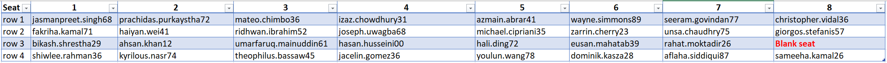
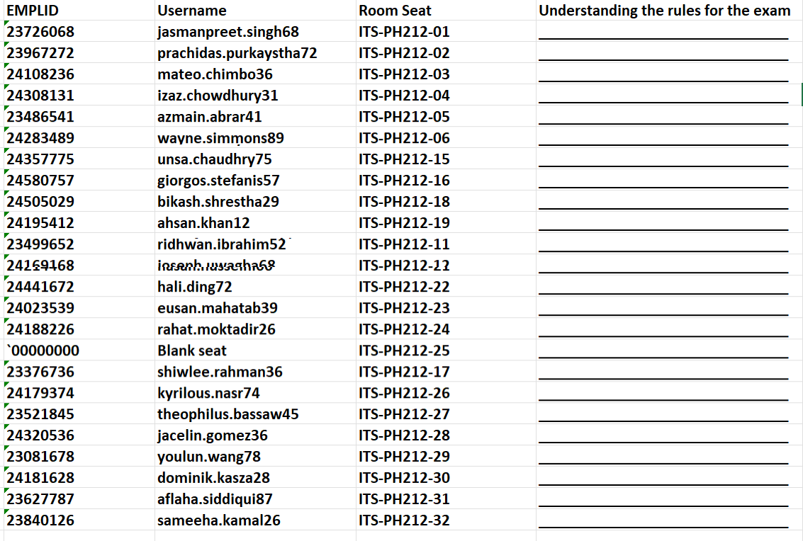
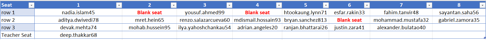
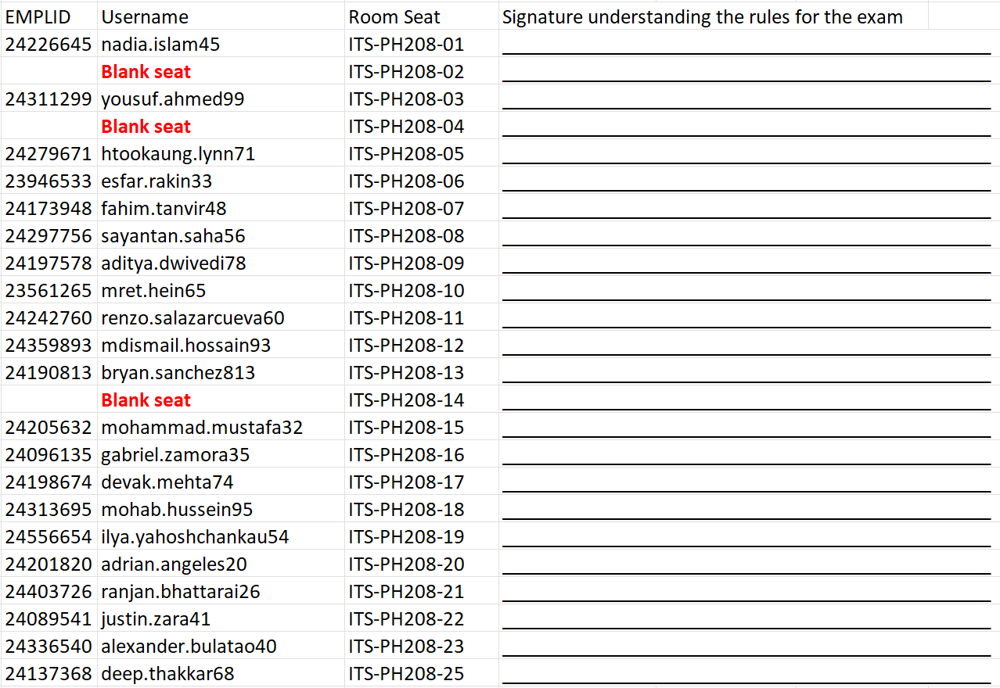
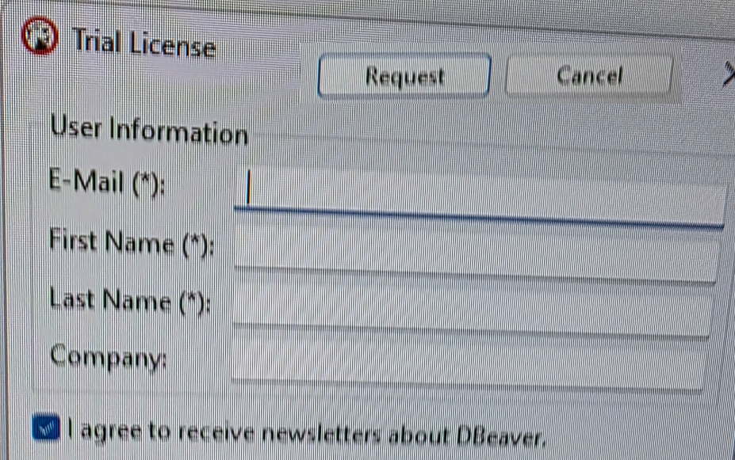

**To: ITS Network and Cyber Security Group**  
**From: Peter Heller**  
**Date: December 06, 2025**  
**Subject: Requirements for Monitoring and Setup During CSCI 331 Exam on December 11, 2025**

Dear ITS Network and Cyber Security Team,

I am requesting your support to implement guardrails for ensuring academic integrity during the CSCI 331 exam on December 11, 2025, in rooms ITS-PH212 and ITS-PH208. 

The goal is to detect and prevent cheating involving external tools, while permitting legitimate actions such as downloading and uploading exam files via BrightSpace. 

Below, I outline the proposed monitoring measures (**Sunny Chan had done this in Spring 2025, and the baton has been passed to Leighton Brown**), implementation details, and setup requirements for the exam computers.

Please note the classes seat assignments for the examination are attached below .

## Proposed Monitoring and Anti-Cheating Measures
To catch unauthorized activities, I request collaboration to implement the following tracking and restrictions on the exam-room computers (ITS-PH212 and ITS-PH208) during the exam window (December 11, 2025, from 8:45 AM to 12:15 PM):

- **Browser and Internet Usage Monitoring**: Track access to external sites like Google, email services (e.g., Gmail, Outlook), or any non-approved web resources. Flag any attempts to open more than one browser tab during the exam.
- **File Upload and Download Tracking**: Monitor all file uploads/downloads, including legitimate test files from/to BrightSpace. Log any suspicious transfers to or from external drives, cloud storage, or unauthorized locations.
- **Recycle Bin and File Deletion Access**: Monitor access to the recycle bin to detect deletions of notes, screenshots, or other prohibited materials.
- **General Restrictions**: Block or flag use of AI tools (e.g., ChatGPT via browser), email clients, note-taking apps, or any external communication during the exam window except for BrightSpace.
- **Implementation Notes**: These measures should be enforced via network policies, software agents, or monitoring tools. Define thresholds for alerts (e.g., automatic notifications to proctors) while ensuring compliance with privacy policies. Real-time logging and post-exam audits would be helpful if cybersecurity resources are involved.

If additional cybersecurity expertise is needed, please advise on setup for real-time logging and audits.

## Technical Setup Requirements (has been implemented by Robert Lau)
Please prepare the exam computers in ITS-PH212 (32 computers) and ITS-PH208 (24 computers) with the following:

- Install and configure Docker Desktop on all computers.
- Place the database backup file and instructions in `c:\csci331-backup`.
- Install DBeaver Enterprise using the trial license. Please fill out the form for the trial license as needed.
- Ensure students can log in with their CAMS accounts. If issues arise, direct them to https://apps.qc.cuny.edu/ams for resets.

## **I am providing assigned seating details (including Name, ITS-RoomNumber-ComputerNumber) for posting in the rooms.**

## Class 09:15 AM





## Class 10:45 AM





Please confirm setup completion by December 10, 2025. Let me know if you need any additional details or resources.

Best regards,  
Peter Heller  
Adjunct Lecturer, Computer Science Department  
Peter.Heller@qc.cuny.edu  

# **Student Instructions**: CSCI 331 Exam Instructions and Rules

**Exam Date: December 11, 2025**  
**Rooms: ITS-PH212 and ITS-PH208**  
**Time: [Class 09:15 room PH212 9:15 AM to 10:30 AM, Class 09:15 room PH208 10:45 AM to Noon ]**  
**Important: Zero Tolerance for Academic Integrity Violations**

Dear Students,

This document outlines the rules, procedures, and technical instructions for the CSCI 331 exam. We maintain a zero-tolerance policy for academic integrity to ensure a fair testing environment. Violations will result in severe penalties, including a zero on the exam and potential academic sanctions. These rules will be posted in the exam rooms.

You will be informed of your assigned seat in advance, including your Name and ITS-RoomNumber-ComputerNumber (e.g., ITS-PH212-01). Please arrive early to locate your seat.

## Exam Rules and Procedures
Adhere strictly to the following rules. I will enforce them, supported by monitoring tools.

1. **Browser Usage Protocol**:
   - Use the browser **only twice** during the exam: First, to download the exam from BrightSpace. Immediately close the browser afterward.
   - Work on the exam offline for the duration.
   - At the end, reopen the browser solely to upload the completed exam to BrightSpace.
   - Any deviation (e.g., additional tabs or sites) will be flagged as potential cheating.

2. **Cellphone Policy (Critical)**:
   - **All cell phones must be turned off** and placed inside your backpack or an equivalent bag. If you do not have a backpack or similar item, you may place your phone on the exam-room windowsill or face-up on your desk. Phones placed on the desk must remain face-up and unmoved for the entire duration of the exam. Any movement of the device will result in your being asked to leave under the zero-tolerance policy.
   - **If a phone is found to be active at any time**—especially if it rings, vibrates, or makes any sound—you will be required to submit your exam immediately and will receive a zero for failing to follow instructions.
   - No exceptions; devices will be checked at the start.

3. **Seating Assignments**:
   - Sit only in your assigned seat, posted in the exam room.
   - Seat identifiers: Name, ITS-RoomNumber-ComputerNumber (e.g., ITS-PH212-01 to ITS-PH212-32 for PH212; ITS-PH208-01 to ITS-PH208-24 for PH208).
   - Seating layout:
     - **PH212 (32 computers)**: Row-based, with Computer 1 **(ITS-PH212-01) as the first in the first row, closest to the wall. Computer 8 is closest to the window.**
     - **PH208 (24 computers)**: Row-based, with Computer 1 **(ITS-PH208-01) as the first in the first row, closest to the window. Computer 8 is closest to the wall.**
   - To view computer names without logging in: **Enter `.\`** in the username field during login—the domain will display the computer name.

4. **Explicit Prohibitions and Honor Code**:
   - No use of any AI tools, browser-based prompts, notes, or unauthorized resources.
   - No email access or communication with others.
   - Strict adherence to the honor code: Any violation may result in academic penalties.
   - Proctors will enforce these rules, with monitoring tools as backup.

## What Will Be Monitored
To ensure integrity, the following will be tracked on exam computers:
- Browser and internet usage (e.g., access to non-BrightSpace sites, multiple tabs).
- File uploads/downloads (e.g., suspicious transfers beyond exam files).
- Recycle bin access and file deletions.
- Use of restricted tools (e.g., AI, email, note-taking apps).

Logs may be reviewed post-exam for audits.

## Submission Requirements
- **Submit your exam as a `.sql` file only. No `.ipynb` files accepted.**
- Azure Data Studio is not allowed for submission.
- Include your name and computer number in the exam file and as part of the submission filename (e.g., LastName_FirstName_ITS-PH212-01.sql).
- Failure to include name and computer number will result in a 40-point deduction.

## Technical Setup Instructions for Docker and Database
Use these steps to set up Docker for database tasks. Instructions are in `c:\csci331-backup` on your computer.

### DBeaver Enterprise
- DBeaver Enterprise is installed with a trial license. If prompted, fill out the form for the trial.



### Docker Setup Steps
1. **Start Docker Desktop Application**: Launch the Docker Desktop app on the computer.

2. **Run the Docker Container Command**:
   - Open a Command Window (CMD or PowerShell).
   - Paste and execute the following command:
     ```
     docker container run --name bckvolSql2k19 -p 13001:1433 -e "ACCEPT_EULA=Y" -e "MSSQL_AGENT_ENABLED=true" -e "SA_PASSWORD=PH@123456789" -e "MSSQL_DATA_DIR=/var/opt/mssql/data/" -e "MSSQL_LOG_DIR=/var/opt/mssql/log/" -e "MSSQL_BACKUP_DIR=/var/opt/mssql/backup/" -v //c/csci331-backup:/var/opt/mssql/backup -h csci331-server -d mcr.microsoft.com/mssql/server:2019-latest
     ```

### Additional Terminal Commands (for Troubleshooting)
- List all containers: `docker container ls -a`
- Access the container bash (as root): `docker exec -u 0 -it bckvolSql2k19 bash`
- Navigate to backup directory: `cd /var/opt/mssql/backup/`
- Navigate to MSSQL directory: `cd /var/opt/mssql`
- Set permissions: `chmod -R 777 /var/opt/mssql`

### SSMS Database Credentials
- **Server Address**: `localhost,13001`
- **Username**: `sa`
- **Password**: `PH@123456789`

## Additional Preparation
- Ensure you know your CAMS account username and password for login. Reset at: https://apps.qc.cuny.edu/ams if needed.

If you have questions, contact me before the exam. Good luck!

Best regards,  
Peter Heller  
Adjunct Lecturer, Computer Science Department  
Peter.Heller@qc.cuny.edu  
