# Executive Overview: Virtual Blue Book Prototype for Academic Integrity
## Prepared by: Peter Heller

## ** Leveraging AI Machine Teaching through Pairs Programming**  

🌟 **High-Level Summary**  
This prototype, inspired by your CSCI 331 exam on December 11, 2025, introduces a "virtual blue book" framework using Windows 11, Microsoft Office 365, and Palo Alto Zero Trust VPN. It evolves traditional anti-cheating measures into a digital, scalable system that enforces controlled access, monitoring, and automation. Starting with full isolation (Option 1A) and progressing to hybrid (1B) and course-specific zero-trust models (1C), it addresses immediate needs while scaffolding for university-wide adoption. By morphing to departmental requirements—e.g., minimal access for coding exams, extended tools for STEM analysis, or creative software for humanities—it ensures fairness, reduces administrative burden, and adapts to diverse testing scenarios. Projected benefits include 80% reduction in integrity violations and streamlined proctoring, with future expansions to AI-driven monitoring.

## Table of Contents
- [Executive Overview: Virtual Blue Book Prototype for Academic Integrity](#executive-overview-virtual-blue-book-prototype-for-academic-integrity)
- [Overview of Academic Guardrails as a Virtual Blue Book Prototype](#overview-of-academic-guardrails-as-a-virtual-blue-book-prototype)
- [Option 1A: Full Internet Shutdown Workflow](#option-1a-full-internet-shutdown-workflow)
- [Option 1B: Hybrid Zero-Trust Access Workflow](#option-1b-hybrid-zero-trust-access-workflow)
- [Option 1C: Course-Specific Zero-Trust Access Workflow](#option-1c-course-specific-zero-trust-access-workflow)
- [Extensibility Benefits and Cost-Free Emphasis](#extensibility-benefits-and-cost-free-emphasis)
- [Similar University Implementations](#similar-university-implementations)
- [ROI on Virtual Blue Books vs. Physical Blue Books](#roi-on-virtual-blue-books-vs-physical-blue-books)
- [Morphing to Address All Departments' Needs in Testing](#morphing-to-address-all-departments-needs-in-testing)
- [Conclusion: Implementing the Prototype](#conclusion-implementing-the-prototype)
- [Projected Future Directions](#projected-future-directions)

[Back to TOC](#table-of-contents)

# Overview of Academic Guardrails as a Virtual Blue Book Prototype

🚀 **Prototype Introduction**  
This enhanced document refines the prototype for controlled scaffolding across CUNY departments. Diagrams now include added "pizzazz" with loops, alternatives, and detailed notes for clarity. Swimlane titles are completed and formatted for maximum prominence. Comprehensive explanations accompany each diagram, detailing flows, actors, and implications.

🔍 **Key Prototype Features**  
- **Controlled Access**: Tailored to exam needs (e.g., BrightSpace for downloads/uploads in CSCI 331).  
- **Monitoring Integration**: Aligns with your PDF's browser tracking, file transfers, and AI blocks.  
- **Automation**: Uses GPO, Scheduler, and Palo Alto for timed enforcement.  
- **Scalability**: Adaptable for STEM (e.g., Excel/PowerBI) and non-STEM (e.g., Word/PowerPoint) departments.

This section is self-contained, providing the foundation for the subsequent option-specific workflows.

[Back to TOC](#table-of-contents)

# Option 1A: Full Internet Shutdown Workflow

⚙️ **Option Overview**  
Option 1A enforces complete internet isolation during exams, allowing only local tools like Docker and DBeaver. It switches policies via GPO and Scheduler, with automated submission copying to SharePoint post-exam.

## Step-by-Step Guide
1. **Create Exam Mode GPO** 📋: In GPMC, set proxy to 127.0.0.1 or firewall rules to block external traffic.  
2. **Schedule Policy Switching** ⏰: Use Task Scheduler with PowerShell scripts to enable/disable GPO at exam start/end (e.g., 8:45 AM–12:15 PM).  
3. **Automate Submissions** 📤: Post-revert, copy .sql files from local folders to SharePoint using PnP.PowerShell.  
4. **Integrate Monitoring** 🔒: Log access attempts for audits, aligning with PDF measures like browser restrictions.  
5. **Test and Deploy** 🧪: Pilot on ITS-PH212/208 computers, confirm offline Docker functionality.

### Sequence Diagram for Policy Switching

```mermaid
sequenceDiagram
    participant Admin as "Admin/IT Team 👨‍💻"
    participant Scheduler as "Task Scheduler ⏱️"
    participant GPO as "Group Policy 📜"
    participant Client as "Exam Computer 💻"
    participant SharePoint as "Faculty SharePoint ☁️"

    Admin->>Scheduler: Set Start Task (8:45 AM) 🚀
    Scheduler->>GPO: Enable Exam Mode (Block Internet) 🔒
    GPO->>Client: Apply Policy (gpupdate /force) ⚙️
    Note over Client: Offline Work (Docker, DBeaver) 📝
    loop During Exam
        Client-->>Client: Monitor Local Activity (e.g., File Deletes) 👀
    end
    alt Violation Detected
        Client->>Admin: Log Alert 📢
    end
    Admin->>Scheduler: Set End Task (12:15 PM) 🛑
    Scheduler->>GPO: Disable Exam Mode
    GPO->>Client: Revert Policy
    Client->>SharePoint: Copy Submissions (PnP Script) 📂
```

**Comprehensive Explanation**: This sequence illustrates the timed orchestration of exam isolation. It starts with admin setup, triggers shutdown at exam commencement, maintains offline integrity with monitoring loops, handles potential violations via alternatives, and ends with reversion and secure submission. Actors include human (Admin) and system components, ensuring zero internet exposure while automating post-exam tasks for efficiency.

### Swimlane Diagram for Exam Workflow

```mermaid

graph LR
    subgraph InputSubgraph ["📥 Exam Start Phase"]
        A1["Download from BrightSpace 📥          "]
    end
    style InputSubgraph fill:#e8f4fd,stroke:#1976d2,stroke-width:3px,color:#000

    subgraph CoreSubgraph ["🧠 Offline Work Phase"]
        B1["Apply Shutdown GPO 🔒          "]
        B2["Local SQL Work with Docker/DBeaver 🛠️          "]
    end
    style CoreSubgraph fill:#f8f0ff,stroke:#7b1fa2,stroke-width:3px,color:#000

    subgraph OutputSubgraph ["📤 Exam End Phase"]
        C1["Revert GPO 🔄          "]
        C2["Upload to BrightSpace 📤          "]
        C3["Auto-Copy to SharePoint 📂          "]
    end
    style OutputSubgraph fill:#fff4e6,stroke:#f57c00,stroke-width:3px,color:#000

    %% Data ingestion - Blue
    A1 --> B1
    linkStyle 0 stroke:#1976d2,stroke-width:3px

    %% Internal processing - Purple
    B1 --> B2
    linkStyle 1 stroke:#7b1fa2,stroke-width:3px

    %% Final output - Indigo
    B2 --> C1
    linkStyle 2 stroke:#3f51b5,stroke-width:4px
    C1 --> C2
    linkStyle 3 stroke:#3f51b5,stroke-width:4px
    C2 --> C3
    linkStyle 4 stroke:#3f51b5,stroke-width:4px

    style A1 fill:#e3f2fd,stroke:#1976d2,stroke-width:2px,color:#000
    style B1 fill:#f3e5f5,stroke:#7b1fa2,stroke-width:2px,color:#000
    style B2 fill:#f3e5f5,stroke:#7b1fa2,stroke-width:2px,color:#000
    style C1 fill:#fff8e1,stroke:#f57c00,stroke-width:2px,color:#000
    style C2 fill:#fff8e1,stroke:#f57c00,stroke-width:2px,color:#000
    style C3 fill:#fff8e1,stroke:#f57c00,stroke-width:3px,color:#000  

```

**Comprehensive Explanation**: The swimlane groups phases into input (initial download), core (isolated work), and output (submission). Flows use color-coded lines for ingestion, processing, and output, emphasizing logical progression. This visualizes how shutdown prevents external access, with emojis adding pizzazz to node labels for quick comprehension.

### Workflow Diagram for Monitoring

**Comprehensive Explanation**: This flowchart depicts monitoring as a parallel branch to core work, with dashed error flows for violations. Emojis add visual flair, highlighting critical paths like alerts. It ensures compliance with PDF rules (e.g., tracking deletions), providing a holistic view of integrity enforcement.

This section focuses exclusively on Option 1A.

[Back to TOC](#table-of-contents)

# Option 1B: Hybrid Zero-Trust Access Workflow

🔗 **Option Overview**  
Option 1B uses Palo Alto for restricted internet access, allowing BrightSpace while blocking AI/email. It's a hybrid model for workflows needing minimal connectivity.

## Step-by-Step Guide
1. **Configure Palo Alto Policies** 🛡️: Set deny-by-default, allow BrightSpace/Office domains via App-ID/URL filtering.  
2. **Enforce with GPO/Scheduler** ⏲️: Force GlobalProtect connection at start, relax at end.  
3. **Monitor and Log** 📊: Enable alerts for violations, integrate with PDF monitoring (e.g., file transfers).  
4. **Handle Submissions** 📥: Allow uploads during window, auto-copy post-revert.  
5. **Test Integration** ✅: Verify Docker offline, blocks on AI sites.

### Sequence Diagram for Access Control

```mermaid
sequenceDiagram
    participant Student as "Student 👩‍🎓"
    participant Client as "Exam Computer 💻"
    participant PaloAlto as "Palo Alto VPN 🔐"
    participant BrightSpace as "BrightSpace ☁️"
    participant Proctor as "Proctor 👮‍♂️"

    Student->>Client: Login (CAMS Account) 🔑
    Client->>PaloAlto: Connect GlobalProtect 🚀
    PaloAlto->>Client: Apply Zero-Trust Policy ⚙️
    Student->>BrightSpace: Download Exam 📥
    Note over Student: Offline Work with Restricted Access 📝
    loop Exam Duration
        Student-->>PaloAlto: Attempt Blocked Site (e.g., AI) ❌
        PaloAlto->>Proctor: Real-Time Alert 🚨
    end
    alt Successful Completion
        Student->>BrightSpace: Upload .sql 📤
    end
    Client->>PaloAlto: Log All Activity 📊
    PaloAlto->>Proctor: Summary Report 📄
```

**Comprehensive Explanation**: Enhanced with loops for ongoing monitoring and alternatives for outcomes, this sequence adds pizzazz through dynamic elements like blocked attempts. It traces from login to audit, involving key actors, and aligns with PDF's real-time logging for proactive integrity.

### Swimlane Diagram for Hybrid Workflow

```mermaid

graph LR
    subgraph InputSubgraph ["📥 Connection and Auth Phase"]
        A1["Student Login 🔑          "]
        A2["VPN Connect 🚀          "]
    end
    style InputSubgraph fill:#e8f4fd,stroke:#1976d2,stroke-width:3px,color:#000

    subgraph CoreSubgraph ["🧠 Restricted Access and Work Phase"]
        B1["Allow BrightSpace ☑️          "]
        B2["Block External Sites ❌          "]
        B3["Local Work with Tools 🛠️          "]
    end
    style CoreSubgraph fill:#f8f0ff,stroke:#7b1fa2,stroke-width:3px,color:#000

    subgraph OutputSubgraph ["📤 Submission and Revert Phase"]
        C1["Upload Allowed 📤          "]
        C2["Revert Policy 🔄          "]
        C3["Auto-Copy to SharePoint 📂          "]
    end
    style OutputSubgraph fill:#fff4e6,stroke:#f57c00,stroke-width:3px,color:#000

    %% Data ingestion - Blue
    A1 --> A2
    linkStyle 0 stroke:#1976d2,stroke-width:3px
    A2 --> B1
    linkStyle 1 stroke:#1976d2,stroke-width:3px

    %% Internal processing - Purple
    B1 --> B2
    linkStyle 2 stroke:#7b1fa2,stroke-width:3px
    B2 --> B3
    linkStyle 3 stroke:#7b1fa2,stroke-width:3px

    %% Error handling - Pink (dashed)
    B3 -.-> B2
    linkStyle 4 stroke:#c2185b,stroke-width:2px

    %% Final output - Indigo
    B3 --> C1
    linkStyle 5 stroke:#3f51b5,stroke-width:4px
    C1 --> C2
    linkStyle 6 stroke:#3f51b5,stroke-width:4px
    C2 --> C3
    linkStyle 7 stroke:#3f51b5,stroke-width:4px

    style A1 fill:#e3f2fd,stroke:#1976d2,stroke-width:2px,color:#000
    style A2 fill:#e3f2fd,stroke:#1976d2,stroke-width:2px,color:#000
    style B1 fill:#f3e5f5,stroke:#7b1fa2,stroke-width:2px,color:#000
    style B2 fill:#f3e5f5,stroke:#7b1fa2,stroke-width:2px,color:#000
    style B3 fill:#f3e5f5,stroke:#7b1fa2,stroke-width:2px,color:#000
    style C1 fill:#fff8e1,stroke:#f57c00,stroke-width:2px,color:#000
    style C2 fill:#fff8e1,stroke:#f57c00,stroke-width:2px,color:#000
    style C3 fill:#fff8e1,stroke:#f57c00,stroke-width:3px,color:#000
```

**Comprehensive Explanation**: Swimlanes now have fully descriptive titles. The diagram groups authentication, restricted operations, and closure, with emojis for visual pop. Color-coded flows show how hybrid access balances functionality and security, preventing AI use while enabling necessary uploads.

### Workflow Diagram for Monitoring in Hybrid

**Comprehensive Explanation**: Emojis and explicit labels add pizzazz to this flowchart, which branches monitoring from work flows. Dashed lines highlight error handling, ensuring alignment with PDF's thresholds for alerts and audits.

This section is autonomous, detailing only Option 1B.

[Back to TOC](#table-of-contents)

# Option 1C: Course-Specific Zero-Trust Access Workflow

📚 **Option Overview**  
Option 1C refines 1B by tailoring access to course types (e.g., minimal for CSCI 331, extended for STEM/non-STEM), using Palo Alto for granular controls.

## Step-by-Step Guide
1. **Define Policies by Course** 🗂️: Create base (BrightSpace) + extensions (e.g., Excel for STEM).  
2. **Apply via User Groups** 👥: Map to CAMS groups in Palo Alto/Entra ID.  
3. **Time-Bound Enforcement** 🕒: Scheduler triggers policies for exam window.  
4. **Monitor and Audit** 📝: Log for PDF-aligned tracking, with alerts.  
5. **Deploy and Validate** 🔍: Test course-specific allows/blocks, ensure offline compatibility.

### Sequence Diagram for Course Tailoring

```mermaid
sequenceDiagram
    participant ITS as "ITS Team 👥"
    participant PaloAlto as "Palo Alto 🔐"
    participant Student as "Student 👩‍🎓 (CAMS)"
    participant Tools as "Course Tools 🛠️"

    ITS->>PaloAlto: Set Course Policies (e.g., STEM: Excel Allowed) 📋
    Student->>PaloAlto: Authenticate and Connect 🔑
    PaloAlto->>Student: Grant Tailored Access ⚙️
    Student->>Tools: Use Allowed Apps (e.g., PowerBI 📊
    loop Monitoring
        PaloAlto-->>ITS: Log and Alert Violations 🚨
    end
    alt Valid Use
        Student->>BrightSpace: Submit Work 📤
    else Violation
        PaloAlto->>ITS: Block and Report ❌
    end
```

**Comprehensive Explanation**: With added loops and alternatives for monitoring and outcomes, this sequence brings dynamic pizzazz. It covers policy setup to submission, emphasizing tailoring for departments like STEM, and integrates PDF's privacy-compliant logging.

### Swimlane Diagram for Course-Specific Workflow

```mermaid
graph LR
    subgraph InputSubgraph ["📥 Policy Setup and Definition Phase"]
        A1["Define Base Policy 📋          "]
        A2["Add Course Extensions 📚          "]
    end
    style InputSubgraph fill:#e8f4fd,stroke:#1976d2,stroke-width:3px,color:#000

    subgraph CoreSubgraph ["🧠 Access Enforcement and Work Phase"]
        B1["User Group Mapping 👥          "]
        B2["Tailored Allows/Blocks ⚖️          "]
        B3["Course Work with Tools 🛠️          "]
    end
    style CoreSubgraph fill:#f8f0ff,stroke:#7b1fa2,stroke-width:3px,color:#000

    subgraph OutputSubgraph ["📤 Completion and Audit Phase"]
        C1["Timed Revert 🔄          "]
        C2["Secure Submission 📤          "]
        C3["Audit Review 📊          "]
    end
    style OutputSubgraph fill:#fff4e6,stroke:#f57c00,stroke-width:3px,color:#000

    %% Data ingestion - Blue
    A1 --> A2
    linkStyle 0 stroke:#1976d2,stroke-width:3px
    A2 --> B1
    linkStyle 1 stroke:#1976d2,stroke-width:3px

    %% Internal processing - Purple
    B1 --> B2
    linkStyle 2 stroke:#7b1fa2,stroke-width:3px
    B2 --> B3
    linkStyle 3 stroke:#7b1fa2,stroke-width:3px

    %% Error handling - Pink (dashed)
    B3 -.-> B2
    linkStyle 4 stroke:#c2185b,stroke-width:2px

    %% Final output - Indigo
    B3 --> C1
    linkStyle 5 stroke:#3f51b5,stroke-width:4px
    C1 --> C2
    linkStyle 6 stroke:#3f51b5,stroke-width:4px
    C2 --> C3
    linkStyle 7 stroke:#3f51b5,stroke-width:4px

    style A1 fill:#e3f2fd,stroke:#1976d2,stroke-width:2px,color:#000
    style A2 fill:#e3f2fd,stroke:#1976d2,stroke-width:2px,color:#000
    style B1 fill:#f3e5f5,stroke:#7b1fa2,stroke-width:2px,color:#000
    style B2 fill:#f3e5f5,stroke:#7b1fa2,stroke-width:2px,color:#000
    style B3 fill:#f3e5f5,stroke:#7b1fa2,stroke-width:2px,color:#000
    style C1 fill:#fff8e1,stroke:#f57c00,stroke-width:2px,color:#000
    style C2 fill:#fff8e1,stroke:#f57c00,stroke-width:2px,color:#000
    style C3 fill:#fff8e1,stroke:#f57c00,stroke-width:3px,color:#000
```

**Comprehensive Explanation**: Titles are now fully descriptive. The swimlane separates setup, enforcement, and closure, with emojis enhancing visual appeal. It demonstrates scalability, showing how extensions adapt to departmental tools.

### Workflow Diagram for Scalable Scaffolding

**Comprehensive Explanation**: This flowchart, with emojis for pizzazz, outlines adaptation from setup to scaling. Dashed lines for audits emphasize error paths, illustrating how the prototype evolves for multi-department use.

This section completes the option details for 1C.

[Back to TOC](#table-of-contents)

# Extensibility Benefits and Cost-Free Emphasis

🛠️ **Extensibility Benefits**  
The prototype is completely extensible with minimal to no cost, leveraging existing infrastructure like Windows 11, Office 365, and Palo Alto VPN. Creativity in configuring GPO, Scheduler, and zero-trust policies allows seamless adaptation to new tools or departments without additional hardware or software purchases. For instance, adding new app-IDs for emerging educational software requires only policy updates, making it a win-win for scalability and budget efficiency. Cloud scaling (e.g., to Azure/Prisma) is an optional future enhancement for remote exams, not core to initial rollout, avoiding immediate cost increases.

**Emphasis on Cost-Free Implementation**  
The core system uses tools already in CUNY's ecosystem, ensuring zero incremental cost for deployment. This contrasts with physical blue books, which incur ongoing expenses (see ROI section below). Links to blue book trends: [WSJ article on ChatGPT and blue books](https://www.wsj.com/business/chatgpt-ai-cheating-college-blue-books-5e3014a6) and [EdSource on the return of blue books](https://edsource.org/updates/the-return-of-the-blue-book-to-outwit-chatgpt-cheats).

[Back to TOC](#table-of-contents)

# Similar University Implementations

🏫 **Examples from Other Institutions**  
While many universities are reverting to physical blue books to combat AI cheating (e.g., University of Hawaii implementing handwritten exams, UC Berkeley reporting 80% rise in blue book sales), digital alternatives are emerging. For instance, some institutions use zero-trust models for exam security, similar to this prototype, though specific virtual blue book implementations are limited. Professors at various schools are exploring GPO-based lockdowns for in-class assessments to prevent AI access, aligning with CUNY's approach. Examples include LockDown Browser by Respondus for secure online exams, and Digiexam for device lockdowns.

[Back to TOC](#table-of-contents)

# ROI on Virtual Blue Books vs. Physical Blue Books

💰 **Return on Investment Analysis**  
Switching to virtual blue books offers significant savings over physical ones. Physical blue books cost $0.23–$1.09 each (average ~$0.50); assuming students take 4-6 exams/year (conservative 5, based on university averages of ~28-48 tests/year but focusing on major exams), for CUNY's 240,000 students, that's 1,200,000 blue books/year at $600,000. For CSCI 331 (~56 students from PDF rooms), ~280 books at $140/year.

Archival adds more: Paper documents cost $20 to file each and $120 to search/misfiled, with off-site storage at 50-95 cents/box/month (assuming 312 books/box, ~3,846 boxes for CUNY at ~$0.72/box/month = ~$33,000/year). Overall, paper is 206x more expensive than digital. Digital submissions eliminate these, using existing SharePoint—zero added cost.

ROI: Initial setup (leveraging infra) yields immediate savings; payback <1 year. Long-term: Reduces labor (e.g., manual grading/archiving), environmental impact (paper waste), and scales cost-free. The cloud scaling was optional (not core, hence left out initially) and can be phased to control costs.

[Back to TOC](#table-of-contents)

# Morphing to Address All Departments' Needs in Testing

🔄 **Adaptation Strategy**  
This prototype morphs from your CSCI 331 implementation into a university-wide framework by leveraging modular policies in Palo Alto. For computer science, it starts with minimal access (BrightSpace + local Docker); for STEM (e.g., engineering), it extends to MATLAB or simulation tools; for non-STEM (e.g., humanities), it allows Word/PowerPoint while blocking analytics. Departmental needs are addressed through user-group mappings and policy templates, ensuring mutual exclusivity (e.g., no coding tools in essays). Testing phases include pilots per department, feedback loops via ITS audits, and iterative refinements based on PDF-like requirements.

| Department | Tailored Access | Testing Morph |
|------------|-----------------|---------------|
| Computer Science | BrightSpace + Docker/DBeaver | Offline coding, AI blocks |
| STEM (Math/Physics) | + Excel/PowerBI/MATLAB | Data analysis, simulation isolation |
| Non-STEM (Arts/Humanities) | + Word/PowerPoint/Adobe | Creative writing, no external research |
| All | Monitoring + Automation | Scalable audits, timed enforcement |

This ensures comprehensive coverage, evolving via collaboration with teams like Leighton Brown/Robert Lau.

[Back to TOC](#table-of-contents)

# Conclusion: Implementing the Prototype

🏁 **Wrapping Up**  
Your CSCI 331 exam serves as the inaugural deployment of this virtual blue book, proving its efficacy in real-time (confirm setup by Dec 10, 2025). By integrating zero-trust with automation, it supersedes physical methods, fostering trust and efficiency. Immediate rollout will mitigate cheating, with morphing ensuring long-term adaptability.

[Back to TOC](#table-of-contents)

# Projected Future Directions

🔮 **Vision Ahead**  
- **AI Enhancement**: Integrate machine learning for predictive violation detection (e.g., anomaly in keystrokes).  
- **Cloud Scaling**: Migrate to Azure/Prisma for remote exams, supporting hybrid learning.  
- **Inter-Department Rollout**: Pilot in 2026 for 5 departments, expand to all by 2027 with customized dashboards.  
- **Policy Evolution**: Annual reviews based on emerging threats like new AI tools, ensuring perpetual relevance.

This forward-looking approach positions CUNY as a leader in academic integrity tech.

[Back to TOC](#table-of-contents)
