# 🐘 PostgreSQL18-DuckDB-SQLite3 Integration with LLM-SQL Architecture

## 📊 Usage Examples & Patterns

[Back to TOC](#-table-of-contents)

### Usage Pattern Architecture

```mermaid
graph TB
    subgraph BASIC ["📝    Basic    Query    Patterns"]
        B1[Simple SELECT]
        B2[Filtered Queries]
        B3[Aggregations]
        B4[Joins]
    end
    
    subgraph ADVANCED ["🔬    Advanced    Patterns"]
        A1[Cross-Database Joins]
        A2[Window Functions]
        A3[CTEs & Subqueries]
        A4[Batch Operations]
    end
    
    subgraph VECTOR ["🎯    Vector    Search"]
        V1[Embedding Generation]
        V2[Similarity Search]
        V3[Hybrid Search]
        V4[Semantic Ranking]
    end
    
    subgraph LLM ["🤖    LLM-Powered"]
        L1[Text-to-SQL]
        L2[Query Explanation]
        L3[Schema Discovery]
        L4[Query Optimization]
    end
    
    subgraph INTEGRATION ["🔗    Integration    Patterns"]
        I1[Python SDK]
        I2[REST API]
        I3[Streaming Results]
        I4[Webhooks]
    end
    
    %% Basic to Advanced - Blue
    B1 --> A1
    B2 --> A2
    B3 --> A3
    B4 --> A4
    
    %% Advanced to Vector - Purple
    A1 --> V1
    A2 --> V2
    A3 --> V3
    A4 --> V4
    
    %% Vector to LLM - Orange
    V1 --> L1
    V2 --> L2
    V3 --> L3
    V4 --> L4
    
    %% LLM to Integration - Green
    L1 --> I1
    L2 --> I2
    L3 --> I3
    L4 --> I4
    
    %% Apply linkStyle
    linkStyle 0,1,2,3 stroke:#1976d2,stroke-width:3px
    linkStyle 4,5,6,7 stroke:#7b1fa2,stroke-width:3px
    linkStyle 8,9,10,11 stroke:#f57c00,stroke-width:3px
    linkStyle 12,13,14,15 stroke:#388e3c,stroke-width:3px
    
    %% Define node classes
    classDef basicStyle fill:#e3f2fd,stroke:#1976d2,stroke-width:2px
    classDef advancedStyle fill:#f3e5f5,stroke:#7b1fa2,stroke-width:2px
    classDef vectorStyle fill:#fff8e1,stroke:#f57c00,stroke-width:2px
    classDef llmStyle fill:#e8f5e8,stroke:#388e3c,stroke-width:2px
    classDef integrationStyle fill:#e0f2f1,stroke:#00695c,stroke-width:2px
    
    %% Apply classes
    class B1,B2,B3,B4 basicStyle
    class A1,A2,A3,A4 advancedStyle
    class V1,V2,V3,V4 vectorStyle
    class L1,L2,L3,L4 llmStyle
    class I1,I2,I3,I4 integrationStyle
    
    %% Style subgraphs
    style BASIC fill:#e8f4fd,stroke:#1976d2,stroke-width:3px,color:#000
    style ADVANCED fill:#f8f0ff,stroke:#7b1fa2,stroke-width:3px,color:#000
    style VECTOR fill:#fff4e6,stroke:#f57c00,stroke-width:3px,color:#000
    style LLM fill:#f0f8f0,stroke:#388e3c,stroke-width:3px,color:#000
    style INTEGRATION fill:#f0fffe,stroke:#00695c,stroke-width:3px,color:#000
```



---

### Pattern 1: Basic Query Operations

#### 1.1 Simple SELECT Queries

```python
"""
Basic query patterns using Python requests library.
Demonstrates fundamental query operations.
"""

import requests
from typing import Any, Dict, List
from datetime import datetime, timedelta

# Base configuration
BASE_URL = "http://localhost:8001"
API_VERSION = "/api/v1"
QUERY_ENDPOINT = f"{BASE_URL}{API_VERSION}/query"


def execute_query(sql: str, database: str = "duckdb", **kwargs) -> Dict[str, Any]:
    """
    Execute SQL query against DuckDB service.
    
    Args:
        sql: SQL query string
        database: Target database (duckdb, postgres, sqlite, mysql)
        **kwargs: Additional query parameters
        
    Returns:
        Query result dictionary
    """
    payload = {
        "sql": sql,
        "database": database,
        **kwargs
    }
    
    response = requests.post(QUERY_ENDPOINT, json=payload)
    response.raise_for_status()
    return response.json()


# Example 1: Simple SELECT
result = execute_query(
    sql="SELECT 1 as id, 'test' as name, CURRENT_TIMESTAMP as created_at"
)
print(f"Columns: {result['columns']}")
print(f"Rows: {result['rows']}")
print(f"Execution time: {result['execution_time_ms']}ms")

# Example 2: Query PostgreSQL tables
result = execute_query(
    sql="""
        SELECT 
            user_query,
            execution_time_ms,
            status,
            created_at
        FROM pg.analytics.query_logs
        ORDER BY created_at DESC
        LIMIT 10
    """
)
print(f"Recent queries: {len(result['rows'])} rows")

# Example 3: Filtered query with parameters
result = execute_query(
    sql="""
        SELECT 
            status,
            COUNT(*) as count
        FROM pg.analytics.query_logs
        WHERE created_at > CURRENT_TIMESTAMP - INTERVAL '24 hours'
        GROUP BY status
    """,
    timeout_seconds=60
)
print(f"Query status distribution: {result['rows']}")

# Example 4: Query with row limit
result = execute_query(
    sql="SELECT * FROM pg.analytics.query_logs",
    max_rows=100
)
if result.get('truncated'):
    print(f"⚠️  Results truncated to {result['row_count']} rows")
```

#### 1.2 Aggregation Queries

```python
"""
Aggregation patterns for analytics workloads.
"""

# Example 1: Time-series aggregation
query = """
SELECT 
    DATE_TRUNC('hour', created_at) as hour,
    COUNT(*) as total_queries,
    COUNT(*) FILTER (WHERE status = 'success') as successful_queries,
    COUNT(*) FILTER (WHERE status = 'error') as failed_queries,
    AVG(execution_time_ms) as avg_execution_time_ms,
    PERCENTILE_CONT(0.50) WITHIN GROUP (ORDER BY execution_time_ms) as p50_latency,
    PERCENTILE_CONT(0.95) WITHIN GROUP (ORDER BY execution_time_ms) as p95_latency,
    PERCENTILE_CONT(0.99) WITHIN GROUP (ORDER BY execution_time_ms) as p99_latency
FROM pg.analytics.query_logs
WHERE created_at > CURRENT_TIMESTAMP - INTERVAL '24 hours'
GROUP BY DATE_TRUNC('hour', created_at)
ORDER BY hour DESC
"""

result = execute_query(sql=query)
print("Hourly query statistics:")
for row in result['rows']:
    print(f"{row[0]}: {row[1]} total, p95={row[6]}ms")

# Example 2: Top N queries by frequency
query = """
WITH query_frequencies AS (
    SELECT 
        user_query,
        COUNT(*) as frequency,
        AVG(execution_time_ms) as avg_time,
        MAX(execution_time_ms) as max_time
    FROM pg.analytics.query_logs
    WHERE created_at > CURRENT_TIMESTAMP - INTERVAL '7 days'
    GROUP BY user_query
)
SELECT 
    user_query,
    frequency,
    ROUND(avg_time, 2) as avg_time_ms,
    max_time as max_time_ms
FROM query_frequencies
ORDER BY frequency DESC
LIMIT 20
"""

result = execute_query(sql=query)
print(f"Top {len(result['rows'])} most frequent queries")

# Example 3: Statistical analysis
query = """
SELECT 
    llm_model,
    COUNT(*) as total_queries,
    AVG(execution_time_ms) as mean_time,
    STDDEV(execution_time_ms) as stddev_time,
    MIN(execution_time_ms) as min_time,
    MAX(execution_time_ms) as max_time,
    AVG(result_rows) as avg_result_size
FROM pg.analytics.query_logs
WHERE llm_model IS NOT NULL
    AND created_at > CURRENT_TIMESTAMP - INTERVAL '30 days'
GROUP BY llm_model
ORDER BY total_queries DESC
"""

result = execute_query(sql=query)
print("LLM model performance comparison:")
for row in result['rows']:
    model, total, mean, stddev, min_t, max_t, avg_size = row
    print(f"{model}: {total} queries, {mean:.2f}±{stddev:.2f}ms")
```

#### 1.3 Join Operations

```python
"""
Join patterns across tables and databases.
"""

# Example 1: Self-join for query comparison
query = """
SELECT 
    a.user_query as query_a,
    b.user_query as query_b,
    a.execution_time_ms as time_a,
    b.execution_time_ms as time_b,
    (b.execution_time_ms - a.execution_time_ms) as time_diff
FROM pg.analytics.query_logs a
JOIN pg.analytics.query_logs b 
    ON a.log_id < b.log_id
    AND a.user_query = b.user_query
WHERE a.created_at > CURRENT_TIMESTAMP - INTERVAL '1 day'
    AND ABS(b.execution_time_ms - a.execution_time_ms) > 100
ORDER BY time_diff DESC
LIMIT 10
"""

result = execute_query(sql=query)
print("Queries with significant performance variation")

# Example 2: Join with embeddings (if data exists)
query = """
SELECT 
    ql.user_query,
    ql.execution_time_ms,
    dv.document_id,
    dv.chunk_text
FROM pg.analytics.query_logs ql
LEFT JOIN pg.embeddings.document_vectors dv
    ON ql.log_id = dv.document_id
WHERE ql.created_at > CURRENT_TIMESTAMP - INTERVAL '1 hour'
LIMIT 50
"""

result = execute_query(sql=query)
print(f"Queries with embeddings: {result['row_count']} results")
```

---

### Pattern 2: Cross-Database Operations

#### 2.1 Federated Queries

```python
"""
Cross-database query patterns leveraging DuckDB's ATTACH capability.
"""

# Example 1: Join PostgreSQL and SQLite
query = """
SELECT 
    pg_data.user_query,
    pg_data.execution_time_ms,
    sqlite_cache.cache_key,
    sqlite_cache.cache_hit
FROM pg.analytics.query_logs AS pg_data
LEFT JOIN sqlite.query_cache AS sqlite_cache
    ON pg_data.log_id = sqlite_cache.query_id
WHERE pg_data.created_at > CURRENT_TIMESTAMP - INTERVAL '1 hour'
ORDER BY pg_data.created_at DESC
LIMIT 100
"""

result = execute_query(sql=query)
print(f"Cross-database join: {result['row_count']} rows")

# Example 2: Union data from multiple databases
query = """
SELECT 'PostgreSQL' as source, COUNT(*) as record_count
FROM pg.analytics.query_logs

UNION ALL

SELECT 'SQLite' as source, COUNT(*) as record_count
FROM sqlite.main.query_cache

ORDER BY record_count DESC
"""

result = execute_query(sql=query)
print("Record counts by database:")
for row in result['rows']:
    print(f"  {row[0]}: {row[1]:,} records")

# Example 3: Complex multi-database aggregation
query = """
WITH pg_stats AS (
    SELECT 
        DATE_TRUNC('day', created_at) as day,
        COUNT(*) as query_count,
        AVG(execution_time_ms) as avg_time
    FROM pg.analytics.query_logs
    WHERE created_at > CURRENT_TIMESTAMP - INTERVAL '7 days'
    GROUP BY DATE_TRUNC('day', created_at)
),
sqlite_stats AS (
    SELECT 
        DATE_TRUNC('day', accessed_at) as day,
        COUNT(*) as cache_hits
    FROM sqlite.main.query_cache
    WHERE accessed_at > CURRENT_TIMESTAMP - INTERVAL '7 days'
    GROUP BY DATE_TRUNC('day', accessed_at)
)
SELECT 
    pg_stats.day,
    pg_stats.query_count,
    pg_stats.avg_time,
    COALESCE(sqlite_stats.cache_hits, 0) as cache_hits,
    CAST(COALESCE(sqlite_stats.cache_hits, 0) AS FLOAT) / 
        NULLIF(pg_stats.query_count, 0) as cache_hit_ratio
FROM pg_stats
LEFT JOIN sqlite_stats ON pg_stats.day = sqlite_stats.day
ORDER BY pg_stats.day DESC
"""

result = execute_query(sql=query)
print("Daily query and cache statistics:")
for row in result['rows']:
    day, queries, avg_time, hits, ratio = row
    print(f"{day}: {queries} queries, {hits} cache hits ({ratio:.1%} hit rate)")
```

#### 2.2 Dynamic Database Attachment

```python
"""
Dynamically attach external databases at runtime.
"""

ATTACH_ENDPOINT = f"{BASE_URL}{API_VERSION}/attach"


def attach_database(alias: str, db_type: str, connection_string: str = None) -> Dict[str, Any]:
    """
    Attach external database to DuckDB.
    
    Args:
        alias: Database alias for queries
        db_type: Database type (postgres, mysql, sqlite)
        connection_string: Optional connection string
        
    Returns:
        Attachment status
    """
    payload = {
        "alias": alias,
        "db_type": db_type,
    }
    
    if connection_string:
        payload["connection_string"] = connection_string
    
    response = requests.post(ATTACH_ENDPOINT, json=payload)
    response.raise_for_status()
    return response.json()


def list_attachments() -> List[Dict[str, Any]]:
    """List all attached databases."""
    response = requests.get(ATTACH_ENDPOINT)
    response.raise_for_status()
    return response.json()['databases']


def detach_database(alias: str) -> Dict[str, Any]:
    """Detach database by alias."""
    response = requests.delete(f"{ATTACH_ENDPOINT}/{alias}")
    response.raise_for_status()
    return response.json()


# Example 1: Attach MySQL database
result = attach_database(
    alias="production_mysql",
    db_type="mysql",
    connection_string="host=mysql.example.com user=readonly password=secret port=3306 database=production"
)
print(f"✅ {result['message']}")

# Example 2: Query newly attached database
query = """
SELECT 
    customer_name,
    SUM(order_total) as total_revenue
FROM production_mysql.orders
JOIN production_mysql.customers USING (customer_id)
WHERE order_date > CURRENT_DATE - INTERVAL '30 days'
GROUP BY customer_name
ORDER BY total_revenue DESC
LIMIT 10
"""

result = execute_query(sql=query)
print(f"Top 10 customers: {result['row_count']} rows")

# Example 3: List all attachments
attachments = list_attachments()
print(f"Currently attached databases: {len(attachments)}")
for db in attachments:
    print(f"  - {db['database_name']} ({db['database_type']})")

# Example 4: Detach when done
detach_result = detach_database("production_mysql")
print(f"✅ {detach_result['message']}")
```

---

### Pattern 3: Vector Search Operations

#### 3.1 Embedding Generation and Storage

```python
"""
Vector embedding patterns for semantic search.
"""

import numpy as np
from typing import List


def generate_mock_embedding(text: str, dimensions: int = 1536) -> List[float]:
    """
    Generate mock embedding for demonstration.
    In production, use actual LLM embedding service.
    
    Args:
        text: Text to embed
        dimensions: Embedding dimensions
        
    Returns:
        List of floats representing embedding
    """
    # Mock: Use hash for consistent embeddings
    np.random.seed(hash(text) % (2**32))
    return np.random.rand(dimensions).tolist()


def store_embedding(document_id: int, text: str, embedding: List[float], metadata: Dict = None) -> None:
    """
    Store document embedding in PostgreSQL.
    
    Args:
        document_id: Unique document identifier
        text: Document text chunk
        embedding: Vector embedding
        metadata: Optional metadata
    """
    # Convert embedding to PostgreSQL vector format
    embedding_str = "[" + ",".join(map(str, embedding)) + "]"
    metadata_str = str(metadata or {}).replace("'", '"')
    
    query = f"""
    INSERT INTO pg.embeddings.document_vectors 
        (document_id, chunk_text, embedding, metadata)
    VALUES 
        ({document_id}, '{text}', '{embedding_str}'::vector, '{metadata_str}'::jsonb)
    ON CONFLICT (id) DO UPDATE SET
        chunk_text = EXCLUDED.chunk_text,
        embedding = EXCLUDED.embedding,
        metadata = EXCLUDED.metadata,
        updated_at = CURRENT_TIMESTAMP
    """
    
    execute_query(sql=query)
    print(f"✅ Stored embedding for document {document_id}")


# Example 1: Store document embeddings
documents = [
    {
        "id": 1,
        "text": "Machine learning is a subset of artificial intelligence focused on learning from data.",
        "metadata": {"category": "AI", "source": "textbook"}
    },
    {
        "id": 2,
        "text": "Deep learning uses neural networks with multiple layers to process complex patterns.",
        "metadata": {"category": "AI", "source": "textbook"}
    },
    {
        "id": 3,
        "text": "Natural language processing enables computers to understand human language.",
        "metadata": {"category": "NLP", "source": "article"}
    }
]

for doc in documents:
    embedding = generate_mock_embedding(doc["text"])
    store_embedding(doc["id"], doc["text"], embedding, doc["metadata"])
```

#### 3.2 Semantic Similarity Search

```python
"""
Vector similarity search patterns using pgvector.
"""


def semantic_search(query_text: str, top_k: int = 5, min_similarity: float = 0.0) -> List[Dict[str, Any]]:
    """
    Perform semantic similarity search.
    
    Args:
        query_text: Search query
        top_k: Number of results to return
        min_similarity: Minimum similarity threshold (0-1)
        
    Returns:
        List of similar documents with scores
    """
    # Generate query embedding
    query_embedding = generate_mock_embedding(query_text)
    embedding_str = "[" + ",".join(map(str, query_embedding)) + "]"
    
    # Cosine similarity search using pgvector
    query = f"""
    SELECT 
        document_id,
        chunk_text,
        1 - (embedding <=> '{embedding_str}'::vector) AS similarity,
        metadata
    FROM pg.embeddings.document_vectors
    WHERE 1 - (embedding <=> '{embedding_str}'::vector) >= {min_similarity}
    ORDER BY embedding <=> '{embedding_str}'::vector
    LIMIT {top_k}
    """
    
    result = execute_query(sql=query)
    
    return [
        {
            "document_id": row[0],
            "text": row[1],
            "similarity": row[2],
            "metadata": row[3]
        }
        for row in result['rows']
    ]


# Example 1: Basic semantic search
results = semantic_search("What is artificial intelligence?", top_k=3)
print("Semantic search results:")
for idx, result in enumerate(results, 1):
    print(f"{idx}. [{result['similarity']:.3f}] {result['text'][:80]}...")

# Example 2: Filtered semantic search
query = """
SELECT 
    document_id,
    chunk_text,
    1 - (embedding <=> $1::vector) AS similarity,
    metadata
FROM pg.embeddings.document_vectors
WHERE metadata->>'category' = 'AI'
    AND 1 - (embedding <=> $1::vector) >= 0.7
ORDER BY embedding <=> $1::vector
LIMIT 10
"""

query_embedding = generate_mock_embedding("neural networks")
embedding_str = "[" + ",".join(map(str, query_embedding)) + "]"

result = execute_query(sql=query.replace("$1", f"'{embedding_str}'"))
print(f"Filtered search results: {result['row_count']} documents")

# Example 3: Hybrid search (semantic + keyword)
query = """
WITH semantic_results AS (
    SELECT 
        document_id,
        chunk_text,
        1 - (embedding <=> $1::vector) AS semantic_score,
        metadata
    FROM pg.embeddings.document_vectors
    ORDER BY embedding <=> $1::vector
    LIMIT 20
),
keyword_results AS (
    SELECT 
        document_id,
        chunk_text,
        ts_rank(to_tsvector('english', chunk_text), 
                plainto_tsquery('english', $2)) AS keyword_score,
        metadata
    FROM pg.embeddings.document_vectors
    WHERE to_tsvector('english', chunk_text) @@ plainto_tsquery('english', $2)
    ORDER BY keyword_score DESC
    LIMIT 20
)
SELECT 
    COALESCE(s.document_id, k.document_id) as document_id,
    COALESCE(s.chunk_text, k.chunk_text) as chunk_text,
    COALESCE(s.semantic_score, 0) * 0.7 + COALESCE(k.keyword_score, 0) * 0.3 AS combined_score,
    COALESCE(s.metadata, k.metadata) as metadata
FROM semantic_results s
FULL OUTER JOIN keyword_results k USING (document_id)
ORDER BY combined_score DESC
LIMIT 10
"""

# Note: In production, use parameterized queries properly
result = execute_query(sql=query.replace("$1", f"'{embedding_str}'").replace("$2", "'machine learning'"))
print(f"Hybrid search results: {result['row_count']} documents")
```

---

### Pattern 4: LLM-Powered Operations

#### 4.1 Text-to-SQL Generation

```python
"""
LLM-powered natural language to SQL conversion.
"""


def text_to_sql(natural_language_query: str, schema_context: str = None) -> Dict[str, Any]:
    """
    Convert natural language to SQL using LLM.
    
    Args:
        natural_language_query: User's natural language query
        schema_context: Optional database schema information
        
    Returns:
        Generated SQL and metadata
    """
    # In production, call actual LLM service (Ollama, OpenAI, etc.)
    # This is a mock implementation
    
    prompt = f"""
    Given the following database schema:
    
    Tables:
    - analytics.query_logs (log_id, user_query, generated_sql, execution_time_ms, 
                           result_rows, llm_model, status, created_at)
    - embeddings.document_vectors (id, document_id, chunk_text, embedding, 
                                   metadata, created_at)
    
    Convert this natural language query to SQL:
    "{natural_language_query}"
    
    Return ONLY the SQL query, no explanation.
    """
    
    # Mock LLM call (in production, use actual LLM endpoint)
    # For demonstration, we'll use pattern matching
    
    if "recent queries" in natural_language_query.lower():
        generated_sql = """
        SELECT user_query, execution_time_ms, status, created_at
        FROM pg.analytics.query_logs
        ORDER BY created_at DESC
        LIMIT 10
        """
    elif "average" in natural_language_query.lower() and "execution" in natural_language_query.lower():
        generated_sql = """
        SELECT 
            AVG(execution_time_ms) as avg_execution_time,
            COUNT(*) as total_queries
        FROM pg.analytics.query_logs
        WHERE created_at > CURRENT_TIMESTAMP - INTERVAL '24 hours'
        """
    else:
        generated_sql = """
        SELECT * FROM pg.analytics.query_logs
        ORDER BY created_at DESC
        LIMIT 10
        """
    
    return {
        "natural_language": natural_language_query,
        "generated_sql": generated_sql.strip(),
        "confidence": 0.85,
        "model": "claude-sonnet-4"
    }


# Example 1: Simple text-to-SQL
nl_query = "Show me the 10 most recent queries"
sql_result = text_to_sql(nl_query)
print(f"Natural Language: {sql_result['natural_language']}")
print(f"Generated SQL:\n{sql_result['generated_sql']}")
print(f"Confidence: {sql_result['confidence']:.2%}")

# Execute the generated SQL
query_result = execute_query(sql=sql_result['generated_sql'])
print(f"Results: {query_result['row_count']} rows")

# Example 2: Analytics question
nl_query = "What is the average query execution time in the last 24 hours?"
sql_result = text_to_sql(nl_query)
query_result = execute_query(sql=sql_result['generated_sql'])
print(f"Answer: {query_result['rows'][0]}")
```

#### 4.2 Query Explanation

```python
"""
LLM-powered query result explanation.
"""


def explain_query_results(sql: str, results: Dict[str, Any]) -> str:
    """
    Generate natural language explanation of query results.
    
    Args:
        sql: SQL query
        results: Query execution results
        
    Returns:
        Natural language explanation
    """
    # In production, call actual LLM service
    # Mock implementation for demonstration
    
    row_count = results['row_count']
    columns = results['columns']
    execution_time = results['execution_time_ms']
    
    # Simple pattern-based explanation (replace with actual LLM)
    if "COUNT" in sql.upper():
        explanation = f"The query counted {row_count} records and executed in {execution_time}ms."
    elif "AVG" in sql.upper():
        avg_value = results['rows'][0][0] if results['rows'] else 0
        explanation = f"The average value is {avg_value:.2f}, calculated from the dataset in {execution_time}ms."
    else:
        explanation = f"The query returned {row_count} rows with columns: {', '.join(columns)}. Execution time: {execution_time}ms."
    
    return explanation


# Example: Execute query and explain results
query = """
SELECT 
    status,
    COUNT(*) as count,
    AVG(execution_time_ms) as avg_time
FROM pg.analytics.query_logs
WHERE created_at > CURRENT_TIMESTAMP - INTERVAL '7 days'
GROUP BY status
"""

result = execute_query(sql=query)
explanation = explain_query_results(query, result)

print("Query Results:")
for row in result['rows']:
    print(f"  {row}")

print(f"\nExplanation: {explanation}")
```

#### 4.3 Schema Discovery

```python
"""
LLM-powered schema discovery and documentation.
"""


def discover_schema(database: str = "pg") -> Dict[str, Any]:
    """
    Discover and document database schema.
    
    Args:
        database: Database alias to explore
        
    Returns:
        Schema information with LLM-generated descriptions
    """
    # Query information schema
    query = f"""
    SELECT 
        table_schema,
        table_name,
        column_name,
        data_type,
        is_nullable
    FROM {database}.information_schema.columns
    WHERE table_schema NOT IN ('information_schema', 'pg_catalog')
    ORDER BY table_schema, table_name, ordinal_position
    """
    
    result = execute_query(sql=query)
    
    # Group by table
    schema_dict = {}
    for row in result['rows']:
        schema, table, column, dtype, nullable = row
        key = f"{schema}.{table}"
        
        if key not in schema_dict:
            schema_dict[key] = {
                "schema": schema,
                "table": table,
                "columns": []
            }
        
        schema_dict[key]["columns"].append({
            "name": column,
            "type": dtype,
            "nullable": nullable == "YES"
        })
    
    return schema_dict


# Example: Discover PostgreSQL schema
schema = discover_schema("pg")

print("Database Schema:")
for table_name, table_info in schema.items():
    print(f"\n📊 {table_name}")
    print(f"   Schema: {table_info['schema']}")
    print(f"   Columns: {len(table_info['columns'])}")
    
    for col in table_info['columns'][:5]:  # Show first 5 columns
        nullable = "NULL" if col['nullable'] else "NOT NULL"
        print(f"     - {col['name']}: {col['type']} ({nullable})")
    
    if len(table_info['columns']) > 5:
        print(f"     ... and {len(table_info['columns']) - 5} more columns")
```

[Back to TOC](#-table-of-contents)

---

### Pattern 5: Integration Patterns

#### 5.1 Python SDK Wrapper

```python
"""
Complete Python SDK for LLM-SQL Integration.
Implements high-level abstractions over REST API.
"""

from typing import Optional, Dict, Any, List
from dataclasses import dataclass
from datetime import datetime
import requests


@dataclass
class QueryResult:
    """Query result data class."""
    columns: List[str]
    rows: List[List[Any]]
    row_count: int
    execution_time_ms: float
    database: str
    truncated: bool
    timestamp: datetime


@dataclass
class Database:
    """Database attachment metadata."""
    name: str
    db_type: str
    attached: bool
    path: str


class DuckDBClient:
    """
    High-level client for DuckDB Query Service.
    
    Implements connection pooling, retry logic, and error handling.
    """
    
    def __init__(
        self,
        base_url: str = "http://localhost:8001",
        api_version: str = "/api/v1",
        timeout: int = 300,
        max_retries: int = 3
    ):
        """
        Initialize DuckDB client.
        
        Args:
            base_url: Service base URL
            api_version: API version path
            timeout: Request timeout in seconds
            max_retries: Maximum retry attempts
        """
        self.base_url = base_url
        self.api_version = api_version
        self.timeout = timeout
        self.max_retries = max_retries
        self.session = requests.Session()
    
    def query(
        self,
        sql: str,
        database: str = "duckdb",
        parameters: Optional[Dict[str, Any]] = None,
        max_rows: Optional[int] = None,
        timeout_seconds: Optional[int] = None
    ) -> QueryResult:
        """
        Execute SQL query.
        
        Args:
            sql: SQL query string
            database: Target database
            parameters: Query parameters
            max_rows: Maximum rows to return
            timeout_seconds: Query timeout
            
        Returns:
            QueryResult object
            
        Raises:
            requests.HTTPError: On API errors
        """
        endpoint = f"{self.base_url}{self.api_version}/query"
        
        payload = {
            "sql": sql,
            "database": database
        }
        
        if parameters:
            payload["parameters"] = parameters
        if max_rows:
            payload["max_rows"] = max_rows
        if timeout_seconds:
            payload["timeout_seconds"] = timeout_seconds
        
        response = self.session.post(
            endpoint,
            json=payload,
            timeout=timeout_seconds or self.timeout
        )
        response.raise_for_status()
        
        data = response.json()
        
        return QueryResult(
            columns=data["columns"],
            rows=data["rows"],
            row_count=data["row_count"],
            execution_time_ms=data["execution_time_ms"],
            database=data["database"],
            truncated=data.get("truncated", False),
            timestamp=datetime.fromisoformat(data["timestamp"].replace("Z", "+00:00"))
        )
    
    def attach(
        self,
        alias: str,
        db_type: str,
        connection_string: Optional[str] = None
    ) -> Dict[str, Any]:
        """
        Attach external database.
        
        Args:
            alias: Database alias
            db_type: Database type (postgres, mysql, sqlite)
            connection_string: Connection parameters
            
        Returns:
            Attachment status
        """
        endpoint = f"{self.base_url}{self.api_version}/attach"
        
        payload = {
            "alias": alias,
            "db_type": db_type
        }
        
        if connection_string:
            payload["connection_string"] = connection_string
        
        response = self.session.post(endpoint, json=payload, timeout=self.timeout)
        response.raise_for_status()
        
        return response.json()
    
    def detach(self, alias: str) -> Dict[str, Any]:
        """Detach database."""
        endpoint = f"{self.base_url}{self.api_version}/attach/{alias}"
        response = self.session.delete(endpoint, timeout=self.timeout)
        response.raise_for_status()
        return response.json()
    
    def list_databases(self) -> List[Database]:
        """List all attached databases."""
        endpoint = f"{self.base_url}{self.api_version}/attach"
        response = self.session.get(endpoint, timeout=self.timeout)
        response.raise_for_status()
        
        data = response.json()
        
        return [
            Database(
                name=db["database_name"],
                db_type=db["database_type"],
                attached=db["attached"],
                path=db["path"]
            )
            for db in data["databases"]
        ]
    
    def health(self) -> Dict[str, Any]:
        """Check service health."""
        endpoint = f"{self.base_url}{self.api_version}/health"
        response = self.session.get(endpoint, timeout=10)
        response.raise_for_status()
        return response.json()
    
    def __enter__(self):
        """Context manager entry."""
        return self
    
    def __exit__(self, exc_type, exc_val, exc_tb):
        """Context manager exit."""
        self.session.close()


# Example usage of SDK
if __name__ == "__main__":
    # Initialize client
    with DuckDBClient() as client:
        # Check health
        health = client.health()
        print(f"Service status: {health['status']}")
        print(f"DuckDB version: {health['duckdb_version']}")
        
        # List databases
        databases = client.list_databases()
        print(f"\nAttached databases: {len(databases)}")
        for db in databases:
            print(f"  - {db.name} ({db.db_type})")
        
        # Execute query
        result = client.query(
            sql="SELECT COUNT(*) as total FROM pg.analytics.query_logs",
            timeout_seconds=60
        )
        
        print(f"\nQuery executed in {result.execution_time_ms}ms")
        print(f"Results: {result.rows[0][0]} total records")
        
        # Parameterized query
        result = client.query(
            sql="""
                SELECT status, COUNT(*) as count
                FROM pg.analytics.query_logs
                WHERE created_at > CURRENT_TIMESTAMP - INTERVAL '1 day'
                GROUP BY status
            """,
            max_rows=100
        )
        
        print(f"\nQuery status distribution:")
        for row in result.rows:
            status, count = row
            print(f"  {status}: {count}")
```

#### 5.2 Async Python Client

```python
"""
Asynchronous Python client using httpx.
"""

import asyncio
from typing import Optional, Dict, Any, List
import httpx


class AsyncDuckDBClient:
    """Async client for concurrent query execution."""
    
    def __init__(
        self,
        base_url: str = "http://localhost:8001",
        api_version: str = "/api/v1",
        timeout: int = 300
    ):
        self.base_url = base_url
        self.api_version = api_version
        self.timeout = timeout
    
    async def query(
        self,
        sql: str,
        database: str = "duckdb",
        **kwargs
    ) -> Dict[str, Any]:
        """Execute query asynchronously."""
        endpoint = f"{self.base_url}{self.api_version}/query"
        
        payload = {
            "sql": sql,
            "database": database,
            **kwargs
        }
        
        async with httpx.AsyncClient(timeout=self.timeout) as client:
            response = await client.post(endpoint, json=payload)
            response.raise_for_status()
            return response.json()
    
    async def query_many(
        self,
        queries: List[Dict[str, Any]]
    ) -> List[Dict[str, Any]]:
        """
        Execute multiple queries concurrently.
        
        Args:
            queries: List of query specifications
            
        Returns:
            List of query results
        """
        tasks = [
            self.query(**query_spec)
            for query_spec in queries
        ]
        
        return await asyncio.gather(*tasks, return_exceptions=True)


# Example: Concurrent query execution
async def main():
    client = AsyncDuckDBClient()
    
    # Define multiple queries
    queries = [
        {"sql": "SELECT COUNT(*) FROM pg.analytics.query_logs"},
        {"sql": "SELECT AVG(execution_time_ms) FROM pg.analytics.query_logs"},
        {"sql": "SELECT MAX(created_at) FROM pg.analytics.query_logs"},
        {"sql": "SELECT DISTINCT status FROM pg.analytics.query_logs"},
    ]
    
    # Execute concurrently
    results = await client.query_many(queries)
    
    for idx, result in enumerate(results, 1):
        if isinstance(result, Exception):
            print(f"Query {idx} failed: {result}")
        else:
            print(f"Query {idx}: {result['rows'][0]}")


if __name__ == "__main__":
    asyncio.run(main())
```

#### 5.3 Batch Processing Pattern

```python
"""
Batch processing pattern for large-scale data operations.
"""

from typing import Iterator, List, Dict, Any
import time


def batch_iterator(items: List[Any], batch_size: int) -> Iterator[List[Any]]:
    """
    Yield successive batches from items.
    
    Args:
        items: List to batch
        batch_size: Size of each batch
        
    Yields:
        Batches of items
    """
    for i in range(0, len(items), batch_size):
        yield items[i:i + batch_size]


def process_large_dataset(
    client: DuckDBClient,
    total_records: int,
    batch_size: int = 10000
) -> Dict[str, Any]:
    """
    Process large dataset in batches.
    
    Args:
        client: DuckDB client
        total_records: Total records to process
        batch_size: Records per batch
        
    Returns:
        Processing statistics
    """
    start_time = time.time()
    processed = 0
    errors = 0
    
    for offset in range(0, total_records, batch_size):
        try:
            # Query batch
            query = f"""
            SELECT *
            FROM pg.analytics.query_logs
            ORDER BY log_id
            LIMIT {batch_size}
            OFFSET {offset}
            """
            
            result = client.query(sql=query, timeout_seconds=120)
            
            # Process batch (example: transform and load)
            for row in result.rows:
                # Process individual row
                pass
            
            processed += result.row_count
            
            # Progress update
            progress = (processed / total_records) * 100
            print(f"Progress: {progress:.1f}% ({processed}/{total_records})")
            
        except Exception as e:
            print(f"Error processing batch at offset {offset}: {e}")
            errors += 1
    
    elapsed_time = time.time() - start_time
    
    return {
        "total_records": total_records,
        "processed": processed,
        "errors": errors,
        "elapsed_time_seconds": elapsed_time,
        "records_per_second": processed / elapsed_time if elapsed_time > 0 else 0
    }


# Example: Batch processing
with DuckDBClient() as client:
    # Get total record count
    count_result = client.query("SELECT COUNT(*) FROM pg.analytics.query_logs")
    total = count_result.rows[0][0]
    
    print(f"Processing {total:,} records in batches...")
    
    stats = process_large_dataset(client, total, batch_size=5000)
    
    print(f"\nProcessing complete:")
    print(f"  Processed: {stats['processed']:,} records")
    print(f"  Errors: {stats['errors']}")
    print(f"  Time: {stats['elapsed_time_seconds']:.2f}s")
    print(f"  Throughput: {stats['records_per_second']:.0f} records/sec")
```

[Back to TOC](#-table-of-contents)

---

### Pattern 6: Real-World Use Cases

#### 6.1 Log Analysis Pipeline

```python
"""
Real-world log analysis pipeline using DuckDB.
"""


def analyze_query_performance(client: DuckDBClient, days: int = 7) -> Dict[str, Any]:
    """
    Analyze query performance over time period.
    
    Args:
        client: DuckDB client
        days: Number of days to analyze
        
    Returns:
        Performance analysis report
    """
    # Query for comprehensive performance metrics
    query = f"""
    WITH daily_stats AS (
        SELECT 
            DATE_TRUNC('day', created_at) as day,
            COUNT(*) as total_queries,
            COUNT(*) FILTER (WHERE status = 'success') as successful,
            COUNT(*) FILTER (WHERE status = 'error') as failed,
            AVG(execution_time_ms) as avg_time,
            PERCENTILE_CONT(0.50) WITHIN GROUP (ORDER BY execution_time_ms) as p50,
            PERCENTILE_CONT(0.95) WITHIN GROUP (ORDER BY execution_time_ms) as p95,
            PERCENTILE_CONT(0.99) WITHIN GROUP (ORDER BY execution_time_ms) as p99,
            MAX(execution_time_ms) as max_time,
            AVG(result_rows) as avg_result_size
        FROM pg.analytics.query_logs
        WHERE created_at > CURRENT_TIMESTAMP - INTERVAL '{days} days'
        GROUP BY DATE_TRUNC('day', created_at)
        ORDER BY day DESC
    )
    SELECT 
        day,
        total_queries,
        successful,
        failed,
        ROUND(CAST(failed AS FLOAT) / NULLIF(total_queries, 0) * 100, 2) as error_rate_pct,
        ROUND(avg_time, 2) as avg_time_ms,
        ROUND(p50, 2) as p50_ms,
        ROUND(p95, 2) as p95_ms,
        ROUND(p99, 2) as p99_ms,
        max_time as max_time_ms,
        ROUND(avg_result_size, 0) as avg_rows
    FROM daily_stats
    """
    
    result = client.query(sql=query)
    
    # Format report
    report = {
        "period_days": days,
        "daily_statistics": []
    }
    
    for row in result.rows:
        day, total, successful, failed, error_rate, avg, p50, p95, p99, max_t, avg_rows = row
        
        report["daily_statistics"].append({
            "date": str(day),
            "total_queries": total,
            "successful": successful,
            "failed": failed,
            "error_rate_percent": error_rate,
            "latency_ms": {
                "average": avg,
                "p50": p50,
                "p95": p95,
                "p99": p99,
                "max": max_t
            },
            "avg_result_size": avg_rows
        })
    
    return report


# Example usage
with DuckDBClient() as client:
    report = analyze_query_performance(client, days=7)
    
    print("📊 Query Performance Analysis (7 days)\n")
    
    for day_stat in report["daily_statistics"]:
        print(f"Date: {day_stat['date']}")
        print(f"  Total queries: {day_stat['total_queries']:,}")
        print(f"  Success rate: {100 - day_stat['error_rate_percent']:.1f}%")
        print(f"  P95 latency: {day_stat['latency_ms']['p95']:.0f}ms")
        print(f"  P99 latency: {day_stat['latency_ms']['p99']:.0f}ms")
        print()
```

#### 6.2 Data Quality Monitoring

```python
"""
Data quality monitoring across databases.
"""


def monitor_data_quality(client: DuckDBClient) -> Dict[str, Any]:
    """
    Monitor data quality metrics across all databases.
    
    Args:
        client: DuckDB client
        
    Returns:
        Data quality report
    """
    quality_report = {
        "timestamp": datetime.now().isoformat(),
        "checks": []
    }
    
    # Check 1: Null value analysis
    null_check = client.query("""
        SELECT 
            'query_logs' as table_name,
            COUNT(*) FILTER (WHERE user_query IS NULL) as null_user_query,
            COUNT(*) FILTER (WHERE generated_sql IS NULL) as null_generated_sql,
            COUNT(*) FILTER (WHERE execution_time_ms IS NULL) as null_execution_time,
            COUNT(*) as total_rows
        FROM pg.analytics.query_logs
    """)
    
    quality_report["checks"].append({
        "check_name": "null_values",
        "status": "pass" if all(v == 0 for v in null_check.rows[0][1:4]) else "warning",
        "details": dict(zip(null_check.columns, null_check.rows[0]))
    })
    
    # Check 2: Data freshness
    freshness_check = client.query("""
        SELECT 
            MAX(created_at) as latest_record,
            EXTRACT(EPOCH FROM (CURRENT_TIMESTAMP - MAX(created_at))) / 3600 as hours_since_last
        FROM pg.analytics.query_logs
    """)
    
    hours_since = freshness_check.rows[0][1]
    quality_report["checks"].append({
        "check_name": "data_freshness",
        "status": "pass" if hours_since < 1 else "warning",
        "hours_since_last_record": hours_since
    })
    
    # Check 3: Anomaly detection (execution times)
    anomaly_check = client.query("""
        WITH stats AS (
            SELECT 
                AVG(execution_time_ms) as mean,
                STDDEV(execution_time_ms) as stddev
            FROM pg.analytics.query_logs
            WHERE created_at > CURRENT_TIMESTAMP - INTERVAL '24 hours'
        )
        SELECT 
            COUNT(*) as anomaly_count
        FROM pg.analytics.query_logs, stats
        WHERE created_at > CURRENT_TIMESTAMP - INTERVAL '24 hours'
            AND ABS(execution_time_ms - stats.mean) > 3 * stats.stddev
    """)
    
    anomaly_count = anomaly_check.rows[0][0]
    quality_report["checks"].append({
        "check_name": "execution_time_anomalies",
        "status": "pass" if anomaly_count < 10 else "warning",
        "anomaly_count": anomaly_count
    })
    
    return quality_report


# Example usage
with DuckDBClient() as client:
    report = monitor_data_quality(client)
    
    print("🔍 Data Quality Report\n")
    print(f"Timestamp: {report['timestamp']}\n")
    
    for check in report["checks"]:
        status_icon = "✅" if check["status"] == "pass" else "⚠️"
        print(f"{status_icon} {check['check_name']}: {check['status'].upper()}")
        
        if "details" in check:
            for key, value in check["details"].items():
                if key != "table_name":
                    print(f"  {key}: {value}")
        
        if "anomaly_count" in check:
            print(f"  Anomalies detected: {check['anomaly_count']}")
        
        if "hours_since_last_record" in check:
            print(f"  Hours since last record: {check['hours_since_last_record']:.2f}")
        
        print()
```

[Back to TOC](#-table-of-contents)

---

**This completes Part 5: Usage Examples & Patterns!**

The usage guide now includes:
✅ Basic query patterns (SELECT, aggregations, joins)  
✅ Cross-database federation queries  
✅ Vector search with pgvector  
✅ LLM-powered text-to-SQL and explanations  
✅ Complete Python SDK implementation  
✅ Async client for concurrent operations  
✅ Real-world use cases (log analysis, data quality)  
