# 🐘 PostgreSQL18-DuckDB-SQLite3 Integration with LLM-SQL Architecture

## 🔧 Configuration & Tuning Reference

[Back to TOC](#-table-of-contents)

### Configuration Architecture

```mermaid
graph TB
    subgraph POSTGRES ["🐘    PostgreSQL    Configuration"]
        PG1[Memory Settings]
        PG2[Connection Pool]
        PG3[Query Optimizer]
        PG4[WAL & Checkpoints]
    end
    
    subgraph DUCKDB ["🦆    DuckDB    Configuration"]
        DK1[Thread Management]
        DK2[Memory Allocation]
        DK3[Temp Storage]
        DK4[Extensions]
    end
    
    subgraph NGINX ["🔀    NGINX    Configuration"]
        NX1[Worker Processes]
        NX2[Rate Limiting]
        NX3[Buffer Sizes]
        NX4[SSL/TLS]
    end
    
    subgraph PYTHON ["🐍    Python    Configuration"]
        PY1[Uvicorn Workers]
        PY2[Connection Pooling]
        PY3[Logging]
        PY4[Metrics]
    end
    
    subgraph SYSTEM ["💻    System    Configuration"]
        SYS1[Kernel Parameters]
        SYS2[File Descriptors]
        SYS3[Network Tuning]
        SYS4[Disk I/O]
    end
    
    %% Memory dependencies - Blue
    SYS1 --> PG1
    SYS1 --> DK2
    
    %% Connection dependencies - Purple
    PG2 --> PY2
    NX2 --> PG2
    
    %% Performance dependencies - Green
    PG3 --> DK1
    DK3 --> SYS4
    
    %% Security dependencies - Orange
    NX4 --> PY3
    PY4 --> NX1
    
    %% System optimization - Teal
    SYS2 --> NX1
    SYS3 --> PG4
    SYS4 --> DK4
    
    %% Apply linkStyle
    linkStyle 0,1 stroke:#1976d2,stroke-width:3px
    linkStyle 2,3 stroke:#7b1fa2,stroke-width:3px
    linkStyle 4,5 stroke:#388e3c,stroke-width:3px
    linkStyle 6,7 stroke:#f57c00,stroke-width:3px
    linkStyle 8,9,10 stroke:#00695c,stroke-width:3px
    
    %% Define node classes
    classDef pgStyle fill:#e3f2fd,stroke:#1976d2,stroke-width:2px
    classDef dkStyle fill:#f3e5f5,stroke:#7b1fa2,stroke-width:2px
    classDef nxStyle fill:#e8f5e8,stroke:#388e3c,stroke-width:2px
    classDef pyStyle fill:#fff8e1,stroke:#f57c00,stroke-width:2px
    classDef sysStyle fill:#e0f2f1,stroke:#00695c,stroke-width:2px
    
    %% Apply classes
    class PG1,PG2,PG3,PG4 pgStyle
    class DK1,DK2,DK3,DK4 dkStyle
    class NX1,NX2,NX3,NX4 nxStyle
    class PY1,PY2,PY3,PY4 pyStyle
    class SYS1,SYS2,SYS3,SYS4 sysStyle
    
    %% Style subgraphs
    style POSTGRES fill:#e8f4fd,stroke:#1976d2,stroke-width:3px,color:#000
    style DUCKDB fill:#f8f0ff,stroke:#7b1fa2,stroke-width:3px,color:#000
    style NGINX fill:#f0f8f0,stroke:#388e3c,stroke-width:3px,color:#000
    style PYTHON fill:#fff4e6,stroke:#f57c00,stroke-width:3px,color:#000
    style SYSTEM fill:#f0fffe,stroke:#00695c,stroke-width:3px,color:#000
```



---

### Section 1: PostgreSQL Performance Tuning

#### 1.1 Memory Configuration

**PostgreSQL Memory Architecture:**

```sql
-- View current PostgreSQL configuration
SHOW ALL;

-- Critical memory parameters
SHOW shared_buffers;          -- Primary memory cache
SHOW effective_cache_size;    -- OS + PostgreSQL cache estimation
SHOW work_mem;                -- Per-operation memory
SHOW maintenance_work_mem;    -- Maintenance operations memory
```

**Optimal Configuration (64GB RAM System):**

Create `postgresql.conf` overrides:

```conf
# ============================================================================
# MEMORY CONFIGURATION (64GB RAM System)
# ============================================================================

# Shared Buffers: 25% of system RAM
shared_buffers = 16GB

# Effective Cache Size: 75% of system RAM
effective_cache_size = 48GB

# Work Memory: For sorting/hashing operations
# Formula: (Total RAM - shared_buffers) / (max_connections * 2)
# (64GB - 16GB) / (200 * 2) = 120MB
work_mem = 128MB

# Maintenance Work Memory: For VACUUM, CREATE INDEX
maintenance_work_mem = 2GB

# WAL Buffers: -1 = auto (3% of shared_buffers)
wal_buffers = -1

# Huge Pages: Enable for better memory management
huge_pages = try

# Temp Buffers: For temporary tables
temp_buffers = 32MB
```

**Memory Configuration Script:**

```bash
#!/bin/bash
# configure-postgres-memory.sh - Calculate optimal PostgreSQL memory settings

set -euo pipefail

# Get system memory in GB
TOTAL_RAM_KB=$(grep MemTotal /proc/meminfo | awk '{print $2}')
TOTAL_RAM_GB=$((TOTAL_RAM_KB / 1024 / 1024))

echo "🧮 Calculating PostgreSQL memory settings for ${TOTAL_RAM_GB}GB RAM"

# Calculations
SHARED_BUFFERS=$((TOTAL_RAM_GB / 4))  # 25% of RAM
EFFECTIVE_CACHE=$((TOTAL_RAM_GB * 3 / 4))  # 75% of RAM
MAINTENANCE_WORK=$((TOTAL_RAM_GB / 32))  # ~3% of RAM

# Work memory (assumes 200 max connections)
WORK_MEM=$(( (TOTAL_RAM_GB - SHARED_BUFFERS) * 1024 / (200 * 2) ))

echo ""
echo "Recommended settings:"
echo "  shared_buffers = ${SHARED_BUFFERS}GB"
echo "  effective_cache_size = ${EFFECTIVE_CACHE}GB"
echo "  work_mem = ${WORK_MEM}MB"
echo "  maintenance_work_mem = ${MAINTENANCE_WORK}GB"
echo ""
echo "Add these to postgresql.conf or use ALTER SYSTEM commands"
```

#### 1.2 Connection Pool Configuration

```conf
# ============================================================================
# CONNECTION POOL SETTINGS
# ============================================================================

# Max Connections
max_connections = 200

# Reserved connections for superuser
superuser_reserved_connections = 3

# Connection limits per database
# ALTER DATABASE llm_analytics CONNECTION LIMIT 150;

# Statement timeout: Prevent runaway queries
statement_timeout = '5min'

# Idle in transaction timeout
idle_in_transaction_session_timeout = '10min'

# Lock timeout
lock_timeout = '30s'
```

**PgBouncer Configuration (Connection Pooler):**

Create `pgbouncer/pgbouncer.ini`:

```ini
[databases]
llm_analytics = host=postgres18 port=5432 dbname=llm_analytics

[pgbouncer]
# Connection pooling mode
pool_mode = transaction

# Maximum client connections
max_client_conn = 1000

# Connections per pool
default_pool_size = 25

# Minimum pool size
min_pool_size = 10

# Reserve pool
reserve_pool_size = 5

# Server lifetime
server_lifetime = 3600

# Server idle timeout
server_idle_timeout = 600

# Query timeout
query_timeout = 300

# Client idle timeout
client_idle_timeout = 0

# Listen address
listen_addr = *
listen_port = 6432

# Authentication
auth_type = md5
auth_file = /etc/pgbouncer/userlist.txt

# Logging
log_connections = 1
log_disconnections = 1
log_pooler_errors = 1
```

#### 1.3 Query Optimizer Configuration

```conf
# ============================================================================
# QUERY PLANNER / OPTIMIZER
# ============================================================================

# Enable parallel query execution
max_parallel_workers_per_gather = 4
max_parallel_workers = 8
max_worker_processes = 16

# Parallel setup cost
parallel_setup_cost = 1000.0
parallel_tuple_cost = 0.1

# Cost-based optimizer settings
random_page_cost = 1.1  # For SSD (default: 4.0 for HDD)
effective_io_concurrency = 200  # For SSD
seq_page_cost = 1.0

# Statistics target: Higher = better estimates, slower ANALYZE
default_statistics_target = 100

# Enable JIT compilation (PostgreSQL 11+)
jit = on
jit_above_cost = 100000

# Genetic query optimizer
geqo = on
geqo_threshold = 12
```

**Query Performance Analysis:**

```sql
-- Enable query timing
\timing on

-- Explain analyze for query optimization
EXPLAIN (ANALYZE, BUFFERS, VERBOSE, COSTS)
SELECT 
    user_query,
    COUNT(*) as frequency
FROM analytics.query_logs
WHERE created_at > CURRENT_TIMESTAMP - INTERVAL '7 days'
GROUP BY user_query
ORDER BY frequency DESC
LIMIT 10;

-- View query statistics
SELECT 
    queryid,
    calls,
    total_exec_time,
    mean_exec_time,
    stddev_exec_time,
    query
FROM pg_stat_statements
ORDER BY mean_exec_time DESC
LIMIT 20;

-- Identify missing indexes
SELECT 
    schemaname,
    tablename,
    attname,
    n_distinct,
    correlation
FROM pg_stats
WHERE schemaname = 'analytics'
    AND n_distinct > 100
    AND correlation < 0.1
ORDER BY n_distinct DESC;
```

#### 1.4 WAL & Checkpoint Configuration

```conf
# ============================================================================
# WRITE-AHEAD LOG (WAL)
# ============================================================================

# WAL level for replication
wal_level = replica

# Maximum WAL size
max_wal_size = 4GB
min_wal_size = 1GB

# WAL segment size (compile-time default: 16MB)
# Can be changed with initdb --wal-segsize

# Checkpoint settings
checkpoint_timeout = 15min
checkpoint_completion_target = 0.9

# WAL writer
wal_writer_delay = 200ms
wal_writer_flush_after = 1MB

# Commit delay for group commit
commit_delay = 0
commit_siblings = 5

# Archive mode (for backup)
archive_mode = on
archive_command = 'test ! -f /backups/postgres/wal/%f && cp %p /backups/postgres/wal/%f'
archive_timeout = 3600

# Synchronous commit
synchronous_commit = on
```

#### 1.5 Vacuum & Autovacuum Configuration

```conf
# ============================================================================
# AUTOVACUUM PARAMETERS
# ============================================================================

# Enable autovacuum
autovacuum = on

# Maximum autovacuum workers
autovacuum_max_workers = 3

# Autovacuum thresholds
autovacuum_naptime = 1min
autovacuum_vacuum_threshold = 50
autovacuum_analyze_threshold = 50
autovacuum_vacuum_scale_factor = 0.2
autovacuum_analyze_scale_factor = 0.1

# Vacuum cost settings
autovacuum_vacuum_cost_delay = 2ms
autovacuum_vacuum_cost_limit = 200

# Vacuum freeze settings
autovacuum_freeze_max_age = 200000000
autovacuum_multixact_freeze_max_age = 400000000
```

**Manual Vacuum Strategy:**

```sql
-- Full vacuum (locks table)
VACUUM FULL VERBOSE ANALYZE analytics.query_logs;

-- Concurrent vacuum (no lock)
VACUUM (VERBOSE, ANALYZE) analytics.query_logs;

-- Vacuum specific columns
VACUUM (VERBOSE, ANALYZE, FREEZE) analytics.query_logs (user_query, created_at);

-- View vacuum progress
SELECT 
    pid,
    datname,
    relid::regclass as table_name,
    phase,
    heap_blks_total,
    heap_blks_scanned,
    heap_blks_vacuumed,
    index_vacuum_count,
    max_dead_tuples,
    num_dead_tuples
FROM pg_stat_progress_vacuum;
```

#### 1.6 pgvector Optimization

```sql
-- ============================================================================
-- PGVECTOR INDEX OPTIMIZATION
-- ============================================================================

-- Create IVFFlat index with optimal parameters
-- lists = sqrt(row_count) for < 1M rows
-- lists = row_count / 1000 for >= 1M rows

-- For 100,000 documents:
DROP INDEX IF EXISTS idx_document_vectors_embedding;
CREATE INDEX idx_document_vectors_embedding 
ON embeddings.document_vectors 
USING ivfflat (embedding vector_cosine_ops)
WITH (lists = 316);  -- sqrt(100000) ≈ 316

-- For 1,000,000 documents:
CREATE INDEX idx_document_vectors_embedding_large
ON embeddings.document_vectors 
USING ivfflat (embedding vector_cosine_ops)
WITH (lists = 1000);

-- Set probes for query time (tradeoff: accuracy vs speed)
-- Higher probes = more accurate, slower
SET ivfflat.probes = 10;  -- Default is 1

-- Optimize vector search query
EXPLAIN (ANALYZE, BUFFERS)
SELECT 
    document_id,
    chunk_text,
    1 - (embedding <=> '[0.1,0.2,...]'::vector) AS similarity
FROM embeddings.document_vectors
ORDER BY embedding <=> '[0.1,0.2,...]'::vector
LIMIT 10;

-- Vacuum after bulk inserts
VACUUM ANALYZE embeddings.document_vectors;
```

**Index Maintenance Script:**

```bash
#!/bin/bash
# maintain-pgvector-index.sh - Rebuild pgvector indexes

set -euo pipefail

PGHOST="postgres18"
PGUSER="pgadmin"
PGDB="llm_analytics"

echo "🔧 Maintaining pgvector indexes..."

# Get row count
ROW_COUNT=$(psql -h $PGHOST -U $PGUSER -d $PGDB -t -c \
    "SELECT COUNT(*) FROM embeddings.document_vectors")

# Calculate optimal lists parameter
if [ "$ROW_COUNT" -lt 1000000 ]; then
    LISTS=$(echo "sqrt($ROW_COUNT)" | bc)
else
    LISTS=$((ROW_COUNT / 1000))
fi

echo "Row count: $ROW_COUNT"
echo "Optimal lists: $LISTS"

# Rebuild index
psql -h $PGHOST -U $PGUSER -d $PGDB <<EOF
DROP INDEX IF EXISTS embeddings.idx_document_vectors_embedding;
CREATE INDEX idx_document_vectors_embedding 
ON embeddings.document_vectors 
USING ivfflat (embedding vector_cosine_ops)
WITH (lists = $LISTS);

VACUUM ANALYZE embeddings.document_vectors;
EOF

echo "✅ Index rebuilt successfully"
```

[Back to TOC](#-table-of-contents)

---

### Section 2: DuckDB Optimization

#### 2.1 Memory & Thread Configuration

```python
"""
DuckDB configuration for optimal performance.
"""

import duckdb

# Create connection with optimized settings
conn = duckdb.connect(
    database='/data/analytics.duckdb',
    read_only=False,
    config={
        # Memory settings
        'memory_limit': '32GB',          # Maximum memory usage
        'max_memory': '32GB',            # Alias for memory_limit
        'temp_directory': '/tmp/duckdb', # Temp file location
        
        # Threading
        'threads': 16,                   # Worker threads
        'external_threads': 4,           # I/O threads
        
        # Performance
        'default_order': 'ASC',          # Default sort order
        'preserve_insertion_order': False,
        'checkpoint_threshold': '16MB',   # WAL checkpoint size
        
        # Optimizer
        'enable_optimizer': True,
        'enable_profiling': False,       # Enable for debugging
        'profiling_mode': 'detailed',
        
        # Access mode
        'access_mode': 'READ_WRITE',
    }
)

# Set runtime pragmas
conn.execute("PRAGMA force_checkpoint")
conn.execute("PRAGMA enable_object_cache")
conn.execute("PRAGMA enable_profiling")
```

**Configuration Table:**

| Parameter | Small (8GB) | Medium (32GB) | Large (64GB+) |
|-----------|-------------|---------------|---------------|
| `memory_limit` | 4GB | 16GB | 32GB |
| `threads` | 4 | 8 | 16 |
| `external_threads` | 2 | 4 | 8 |
| `checkpoint_threshold` | 4MB | 16MB | 32MB |

#### 2.2 Query Optimization

```sql
-- ============================================================================
-- DUCKDB QUERY OPTIMIZATION
-- ============================================================================

-- Enable query profiling
PRAGMA enable_profiling = 'json';
PRAGMA profiling_output = '/tmp/duckdb_profile.json';

-- View execution plan
EXPLAIN 
SELECT 
    user_query,
    COUNT(*) as frequency
FROM pg.analytics.query_logs
WHERE created_at > CURRENT_TIMESTAMP - INTERVAL '7 days'
GROUP BY user_query
ORDER BY frequency DESC
LIMIT 10;

-- Analyze query with detailed profiling
EXPLAIN ANALYZE
SELECT 
    DATE_TRUNC('hour', created_at) as hour,
    AVG(execution_time_ms) as avg_time
FROM pg.analytics.query_logs
GROUP BY DATE_TRUNC('hour', created_at);

-- Create statistics for better optimization
ANALYZE pg.analytics.query_logs;

-- View table statistics
SELECT * FROM duckdb_tables();
SELECT * FROM duckdb_columns();

-- Optimize table storage
CHECKPOINT;
```

#### 2.3 Extension Management

```python
"""
DuckDB extension configuration.
"""

# Install and load extensions
extensions = [
    'postgres',   # PostgreSQL scanner
    'mysql',      # MySQL scanner
    'sqlite',     # SQLite scanner
    'httpfs',     # HTTP/S3 file system
    'parquet',    # Parquet support
    'json',       # JSON functions
    'excel',      # Excel file support
    'spatial',    # Spatial functions
    'inet',       # Network functions
]

for ext in extensions:
    try:
        conn.execute(f"INSTALL {ext}")
        conn.execute(f"LOAD {ext}")
        print(f"✅ Loaded extension: {ext}")
    except Exception as e:
        print(f"⚠️  Failed to load {ext}: {e}")

# Configure extension settings
conn.execute("SET s3_region='us-east-1'")
conn.execute("SET http_timeout=120000")  # 2 minutes
```

#### 2.4 Parquet Optimization

```sql
-- ============================================================================
-- PARQUET FILE OPTIMIZATION
-- ============================================================================

-- Export to Parquet with optimal settings
COPY (
    SELECT * FROM pg.analytics.query_logs
    WHERE created_at > CURRENT_TIMESTAMP - INTERVAL '30 days'
) TO '/shared-data/query_logs.parquet' (
    FORMAT PARQUET,
    COMPRESSION 'ZSTD',
    COMPRESSION_LEVEL 3,
    ROW_GROUP_SIZE 100000
);

-- Query Parquet files directly
SELECT 
    COUNT(*),
    AVG(execution_time_ms)
FROM '/shared-data/query_logs.parquet'
WHERE status = 'success';

-- Create views over Parquet files
CREATE VIEW query_logs_archive AS
SELECT * FROM '/shared-data/archives/*.parquet';

-- Partition Parquet exports by date
COPY (
    SELECT * FROM pg.analytics.query_logs
    WHERE created_at >= '2024-01-01' AND created_at < '2024-02-01'
) TO '/shared-data/partitioned/year=2024/month=01/data.parquet'
(FORMAT PARQUET, PARTITION_BY (year, month));
```

#### 2.5 Memory Management

```python
"""
DuckDB memory management strategies.
"""

# Monitor memory usage
def get_memory_usage(conn):
    """Get current DuckDB memory usage."""
    result = conn.execute("SELECT * FROM duckdb_memory()").fetchall()
    return result

# Force garbage collection
def cleanup_memory(conn):
    """Free unused memory."""
    conn.execute("PRAGMA force_checkpoint")
    conn.execute("CALL dbgen(sf=0)")  # Reset temporary memory
    
# Example: Process large dataset in chunks
def process_large_query(conn, total_rows, chunk_size=100000):
    """Process large result set in chunks."""
    offset = 0
    
    while offset < total_rows:
        result = conn.execute(f"""
            SELECT * FROM pg.analytics.query_logs
            ORDER BY log_id
            LIMIT {chunk_size}
            OFFSET {offset}
        """).fetchall()
        
        if not result:
            break
        
        # Process chunk
        for row in result:
            pass  # Process row
        
        offset += chunk_size
        
        # Clean up memory periodically
        if offset % (chunk_size * 10) == 0:
            cleanup_memory(conn)
```

[Back to TOC](#-table-of-contents)

---

### Section 3: NGINX Advanced Configuration

#### 3.1 Complete Production NGINX Configuration

```nginx
# ============================================================================
# NGINX PRODUCTION CONFIGURATION
# /etc/nginx/nginx.conf
# ============================================================================

user nginx;
worker_processes auto;
worker_rlimit_nofile 65535;

error_log /var/log/nginx/error.log warn;
pid /var/run/nginx.pid;

events {
    worker_connections 4096;
    use epoll;
    multi_accept on;
}

http {
    include /etc/nginx/mime.types;
    default_type application/octet-stream;

    # ========================================================================
    # LOGGING
    # ========================================================================
    
    log_format main '$remote_addr - $remote_user [$time_local] "$request" '
                    '$status $body_bytes_sent "$http_referer" '
                    '"$http_user_agent" "$http_x_forwarded_for" '
                    'rt=$request_time uct="$upstream_connect_time" '
                    'uht="$upstream_header_time" urt="$upstream_response_time"';

    log_format json_combined escape=json
    '{'
        '"time_local":"$time_local",'
        '"remote_addr":"$remote_addr",'
        '"remote_user":"$remote_user",'
        '"request":"$request",'
        '"status": "$status",'
        '"body_bytes_sent":"$body_bytes_sent",'
        '"request_time":"$request_time",'
        '"http_referrer":"$http_referer",'
        '"http_user_agent":"$http_user_agent",'
        '"upstream_response_time":"$upstream_response_time",'
        '"upstream_connect_time":"$upstream_connect_time",'
        '"correlation_id":"$http_x_correlation_id"'
    '}';

    access_log /var/log/nginx/access.log json_combined;

    # ========================================================================
    # PERFORMANCE TUNING
    # ========================================================================
    
    sendfile on;
    tcp_nopush on;
    tcp_nodelay on;
    keepalive_timeout 65;
    keepalive_requests 100;
    reset_timedout_connection on;
    
    types_hash_max_size 2048;
    server_tokens off;
    server_names_hash_bucket_size 128;
    
    client_max_body_size 100M;
    client_body_buffer_size 128k;
    client_header_buffer_size 1k;
    large_client_header_buffers 4 16k;
    
    # ========================================================================
    # GZIP COMPRESSION
    # ========================================================================
    
    gzip on;
    gzip_vary on;
    gzip_proxied any;
    gzip_comp_level 6;
    gzip_min_length 1000;
    gzip_types
        text/plain
        text/css
        text/xml
        text/javascript
        application/json
        application/javascript
        application/xml+rss
        application/rss+xml
        application/atom+xml
        image/svg+xml;

    # ========================================================================
    # BROTLI COMPRESSION (if module available)
    # ========================================================================
    
    # brotli on;
    # brotli_comp_level 6;
    # brotli_types text/plain text/css application/json application/javascript;

    # ========================================================================
    # SECURITY HEADERS
    # ========================================================================
    
    add_header X-Frame-Options "SAMEORIGIN" always;
    add_header X-Content-Type-Options "nosniff" always;
    add_header X-XSS-Protection "1; mode=block" always;
    add_header Referrer-Policy "no-referrer-when-downgrade" always;
    add_header Content-Security-Policy "default-src 'self' http: https: data: blob: 'unsafe-inline'" always;

    # ========================================================================
    # RATE LIMITING
    # ========================================================================
    
    # Define zones
    limit_req_zone $binary_remote_addr zone=api_limit:10m rate=10r/s;
    limit_req_zone $binary_remote_addr zone=llm_limit:10m rate=1r/s;
    limit_req_zone $binary_remote_addr zone=duckdb_limit:10m rate=5r/s;
    limit_req_zone $binary_remote_addr zone=login_limit:10m rate=5r/m;
    
    # Connection limiting
    limit_conn_zone $binary_remote_addr zone=conn_limit:10m;
    limit_conn conn_limit 20;
    
    # ========================================================================
    # PROXY SETTINGS
    # ========================================================================
    
    proxy_http_version 1.1;
    proxy_set_header Upgrade $http_upgrade;
    proxy_set_header Connection "upgrade";
    proxy_set_header Host $host;
    proxy_set_header X-Real-IP $remote_addr;
    proxy_set_header X-Forwarded-For $proxy_add_x_forwarded_for;
    proxy_set_header X-Forwarded-Proto $scheme;
    proxy_set_header X-Request-ID $request_id;
    
    proxy_buffering off;
    proxy_request_buffering off;
    proxy_connect_timeout 10s;
    proxy_send_timeout 300s;
    proxy_read_timeout 300s;
    
    # ========================================================================
    # UPSTREAM DEFINITIONS
    # ========================================================================
    
    upstream duckdb_backend {
        least_conn;
        server duckdb-server:8001 max_fails=3 fail_timeout=30s;
        keepalive 32;
    }

    upstream llm_backend {
        server llm-gateway:11434 max_fails=3 fail_timeout=30s;
        keepalive 16;
    }

    upstream api_backend {
        least_conn;
        server api-server:8000 max_fails=3 fail_timeout=30s;
        keepalive 64;
    }

    # ========================================================================
    # CACHING
    # ========================================================================
    
    proxy_cache_path /var/cache/nginx/api 
        levels=1:2 
        keys_zone=api_cache:10m 
        max_size=1g 
        inactive=60m 
        use_temp_path=off;

    # ========================================================================
    # MAIN SERVER BLOCK
    # ========================================================================
    
    server {
        listen 80;
        listen [::]:80;
        server_name _;
        
        # Redirect HTTP to HTTPS
        return 301 https://$host$request_uri;
    }

    server {
        listen 443 ssl http2;
        listen [::]:443 ssl http2;
        server_name _;

        # SSL Configuration
        ssl_certificate /etc/nginx/ssl/server.crt;
        ssl_certificate_key /etc/nginx/ssl/server.key;
        ssl_dhparam /etc/nginx/ssl/dhparam.pem;
        
        ssl_protocols TLSv1.2 TLSv1.3;
        ssl_ciphers ECDHE-ECDSA-AES128-GCM-SHA256:ECDHE-RSA-AES128-GCM-SHA256:ECDHE-ECDSA-AES256-GCM-SHA384:ECDHE-RSA-AES256-GCM-SHA384;
        ssl_prefer_server_ciphers off;
        
        ssl_session_cache shared:SSL:10m;
        ssl_session_timeout 10m;
        ssl_session_tickets off;
        
        ssl_stapling on;
        ssl_stapling_verify on;
        resolver 8.8.8.8 8.8.4.4 valid=300s;
        resolver_timeout 5s;

        # API endpoints
        location /api/ {
            limit_req zone=api_limit burst=20 nodelay;
            limit_req_status 429;
            
            proxy_pass http://api_backend/;
            proxy_read_timeout 300s;
            
            # CORS headers
            add_header Access-Control-Allow-Origin * always;
            add_header Access-Control-Allow-Methods "GET, POST, OPTIONS" always;
            add_header Access-Control-Allow-Headers "Authorization, Content-Type, X-Correlation-ID" always;
            
            if ($request_method = 'OPTIONS') {
                return 204;
            }
        }

        # DuckDB query endpoint
        location /duckdb/ {
            limit_req zone=duckdb_limit burst=10 nodelay;
            
            proxy_pass http://duckdb_backend/;
            proxy_read_timeout 600s;
            proxy_buffering off;
        }

        # LLM endpoint
        location /llm/ {
            limit_req zone=llm_limit burst=5 nodelay;
            
            proxy_pass http://llm_backend/;
            proxy_read_timeout 900s;
        }

        # Health check endpoint (no rate limit)
        location /health {
            access_log off;
            return 200 "healthy\n";
            add_header Content-Type text/plain;
        }

        # Metrics endpoint (restricted)
        location /metrics {
            allow 127.0.0.1;
            allow 172.28.0.0/16;
            deny all;
            
            proxy_pass http://api_backend/metrics;
        }

        # NGINX status (restricted)
        location /nginx_status {
            stub_status on;
            access_log off;
            allow 127.0.0.1;
            allow 172.28.0.0/16;
            deny all;
        }
    }
}
```

#### 3.2 Rate Limiting Configuration

Create `nginx/conf.d/rate-limiting.conf`:

```nginx
# ============================================================================
# ADVANCED RATE LIMITING CONFIGURATION
# ============================================================================

# Geographic rate limiting (requires GeoIP module)
# geo $limit_by_country {
#     default 1;
#     US 0;      # No limit for US
#     CA 0;      # No limit for Canada
# }

# map $limit_by_country $limit_key {
#     0 "";
#     1 $binary_remote_addr;
# }

# API key-based rate limiting
map $http_x_api_key $api_rate_limit {
    default "api_limit";
    "premium_key_123" "api_limit_premium";
    "enterprise_key_456" "api_limit_enterprise";
}

# Define different rate limit zones
limit_req_zone $binary_remote_addr zone=api_limit:10m rate=10r/s;
limit_req_zone $binary_remote_addr zone=api_limit_premium:10m rate=50r/s;
limit_req_zone $binary_remote_addr zone=api_limit_enterprise:10m rate=200r/s;

# Per-endpoint rate limits
map $request_uri $endpoint_rate_limit {
    default "api_limit";
    ~^/api/v1/query$ "query_limit";
    ~^/api/v1/attach "attach_limit";
}

limit_req_zone $binary_remote_addr zone=query_limit:10m rate=5r/s;
limit_req_zone $binary_remote_addr zone=attach_limit:10m rate=1r/s;

# Custom error page for rate limiting
error_page 429 @rate_limit_exceeded;

location @rate_limit_exceeded {
    default_type application/json;
    return 429 '{"error":"RateLimitExceeded","message":"Too many requests. Please try again later.","retry_after":60}';
}
```

#### 3.3 Caching Strategy

```nginx
# ============================================================================
# CACHING CONFIGURATION
# ============================================================================

# Cache GET requests to read-only endpoints
location /api/v1/attach {
    limit_req zone=api_limit burst=20 nodelay;
    
    # Enable caching for GET requests
    proxy_cache api_cache;
    proxy_cache_valid 200 5m;
    proxy_cache_valid 404 1m;
    proxy_cache_methods GET;
    proxy_cache_key "$scheme$request_method$host$request_uri";
    
    # Add cache status header
    add_header X-Cache-Status $upstream_cache_status;
    
    # Bypass cache for specific conditions
    proxy_cache_bypass $http_x_no_cache $cookie_nocache;
    proxy_no_cache $http_x_no_cache $cookie_nocache;
    
    proxy_pass http://api_backend/api/v1/attach;
}

# Cache static health check
location = /health {
    access_log off;
    proxy_cache api_cache;
    proxy_cache_valid 200 10s;
    proxy_pass http://api_backend/health;
    add_header X-Cache-Status $upstream_cache_status;
}
```

[Back to TOC](#-table-of-contents)

---

### Section 4: System-Level Optimization

#### 4.1 Linux Kernel Parameters

Create `/etc/sysctl.d/99-llm-sql-tuning.conf`:

```conf
# ============================================================================
# LINUX KERNEL TUNING FOR DATABASE WORKLOADS
# ============================================================================

# Network settings
net.core.somaxconn = 4096
net.core.netdev_max_backlog = 5000
net.ipv4.tcp_max_syn_backlog = 8192
net.ipv4.tcp_fin_timeout = 30
net.ipv4.tcp_keepalive_time = 300
net.ipv4.tcp_keepalive_probes = 3
net.ipv4.tcp_keepalive_intvl = 15
net.ipv4.tcp_tw_reuse = 1

# Memory management
vm.swappiness = 10
vm.dirty_ratio = 15
vm.dirty_background_ratio = 5
vm.overcommit_memory = 2
vm.overcommit_ratio = 80

# Shared memory (for PostgreSQL)
kernel.shmmax = 17179869184  # 16GB
kernel.shmall = 4194304
kernel.shmmni = 4096

# File descriptors
fs.file-max = 2097152
fs.nr_open = 1048576

# Transparent huge pages (disable for PostgreSQL)
# echo never > /sys/kernel/mm/transparent_hugepage/enabled
# echo never > /sys/kernel/mm/transparent_hugepage/defrag
```

**Apply kernel parameters:**

```bash
#!/bin/bash
# apply-kernel-tuning.sh

sudo sysctl -p /etc/sysctl.d/99-llm-sql-tuning.conf

# Disable transparent huge pages
echo never | sudo tee /sys/kernel/mm/transparent_hugepage/enabled
echo never | sudo tee /sys/kernel/mm/transparent_hugepage/defrag

# Verify settings
sysctl net.core.somaxconn
sysctl vm.swappiness
sysctl fs.file-max
```

#### 4.2 File Descriptor Limits

Create `/etc/security/limits.d/99-llm-sql.conf`:

```conf
# ============================================================================
# FILE DESCRIPTOR LIMITS
# ============================================================================

# User limits
postgres    soft    nofile  65536
postgres    hard    nofile  65536
postgres    soft    nproc   4096
postgres    hard    nproc   4096

# System-wide limits
*           soft    nofile  65536
*           hard    nofile  65536
*           soft    nproc   32768
*           hard    nproc   32768

# Docker container limits
root        soft    nofile  1048576
root        hard    nofile  1048576
```

#### 4.3 Disk I/O Optimization

```bash
#!/bin/bash
# optimize-disk-io.sh - Optimize disk I/O for database workloads

set -euo pipefail

# Get data disk device
DATA_DISK="/dev/sda"  # Adjust for your system

echo "🔧 Optimizing disk I/O for $DATA_DISK"

# Set I/O scheduler to none (for NVMe) or deadline (for SSD)
if [[ $DATA_DISK == *"nvme"* ]]; then
    echo "none" | sudo tee /sys/block/${DATA_DISK##*/}/queue/scheduler
else
    echo "deadline" | sudo tee /sys/block/${DATA_DISK##*/}/queue/scheduler
fi

# Increase read-ahead
sudo blockdev --setra 8192 $DATA_DISK

# Disable disk cache (for SSDs with capacitor backup)
# sudo hdparm -W 0 $DATA_DISK

# Set noatime mount option in /etc/fstab
# UUID=xxx /var/lib/postgresql ext4 noatime,nodiratime 0 2

echo "✅ Disk I/O optimization complete"
```

#### 4.4 Docker Resource Limits

Update `docker-compose.yml` with resource constraints:

```yaml
services:
  postgres18:
    deploy:
      resources:
        limits:
          cpus: '8.0'
          memory: 16G
        reservations:
          cpus: '4.0'
          memory: 8G
      placement:
        constraints:
          - node.role == manager
    ulimits:
      nofile:
        soft: 65536
        hard: 65536
      nproc:
        soft: 4096
        hard: 4096

  duckdb-server:
    deploy:
      resources:
        limits:
          cpus: '16.0'
          memory: 32G
        reservations:
          cpus: '8.0'
          memory: 16G
    ulimits:
      nofile:
        soft: 65536
        hard: 65536
```

[Back to TOC](#-table-of-contents)

---

### Section 5: Security Hardening

#### 5.1 PostgreSQL Security

```sql
-- ============================================================================
-- POSTGRESQL SECURITY HARDENING
-- ============================================================================

-- Revoke public schema privileges
REVOKE ALL ON SCHEMA public FROM PUBLIC;
GRANT USAGE ON SCHEMA public TO pgadmin;

-- Create read-only role
CREATE ROLE readonly_user WITH LOGIN PASSWORD 'secure_password';
GRANT CONNECT ON DATABASE llm_analytics TO readonly_user;
GRANT USAGE ON SCHEMA analytics, embeddings TO readonly_user;
GRANT SELECT ON ALL TABLES IN SCHEMA analytics, embeddings TO readonly_user;
ALTER DEFAULT PRIVILEGES IN SCHEMA analytics, embeddings 
    GRANT SELECT ON TABLES TO readonly_user;

-- Create application role with limited privileges
CREATE ROLE app_user WITH LOGIN PASSWORD 'app_secure_password';
GRANT CONNECT ON DATABASE llm_analytics TO app_user;
GRANT USAGE ON SCHEMA analytics, embeddings TO app_user;
GRANT SELECT, INSERT ON ALL TABLES IN SCHEMA analytics TO app_user;
GRANT SELECT ON ALL TABLES IN SCHEMA embeddings TO app_user;
GRANT USAGE, SELECT ON ALL SEQUENCES IN SCHEMA analytics TO app_user;

-- Enable row-level security
ALTER TABLE analytics.query_logs ENABLE ROW LEVEL SECURITY;

-- Create policy for user isolation
CREATE POLICY query_logs_isolation ON analytics.query_logs
    FOR ALL
    TO app_user
    USING (client_ip = inet_client_addr());

-- Audit logging
CREATE EXTENSION IF NOT EXISTS pgaudit;
ALTER SYSTEM SET pgaudit.log = 'ddl, role, read, write';
ALTER SYSTEM SET pgaudit.log_catalog = off;
ALTER SYSTEM SET pgaudit.log_parameter = on;

-- SSL enforcement
ALTER SYSTEM SET ssl = on;
ALTER SYSTEM SET ssl_cert_file = '/etc/ssl/certs/server.crt';
ALTER SYSTEM SET ssl_key_file = '/etc/ssl/private/server.key';
```

#### 5.2 Network Security

Create `docker-compose.security.yml`:

```yaml
services:
  postgres18:
    networks:
      llm-network:
        ipv4_address: 172.28.0.10
    environment:
      POSTGRES_HOST_AUTH_METHOD: scram-sha-256
      POSTGRES_INITDB_ARGS: "--auth-host=scram-sha-256"
    command: 
      - "postgres"
      - "-c"
      - "ssl=on"
      - "-c"
      - "ssl_cert_file=/etc/ssl/certs/server.crt"
      - "-c"
      - "ssl_key_file=/etc/ssl/private/server.key"
      - "-c"
      - "log_connections=on"
      - "-c"
      - "log_disconnections=on"

networks:
  llm-network:
    driver: bridge
    driver_opts:
      com.docker.network.bridge.enable_ip_masquerade: "true"
    ipam:
      config:
        - subnet: 172.28.0.0/16
          gateway: 172.28.0.1
```

#### 5.3 API Security

```python
"""
API security implementation with JWT and API keys.
"""

from datetime import datetime, timedelta
from typing import Optional
from fastapi import Depends, HTTPException, Security
from fastapi.security import HTTPBearer, HTTPAuthorizationCredentials
import jwt

SECRET_KEY = "your-secret-key-here"  # Use environment variable
ALGORITHM = "HS256"
ACCESS_TOKEN_EXPIRE_MINUTES = 30

security = HTTPBearer()


def create_access_token(data: dict, expires_delta: Optional[timedelta] = None):
    """Create JWT access token."""
    to_encode = data.copy()
    
    if expires_delta:
        expire = datetime.utcnow() + expires_delta
    else:
        expire = datetime.utcnow() + timedelta(minutes=15)
    
    to_encode.update({"exp": expire})
    encoded_jwt = jwt.encode(to_encode, SECRET_KEY, algorithm=ALGORITHM)
    
    return encoded_jwt


def verify_token(credentials: HTTPAuthorizationCredentials = Security(security)):
    """Verify JWT token."""
    try:
        token = credentials.credentials
        payload = jwt.decode(token, SECRET_KEY, algorithms=[ALGORITHM])
        return payload
    except jwt.ExpiredSignatureError:
        raise HTTPException(status_code=401, detail="Token expired")
    except jwt.JWTError:
        raise HTTPException(status_code=401, detail="Invalid token")


# Rate limiting by API key
API_KEY_LIMITS = {
    "free": 100,      # 100 requests per hour
    "premium": 1000,  # 1000 requests per hour
    "enterprise": 10000,  # 10000 requests per hour
}


def check_api_key_rate_limit(api_key: str) -> bool:
    """Check if API key has exceeded rate limit."""
    # Implement Redis-based rate limiting
    pass
```

#### 5.4 Secrets Management

Create `.env.example` template:

```bash
# ============================================================================
# SECRETS TEMPLATE - DO NOT COMMIT ACTUAL SECRETS
# ============================================================================

# PostgreSQL
POSTGRES_PASSWORD=<generate-with-openssl-rand-base64-32>
POSTGRES_USER=pgadmin
POSTGRES_DB=llm_analytics

# MySQL (optional)
MYSQL_ROOT_PASSWORD=<generate-with-openssl-rand-base64-32>
MYSQL_USER=analyst
MYSQL_PASSWORD=<generate-with-openssl-rand-base64-32>

# Application
SECRET_KEY=<generate-with-openssl-rand-hex-32>
API_KEY_SALT=<generate-with-openssl-rand-hex-16>

# JWT
JWT_SECRET_KEY=<generate-with-openssl-rand-hex-32>
JWT_ALGORITHM=HS256
JWT_EXPIRE_MINUTES=30

# Monitoring
GRAFANA_PASSWORD=<generate-with-openssl-rand-base64-24>
```

**Secrets rotation script:**

```bash
#!/bin/bash
# rotate-secrets.sh - Rotate application secrets

set -euo pipefail

echo "🔐 Rotating application secrets..."

# Backup current .env
cp .env .env.backup.$(date +%Y%m%d_%H%M%S)

# Generate new secrets
NEW_POSTGRES_PASSWORD=$(openssl rand -base64 32)
NEW_SECRET_KEY=$(openssl rand -hex 32)
NEW_JWT_SECRET=$(openssl rand -hex 32)

# Update .env file (using sed)
sed -i "s/^POSTGRES_PASSWORD=.*/POSTGRES_PASSWORD=$NEW_POSTGRES_PASSWORD/" .env
sed -i "s/^SECRET_KEY=.*/SECRET_KEY=$NEW_SECRET_KEY/" .env
sed -i "s/^JWT_SECRET_KEY=.*/JWT_SECRET_KEY=$NEW_JWT_SECRET/" .env

echo "✅ Secrets rotated successfully"
echo "⚠️  Remember to restart services for changes to take effect"
echo "🔄 Old configuration backed up to .env.backup.*"
```

[Back to TOC](#-table-of-contents)

---

**This completes Part 6: Configuration & Tuning Reference!**

The configuration guide now includes:
✅ PostgreSQL performance tuning (memory, connections, WAL, vacuum, pgvector)  
✅ DuckDB optimization (memory, threads, extensions, Parquet)  
✅ NGINX advanced configuration (rate limiting, caching, SSL)  
✅ System-level optimization (kernel parameters, I/O, Docker resources)  
✅ Security hardening (PostgreSQL roles, network security, API auth, secrets management)  

**Final Summary - Complete Documentation:**

1. ✅ **Executive Overview** - Architecture foundation and D⁴ methodology
2. ✅ **System Architecture** - Component diagrams and data flows
3. ✅ **Sequence Diagrams** - Query flows and interactions
4. ✅ **Docker Infrastructure** - Complete stack configuration
5. ✅ **Python Implementation** - Services with Pydantic v2 and SOLID principles
6. ✅ **Deployment Guide** - Step-by-step operations and monitoring
7. ✅ **Usage Examples** - Real-world patterns and SDK
8. ✅ **Configuration & Tuning** - Performance optimization and security

This comprehensive guide provides everything needed to deploy, operate, and optimize a production-grade PostgreSQL18-DuckDB-SQLite3 integration with LLM-SQL capabilities! 🎉