# 🐳 LLM-SQL Stack: Comprehensive Deployment & Architecture Guide

**A Production-Ready, Generalized Docker Architecture for SQL Server 2025 + LLM Integration**
SQL Server 2025 LLM-SQL Stack - section 1
---

## 📑 Table of Contents

1. [🎯 Executive Overview](#-executive-overview)
2. [🏗️ Architecture Philosophy](#️-architecture-philosophy)
3. [📊 System Architecture Diagrams](#-system-architecture-diagrams)
4. [🚀 Quick Start Guide](#-quick-start-guide)
5. [⚙️ Configuration Management](#️-configuration-management)
6. [🔧 Deployment Scenarios](#-deployment-scenarios)
7. [🧪 Testing & Validation](#-testing--validation)
8. [📈 Production Operations](#-production-operations)
9. [🔍 Troubleshooting Guide](#-troubleshooting-guide)
10. [🎓 Advanced Topics](#-advanced-topics)

---

## 🎯 Executive Overview

[🔝 Back to TOC](#-table-of-contents)

### **Project Vision**

The **LLM-SQL Stack** is a containerized, production-ready architecture that integrates **SQL Server 2025** with **various LLM providers** (Ollama, OpenAI, Azure OpenAI, Anthropic) following strict design principles:

- ✅ **Single Responsibility Principle (SRP)**: Each service performs ONE well-defined task
- ✅ **KISS Philosophy**: Keep It Simple, Stupid - no unnecessary complexity
- ✅ **Docker Best Practices**: Health checks, named volumes, proper networking
- ✅ **Zero Hardcoding**: All configuration externalized via environment variables
- ✅ **Modular Design**: Choose your LLM provider via compose override files

### **Key Features**

| Feature | Description |
|---------|-------------|
| 🔌 **Multi-Provider Support** | Works with Ollama (local), OpenAI, Azure OpenAI, Anthropic |
| 🔒 **Built-in Security** | Automatic SSL/TLS certificate generation and trust chain |
| 📦 **Production-Ready** | Health checks, restart policies, volume persistence |
| 🎯 **Vector Search** | Full SQL Server 2025 AI capabilities with DiskANN indexes |
| 🧩 **Modular Extensions** | Core infrastructure + optional LLM provider overlays |
| 🛠️ **Developer-Friendly** | Makefile with 30+ commands, comprehensive testing |

### **What Makes This Different**

Unlike the original `ollama-sql-faststart` repository, this architecture:

1. **Eliminates Hardcoding**: All values externalized to `.env` file
2. **Provider Agnostic**: Swap LLM providers without changing core infrastructure
3. **Follows SRP**: Each service has exactly one responsibility
4. **Production-Grade**: Proper health checks, monitoring, backup strategies
5. **Extensively Documented**: 4 comprehensive guides + architecture diagrams

---

## 🏗️ Architecture Philosophy

[🔝 Back to TOC](#-table-of-contents)

### **Single Responsibility Principle in Action**

Each Docker service has **exactly one job**:


### **KISS: Keep It Simple, Stupid**

The architecture avoids complexity through:

1. **Configuration Externalization**
   - Single `.env` file for all settings
   - No environment-specific compose files
   - Clear variable naming conventions

2. **Standard Docker Images**
   - Official Microsoft SQL Server image
   - Official Ollama image
   - Official NGINX image
   - Minimal custom builds (only SSL generator)

3. **Clear Separation of Concerns**
   - Core infrastructure in `docker-compose.yml`
   - LLM providers in extension files
   - Configuration scripts in `/scripts`
   - Certificates in `/certs`

4. **No Magic**
   - Explicit dependency chains
   - Transparent health checks
   - Readable compose syntax

### **Docker Best Practices Applied**

| Best Practice | Implementation |
|---------------|----------------|
| **Health Checks** | All runtime services have health checks |
| **Named Volumes** | `sql_data`, `llm_models` for persistence |
| **Restart Policies** | `unless-stopped` for resilience |
| **Platform Specificity** | `linux/amd64` for SQL Server compatibility |
| **Read-Only Mounts** | Configs mounted as `:ro` |
| **Proper Networking** | Custom bridge network with service discovery |
| **Resource Limits** | GPU allocation for Ollama (optional) |
| **Graceful Shutdown** | Proper dependency ordering |

---

## 📊 System Architecture Diagrams

[🔝 Back to TOC](#-table-of-contents)

### **Complete System Overview**


### **Vector Embedding Data Flow**


### **Deployment Options Decision Tree**

```mermaid
graph TB
    subgraph START ["🚀    Deployment    Decision    Point"]
        A1{Select Your<br/>Deployment Scenario}
    end
    
    subgraph LOCAL ["💻    Local    Development"]
        B1[Docker Compose<br/>with Ollama]
        B2[GPU Acceleration<br/>Optional]
        B3[Quick Iteration<br/>No API Costs]
    end
    
    subgraph CLOUD ["☁️    Cloud    Integration"]
        C1{Choose Provider}
        C2[OpenAI<br/>Standard API]
        C3[Azure OpenAI<br/>Enterprise]
        C4[Anthropic<br/>via Gateway]
    end
    
    subgraph CORE ["🏢    Core    Only"]
        D1[SQL Server<br/>+ NGINX Only]
        D2[Bring Your Own<br/>LLM Solution]
        D3[Custom Integration]
    end
    
    subgraph CONFIG ["⚙️    Configuration    Applied"]
        E1[.env File Setup]
        E2[Compose Overlay<br/>Selection]
        E3[Service Initialization]
        E4[Health Validation]
    end
    
    subgraph READY ["✅    Production    Ready"]
        F1[Stack Operational]
        F2[Vector Search Active]
        F3[Monitoring Enabled]
    end
    
    %% Decision flows - Blue
    A1 --> B1
    A1 --> C1
    A1 --> D1
    
    %% Local path - Purple
    B1 --> B2
    B2 --> B3
    B3 --> E1
    
    %% Cloud path - Green
    C1 --> C2
    C1 --> C3
    C1 --> C4
    C2 --> E1
    C3 --> E1
    C4 --> E1
    
    %% Core path - Orange
    D1 --> D2
    D2 --> D3
    D3 --> E1
    
    %% Configuration flow - Teal
    E1 --> E2
    E2 --> E3
    E3 --> E4
    
    %% Final deployment - Indigo
    E4 --> F1
    F1 --> F2
    F2 --> F3

    linkStyle 0 stroke:#1976d2,stroke-width:3px
    linkStyle 1 stroke:#1976d2,stroke-width:3px
    linkStyle 2 stroke:#1976d2,stroke-width:3px
    linkStyle 3 stroke:#7b1fa2,stroke-width:3px
    linkStyle 4 stroke:#7b1fa2,stroke-width:3px
    linkStyle 5 stroke:#7b1fa2,stroke-width:3px
    linkStyle 6 stroke:#388e3c,stroke-width:3px
    linkStyle 7 stroke:#388e3c,stroke-width:3px
    linkStyle 8 stroke:#388e3c,stroke-width:3px
    linkStyle 9 stroke:#388e3c,stroke-width:3px
    linkStyle 10 stroke:#388e3c,stroke-width:3px
    linkStyle 11 stroke:#388e3c,stroke-width:3px
    linkStyle 12 stroke:#f57c00,stroke-width:3px
    linkStyle 13 stroke:#f57c00,stroke-width:3px
    linkStyle 14 stroke:#f57c00,stroke-width:3px
    linkStyle 15 stroke:#00695c,stroke-width:3px
    linkStyle 16 stroke:#00695c,stroke-width:3px
    linkStyle 17 stroke:#00695c,stroke-width:3px
    linkStyle 18 stroke:#3f51b5,stroke-width:4px
    linkStyle 19 stroke:#3f51b5,stroke-width:4px
    linkStyle 20 stroke:#3f51b5,stroke-width:4px

    style START fill:#e8f4fd,stroke:#1976d2,stroke-width:3px,color:#000
    style LOCAL fill:#f8f0ff,stroke:#7b1fa2,stroke-width:3px,color:#000
    style CLOUD fill:#f0f8f0,stroke:#388e3c,stroke-width:3px,color:#000
    style CORE fill:#fff4e6,stroke:#f57c00,stroke-width:3px,color:#000
    style CONFIG fill:#f0fffe,stroke:#00695c,stroke-width:3px,color:#000
    style READY fill:#e8eaf6,stroke:#3f51b5,stroke-width:3px,color:#000

    style A1 fill:#e3f2fd,stroke:#1976d2,stroke-width:3px,color:#000
    style B1 fill:#f3e5f5,stroke:#7b1fa2,stroke-width:2px,color:#000
    style B2 fill:#f3e5f5,stroke:#7b1fa2,stroke-width:2px,color:#000
    style B3 fill:#f3e5f5,stroke:#7b1fa2,stroke-width:2px,color:#000
    style C1 fill:#e8f5e8,stroke:#388e3c,stroke-width:2px,color:#000
    style C2 fill:#e8f5e8,stroke:#388e3c,stroke-width:2px,color:#000
    style C3 fill:#e8f5e8,stroke:#388e3c,stroke-width:2px,color:#000
    style C4 fill:#e8f5e8,stroke:#388e3c,stroke-width:2px,color:#000
    style D1 fill:#fff8e1,stroke:#f57c00,stroke-width:2px,color:#000
    style D2 fill:#fff8e1,stroke:#f57c00,stroke-width:2px,color:#000
    style D3 fill:#fff8e1,stroke:#f57c00,stroke-width:2px,color:#000
    style E1 fill:#e0f2f1,stroke:#00695c,stroke-width:2px,color:#000
    style E2 fill:#e0f2f1,stroke:#00695c,stroke-width:2px,color:#000
    style E3 fill:#e0f2f1,stroke:#00695c,stroke-width:2px,color:#000
    style E4 fill:#e0f2f1,stroke:#00695c,stroke-width:2px,color:#000
    style F1 fill:#e8eaf6,stroke:#3f51b5,stroke-width:3px,color:#000
    style F2 fill:#e8eaf6,stroke:#3f51b5,stroke-width:2px,color:#000
    style F3 fill:#e8eaf6,stroke:#3f51b5,stroke-width:2px,color:#000
```



---

## 🚀 Quick Start Guide

[🔝 Back to TOC](#-table-of-contents)

### **Prerequisites Checklist**

Before beginning, ensure you have:

- ✅ **Docker Engine** 20.10+ or **Docker Desktop** 4.0+
- ✅ **Docker Compose** 2.0+
- ✅ **Git** for repository cloning
- ✅ **Make** (optional, for convenience commands)
- ✅ **Minimum**: 8GB RAM, 20GB disk space
- ✅ **Recommended**: 16GB RAM, 50GB disk space

### **Option 1: Rapid Deployment with Ollama (5 Minutes)**

Perfect for development, testing, and learning SQL Server 2025 vector capabilities.

```bash
# Step 1: Clone the repository
git clone https://github.com/QCadjunct/llm-sql-stack.git
cd llm-sql-stack

# Step 2: Initialize environment configuration
cp .env.example .env

# Step 3: Set a strong SQL Server password
# CRITICAL: Change the default password!
sed -i 's/YourStrong!Passw0rd/MySecure#Pass2025!/' .env

# Step 4: Deploy the complete stack
docker compose -f docker-compose.yml -f docker-compose.ollama.yml up -d

# Step 5: Monitor initialization (Ollama model download)
docker compose logs -f ollama-init

# Step 6: Verify all services are healthy
docker compose ps

# Step 7: Run validation tests
./test.sh

# Step 8: Connect to SQL Server
docker exec -it llm-sql-server /opt/mssql-tools/bin/sqlcmd \
  -S localhost -U sa -P 'MySecure#Pass2025!'
```

**Expected Output:**
```
NAME                    STATUS              PORTS
llm-sql-server          Up (healthy)        0.0.0.0:1433->1433/tcp
llm-sql-nginx           Up (healthy)        0.0.0.0:80->80/tcp, 0.0.0.0:443->443/tcp
llm-sql-ollama          Up (healthy)        0.0.0.0:11434->11434/tcp
```

### **Option 2: Using Make Commands (Recommended)**

```bash
# View all available commands
make help

# Initialize and start with Ollama
make init
make up-ollama

# Check service status
make status

# View real-time logs
make logs

# Run comprehensive tests
make test-all

# Access SQL Server shell
make sql-shell

# Stop all services
make down
```

### **Option 3: Cloud LLM Provider (OpenAI/Azure)**

```bash
# Step 1: Clone and initialize
git clone https://github.com/QCadjunct/llm-sql-stack.git
cd llm-sql-stack
cp .env.example .env

# Step 2: Configure cloud provider
nano .env
# Set:
# LLM_PROVIDER=openai
# OPENAI_API_KEY=sk-proj-your-actual-key-here
# MSSQL_SA_PASSWORD=MySecure#Pass2025!

# Step 3: Deploy with OpenAI integration
docker compose -f docker-compose.yml -f docker-compose.openai.yml up -d

# Step 4: Verify deployment
./test.sh
```

### **First Connection Test**

Once deployed, test your connection:

```sql
-- Connect using SQL Server Management Studio (SSMS)
-- Server: localhost,1433
-- Authentication: SQL Server Authentication
-- Login: sa
-- Password: MySecure#Pass2025!

-- Or use sqlcmd from command line
sqlcmd -S localhost,1433 -U sa -P 'MySecure#Pass2025!' -Q "SELECT @@VERSION"
```

---

## ⚙️ Configuration Management

[🔝 Back to TOC](#-table-of-contents)

### **Environment Variables Structure**

The `.env` file is the single source of truth for all configuration. Here's the complete breakdown:

#### **SQL Server Configuration**

```bash
# =============================================================================
# SQL Server Database Configuration
# =============================================================================

# SQL Server Version Selection
MSSQL_VERSION=2025-RTM-ubuntu-22.04
# Available options:
# - 2025-RTM-ubuntu-22.04 (Latest with AI features)
# - 2022-latest (Previous version)
# - 2019-latest (LTS version)

# Network Port Mapping
MSSQL_PORT=1433
# Change if port 1433 is already in use
# Example: MSSQL_PORT=1434

# System Administrator Password
MSSQL_SA_PASSWORD=YourStrong!Passw0rd
# REQUIREMENTS:
# - Minimum 8 characters
# - Must contain: uppercase, lowercase, digit, special character
# - Examples of strong passwords:
#   - MySecure#Database2025!
#   - SQL$erver@Admin123
#   - P@ssw0rd!Complex

# License Acceptance
ACCEPT_EULA=Y
# Must be 'Y' to accept SQL Server license terms
```

#### **LLM Provider Configuration**

```bash
# =============================================================================
# LLM Service Provider Configuration
# =============================================================================

# Provider Selection
LLM_PROVIDER=ollama
# Options: ollama | openai | azure-openai | anthropic

# --- Ollama Configuration (Local Inference) ---
OLLAMA_MODEL=nomic-embed-text
# Popular models:
# - nomic-embed-text    (768 dimensions, recommended)
# - llama2              (General purpose)
# - mistral             (Fast and efficient)
# - codellama           (Code-focused)
# - all-minilm          (Lightweight, 384 dimensions)

OLLAMA_HOST=ollama
# Internal Docker service name (don't change)

OLLAMA_PORT=11434
# Ollama API port

# --- OpenAI Configuration (Cloud) ---
OPENAI_API_KEY=sk-proj-your-key-here
# Get from: https://platform.openai.com/api-keys

OPENAI_BASE_URL=https://api.openai.com/v1
# For OpenAI-compatible APIs, change this URL

OPENAI_MODEL=text-embedding-ada-002
# Options:
# - text-embedding-ada-002     (1536 dimensions)
# - text-embedding-3-small     (512-1536 dimensions)
# - text-embedding-3-large     (1024-3072 dimensions)

# --- Azure OpenAI Configuration (Enterprise) ---
AZURE_OPENAI_API_KEY=your-azure-key
# From Azure Portal > Your Resource > Keys

AZURE_OPENAI_ENDPOINT=https://your-resource.openai.azure.com/
# Your Azure OpenAI resource endpoint

AZURE_OPENAI_DEPLOYMENT=your-deployment-name
# The deployment name you created in Azure

# --- Anthropic Configuration (via API Gateway) ---
ANTHROPIC_API_KEY=sk-ant-your-key-here
# Requires custom API gateway implementation
```

#### **NGINX and SSL Configuration**

```bash
# =============================================================================
# NGINX Reverse Proxy Configuration
# =============================================================================

NGINX_PORT=443
# HTTPS port for secure LLM API access

NGINX_HTTP_PORT=80
# HTTP port (redirects to HTTPS)

# =============================================================================
# SSL/TLS Certificate Configuration
# =============================================================================

SSL_COUNTRY=US
SSL_STATE=New York
SSL_CITY=New York
SSL_ORG=Queens College CUNY
SSL_OU=Computer Science Department
SSL_CN=localhost
# Common Name - use your domain in production

SSL_DAYS=365
# Certificate validity period
```

#### **Docker Infrastructure Configuration**

```bash
# =============================================================================
# Docker Network and Volume Configuration
# =============================================================================

NETWORK_NAME=llm_sql_network
# Custom Docker bridge network name

VOLUME_PREFIX=llm_sql
# Prefix for all named volumes
# Creates: llm_sql_data, llm_sql_models

# =============================================================================
# GPU Configuration (Optional)
# =============================================================================

USE_GPU=false
# Set to 'true' if you have NVIDIA GPU support

GPU_COUNT=1
# Number of GPUs to allocate to Ollama
```

### **Configuration Validation**

Before deployment, validate your configuration:

```bash
# Check for required variables
grep "MSSQL_SA_PASSWORD" .env | grep -v "YourStrong"
# Should return your custom password

# Validate password strength
echo "MySecure#Pass2025!" | grep -E '^.{8,}$' && \
echo "MySecure#Pass2025!" | grep -E '[A-Z]' && \
echo "MySecure#Pass2025!" | grep -E '[a-z]' && \
echo "MySecure#Pass2025!" | grep -E '[0-9]' && \
echo "MySecure#Pass2025!" | grep -E '[!@#$%^&*]'
# All checks should pass

# Test environment file syntax
docker compose config
# Should display merged configuration without errors
```

---

**Continue to Section 2: Deployment Scenarios**

This is Section 1 of a multi-part comprehensive guide. Due to the extensive nature of this documentation, I'll continue with subsequent sections in separate responses to avoid markdown duplication and ensure clean, autonomous sections.

**Sections Overview:**
1. ✅ Executive Overview, Architecture Philosophy, Diagrams, Quick Start, Configuration (Current)
2. 🔄 Deployment Scenarios, Testing & Validation
3. 🔄 Production Operations, Troubleshooting Guide
4. 🔄 Advanced Topics, SQL Server Vector Operations

