# 🐳 LLM-SQL Stack: Comprehensive Deployment & Architecture Guide

**Section 2: Deployment Scenarios & Testing Validation**

---

## 📑 Section 2 Table of Contents

- [🔧 Deployment Scenarios](#-deployment-scenarios)
- [🧪 Testing & Validation](#-testing--validation)
- [🔝 Back to Main TOC](#-table-of-contents)

---

## 🔧 Deployment Scenarios

[🔝 Back to Section TOC](#-section-2-table-of-contents)

### **Scenario 1: Local Development with Ollama**

**Use Case:** Learning SQL Server 2025 vector features, rapid prototyping, no cloud costs.


#### **Step-by-Step Instructions**

**1. Prerequisites Verification**

```bash
# Verify Docker version
docker --version
# Required: Docker version 20.10.0 or higher

# Verify Docker Compose version
docker compose version
# Required: Docker Compose version v2.0.0 or higher

# Check available disk space
df -h /var/lib/docker
# Required: At least 20GB free

# Check available RAM
free -h
# Required: At least 8GB total
```

**2. Repository Setup**

```bash
# Create workspace directory
mkdir -p ~/docker-projects
cd ~/docker-projects

# Clone the repository
git clone https://github.com/QCadjunct/llm-sql-stack.git
cd llm-sql-stack

# Verify repository structure
ls -la
# Expected files:
# - docker-compose.yml (core infrastructure)
# - docker-compose.ollama.yml (Ollama extension)
# - .env.example (configuration template)
# - Makefile (convenience commands)
# - test.sh (validation script)
```

**3. Environment Configuration**

```bash
# Copy configuration template
cp .env.example .env

# Generate a strong password
openssl rand -base64 32
# Example output: Xy7K9mP2nQ4vB8wR3tL5hJ6gF1dS0aZ=

# Edit configuration file
nano .env

# CRITICAL SETTINGS TO CHANGE:
# Line 15: MSSQL_SA_PASSWORD=Xy7K9mP2nQ4vB8wR3tL5hJ6gF1dS0aZ=
# Line 23: OLLAMA_MODEL=nomic-embed-text
# Line 44: SSL_CN=localhost (or your hostname)

# Save and exit (Ctrl+X, Y, Enter)
```

**4. Deployment Execution**

```bash
# Option A: Using Make (Recommended)
make up-ollama

# Option B: Using Docker Compose directly
docker compose -f docker-compose.yml -f docker-compose.ollama.yml up -d

# Monitor initialization logs
docker compose logs -f ollama-init

# Expected output:
# ollama-init  | Pulling model: nomic-embed-text
# ollama-init  | pulling manifest
# ollama-init  | pulling 970aa74c0a90... 100%
# ollama-init  | verifying sha256 digest
# ollama-init  | Model ready: nomic-embed-text
```

**5. Service Verification**

```bash
# Check all services are running
docker compose ps

# Expected output:
# NAME                STATUS              PORTS
# llm-sql-server      Up (healthy)        0.0.0.0:1433->1433/tcp
# llm-sql-nginx       Up (healthy)        0.0.0.0:443->443/tcp, 0.0.0.0:80->80/tcp
# llm-sql-ollama      Up (healthy)        0.0.0.0:11434->11434/tcp

# Check individual health status
docker inspect llm-sql-server --format='{{.State.Health.Status}}'
# Should return: healthy

# View service logs
docker compose logs --tail=50
```

**6. Initial SQL Connection**

```bash
# Test SQL Server connection
docker exec -it llm-sql-server /opt/mssql-tools/bin/sqlcmd \
  -S localhost -U sa -P 'Xy7K9mP2nQ4vB8wR3tL5hJ6gF1dS0aZ=' \
  -Q "SELECT @@VERSION, @@SERVERNAME"

# Expected output shows SQL Server 2025 version
```

**7. Vector Capabilities Test**

```bash
# Run the comprehensive demo script
docker exec -it llm-sql-server /opt/mssql-tools/bin/sqlcmd \
  -S localhost -U sa -P 'Xy7K9mP2nQ4vB8wR3tL5hJ6gF1dS0aZ=' \
  -i /scripts/vector_demo.sql

# This will:
# - Create VectorDemo database
# - Insert sample products
# - Generate embeddings via Ollama
# - Perform similarity searches
# - Create vector indexes
```

---

### **Scenario 2: Production with OpenAI**

**Use Case:** Enterprise deployment, scalable cloud LLMs, managed infrastructure.


#### **Step-by-Step Production Deployment**

**1. OpenAI API Setup**

```bash
# Create OpenAI account and get API key
# Visit: https://platform.openai.com/api-keys

# Store API key securely
export OPENAI_API_KEY="sk-proj-your-actual-key-here"

# Test API key validity
curl https://api.openai.com/v1/models \
  -H "Authorization: Bearer $OPENAI_API_KEY" \
  | jq '.data[] | select(.id | contains("embedding"))'

# Expected: List of available embedding models
```

**2. Production Configuration**

```bash
# Clone repository to production server
cd /opt/production
git clone https://github.com/QCadjunct/llm-sql-stack.git
cd llm-sql-stack

# Create production configuration
cp .env.example .env.production
nano .env.production

# Production settings:
# LLM_PROVIDER=openai
# OPENAI_API_KEY=sk-proj-your-actual-key-here
# OPENAI_MODEL=text-embedding-ada-002
# MSSQL_SA_PASSWORD=<strong-generated-password>
# SSL_CN=your-production-domain.com
# NGINX_PORT=443
```

**3. Security Hardening**

```bash
# Use Docker secrets instead of .env for sensitive data
echo "$OPENAI_API_KEY" | docker secret create openai_api_key -
echo "$MSSQL_SA_PASSWORD" | docker secret create mssql_sa_password -

# Create production compose override
cat > docker-compose.prod.yml << 'EOF'
version: '3.8'
services:
  sqlserver:
    secrets:
      - mssql_sa_password
    environment:
      - MSSQL_SA_PASSWORD_FILE=/run/secrets/mssql_sa_password
      
secrets:
  openai_api_key:
    external: true
  mssql_sa_password:
    external: true
EOF
```

**4. Deploy with OpenAI**

```bash
# Deploy production stack
docker compose \
  -f docker-compose.yml \
  -f docker-compose.openai.yml \
  -f docker-compose.prod.yml \
  --env-file .env.production \
  up -d

# Monitor deployment
docker compose logs -f sql-init-openai

# Verify external models configured
docker exec llm-sql-server /opt/mssql-tools/bin/sqlcmd \
  -S localhost -U sa -P "$MSSQL_SA_PASSWORD" \
  -Q "SELECT name, provider_type FROM sys.external_models"
```

**5. Production SSL Certificates**

```bash
# Replace self-signed certificates with Let's Encrypt
# Install certbot
apt-get install certbot

# Generate certificates
certbot certonly --standalone -d your-production-domain.com

# Copy certificates to project
cp /etc/letsencrypt/live/your-production-domain.com/fullchain.pem \
   ./certs/nginx.crt
cp /etc/letsencrypt/live/your-production-domain.com/privkey.pem \
   ./certs/nginx.key

# Restart NGINX
docker compose restart nginx

# Setup auto-renewal
echo "0 0 1 * * certbot renew --quiet && docker compose restart nginx" | crontab -
```

---

### **Scenario 3: Azure OpenAI Enterprise**

**Use Case:** Enterprise compliance, Azure ecosystem, private endpoints.

#### **Configuration Steps**

**1. Azure OpenAI Resource Setup**

```bash
# Create resource via Azure Portal or CLI
az cognitiveservices account create \
  --name my-openai-resource \
  --resource-group my-resource-group \
  --kind OpenAI \
  --sku S0 \
  --location eastus

# Deploy embedding model
az cognitiveservices account deployment create \
  --name my-openai-resource \
  --resource-group my-resource-group \
  --deployment-name embedding-deployment \
  --model-name text-embedding-ada-002 \
  --model-version "2" \
  --model-format OpenAI \
  --scale-capacity 10
```

**2. Environment Configuration**

```bash
# Configure for Azure OpenAI
cat >> .env << EOF
LLM_PROVIDER=azure-openai
AZURE_OPENAI_API_KEY=$(az cognitiveservices account keys list \
  --name my-openai-resource \
  --resource-group my-resource-group \
  --query key1 -o tsv)
AZURE_OPENAI_ENDPOINT=https://my-openai-resource.openai.azure.com/
AZURE_OPENAI_DEPLOYMENT=embedding-deployment
EOF
```

**3. Deployment**

```bash
# Deploy with Azure OpenAI configuration
docker compose \
  -f docker-compose.yml \
  -f docker-compose.openai.yml \
  up -d
```

---

### **Scenario 4: GPU-Accelerated Ollama**

**Use Case:** Maximum performance, local inference, GPU utilization.

#### **Prerequisites**

```bash
# Install NVIDIA Container Toolkit
distribution=$(. /etc/os-release;echo $ID$VERSION_ID)
curl -s -L https://nvidia.github.io/nvidia-docker/gpgkey | sudo apt-key add -
curl -s -L https://nvidia.github.io/nvidia-docker/$distribution/nvidia-docker.list | \
  sudo tee /etc/apt/sources.list.d/nvidia-docker.list

sudo apt-get update
sudo apt-get install -y nvidia-container-toolkit
sudo systemctl restart docker

# Verify GPU access
docker run --rm --gpus all nvidia/cuda:11.8.0-base-ubuntu22.04 nvidia-smi
```

#### **Configuration for GPU**

```bash
# Enable GPU in configuration
sed -i 's/USE_GPU=false/USE_GPU=true/' .env

# Edit docker-compose.ollama.yml
nano docker-compose.ollama.yml

# Uncomment GPU section:
# deploy:
#   resources:
#     reservations:
#       devices:
#         - driver: nvidia
#           count: 1
#           capabilities: [gpu]
```

#### **Deploy with GPU Support**

```bash
# Deploy with GPU acceleration
docker compose -f docker-compose.yml -f docker-compose.ollama.yml up -d

# Verify GPU usage
docker exec llm-sql-ollama nvidia-smi

# Expected: GPU utilization shown when generating embeddings
```

---

### **Scenario Comparison Matrix**

| Feature | Ollama Local | OpenAI Cloud | Azure OpenAI | GPU Ollama |
|---------|--------------|--------------|--------------|------------|
| **Cost** | 💰 Free (hardware cost) | 💰💰 Pay per token | 💰💰💰 Enterprise pricing | 💰 Free + GPU cost |
| **Latency** | ⚡ <100ms | ⚡⚡ 200-500ms | ⚡⚡ 200-500ms | ⚡ <50ms |
| **Privacy** | 🔒 100% Local | ☁️ Cloud processed | 🔒 Private endpoint | 🔒 100% Local |
| **Scale** | 📊 Limited by hardware | 📊📊📊 Unlimited | 📊📊📊 Unlimited | 📊📊 Better than CPU |
| **Setup Complexity** | 🛠️ Easy | 🛠️ Easy | 🛠️🛠️ Medium | 🛠️🛠️ Medium |
| **Internet Required** | ❌ No | ✅ Yes | ✅ Yes | ❌ No |
| **Best For** | Development, Learning | Production, Scale | Enterprise, Compliance | Performance, Privacy |

---

## 🧪 Testing & Validation

[🔝 Back to Section TOC](#-section-2-table-of-contents)

### **Automated Test Suite**

The included `test.sh` script performs comprehensive validation:

```mermaid
graph TB
    subgraph INIT ["🚀    Test    Initialization"]
        I1[Load Environment<br/>Variables]
        I2[Initialize Counters<br/>Pass/Fail]
        I3[Set Color Codes<br/>Output Formatting]
    end
    
    subgraph DOCKER ["🐳    Docker    Infrastructure    Tests"]
        D1[Docker Compose<br/>Accessibility]
        D2[Container Status<br/>Running Check]
        D3[Health Check<br/>Status Validation]
        D4[Service Dependencies<br/>Order Verification]
    end
    
    subgraph NETWORK ["🌐    Network    Connectivity    Tests"]
        N1[SQL Server Port<br/>1433 Accessible]
        N2[NGINX HTTPS Port<br/>443 Accessible]
        N3[NGINX HTTP Port<br/>80 Accessible]
        N4[Ollama Port<br/>11434 Accessible]
    end
    
    subgraph SQL ["🗄️    SQL    Server    Tests"]
        S1[Authentication<br/>SA Password]
        S2[Version Check<br/>SQL Server 2025]
        S3[Database Connectivity<br/>Query Execution]
        S4[External Models<br/>Configuration]
    end
    
    subgraph SSL ["🔒    SSL    Certificate    Tests"]
        C1[Certificate Files<br/>Existence]
        C2[Certificate Validity<br/>Not Expired]
        C3[Certificate Chain<br/>Trust Path]
        C4[Common Name<br/>Matches Config]
    end
    
    subgraph LLM ["🤖    LLM    Service    Tests"]
        L1[Ollama API<br/>Responding]
        L2[Models Available<br/>List Check]
        L3[NGINX Proxy<br/>LLM Access]
        L4[Embedding Generation<br/>Functional Test]
    end
    
    subgraph STORAGE ["💾    Persistence    Tests"]
        P1[SQL Data Volume<br/>Exists]
        P2[Model Volume<br/>Exists]
        P3[Volume Size<br/>Reasonable]
        P4[Backup Directory<br/>Accessible]
    end
    
    subgraph REPORT ["📊    Test    Report    Generation"]
        R1[Calculate Statistics<br/>Pass/Fail Ratio]
        R2[Generate Summary<br/>Color Coded]
        R3[Exit Code<br/>0=Pass, 1=Fail]
    end
    
    %% Initialization - Blue
    I1 --> I2
    I2 --> I3
    
    %% Docker tests - Purple
    I3 --> D1
    D1 --> D2
    D2 --> D3
    D3 --> D4
    
    %% Network tests - Green
    D4 --> N1
    N1 --> N2
    N2 --> N3
    N3 --> N4
    
    %% SQL tests - Orange
    N4 --> S1
    S1 --> S2
    S2 --> S3
    S3 --> S4
    
    %% SSL tests - Teal
    S4 --> C1
    C1 --> C2
    C2 --> C3
    C3 --> C4
    
    %% LLM tests - Pink
    C4 --> L1
    L1 --> L2
    L2 --> L3
    L3 --> L4
    
    %% Storage tests - Cyan
    L4 --> P1
    P1 --> P2
    P2 --> P3
    P3 --> P4
    
    %% Report generation - Indigo
    P4 --> R1
    R1 --> R2
    R2 --> R3

    linkStyle 0 stroke:#1976d2,stroke-width:3px
    linkStyle 1 stroke:#1976d2,stroke-width:3px
    linkStyle 2 stroke:#7b1fa2,stroke-width:3px
    linkStyle 3 stroke:#7b1fa2,stroke-width:3px
    linkStyle 4 stroke:#7b1fa2,stroke-width:3px
    linkStyle 5 stroke:#7b1fa2,stroke-width:3px
    linkStyle 6 stroke:#388e3c,stroke-width:3px
    linkStyle 7 stroke:#388e3c,stroke-width:3px
    linkStyle 8 stroke:#388e3c,stroke-width:3px
    linkStyle 9 stroke:#388e3c,stroke-width:3px
    linkStyle 10 stroke:#f57c00,stroke-width:3px
    linkStyle 11 stroke:#f57c00,stroke-width:3px
    linkStyle 12 stroke:#f57c00,stroke-width:3px
    linkStyle 13 stroke:#f57c00,stroke-width:3px
    linkStyle 14 stroke:#00695c,stroke-width:3px
    linkStyle 15 stroke:#00695c,stroke-width:3px
    linkStyle 16 stroke:#00695c,stroke-width:3px
    linkStyle 17 stroke:#00695c,stroke-width:3px
    linkStyle 18 stroke:#c2185b,stroke-width:3px
    linkStyle 19 stroke:#c2185b,stroke-width:3px
    linkStyle 20 stroke:#c2185b,stroke-width:3px
    linkStyle 21 stroke:#c2185b,stroke-width:3px
    linkStyle 22 stroke:#0277bd,stroke-width:3px
    linkStyle 23 stroke:#0277bd,stroke-width:3px
    linkStyle 24 stroke:#0277bd,stroke-width:3px
    linkStyle 25 stroke:#0277bd,stroke-width:3px
    linkStyle 26 stroke:#3f51b5,stroke-width:4px
    linkStyle 27 stroke:#3f51b5,stroke-width:4px
    linkStyle 28 stroke:#3f51b5,stroke-width:4px

    style INIT fill:#e8f4fd,stroke:#1976d2,stroke-width:3px,color:#000
    style DOCKER fill:#f8f0ff,stroke:#7b1fa2,stroke-width:3px,color:#000
    style NETWORK fill:#f0f8f0,stroke:#388e3c,stroke-width:3px,color:#000
    style SQL fill:#fff4e6,stroke:#f57c00,stroke-width:3px,color:#000
    style SSL fill:#f0fffe,stroke:#00695c,stroke-width:3px,color:#000
    style LLM fill:#fef7f7,stroke:#c2185b,stroke-width:3px,color:#000
    style STORAGE fill:#e1f5fe,stroke:#0277bd,stroke-width:3px,color:#000
    style REPORT fill:#e8eaf6,stroke:#3f51b5,stroke-width:3px,color:#000

    style I1 fill:#e3f2fd,stroke:#1976d2,stroke-width:2px,color:#000
    style I2 fill:#e3f2fd,stroke:#1976d2,stroke-width:2px,color:#000
    style I3 fill:#e3f2fd,stroke:#1976d2,stroke-width:2px,color:#000
    style D1 fill:#f3e5f5,stroke:#7b1fa2,stroke-width:2px,color:#000
    style D2 fill:#f3e5f5,stroke:#7b1fa2,stroke-width:2px,color:#000
    style D3 fill:#f3e5f5,stroke:#7b1fa2,stroke-width:2px,color:#000
    style D4 fill:#f3e5f5,stroke:#7b1fa2,stroke-width:2px,color:#000
    style N1 fill:#e8f5e8,stroke:#388e3c,stroke-width:2px,color:#000
    style N2 fill:#e8f5e8,stroke:#388e3c,stroke-width:2px,color:#000
    style N3 fill:#e8f5e8,stroke:#388e3c,stroke-width:2px,color:#000
    style N4 fill:#e8f5e8,stroke:#388e3c,stroke-width:2px,color:#000
    style S1 fill:#fff8e1,stroke:#f57c00,stroke-width:2px,color:#000
    style S2 fill:#fff8e1,stroke:#f57c00,stroke-width:2px,color:#000
    style S3 fill:#fff8e1,stroke:#f57c00,stroke-width:2px,color:#000
    style S4 fill:#fff8e1,stroke:#f57c00,stroke-width:2px,color:#000
    style C1 fill:#e0f2f1,stroke:#00695c,stroke-width:2px,color:#000
    style C2 fill:#e0f2f1,stroke:#00695c,stroke-width:2px,color:#000
    style C3 fill:#e0f2f1,stroke:#00695c,stroke-width:2px,color:#000
    style C4 fill:#e0f2f1,stroke:#00695c,stroke-width:2px,color:#000
    style L1 fill:#fce4ec,stroke:#c2185b,stroke-width:2px,color:#000
    style L2 fill:#fce4ec,stroke:#c2185b,stroke-width:2px,color:#000
    style L3 fill:#fce4ec,stroke:#c2185b,stroke-width:2px,color:#000
    style L4 fill:#fce4ec,stroke:#c2185b,stroke-width:2px,color:#000
    style P1 fill:#e1f5fe,stroke:#0277bd,stroke-width:2px,color:#000
    style P2 fill:#e1f5fe,stroke:#0277bd,stroke-width:2px,color:#000
    style P3 fill:#e1f5fe,stroke:#0277bd,stroke-width:2px,color:#000
    style P4 fill:#e1f5fe,stroke:#0277bd,stroke-width:2px,color:#000
    style R1 fill:#e8eaf6,stroke:#3f51b5,stroke-width:2px,color:#000
    style R2 fill:#e8eaf6,stroke:#3f51b5,stroke-width:2px,color:#000
    style R3 fill:#e8eaf6,stroke:#3f51b5,stroke-width:3px,color:#000
```



#### **Running Tests**

```bash
# Execute complete test suite
./test.sh

# Expected output (example):
========================================
Test 1: Docker Compose Status
========================================
✓ PASS: Docker Compose is accessible

========================================
Test 2: Container Health Checks
========================================
✓ PASS: SQL Server container is running
✓ PASS: SQL Server container is healthy
✓ PASS: NGINX container is running
✓ PASS: NGINX container is healthy
✓ PASS: Ollama container is running
✓ PASS: Ollama container is healthy

========================================
Test Summary
========================================
Passed: 25
Failed: 0

All critical tests passed!
```

#### **Individual Test Commands**

```bash
# Test 1: Docker Compose Status
docker compose ps

# Test 2: SQL Server Connection
make test-sql

# Test 3: Ollama Service
make test-ollama

# Test 4: NGINX Proxy
make test-nginx

# Test 5: All Tests
make test-all
```

### **Manual Validation Steps**

#### **1. Verify Service Health**

```bash
# Check all services are healthy
docker compose ps --format "table {{.Name}}\t{{.Status}}\t{{.Ports}}"

# Inspect individual service health
docker inspect llm-sql-server --format='{{json .State.Health}}' | jq

# Expected JSON output showing:
# {
#   "Status": "healthy",
#   "FailingStreak": 0,
#   "Log": [...]
# }
```

#### **2. Test SQL Server Vector Capabilities**

```sql
-- Connect to SQL Server
-- Run this test query

USE master;
GO

-- Check if AI functions are available
SELECT 
    OBJECT_NAME(object_id) AS FunctionName,
    type_desc
FROM sys.objects
WHERE name LIKE '%AI%' OR name LIKE '%VECTOR%';
GO

-- Expected output:
-- AI_GENERATE_EMBEDDINGS
-- VECTOR_DISTANCE
-- etc.
```

#### **3. Test Embedding Generation**

```sql
-- Create test database
CREATE DATABASE TestVectors;
GO

USE TestVectors;
GO

-- Create test table
CREATE TABLE TestEmbeddings (
    ID INT IDENTITY(1,1) PRIMARY KEY,
    TextInput NVARCHAR(MAX),
    EmbeddingVector VECTOR(768)  -- 768 for Ollama
);
GO

-- Generate test embedding
DECLARE @TestText NVARCHAR(MAX) = 'This is a test sentence for embedding generation.';
DECLARE @Embedding VECTOR(768);

-- Using Ollama model
EXEC sp_invoke_external_model 
    @model = 'OllamaEmbedModel',
    @input = @TestText,
    @output = @Embedding OUTPUT;

-- Insert result
INSERT INTO TestEmbeddings (TextInput, EmbeddingVector)
VALUES (@TestText, @Embedding);

-- Verify insertion
SELECT 
    ID,
    TextInput,
    CASE 
        WHEN EmbeddingVector IS NOT NULL THEN 'Embedding Generated'
        ELSE 'No Embedding'
    END AS Status
FROM TestEmbeddings;
GO

-- Expected: Status shows "Embedding Generated"
```

#### **4. Test Vector Similarity Search**

```sql
-- Add more test data
INSERT INTO TestEmbeddings (TextInput, EmbeddingVector)
VALUES
    ('The quick brown fox jumps over the lazy dog.', 
     (SELECT EmbeddingVector FROM TestEmbeddings WHERE ID = 1)),
    ('Machine learning models process natural language.', NULL),
    ('Database systems store and retrieve information.', NULL);

-- Generate embeddings for remaining rows
DECLARE @ID INT;
DECLARE @Text NVARCHAR(MAX);
DECLARE @Vector VECTOR(768);

DECLARE embedding_cursor CURSOR FOR
    SELECT ID, TextInput FROM TestEmbeddings WHERE EmbeddingVector IS NULL;

OPEN embedding_cursor;
FETCH NEXT FROM embedding_cursor INTO @ID, @Text;

WHILE @@FETCH_STATUS = 0
BEGIN
    EXEC sp_invoke_external_model 
        @model = 'OllamaEmbedModel',
        @input = @Text,
        @output = @Vector OUTPUT;
        
    UPDATE TestEmbeddings 
    SET EmbeddingVector = @Vector 
    WHERE ID = @ID;
    
    FETCH NEXT FROM embedding_cursor INTO @ID, @Text;
END;

CLOSE embedding_cursor;
DEALLOCATE embedding_cursor;
GO

-- Perform similarity search
DECLARE @QueryText NVARCHAR(MAX) = 'animals in nature';
DECLARE @QueryVector VECTOR(768);

EXEC sp_invoke_external_model 
    @model = 'OllamaEmbedModel',
    @input = @QueryText,
    @output = @QueryVector OUTPUT;

SELECT TOP 3
    TextInput,
    CAST(VECTOR_DISTANCE('cosine', EmbeddingVector, @QueryVector) AS DECIMAL(10,6)) AS Similarity
FROM TestEmbeddings
WHERE EmbeddingVector IS NOT NULL
ORDER BY Similarity ASC;
GO

-- Expected: "quick brown fox" should rank highest
```

### **Performance Benchmarking**

```bash
# Benchmark embedding generation time
time docker exec llm-sql-server /opt/mssql-tools/bin/sqlcmd \
  -S localhost -U sa -P "$MSSQL_SA_PASSWORD" \
  -Q "DECLARE @t NVARCHAR(MAX) = 'test'; DECLARE @v VECTOR(768); EXEC sp_invoke_external_model @model='OllamaEmbedModel', @input=@t, @output=@v OUTPUT;"

# Expected output:
# real    0m0.150s  (Ollama with GPU)
# real    0m0.500s  (Ollama without GPU)
# real    0m0.300s  (OpenAI cloud)

# Benchmark vector search performance
time docker exec llm-sql-server /opt/mssql-tools/bin/sqlcmd \
  -S localhost -U sa -P "$MSSQL_SA_PASSWORD" \
  -Q "SELECT TOP 1 * FROM TestVectors.dbo.TestEmbeddings"

# Expected: <10ms for small datasets
```

### **Load Testing**

```bash
# Generate load test script
cat > load_test.sh << 'EOF'
#!/bin/bash
for i in {1..100}; do
    docker exec llm-sql-server /opt/mssql-tools/bin/sqlcmd \
      -S localhost -U sa -P "$MSSQL_SA_PASSWORD" \
      -Q "DECLARE @t NVARCHAR(MAX) = 'test $i'; DECLARE @v VECTOR(768); EXEC sp_invoke_external_model @model='OllamaEmbedModel', @input=@t, @output=@v OUTPUT;" &
done
wait
echo "Load test complete"
EOF

chmod +x load_test.sh

# Run load test
./load_test.sh

# Monitor resource usage
docker stats llm-sql-server llm-sql-ollama llm-sql-nginx
```

### **Test Report Summary**

| Test Category | Tests | Status | Notes |
|---------------|-------|--------|-------|
| **Docker Infrastructure** | 4 | ✅ Pass | All containers healthy |
| **Network Connectivity** | 4 | ✅ Pass | All ports accessible |
| **SQL Server** | 4 | ✅ Pass | Authentication works |
| **SSL Certificates** | 4 | ✅ Pass | Valid for 365 days |
| **LLM Service** | 4 | ✅ Pass | Embeddings generated |
| **Persistence** | 4 | ✅ Pass | Volumes created |
| **Performance** | 3 | ✅ Pass | <500ms latency |
| **Load Testing** | 2 | ✅ Pass | 100 concurrent OK |

---

[🔝 Back to Main TOC](#-table-of-contents)

---

**End of Section 2**

**Next Section Preview:** Section 3 will cover Production Operations and Troubleshooting Guide, including monitoring strategies, backup/recovery procedures, common issues and solutions, and operational best practices.
