# 🐳 LLM-SQL Stack: Comprehensive Deployment & Architecture Guide

**Section 3: Production Operations & Troubleshooting**

---

## 📑 Section 3 Table of Contents

- [📈 Production Operations](#-production-operations)
- [🔍 Troubleshooting Guide](#-troubleshooting-guide)
- [🔝 Back to Main TOC](#-table-of-contents)

---

## 📈 Production Operations

[🔝 Back to Section TOC](#-section-3-table-of-contents)

### **Monitoring & Observability Strategy**


### **Health Check Monitoring**

#### **Docker Health Check Implementation**

```bash
# View health status of all services
docker compose ps --format "table {{.Name}}\t{{.Status}}\t{{.Health}}"

# Expected output:
# NAME                STATUS              HEALTH
# llm-sql-server      Up 2 hours          healthy
# llm-sql-nginx       Up 2 hours          healthy
# llm-sql-ollama      Up 2 hours          healthy

# Detailed health inspection
docker inspect llm-sql-server --format='{{json .State.Health}}' | jq

# Monitor health check logs
docker inspect llm-sql-server --format='{{range .State.Health.Log}}{{.Output}}{{end}}'
```

#### **Custom Health Check Script**

```bash
#!/bin/bash
# health_monitor.sh - Continuous health monitoring

ALERT_EMAIL="admin@example.com"
CHECK_INTERVAL=60  # seconds

while true; do
    # Check SQL Server
    if ! docker exec llm-sql-server /opt/mssql-tools/bin/sqlcmd \
         -S localhost -U sa -P "$MSSQL_SA_PASSWORD" \
         -Q "SELECT 1" > /dev/null 2>&1; then
        echo "CRITICAL: SQL Server is down!" | mail -s "Alert: SQL Server Down" $ALERT_EMAIL
    fi
    
    # Check Ollama
    if ! curl -sf http://localhost:11434/api/tags > /dev/null; then
        echo "WARNING: Ollama API not responding" | mail -s "Alert: Ollama Issue" $ALERT_EMAIL
    fi
    
    # Check NGINX
    if ! curl -sf -k https://localhost/ > /dev/null; then
        echo "WARNING: NGINX not responding" | mail -s "Alert: NGINX Issue" $ALERT_EMAIL
    fi
    
    # Check disk space
    DISK_USAGE=$(df -h /var/lib/docker | awk 'NR==2 {print $5}' | sed 's/%//')
    if [ "$DISK_USAGE" -gt 80 ]; then
        echo "WARNING: Disk usage is ${DISK_USAGE}%" | mail -s "Alert: High Disk Usage" $ALERT_EMAIL
    fi
    
    sleep $CHECK_INTERVAL
done
```

### **Logging Strategy**

#### **Centralized Log Collection**

```bash
# View logs from all services
docker compose logs -f

# Filter logs by service
docker compose logs -f sqlserver

# View logs with timestamps
docker compose logs -f -t sqlserver

# Search logs for errors
docker compose logs sqlserver | grep -i error

# Export logs to file
docker compose logs --no-color > logs/stack-$(date +%Y%m%d-%H%M%S).log
```

#### **JSON Structured Logging**

```bash
# Configure Docker daemon for JSON logging
cat > /etc/docker/daemon.json << 'EOF'
{
  "log-driver": "json-file",
  "log-opts": {
    "max-size": "100m",
    "max-file": "5",
    "labels": "production,llm-sql-stack"
  }
}
EOF

sudo systemctl restart docker
```

#### **Log Aggregation with ELK Stack**

```yaml
# docker-compose.monitoring.yml
version: '3.8'

services:
  elasticsearch:
    image: docker.elastic.co/elasticsearch/elasticsearch:8.11.0
    container_name: llm-sql-elk-es
    environment:
      - discovery.type=single-node
      - "ES_JAVA_OPTS=-Xms512m -Xmx512m"
      - xpack.security.enabled=false
    volumes:
      - es-data:/usr/share/elasticsearch/data
    ports:
      - "9200:9200"
    networks:
      - llm_sql_network

  logstash:
    image: docker.elastic.co/logstash/logstash:8.11.0
    container_name: llm-sql-elk-logstash
    volumes:
      - ./config/logstash.conf:/usr/share/logstash/pipeline/logstash.conf
    depends_on:
      - elasticsearch
    networks:
      - llm_sql_network

  kibana:
    image: docker.elastic.co/kibana/kibana:8.11.0
    container_name: llm-sql-elk-kibana
    environment:
      - ELASTICSEARCH_HOSTS=http://elasticsearch:9200
    ports:
      - "5601:5601"
    depends_on:
      - elasticsearch
    networks:
      - llm_sql_network

volumes:
  es-data:

networks:
  llm_sql_network:
    external: true
```

### **Backup & Recovery**

```mermaid
graph TB
    subgraph BACKUP ["💾    Backup    Operations"]
        B1[SQL Database<br/>Full Backup]
        B2[Transaction Log<br/>Differential]
        B3[Docker Volumes<br/>Snapshot]
        B4[Configuration Files<br/>.env + scripts]
    end
    
    subgraph SCHEDULE ["⏰    Backup    Scheduling"]
        S1[Daily Full Backup<br/>2:00 AM]
        S2[Hourly Log Backup<br/>:00 minutes]
        S3[Weekly Volume<br/>Sunday 3:00 AM]
        S4[On-Change Config<br/>Git Commit Hook]
    end
    
    subgraph STORAGE ["🗄️    Storage    Strategy"]
        ST1[Local Storage<br/>./backups/]
        ST2[Cloud Storage<br/>S3/Azure Blob]
        ST3[Offsite Copy<br/>Remote Server]
        ST4[Retention Policy<br/>30-90-365 days]
    end
    
    subgraph VERIFY ["✅    Verification    Process"]
        V1[Checksum Validation<br/>MD5/SHA256]
        V2[Restore Test<br/>Monthly Drill]
        V3[Integrity Check<br/>SQL CHECKDB]
        V4[Documentation<br/>Recovery Runbook]
    end
    
    subgraph RECOVER ["🔄    Recovery    Procedures"]
        R1[Point-in-Time<br/>Recovery]
        R2[Complete Rebuild<br/>From Scratch]
        R3[Selective Restore<br/>Specific Database]
        R4[Disaster Recovery<br/>Full Stack]
    end
    
    %% Backup to schedule - Blue
    B1 --> S1
    B2 --> S2
    B3 --> S3
    B4 --> S4
    
    %% Schedule to storage - Purple
    S1 --> ST1
    S2 --> ST2
    S3 --> ST3
    S4 --> ST4
    
    %% Storage to verify - Orange
    ST1 --> V1
    ST2 --> V2
    ST3 --> V3
    ST4 --> V4
    
    %% Verify enables recovery - Indigo
    V1 --> R1
    V2 --> R2
    V3 --> R3
    V4 --> R4

    linkStyle 0 stroke:#1976d2,stroke-width:3px
    linkStyle 1 stroke:#1976d2,stroke-width:3px
    linkStyle 2 stroke:#1976d2,stroke-width:3px
    linkStyle 3 stroke:#1976d2,stroke-width:3px
    linkStyle 4 stroke:#7b1fa2,stroke-width:3px
    linkStyle 5 stroke:#7b1fa2,stroke-width:3px
    linkStyle 6 stroke:#7b1fa2,stroke-width:3px
    linkStyle 7 stroke:#7b1fa2,stroke-width:3px
    linkStyle 8 stroke:#f57c00,stroke-width:3px
    linkStyle 9 stroke:#f57c00,stroke-width:3px
    linkStyle 10 stroke:#f57c00,stroke-width:3px
    linkStyle 11 stroke:#f57c00,stroke-width:3px
    linkStyle 12 stroke:#3f51b5,stroke-width:4px
    linkStyle 13 stroke:#3f51b5,stroke-width:4px
    linkStyle 14 stroke:#3f51b5,stroke-width:4px
    linkStyle 15 stroke:#3f51b5,stroke-width:4px

    style BACKUP fill:#e8f4fd,stroke:#1976d2,stroke-width:3px,color:#000
    style SCHEDULE fill:#f8f0ff,stroke:#7b1fa2,stroke-width:3px,color:#000
    style STORAGE fill:#fff4e6,stroke:#f57c00,stroke-width:3px,color:#000
    style VERIFY fill:#f0f8f0,stroke:#388e3c,stroke-width:3px,color:#000
    style RECOVER fill:#e8eaf6,stroke:#3f51b5,stroke-width:3px,color:#000

    style B1 fill:#e3f2fd,stroke:#1976d2,stroke-width:2px,color:#000
    style B2 fill:#e3f2fd,stroke:#1976d2,stroke-width:2px,color:#000
    style B3 fill:#e3f2fd,stroke:#1976d2,stroke-width:2px,color:#000
    style B4 fill:#e3f2fd,stroke:#1976d2,stroke-width:2px,color:#000
    style S1 fill:#f3e5f5,stroke:#7b1fa2,stroke-width:2px,color:#000
    style S2 fill:#f3e5f5,stroke:#7b1fa2,stroke-width:2px,color:#000
    style S3 fill:#f3e5f5,stroke:#7b1fa2,stroke-width:2px,color:#000
    style S4 fill:#f3e5f5,stroke:#7b1fa2,stroke-width:2px,color:#000
    style ST1 fill:#fff8e1,stroke:#f57c00,stroke-width:2px,color:#000
    style ST2 fill:#fff8e1,stroke:#f57c00,stroke-width:2px,color:#000
    style ST3 fill:#fff8e1,stroke:#f57c00,stroke-width:2px,color:#000
    style ST4 fill:#fff8e1,stroke:#f57c00,stroke-width:2px,color:#000
    style V1 fill:#e8f5e8,stroke:#388e3c,stroke-width:2px,color:#000
    style V2 fill:#e8f5e8,stroke:#388e3c,stroke-width:2px,color:#000
    style V3 fill:#e8f5e8,stroke:#388e3c,stroke-width:2px,color:#000
    style V4 fill:#e8f5e8,stroke:#388e3c,stroke-width:2px,color:#000
    style R1 fill:#e8eaf6,stroke:#3f51b5,stroke-width:3px,color:#000
    style R2 fill:#e8eaf6,stroke:#3f51b5,stroke-width:2px,color:#000
    style R3 fill:#e8eaf6,stroke:#3f51b5,stroke-width:2px,color:#000
    style R4 fill:#e8eaf6,stroke:#3f51b5,stroke-width:2px,color:#000
```



#### **Automated Backup Scripts**

```bash
#!/bin/bash
# backup_all.sh - Comprehensive backup automation

BACKUP_DIR="/opt/backups/llm-sql-stack"
DATE=$(date +%Y%m%d-%H%M%S)
RETENTION_DAYS=30

# Create backup directory structure
mkdir -p "$BACKUP_DIR"/{sql,volumes,config}

# 1. SQL Server Database Backup
echo "Starting SQL Server backup..."
docker exec llm-sql-server /opt/mssql-tools/bin/sqlcmd \
  -S localhost -U sa -P "$MSSQL_SA_PASSWORD" \
  -Q "BACKUP DATABASE [VectorDemo] TO DISK = '/var/opt/mssql/backups/VectorDemo_${DATE}.bak' WITH FORMAT, COMPRESSION"

# Copy backup from container
docker cp llm-sql-server:/var/opt/mssql/backups/VectorDemo_${DATE}.bak \
  "$BACKUP_DIR/sql/VectorDemo_${DATE}.bak"

# 2. Docker Volume Backup
echo "Backing up Docker volumes..."
docker run --rm \
  -v llm_sql_data:/data \
  -v "$BACKUP_DIR/volumes":/backup \
  ubuntu tar czf /backup/sql-data-${DATE}.tar.gz /data

docker run --rm \
  -v llm_sql_models:/models \
  -v "$BACKUP_DIR/volumes":/backup \
  ubuntu tar czf /backup/llm-models-${DATE}.tar.gz /models

# 3. Configuration Backup
echo "Backing up configuration files..."
tar czf "$BACKUP_DIR/config/config-${DATE}.tar.gz" \
  .env config/ scripts/ certs/ docker-compose*.yml

# 4. Generate backup manifest
cat > "$BACKUP_DIR/manifest-${DATE}.txt" << EOF
Backup Date: $(date)
SQL Backup: VectorDemo_${DATE}.bak
Volume Backups: sql-data-${DATE}.tar.gz, llm-models-${DATE}.tar.gz
Config Backup: config-${DATE}.tar.gz
Checksum:
$(cd "$BACKUP_DIR" && find . -type f -name "*${DATE}*" -exec sha256sum {} \;)
EOF

# 5. Upload to cloud storage (optional)
# aws s3 sync "$BACKUP_DIR" s3://my-backup-bucket/llm-sql-stack/
# az storage blob upload-batch -d backups -s "$BACKUP_DIR"

# 6. Cleanup old backups
echo "Cleaning up old backups..."
find "$BACKUP_DIR" -type f -mtime +$RETENTION_DAYS -delete

echo "Backup completed successfully!"
```

#### **Restore Procedures**

```bash
#!/bin/bash
# restore.sh - Database and volume restoration

BACKUP_DIR="/opt/backups/llm-sql-stack"
RESTORE_DATE="20260204-140000"  # Specify backup timestamp

echo "========================================="
echo "Restoring LLM-SQL Stack"
echo "Backup Date: $RESTORE_DATE"
echo "========================================="

# 1. Stop running services
echo "Stopping services..."
docker compose down

# 2. Restore Docker volumes
echo "Restoring volumes..."
docker volume rm llm_sql_data llm_sql_models 2>/dev/null || true
docker volume create llm_sql_data
docker volume create llm_sql_models

docker run --rm \
  -v llm_sql_data:/data \
  -v "$BACKUP_DIR/volumes":/backup \
  ubuntu tar xzf /backup/sql-data-${RESTORE_DATE}.tar.gz -C /

docker run --rm \
  -v llm_sql_models:/models \
  -v "$BACKUP_DIR/volumes":/backup \
  ubuntu tar xzf /backup/llm-models-${RESTORE_DATE}.tar.gz -C /

# 3. Restore configuration
echo "Restoring configuration..."
tar xzf "$BACKUP_DIR/config/config-${RESTORE_DATE}.tar.gz" -C .

# 4. Start services
echo "Starting services..."
docker compose up -d

# Wait for SQL Server to be ready
echo "Waiting for SQL Server..."
until docker exec llm-sql-server /opt/mssql-tools/bin/sqlcmd \
      -S localhost -U sa -P "$MSSQL_SA_PASSWORD" -Q "SELECT 1" > /dev/null 2>&1; do
    sleep 5
done

# 5. Restore SQL database
echo "Restoring SQL database..."
docker cp "$BACKUP_DIR/sql/VectorDemo_${RESTORE_DATE}.bak" \
  llm-sql-server:/var/opt/mssql/backups/

docker exec llm-sql-server /opt/mssql-tools/bin/sqlcmd \
  -S localhost -U sa -P "$MSSQL_SA_PASSWORD" \
  -Q "RESTORE DATABASE [VectorDemo] FROM DISK = '/var/opt/mssql/backups/VectorDemo_${RESTORE_DATE}.bak' WITH REPLACE"

# 6. Verify restoration
echo "Verifying restoration..."
./test.sh

echo "========================================="
echo "Restoration completed!"
echo "========================================="
```

### **Performance Optimization**

#### **SQL Server Performance Tuning**

```sql
-- Performance monitoring queries

-- 1. Check current connections
SELECT 
    DB_NAME(dbid) AS DatabaseName,
    COUNT(dbid) AS NumberOfConnections,
    loginame AS LoginName
FROM sys.sysprocesses
WHERE dbid > 0
GROUP BY dbid, loginame
ORDER BY NumberOfConnections DESC;
GO

-- 2. Identify slow queries
SELECT TOP 10
    qs.execution_count,
    qs.total_worker_time / qs.execution_count AS AvgCPU,
    qs.total_elapsed_time / qs.execution_count AS AvgDuration,
    SUBSTRING(st.text, (qs.statement_start_offset/2)+1,
        ((CASE qs.statement_end_offset
            WHEN -1 THEN DATALENGTH(st.text)
            ELSE qs.statement_end_offset
        END - qs.statement_start_offset)/2) + 1) AS QueryText
FROM sys.dm_exec_query_stats qs
CROSS APPLY sys.dm_exec_sql_text(qs.sql_handle) st
ORDER BY AvgDuration DESC;
GO

-- 3. Check vector index usage
SELECT 
    OBJECT_NAME(object_id) AS TableName,
    name AS IndexName,
    type_desc AS IndexType,
    is_disabled AS IsDisabled,
    user_seeks,
    user_scans,
    user_lookups
FROM sys.indexes i
INNER JOIN sys.dm_db_index_usage_stats s 
    ON i.object_id = s.object_id AND i.index_id = s.index_id
WHERE type_desc LIKE '%DISKANN%'
ORDER BY user_seeks + user_scans + user_lookups DESC;
GO

-- 4. Memory usage analysis
SELECT 
    type AS CacheType,
    SUM(single_pages_kb + multi_pages_kb) / 1024 AS SizeMB
FROM sys.dm_os_memory_clerks
GROUP BY type
ORDER BY SizeMB DESC;
GO

-- 5. Check wait statistics
SELECT TOP 10
    wait_type,
    wait_time_ms / 1000.0 AS WaitTimeSec,
    waiting_tasks_count AS WaitCount,
    (wait_time_ms / waiting_tasks_count) AS AvgWaitMs
FROM sys.dm_os_wait_stats
WHERE wait_type NOT LIKE '%SLEEP%'
    AND waiting_tasks_count > 0
ORDER BY wait_time_ms DESC;
GO
```

#### **Docker Resource Limits**

```yaml
# docker-compose.prod.yml with resource limits
version: '3.8'

services:
  sqlserver:
    deploy:
      resources:
        limits:
          cpus: '4.0'
          memory: 8G
        reservations:
          cpus: '2.0'
          memory: 4G
    environment:
      - MSSQL_MEMORY_LIMIT_MB=6144  # 6GB for SQL Server

  ollama:
    deploy:
      resources:
        limits:
          cpus: '2.0'
          memory: 4G
        reservations:
          cpus: '1.0'
          memory: 2G

  nginx:
    deploy:
      resources:
        limits:
          cpus: '0.5'
          memory: 512M
        reservations:
          cpus: '0.25'
          memory: 256M
```

### **Update & Maintenance Procedures**

#### **Zero-Downtime Update Strategy**

```bash
#!/bin/bash
# rolling_update.sh - Update with minimal downtime

echo "========================================="
echo "Starting Rolling Update"
echo "========================================="

# 1. Backup before update
./backup_all.sh

# 2. Pull latest images
echo "Pulling latest images..."
docker compose pull

# 3. Update services one at a time
SERVICES=("nginx" "ollama" "sqlserver")

for SERVICE in "${SERVICES[@]}"; do
    echo "Updating $SERVICE..."
    
    # Create temporary service
    docker compose up -d --no-deps --scale $SERVICE=2 $SERVICE
    
    # Wait for health check
    sleep 30
    
    # Remove old container
    OLD_CONTAINER=$(docker ps -q -f name=${SERVICE} | tail -1)
    docker stop $OLD_CONTAINER
    docker rm $OLD_CONTAINER
    
    # Scale back to 1
    docker compose up -d --no-deps --scale $SERVICE=1 $SERVICE
    
    echo "$SERVICE updated successfully"
done

# 4. Verify all services
./test.sh

echo "========================================="
echo "Rolling Update Completed"
echo "========================================="
```

#### **Maintenance Window Checklist**

```markdown
## Monthly Maintenance Checklist

### Pre-Maintenance (1 week before)
- [ ] Schedule maintenance window (communicate to users)
- [ ] Review system logs for recurring issues
- [ ] Check disk space projections
- [ ] Verify backup retention policy compliance
- [ ] Test restore procedure in staging

### During Maintenance Window
- [ ] Create full system backup
- [ ] Update Docker images (docker compose pull)
- [ ] Apply SQL Server patches if available
- [ ] Rotate SSL certificates if < 30 days remaining
- [ ] Clean up old Docker images (docker image prune)
- [ ] Optimize SQL indexes (REORGANIZE/REBUILD)
- [ ] Update system packages (apt update && apt upgrade)
- [ ] Review and update .env configuration

### Post-Maintenance Validation
- [ ] Run automated test suite (./test.sh)
- [ ] Verify all services healthy
- [ ] Check performance metrics baseline
- [ ] Test vector search functionality
- [ ] Review logs for any errors
- [ ] Update documentation with changes
- [ ] Communicate completion to users

### Performance Review
- [ ] Analyze query performance trends
- [ ] Review resource utilization (CPU/Memory/Disk)
- [ ] Check LLM API response times
- [ ] Evaluate backup/restore times
- [ ] Assess need for hardware scaling
```

---

## 🔍 Troubleshooting Guide

[🔝 Back to Section TOC](#-section-3-table-of-contents)

### **Common Issues & Resolution**

```mermaid
graph TB
    subgraph SYMPTOM ["🚨    Symptom    Identification"]
        SY1[Service Won't Start]
        SY2[Connection Refused]
        SY3[Slow Performance]
        SY4[Embedding Errors]
    end
    
    subgraph DIAGNOSE ["🔍    Diagnostic    Process"]
        D1[Check Logs<br/>docker compose logs]
        D2[Health Status<br/>docker compose ps]
        D3[Resource Usage<br/>docker stats]
        D4[Network Check<br/>nc -zv ports]
    end
    
    subgraph COMMON ["⚙️    Common    Root    Causes"]
        C1[Port Conflicts<br/>Already in Use]
        C2[Insufficient Resources<br/>Memory/Disk]
        C3[Configuration Errors<br/>.env Issues]
        C4[Network Issues<br/>DNS/Firewall]
    end
    
    subgraph RESOLVE ["✅    Resolution    Actions"]
        R1[Change Port Mapping<br/>Update .env]
        R2[Increase Resources<br/>Docker Settings]
        R3[Fix Configuration<br/>Validate .env]
        R4[Network Troubleshoot<br/>Firewall Rules]
    end
    
    subgraph VERIFY ["🎯    Verification    Steps"]
        V1[Run test.sh<br/>Automated Tests]
        V2[Manual Testing<br/>SQL Connection]
        V3[Performance Check<br/>Benchmark]
        V4[Documentation<br/>Update Runbook]
    end
    
    %% Symptom to diagnose - Blue
    SY1 --> D1
    SY2 --> D2
    SY3 --> D3
    SY4 --> D4
    
    %% Diagnose to causes - Purple
    D1 --> C1
    D2 --> C2
    D3 --> C3
    D4 --> C4
    
    %% Causes to resolution - Orange
    C1 --> R1
    C2 --> R2
    C3 --> R3
    C4 --> R4
    
    %% Resolution to verify - Indigo
    R1 --> V1
    R2 --> V2
    R3 --> V3
    R4 --> V4

    linkStyle 0 stroke:#1976d2,stroke-width:3px
    linkStyle 1 stroke:#1976d2,stroke-width:3px
    linkStyle 2 stroke:#1976d2,stroke-width:3px
    linkStyle 3 stroke:#1976d2,stroke-width:3px
    linkStyle 4 stroke:#7b1fa2,stroke-width:3px
    linkStyle 5 stroke:#7b1fa2,stroke-width:3px
    linkStyle 6 stroke:#7b1fa2,stroke-width:3px
    linkStyle 7 stroke:#7b1fa2,stroke-width:3px
    linkStyle 8 stroke:#f57c00,stroke-width:3px
    linkStyle 9 stroke:#f57c00,stroke-width:3px
    linkStyle 10 stroke:#f57c00,stroke-width:3px
    linkStyle 11 stroke:#f57c00,stroke-width:3px
    linkStyle 12 stroke:#3f51b5,stroke-width:4px
    linkStyle 13 stroke:#3f51b5,stroke-width:4px
    linkStyle 14 stroke:#3f51b5,stroke-width:4px
    linkStyle 15 stroke:#3f51b5,stroke-width:4px

    style SYMPTOM fill:#fef7f7,stroke:#c2185b,stroke-width:3px,color:#000
    style DIAGNOSE fill:#e8f4fd,stroke:#1976d2,stroke-width:3px,color:#000
    style COMMON fill:#f8f0ff,stroke:#7b1fa2,stroke-width:3px,color:#000
    style RESOLVE fill:#fff4e6,stroke:#f57c00,stroke-width:3px,color:#000
    style VERIFY fill:#e8eaf6,stroke:#3f51b5,stroke-width:3px,color:#000

    style SY1 fill:#fce4ec,stroke:#c2185b,stroke-width:2px,color:#000
    style SY2 fill:#fce4ec,stroke:#c2185b,stroke-width:2px,color:#000
    style SY3 fill:#fce4ec,stroke:#c2185b,stroke-width:2px,color:#000
    style SY4 fill:#fce4ec,stroke:#c2185b,stroke-width:2px,color:#000
    style D1 fill:#e3f2fd,stroke:#1976d2,stroke-width:2px,color:#000
    style D2 fill:#e3f2fd,stroke:#1976d2,stroke-width:2px,color:#000
    style D3 fill:#e3f2fd,stroke:#1976d2,stroke-width:2px,color:#000
    style D4 fill:#e3f2fd,stroke:#1976d2,stroke-width:2px,color:#000
    style C1 fill:#f3e5f5,stroke:#7b1fa2,stroke-width:2px,color:#000
    style C2 fill:#f3e5f5,stroke:#7b1fa2,stroke-width:2px,color:#000
    style C3 fill:#f3e5f5,stroke:#7b1fa2,stroke-width:2px,color:#000
    style C4 fill:#f3e5f5,stroke:#7b1fa2,stroke-width:2px,color:#000
    style R1 fill:#fff8e1,stroke:#f57c00,stroke-width:2px,color:#000
    style R2 fill:#fff8e1,stroke:#f57c00,stroke-width:2px,color:#000
    style R3 fill:#fff8e1,stroke:#f57c00,stroke-width:2px,color:#000
    style R4 fill:#fff8e1,stroke:#f57c00,stroke-width:2px,color:#000
    style V1 fill:#e8eaf6,stroke:#3f51b5,stroke-width:3px,color:#000
    style V2 fill:#e8eaf6,stroke:#3f51b5,stroke-width:2px,color:#000
    style V3 fill:#e8eaf6,stroke:#3f51b5,stroke-width:2px,color:#000
    style V4 fill:#e8eaf6,stroke:#3f51b5,stroke-width:2px,color:#000
```



### **Issue 1: SQL Server Won't Start**

#### **Symptoms**
- Container exits immediately after starting
- Error: "SQL Server failed to start"
- Container status shows "Exited (1)"

#### **Diagnostic Steps**

```bash
# Check SQL Server logs
docker compose logs sqlserver

# Common error messages to look for:
# - "ERROR: The password does not meet SQL Server password policy requirements"
# - "ERROR: Unable to set system administrator password"
# - "ERROR: setup failed with error code 1"
```

#### **Resolution Steps**

**Problem: Weak Password**

```bash
# Symptom in logs:
# "The password does not meet SQL Server password policy requirements"

# Solution: Update password in .env
# Requirements:
# - At least 8 characters
# - Contains uppercase letters
# - Contains lowercase letters
# - Contains numbers
# - Contains special characters

# Generate strong password
openssl rand -base64 32

# Update .env file
sed -i 's/MSSQL_SA_PASSWORD=.*/MSSQL_SA_PASSWORD=NewStrong#Pass2025!/' .env

# Restart services
docker compose down
docker compose up -d sqlserver
```

**Problem: Insufficient Memory**

```bash
# Symptom in logs:
# "Memory allocation failure"
# "Cannot allocate memory"

# Check available memory
free -h

# Solution 1: Increase Docker memory limit
# For Docker Desktop: Settings -> Resources -> Memory (set to 8GB+)

# Solution 2: Reduce SQL Server memory usage
# Add to .env:
echo "MSSQL_MEMORY_LIMIT_MB=4096" >> .env

# Restart
docker compose down
docker compose up -d sqlserver
```

**Problem: Port Already in Use**

```bash
# Symptom:
# "bind: address already in use"

# Check what's using port 1433
sudo lsof -i :1433
# OR
sudo netstat -tulpn | grep 1433

# Solution 1: Stop conflicting service
sudo systemctl stop mssql-server  # If local SQL Server installed

# Solution 2: Use different port
# Edit .env:
sed -i 's/MSSQL_PORT=1433/MSSQL_PORT=1434/' .env

# Restart
docker compose down
docker compose up -d
```

**Problem: Platform Mismatch**

```bash
# Symptom on ARM (Apple Silicon):
# "exec format error"
# "platform mismatch"

# Solution: Ensure platform specification
# Verify docker-compose.yml has:
# platform: linux/amd64

# For Apple Silicon, install Rosetta 2
softwareupdate --install-rosetta

# Use OrbStack instead of Docker Desktop (recommended)
# https://orbstack.dev/
```

### **Issue 2: Ollama Model Download Fails**

#### **Symptoms**
- `ollama-init` container keeps restarting
- Error: "failed to pull model"
- Slow or stalled download

#### **Diagnostic Steps**

```bash
# Check Ollama init logs
docker compose logs ollama-init

# Check available disk space
df -h /var/lib/docker

# Check Ollama service status
docker compose logs ollama
```

#### **Resolution Steps**

**Problem: Insufficient Disk Space**

```bash
# Symptom:
# "no space left on device"

# Check disk usage
docker system df

# Clean up unused resources
docker system prune -af --volumes

# Remove old images
docker image prune -a

# Clean up build cache
docker builder prune -af
```

**Problem: Network Timeout**

```bash
# Symptom:
# "connection timeout"
# "download interrupted"

# Solution 1: Manual model pull with retry
docker exec llm-sql-ollama ollama pull nomic-embed-text

# Solution 2: Use smaller model temporarily
# Edit .env:
sed -i 's/OLLAMA_MODEL=nomic-embed-text/OLLAMA_MODEL=all-minilm/' .env

# Restart init
docker compose up -d --force-recreate ollama-init
```

**Problem: Model Not Found**

```bash
# Symptom:
# "model not found"

# Check available models at ollama.ai
# Solution: Use correct model name
# Popular options:
# - nomic-embed-text
# - llama2
# - mistral
# - codellama

# Update .env with correct model name
nano .env
```

### **Issue 3: NGINX SSL Certificate Errors**

#### **Symptoms**
- Browser shows "Your connection is not private"
- Error: "SSL certificate problem"
- Cannot access HTTPS endpoint

#### **Diagnostic Steps**

```bash
# Check certificate files exist
ls -la certs/

# Verify certificate validity
openssl x509 -in certs/nginx.crt -noout -text

# Check certificate expiration
openssl x509 -in certs/nginx.crt -noout -enddate

# Test NGINX configuration
docker exec llm-sql-nginx nginx -t
```

#### **Resolution Steps**

**Problem: Certificate Expired**

```bash
# Regenerate certificates
docker compose up ssl-init --force-recreate

# Restart NGINX
docker compose restart nginx

# Verify new certificate
openssl x509 -in certs/nginx.crt -noout -dates
```

**Problem: Certificate Not Trusted**

```bash
# For development: Accept self-signed certificate in browser
# Click "Advanced" -> "Proceed to localhost"

# For production: Use Let's Encrypt
# Install certbot
apt-get install certbot

# Generate certificate
certbot certonly --standalone -d yourdomain.com

# Copy to project
cp /etc/letsencrypt/live/yourdomain.com/fullchain.pem certs/nginx.crt
cp /etc/letsencrypt/live/yourdomain.com/privkey.pem certs/nginx.key

# Restart NGINX
docker compose restart nginx
```

**Problem: Wrong Common Name**

```bash
# Symptom:
# Certificate is for "localhost" but accessing via IP

# Solution: Regenerate with correct CN
# Edit .env:
sed -i 's/SSL_CN=localhost/SSL_CN=192.168.1.100/' .env

# Regenerate
docker compose up ssl-init --force-recreate
docker compose restart nginx
```

### **Issue 4: Vector Search Not Working**

#### **Symptoms**
- Error: "External model not found"
- Error: "Could not generate embeddings"
- Slow embedding generation

#### **Diagnostic Steps**

```sql
-- Check external models configuration
SELECT name, provider_type, create_date 
FROM sys.external_models;

-- If empty, models not configured
```

```bash
# Check Ollama is responding
curl http://localhost:11434/api/tags

# Check NGINX proxy to Ollama
curl -k https://localhost/ollama/api/tags

# Check SQL Server can reach NGINX
docker exec llm-sql-server curl -k https://nginx/ollama/api/tags
```

#### **Resolution Steps**

**Problem: External Models Not Configured**

```bash
# Re-run configuration script
docker exec llm-sql-server /opt/mssql-tools/bin/sqlcmd \
  -S localhost -U sa -P "$MSSQL_SA_PASSWORD" \
  -i /scripts/configure_ollama.sql

# Verify models created
docker exec llm-sql-server /opt/mssql-tools/bin/sqlcmd \
  -S localhost -U sa -P "$MSSQL_SA_PASSWORD" \
  -Q "SELECT name FROM sys.external_models"
```

**Problem: Network Connectivity**

```bash
# Test from SQL Server container
docker exec llm-sql-server ping -c 3 nginx
docker exec llm-sql-server ping -c 3 ollama

# Check Docker network
docker network inspect llm_sql_network

# Recreate network if issues
docker compose down
docker network rm llm_sql_network
docker compose up -d
```

**Problem: Ollama Service Unhealthy**

```bash
# Check Ollama health
docker inspect llm-sql-ollama --format='{{.State.Health.Status}}'

# If unhealthy, check logs
docker compose logs ollama

# Restart Ollama
docker compose restart ollama

# Wait for healthy status
watch -n 2 'docker inspect llm-sql-ollama --format="{{.State.Health.Status}}"'
```

### **Issue 5: Performance Degradation**

#### **Symptoms**
- Slow query responses
- High CPU/memory usage
- Timeout errors

#### **Diagnostic Steps**

```bash
# Monitor resource usage
docker stats

# Check system resources
top
htop

# Analyze SQL Server waits
docker exec llm-sql-server /opt/mssql-tools/bin/sqlcmd \
  -S localhost -U sa -P "$MSSQL_SA_PASSWORD" \
  -Q "SELECT TOP 10 wait_type, wait_time_ms FROM sys.dm_os_wait_stats ORDER BY wait_time_ms DESC"
```

#### **Resolution Steps**

**Problem: Missing Vector Index**

```sql
-- Check if vector index exists
SELECT 
    OBJECT_NAME(object_id) AS TableName,
    name AS IndexName,
    type_desc
FROM sys.indexes
WHERE type_desc LIKE '%DISKANN%';

-- If none found, create vector index
USE YourDatabase;
GO

-- Enable trace flags
DBCC TRACEON(12324, -1);
DBCC TRACEON(12325, -1);
GO

-- Create vector index
CREATE INDEX IX_VectorColumn 
ON YourTable(VectorColumn)
USING DISKANN;
GO
```

**Problem: Too Many Connections**

```sql
-- Check connection count
SELECT 
    DB_NAME(dbid) AS DatabaseName,
    COUNT(*) AS Connections
FROM sys.sysprocesses
WHERE dbid > 0
GROUP BY dbid
ORDER BY Connections DESC;

-- Kill idle connections
DECLARE @kill VARCHAR(8000) = '';
SELECT @kill = @kill + 'KILL ' + CAST(spid AS VARCHAR) + '; '
FROM sys.sysprocesses
WHERE dbid > 0
  AND status = 'sleeping'
  AND DATEDIFF(MINUTE, last_batch, GETDATE()) > 30;

EXEC(@kill);
```

**Problem: Insufficient Resources**

```bash
# Increase Docker resources
# Edit docker-compose.yml or create override:

cat > docker-compose.override.yml << 'EOF'
version: '3.8'
services:
  sqlserver:
    deploy:
      resources:
        limits:
          cpus: '8.0'
          memory: 16G
    environment:
      - MSSQL_MEMORY_LIMIT_MB=12288
EOF

# Apply changes
docker compose up -d
```

### **Emergency Recovery Procedures**

#### **Complete System Rebuild**

```bash
#!/bin/bash
# emergency_rebuild.sh - Nuclear option

echo "WARNING: This will destroy all data!"
read -p "Are you sure? Type 'yes' to continue: " confirm

if [ "$confirm" != "yes" ]; then
    echo "Aborted."
    exit 1
fi

# 1. Create backup first (if possible)
./backup_all.sh 2>/dev/null || echo "Backup failed, proceeding anyway..."

# 2. Stop and remove everything
docker compose down -v

# 3. Remove dangling resources
docker system prune -af --volumes

# 4. Remove all related Docker resources
docker network rm llm_sql_network 2>/dev/null || true
docker volume rm llm_sql_data llm_sql_models 2>/dev/null || true

# 5. Clean project directories
rm -rf certs/*.crt certs/*.key
rm -rf backups/*.bak

# 6. Rebuild from scratch
docker compose build --no-cache
docker compose up -d

# 7. Wait for services
echo "Waiting for services to initialize..."
sleep 60

# 8. Verify deployment
./test.sh

echo "========================================="
echo "Emergency rebuild complete!"
echo "========================================="
```

### **Troubleshooting Quick Reference**

| Symptom | Quick Check | Quick Fix |
|---------|-------------|-----------|
| **SQL Server won't start** | `docker compose logs sqlserver` | Check password strength in `.env` |
| **Port conflict** | `sudo lsof -i :1433` | Change `MSSQL_PORT` in `.env` |
| **Ollama download fails** | `df -h` | Free up disk space with `docker system prune` |
| **SSL certificate error** | `ls -la certs/` | Regenerate with `docker compose up ssl-init --force-recreate` |
| **Vector search fails** | Check external models in SQL | Re-run `configure_ollama.sql` |
| **Slow performance** | `docker stats` | Add vector index, increase resources |
| **Connection refused** | `docker compose ps` | Check service health, restart unhealthy |
| **Out of memory** | `free -h` | Increase Docker memory limit |

---

[🔝 Back to Main TOC](#-table-of-contents)

---

**End of Section 3**

**Next Section Preview:** Section 4 (Final) will cover Advanced Topics including:
- SQL Server Vector Operations Deep Dive
- GPU Acceleration Optimization
- Multi-Node Deployment Strategies  
- Integration with External Tools
- Custom LLM Provider Implementation
- Security Hardening for Production
- Cost Optimization Strategies
