# 🐳 LLM-SQL Stack: Comprehensive Deployment & Architecture Guide

**Section 4: Advanced Topics (Final Section)**

---

## 📑 Section 4 Table of Contents

- [🎓 Advanced Topics](#-advanced-topics)
  - [Vector Operations Deep Dive](#vector-operations-deep-dive)
  - [GPU Acceleration Optimization](#gpu-acceleration-optimization)
  - [Multi-Node Deployment](#multi-node-deployment)
  - [Custom LLM Integration](#custom-llm-integration)
  - [Security Hardening](#security-hardening)
  - [Cost Optimization](#cost-optimization)
  - [Integration Patterns](#integration-patterns)
- [🔝 Back to Main TOC](#-table-of-contents)

---

## 🎓 Advanced Topics

[🔝 Back to Section TOC](#-section-4-table-of-contents)

### **Vector Operations Deep Dive**

#### **Understanding SQL Server 2025 Vector Architecture**


#### **Advanced Vector Query Patterns**

```sql
-- ============================================================================
-- Advanced Vector Search Patterns for SQL Server 2025
-- ============================================================================

USE VectorDemo;
GO

-- Pattern 1: Hybrid Search (Vector + Full-Text + Filters)
-- Combines semantic similarity with keyword matching and business logic
CREATE OR ALTER PROCEDURE usp_HybridSearch
    @SearchQuery NVARCHAR(MAX),
    @Keywords NVARCHAR(MAX),
    @MinPrice DECIMAL(10,2) = 0,
    @MaxPrice DECIMAL(10,2) = 999999,
    @CategoryFilter NVARCHAR(50) = NULL,
    @TopN INT = 10
AS
BEGIN
    SET NOCOUNT ON;
    
    -- Generate query vector
    DECLARE @QueryVector VECTOR(768);
    EXEC sp_invoke_external_model 
        @model = 'OllamaEmbedModel',
        @input = @SearchQuery,
        @output = @QueryVector OUTPUT;
    
    -- Weighted hybrid search
    SELECT TOP (@TopN)
        ProductID,
        ProductName,
        Category,
        Price,
        Description,
        -- Vector similarity (0-1, higher is better)
        CAST(1 - VECTOR_DISTANCE('cosine', DescriptionVector, @QueryVector) AS DECIMAL(10,6)) AS VectorSimilarity,
        -- Keyword relevance (0-1000)
        ISNULL(FT.RANK, 0) AS KeywordRelevance,
        -- Combined weighted score
        CAST(
            (1 - VECTOR_DISTANCE('cosine', DescriptionVector, @QueryVector)) * 0.7 + 
            (ISNULL(FT.RANK, 0) / 1000.0) * 0.3
        AS DECIMAL(10,6)) AS CombinedScore
    FROM Products P
        LEFT JOIN CONTAINSTABLE(Products, Description, @Keywords) AS FT
            ON P.ProductID = FT.[KEY]
    WHERE 
        DescriptionVector IS NOT NULL
        AND Price BETWEEN @MinPrice AND @MaxPrice
        AND (@CategoryFilter IS NULL OR Category = @CategoryFilter)
    ORDER BY CombinedScore DESC;
END
GO

-- Test hybrid search
EXEC usp_HybridSearch 
    @SearchQuery = 'comfortable ergonomic furniture for office work',
    @Keywords = 'ergonomic OR comfortable OR office',
    @MinPrice = 100,
    @MaxPrice = 500,
    @TopN = 5;
GO

-- Pattern 2: Multi-Vector Comparison (Find Similar Items)
-- Given a product, find similar products
CREATE OR ALTER PROCEDURE usp_FindSimilarProducts
    @ProductID INT,
    @TopN INT = 5
AS
BEGIN
    SET NOCOUNT ON;
    
    DECLARE @ReferenceVector VECTOR(768);
    
    -- Get reference product's vector
    SELECT @ReferenceVector = DescriptionVector
    FROM Products
    WHERE ProductID = @ProductID;
    
    -- Find similar products
    SELECT TOP (@TopN)
        P.ProductID,
        P.ProductName,
        P.Category,
        P.Price,
        CAST(VECTOR_DISTANCE('cosine', P.DescriptionVector, @ReferenceVector) AS DECIMAL(10,6)) AS SimilarityDistance,
        CAST((1 - VECTOR_DISTANCE('cosine', P.DescriptionVector, @ReferenceVector)) * 100 AS DECIMAL(5,2)) AS SimilarityPercent
    FROM Products P
    WHERE 
        P.ProductID != @ProductID
        AND P.DescriptionVector IS NOT NULL
    ORDER BY SimilarityDistance ASC;
END
GO

-- Test similarity search
EXEC usp_FindSimilarProducts @ProductID = 1, @TopN = 5;
GO

-- Pattern 3: Batch Vector Generation with Error Handling
-- Efficiently generate embeddings for multiple items
CREATE OR ALTER PROCEDURE usp_BatchGenerateEmbeddings
    @BatchSize INT = 100,
    @MaxRetries INT = 3
AS
BEGIN
    SET NOCOUNT ON;
    
    DECLARE @ProductID INT;
    DECLARE @Description NVARCHAR(MAX);
    DECLARE @Embedding VECTOR(768);
    DECLARE @ProcessedCount INT = 0;
    DECLARE @ErrorCount INT = 0;
    DECLARE @RetryCount INT;
    
    -- Create temporary table for processing queue
    CREATE TABLE #ProcessingQueue (
        ProductID INT,
        Description NVARCHAR(MAX),
        RetryCount INT DEFAULT 0,
        LastError NVARCHAR(MAX) NULL
    );
    
    -- Queue items needing embeddings
    INSERT INTO #ProcessingQueue (ProductID, Description)
    SELECT TOP (@BatchSize) ProductID, Description
    FROM Products
    WHERE DescriptionVector IS NULL
        AND Description IS NOT NULL
        AND LEN(Description) > 0
    ORDER BY ProductID;
    
    -- Process queue
    WHILE EXISTS (SELECT 1 FROM #ProcessingQueue WHERE RetryCount < @MaxRetries)
    BEGIN
        SELECT TOP 1 
            @ProductID = ProductID,
            @Description = Description,
            @RetryCount = RetryCount
        FROM #ProcessingQueue
        WHERE RetryCount < @MaxRetries
        ORDER BY RetryCount, ProductID;
        
        BEGIN TRY
            -- Generate embedding
            EXEC sp_invoke_external_model 
                @model = 'OllamaEmbedModel',
                @input = @Description,
                @output = @Embedding OUTPUT;
            
            -- Update product
            UPDATE Products
            SET DescriptionVector = @Embedding
            WHERE ProductID = @ProductID;
            
            -- Remove from queue
            DELETE FROM #ProcessingQueue WHERE ProductID = @ProductID;
            
            SET @ProcessedCount = @ProcessedCount + 1;
            
            -- Progress indicator
            IF @ProcessedCount % 10 = 0
                PRINT 'Processed ' + CAST(@ProcessedCount AS VARCHAR) + ' products...';
                
        END TRY
        BEGIN CATCH
            -- Log error and increment retry count
            UPDATE #ProcessingQueue
            SET RetryCount = RetryCount + 1,
                LastError = ERROR_MESSAGE()
            WHERE ProductID = @ProductID;
            
            SET @ErrorCount = @ErrorCount + 1;
            
            -- Wait before retry
            WAITFOR DELAY '00:00:02';
        END CATCH
    END
    
    -- Report results
    PRINT '========================================';
    PRINT 'Batch Processing Complete';
    PRINT 'Successfully Processed: ' + CAST(@ProcessedCount AS VARCHAR);
    PRINT 'Failed: ' + CAST(@ErrorCount AS VARCHAR);
    PRINT '========================================';
    
    -- Show failed items
    IF EXISTS (SELECT 1 FROM #ProcessingQueue)
    BEGIN
        PRINT 'Failed Items:';
        SELECT ProductID, LastError FROM #ProcessingQueue;
    END
    
    DROP TABLE #ProcessingQueue;
END
GO

-- Pattern 4: Vector Index Maintenance
-- Optimize vector indexes for better performance
CREATE OR ALTER PROCEDURE usp_MaintainVectorIndexes
AS
BEGIN
    SET NOCOUNT ON;
    
    DECLARE @TableName NVARCHAR(128);
    DECLARE @IndexName NVARCHAR(128);
    DECLARE @SQL NVARCHAR(MAX);
    
    -- Enable trace flags for vector operations
    DBCC TRACEON(12324, -1);
    DBCC TRACEON(12325, -1);
    
    DECLARE index_cursor CURSOR FOR
        SELECT 
            OBJECT_NAME(i.object_id) AS TableName,
            i.name AS IndexName
        FROM sys.indexes i
        WHERE i.type_desc LIKE '%DISKANN%'
            AND i.is_disabled = 0;
    
    OPEN index_cursor;
    FETCH NEXT FROM index_cursor INTO @TableName, @IndexName;
    
    WHILE @@FETCH_STATUS = 0
    BEGIN
        PRINT 'Updating statistics for ' + @TableName + '.' + @IndexName;
        
        -- Update index statistics
        SET @SQL = 'UPDATE STATISTICS ' + QUOTENAME(@TableName) + ' ' + QUOTENAME(@IndexName) + ' WITH FULLSCAN';
        EXEC sp_executesql @SQL;
        
        -- Check index fragmentation
        SELECT 
            @TableName AS TableName,
            @IndexName AS IndexName,
            avg_fragmentation_in_percent AS FragmentationPercent
        FROM sys.dm_db_index_physical_stats(
            DB_ID(), 
            OBJECT_ID(@TableName), 
            NULL, 
            NULL, 
            'DETAILED'
        )
        WHERE index_id = (
            SELECT index_id 
            FROM sys.indexes 
            WHERE object_id = OBJECT_ID(@TableName) 
                AND name = @IndexName
        );
        
        FETCH NEXT FROM index_cursor INTO @TableName, @IndexName;
    END
    
    CLOSE index_cursor;
    DEALLOCATE index_cursor;
    
    PRINT 'Vector index maintenance complete!';
END
GO

-- Pattern 5: Query Performance Analysis
-- Analyze vector search query performance
CREATE OR ALTER PROCEDURE usp_AnalyzeVectorQueryPerformance
AS
BEGIN
    SET NOCOUNT ON;
    
    -- Find top vector-related queries
    SELECT TOP 20
        qs.execution_count AS ExecutionCount,
        qs.total_worker_time / qs.execution_count / 1000 AS AvgCPU_ms,
        qs.total_elapsed_time / qs.execution_count / 1000 AS AvgDuration_ms,
        qs.total_logical_reads / qs.execution_count AS AvgLogicalReads,
        SUBSTRING(st.text, (qs.statement_start_offset/2)+1,
            ((CASE qs.statement_end_offset
                WHEN -1 THEN DATALENGTH(st.text)
                ELSE qs.statement_end_offset
            END - qs.statement_start_offset)/2) + 1) AS QueryText,
        qp.query_plan
    FROM sys.dm_exec_query_stats qs
        CROSS APPLY sys.dm_exec_sql_text(qs.sql_handle) st
        CROSS APPLY sys.dm_exec_query_plan(qs.plan_handle) qp
    WHERE st.text LIKE '%VECTOR_DISTANCE%'
        OR st.text LIKE '%sp_invoke_external_model%'
    ORDER BY qs.total_elapsed_time / qs.execution_count DESC;
END
GO

-- Pattern 6: Distance Metric Comparison
-- Compare different distance metrics for vector search
CREATE OR ALTER PROCEDURE usp_CompareDistanceMetrics
    @SearchQuery NVARCHAR(MAX),
    @TopN INT = 5
AS
BEGIN
    SET NOCOUNT ON;
    
    DECLARE @QueryVector VECTOR(768);
    
    EXEC sp_invoke_external_model 
        @model = 'OllamaEmbedModel',
        @input = @SearchQuery,
        @output = @QueryVector OUTPUT;
    
    -- Compare all distance metrics
    SELECT TOP (@TopN)
        ProductName,
        Category,
        -- Cosine distance (0-2, lower is better)
        CAST(VECTOR_DISTANCE('cosine', DescriptionVector, @QueryVector) AS DECIMAL(10,6)) AS CosineDistance,
        -- Cosine similarity (0-1, higher is better)
        CAST(1 - VECTOR_DISTANCE('cosine', DescriptionVector, @QueryVector) AS DECIMAL(10,6)) AS CosineSimilarity,
        -- Euclidean distance (lower is better)
        CAST(VECTOR_DISTANCE('euclidean', DescriptionVector, @QueryVector) AS DECIMAL(10,6)) AS EuclideanDistance,
        -- Dot product (higher is better for normalized vectors)
        CAST(VECTOR_DISTANCE('dot', DescriptionVector, @QueryVector) AS DECIMAL(10,6)) AS DotProduct
    FROM Products
    WHERE DescriptionVector IS NOT NULL
    ORDER BY CosineDistance ASC;
END
GO
```

#### **Vector Index Performance Tuning**

```sql
-- ============================================================================
-- Vector Index Optimization Strategies
-- ============================================================================

-- Strategy 1: Create Optimal Vector Index
USE VectorDemo;
GO

-- Enable required trace flags
DBCC TRACEON(12324, -1);  -- Enable vector index creation
DBCC TRACEON(12325, -1);  -- Enable vector index usage
GO

-- Drop existing index if present
IF EXISTS (SELECT 1 FROM sys.indexes WHERE name = 'IX_Products_DescriptionVector')
    DROP INDEX IX_Products_DescriptionVector ON Products;
GO

-- Create optimized vector index with specific parameters
CREATE INDEX IX_Products_DescriptionVector 
ON Products(DescriptionVector)
USING DISKANN
WITH (
    -- DiskANN-specific options
    MAXDOP = 4,                    -- Parallel processing
    SORT_IN_TEMPDB = ON,           -- Use tempdb for sorting
    ONLINE = ON                    -- Allow concurrent access
);
GO

-- Strategy 2: Analyze Index Usage
SELECT 
    OBJECT_NAME(s.object_id) AS TableName,
    i.name AS IndexName,
    i.type_desc AS IndexType,
    s.user_seeks AS UserSeeks,
    s.user_scans AS UserScans,
    s.user_lookups AS UserLookups,
    s.user_updates AS UserUpdates,
    s.last_user_seek AS LastSeek,
    s.last_user_scan AS LastScan
FROM sys.dm_db_index_usage_stats s
    INNER JOIN sys.indexes i 
        ON s.object_id = i.object_id 
        AND s.index_id = i.index_id
WHERE i.type_desc LIKE '%DISKANN%'
    AND s.database_id = DB_ID()
ORDER BY s.user_seeks + s.user_scans + s.user_lookups DESC;
GO

-- Strategy 3: Query Optimization Hints
-- Force index usage for vector queries
SELECT TOP 10
    ProductName,
    VECTOR_DISTANCE('cosine', DescriptionVector, @QueryVector) AS Distance
FROM Products WITH (INDEX(IX_Products_DescriptionVector))
WHERE DescriptionVector IS NOT NULL
ORDER BY Distance
OPTION (MAXDOP 4, RECOMPILE);
GO

-- Strategy 4: Partition Large Tables
-- For tables with millions of vectors
CREATE PARTITION FUNCTION pf_ProductsByCategory (NVARCHAR(50))
AS RANGE RIGHT FOR VALUES ('Apparel', 'Electronics', 'Furniture', 'Sports');
GO

CREATE PARTITION SCHEME ps_ProductsByCategory
AS PARTITION pf_ProductsByCategory
ALL TO ([PRIMARY]);
GO

-- Recreate table with partitioning
CREATE TABLE ProductsPartitioned (
    ProductID INT IDENTITY(1,1),
    ProductName NVARCHAR(100) NOT NULL,
    Category NVARCHAR(50) NOT NULL,
    Description NVARCHAR(MAX),
    Price DECIMAL(10,2),
    DescriptionVector VECTOR(768),
    CONSTRAINT PK_ProductsPartitioned PRIMARY KEY (ProductID, Category)
) ON ps_ProductsByCategory(Category);
GO

-- Create vector index on partitioned table
CREATE INDEX IX_ProductsPartitioned_Vector 
ON ProductsPartitioned(DescriptionVector)
USING DISKANN;
GO
```

---

### **GPU Acceleration Optimization**

#### **GPU Resource Management Architecture**


#### **GPU Configuration & Optimization**

```yaml
# docker-compose.gpu.yml - Advanced GPU Configuration
version: '3.8'

services:
  ollama:
    image: ollama/ollama:latest
    container_name: llm-sql-ollama-gpu
    restart: unless-stopped
    
    # GPU Resource Allocation
    deploy:
      resources:
        reservations:
          devices:
            - driver: nvidia
              count: 1  # Or 'all' for all GPUs
              capabilities: [gpu]
        limits:
          # Limit total GPU memory usage
          memory: 12G
    
    environment:
      # Ollama GPU Configuration
      - OLLAMA_HOST=0.0.0.0
      - OLLAMA_NUM_PARALLEL=4           # Parallel request handling
      - OLLAMA_MAX_LOADED_MODELS=2      # Models in VRAM simultaneously
      - OLLAMA_KEEP_ALIVE=5m            # Keep model in memory
      - OLLAMA_GPU_LAYERS=35            # Layers to offload to GPU
      - CUDA_VISIBLE_DEVICES=0          # Specify GPU device
      - OLLAMA_NUM_GPU=1                # Number of GPUs to use
      
    volumes:
      - llm_models:/root/.ollama
      
    ports:
      - "11434:11434"
      
    networks:
      - llm_sql_network
      
    healthcheck:
      test: ["CMD-SHELL", "ollama list > /dev/null 2>&1 || exit 1"]
      interval: 30s
      timeout: 10s
      retries: 3
      start_period: 60s

networks:
  llm_sql_network:
    external: true

volumes:
  llm_models:
    external: true
```

#### **GPU Monitoring & Benchmarking**

```bash
#!/bin/bash
# gpu_benchmark.sh - GPU performance testing

echo "========================================="
echo "GPU Performance Benchmark"
echo "========================================="

# Test 1: GPU Information
echo -e "\n1. GPU Information:"
docker exec llm-sql-ollama-gpu nvidia-smi --query-gpu=name,memory.total,memory.free,temperature.gpu,utilization.gpu --format=csv

# Test 2: Single Embedding Generation
echo -e "\n2. Single Embedding Generation (GPU):"
time docker exec llm-sql-ollama-gpu ollama run nomic-embed-text "This is a test sentence for benchmarking."

# Test 3: Batch Processing (10 concurrent)
echo -e "\n3. Batch Processing (10 concurrent embeddings):"
start_time=$(date +%s)

for i in {1..10}; do
    docker exec llm-sql-ollama-gpu ollama run nomic-embed-text "Test sentence number $i" &
done

wait
end_time=$(date +%s)
duration=$((end_time - start_time))
throughput=$(echo "scale=2; 10 / $duration" | bc)

echo "Total time: ${duration}s"
echo "Throughput: ${throughput} embeddings/second"

# Test 4: GPU Memory Usage
echo -e "\n4. GPU Memory Usage:"
docker exec llm-sql-ollama-gpu nvidia-smi --query-gpu=memory.used,memory.free --format=csv,noheader,nounits

# Test 5: Compare with CPU
echo -e "\n5. CPU vs GPU Comparison:"
echo "Testing CPU performance..."
# Temporarily disable GPU
docker exec llm-sql-ollama-gpu bash -c "export CUDA_VISIBLE_DEVICES=-1 && time ollama run nomic-embed-text 'CPU test'"

echo -e "\nTesting GPU performance..."
docker exec llm-sql-ollama-gpu bash -c "time ollama run nomic-embed-text 'GPU test'"

echo "========================================="
echo "Benchmark Complete"
echo "========================================="
```

#### **Multi-GPU Configuration**

```yaml
# docker-compose.multi-gpu.yml - Multiple GPU Support
version: '3.8'

services:
  # Primary Ollama instance on GPU 0
  ollama-gpu0:
    image: ollama/ollama:latest
    container_name: llm-sql-ollama-gpu0
    environment:
      - CUDA_VISIBLE_DEVICES=0
      - OLLAMA_HOST=0.0.0.0:11434
    deploy:
      resources:
        reservations:
          devices:
            - driver: nvidia
              device_ids: ['0']
              capabilities: [gpu]
    ports:
      - "11434:11434"
    networks:
      - llm_sql_network
  
  # Secondary Ollama instance on GPU 1
  ollama-gpu1:
    image: ollama/ollama:latest
    container_name: llm-sql-ollama-gpu1
    environment:
      - CUDA_VISIBLE_DEVICES=1
      - OLLAMA_HOST=0.0.0.0:11435
    deploy:
      resources:
        reservations:
          devices:
            - driver: nvidia
              device_ids: ['1']
              capabilities: [gpu]
    ports:
      - "11435:11434"
    networks:
      - llm_sql_network
  
  # Load balancer for multiple GPUs
  nginx-lb:
    image: nginx:alpine
    container_name: llm-sql-gpu-lb
    volumes:
      - ./config/nginx-lb.conf:/etc/nginx/nginx.conf:ro
    ports:
      - "11436:80"
    depends_on:
      - ollama-gpu0
      - ollama-gpu1
    networks:
      - llm_sql_network

networks:
  llm_sql_network:
    external: true
```

```nginx
# config/nginx-lb.conf - Load balancer configuration
events {
    worker_connections 1024;
}

http {
    upstream ollama_backend {
        least_conn;  # Route to least busy server
        server ollama-gpu0:11434 max_fails=3 fail_timeout=30s;
        server ollama-gpu1:11434 max_fails=3 fail_timeout=30s;
    }
    
    server {
        listen 80;
        
        location / {
            proxy_pass http://ollama_backend;
            proxy_http_version 1.1;
            proxy_set_header Upgrade $http_upgrade;
            proxy_set_header Connection 'upgrade';
            proxy_set_header Host $host;
            proxy_cache_bypass $http_upgrade;
            
            # Timeouts for LLM operations
            proxy_connect_timeout 300s;
            proxy_send_timeout 300s;
            proxy_read_timeout 300s;
        }
    }
}
```

---

### **Multi-Node Deployment**

#### **Docker Swarm Cluster Architecture**

```mermaid
graph TB
    subgraph MANAGER ["👔    Manager    Nodes"]
        M1[Manager Node 1<br/>Leader]
        M2[Manager Node 2<br/>Follower]
        M3[Manager Node 3<br/>Follower]
    end
    
    subgraph WORKERS ["⚙️    Worker    Nodes"]
        W1[Worker 1<br/>SQL Server Primary]
        W2[Worker 2<br/>SQL Server Secondary]
        W3[Worker 3<br/>Ollama GPU Node]
        W4[Worker 4<br/>NGINX Load Balancer]
    end
    
    subgraph STORAGE ["💾    Distributed    Storage"]
        S1[NFS Share<br/>Shared Volumes]
        S2[GlusterFS<br/>Replicated Storage]
        S3[Cloud Storage<br/>S3/Azure Blob]
    end
    
    subgraph NETWORK ["🌐    Overlay    Network"]
        N1[Ingress Network<br/>External Access]
        N2[Backend Network<br/>Internal Communication]
        N3[Service Discovery<br/>DNS Resolution]
    end
    
    subgraph LB ["⚖️    Load    Balancing"]
        L1[External LB<br/>HAProxy/Nginx]
        L2[Internal LB<br/>Swarm Routing Mesh]
        L3[Health Checks<br/>Service Monitoring]
    end
    
    %% Manager coordination - Blue
    M1 --> M2
    M2 --> M3
    M3 --> M1
    
    %% Manager to workers - Purple
    M1 --> W1
    M1 --> W2
    M1 --> W3
    M1 --> W4
    
    %% Workers to storage - Green
    W1 --> S1
    W2 --> S1
    W3 --> S2
    W4 --> S3
    
    %% Network connections - Orange
    N1 --> W4
    W1 --> N2
    W2 --> N2
    W3 --> N2
    N2 --> N3
    
    %% Load balancing - Indigo
    L1 --> N1
    L2 --> W1
    L2 --> W2
    L3 --> W1
    L3 --> W2

    linkStyle 0 stroke:#1976d2,stroke-width:3px
    linkStyle 1 stroke:#1976d2,stroke-width:3px
    linkStyle 2 stroke:#1976d2,stroke-width:3px
    linkStyle 3 stroke:#7b1fa2,stroke-width:3px
    linkStyle 4 stroke:#7b1fa2,stroke-width:3px
    linkStyle 5 stroke:#7b1fa2,stroke-width:3px
    linkStyle 6 stroke:#7b1fa2,stroke-width:3px
    linkStyle 7 stroke:#388e3c,stroke-width:3px
    linkStyle 8 stroke:#388e3c,stroke-width:3px
    linkStyle 9 stroke:#388e3c,stroke-width:3px
    linkStyle 10 stroke:#388e3c,stroke-width:3px
    linkStyle 11 stroke:#f57c00,stroke-width:3px
    linkStyle 12 stroke:#f57c00,stroke-width:3px
    linkStyle 13 stroke:#f57c00,stroke-width:3px
    linkStyle 14 stroke:#f57c00,stroke-width:3px
    linkStyle 15 stroke:#f57c00,stroke-width:3px
    linkStyle 16 stroke:#3f51b5,stroke-width:4px
    linkStyle 17 stroke:#3f51b5,stroke-width:4px
    linkStyle 18 stroke:#3f51b5,stroke-width:4px
    linkStyle 19 stroke:#3f51b5,stroke-width:4px
    linkStyle 20 stroke:#3f51b5,stroke-width:4px

    style MANAGER fill:#e8f4fd,stroke:#1976d2,stroke-width:3px,color:#000
    style WORKERS fill:#f8f0ff,stroke:#7b1fa2,stroke-width:3px,color:#000
    style STORAGE fill:#f0f8f0,stroke:#388e3c,stroke-width:3px,color:#000
    style NETWORK fill:#fff4e6,stroke:#f57c00,stroke-width:3px,color:#000
    style LB fill:#e8eaf6,stroke:#3f51b5,stroke-width:3px,color:#000

    style M1 fill:#e3f2fd,stroke:#1976d2,stroke-width:3px,color:#000
    style M2 fill:#e3f2fd,stroke:#1976d2,stroke-width:2px,color:#000
    style M3 fill:#e3f2fd,stroke:#1976d2,stroke-width:2px,color:#000
    style W1 fill:#f3e5f5,stroke:#7b1fa2,stroke-width:3px,color:#000
    style W2 fill:#f3e5f5,stroke:#7b1fa2,stroke-width:2px,color:#000
    style W3 fill:#f3e5f5,stroke:#7b1fa2,stroke-width:2px,color:#000
    style W4 fill:#f3e5f5,stroke:#7b1fa2,stroke-width:2px,color:#000
    style S1 fill:#e8f5e8,stroke:#388e3c,stroke-width:2px,color:#000
    style S2 fill:#e8f5e8,stroke:#388e3c,stroke-width:2px,color:#000
    style S3 fill:#e8f5e8,stroke:#388e3c,stroke-width:2px,color:#000
    style N1 fill:#fff8e1,stroke:#f57c00,stroke-width:2px,color:#000
    style N2 fill:#fff8e1,stroke:#f57c00,stroke-width:2px,color:#000
    style N3 fill:#fff8e1,stroke:#f57c00,stroke-width:2px,color:#000
    style L1 fill:#e8eaf6,stroke:#3f51b5,stroke-width:2px,color:#000
    style L2 fill:#e8eaf6,stroke:#3f51b5,stroke-width:3px,color:#000
    style L3 fill:#e8eaf6,stroke:#3f51b5,stroke-width:2px,color:#000
```



#### **Docker Swarm Stack Configuration**

```yaml
# docker-stack.yml - Production Swarm Deployment
version: '3.8'

services:
  sqlserver:
    image: mcr.microsoft.com/mssql/server:2025-RTM-ubuntu-22.04
    platform: linux/amd64
    
    # High availability with replicas
    deploy:
      replicas: 2
      placement:
        constraints:
          - node.labels.role == database
        preferences:
          - spread: node.labels.zone
      update_config:
        parallelism: 1
        delay: 60s
        failure_action: rollback
      restart_policy:
        condition: on-failure
        delay: 30s
        max_attempts: 3
      resources:
        limits:
          cpus: '4.0'
          memory: 8G
        reservations:
          cpus: '2.0'
          memory: 4G
    
    environment:
      - ACCEPT_EULA=Y
      - MSSQL_SA_PASSWORD_FILE=/run/secrets/mssql_sa_password
      - MSSQL_PID=Developer
    
    secrets:
      - mssql_sa_password
    
    volumes:
      - sql_data:/var/opt/mssql
      - type: bind
        source: /nfs/backups
        target: /var/opt/mssql/backups
    
    networks:
      - backend
      - frontend
    
    healthcheck:
      test: ["CMD-SHELL", "/opt/mssql-tools/bin/sqlcmd -S localhost -U sa -P $$(cat /run/secrets/mssql_sa_password) -Q 'SELECT 1' || exit 1"]
      interval: 30s
      timeout: 10s
      retries: 5
      start_period: 60s

  ollama:
    image: ollama/ollama:latest
    
    deploy:
      replicas: 3
      placement:
        constraints:
          - node.labels.gpu == true
      update_config:
        parallelism: 1
        delay: 10s
      resources:
        reservations:
          devices:
            - driver: nvidia
              capabilities: [gpu]
    
    environment:
      - OLLAMA_HOST=0.0.0.0
      - OLLAMA_NUM_PARALLEL=4
    
    volumes:
      - llm_models:/root/.ollama
    
    networks:
      - backend
    
    healthcheck:
      test: ["CMD-SHELL", "ollama list > /dev/null 2>&1 || exit 1"]
      interval: 30s
      timeout: 10s
      retries: 3

  nginx:
    image: nginx:alpine
    
    deploy:
      replicas: 2
      placement:
        constraints:
          - node.role == worker
      update_config:
        parallelism: 1
        delay: 10s
      resources:
        limits:
          cpus: '1.0'
          memory: 512M
    
    configs:
      - source: nginx_config
        target: /etc/nginx/nginx.conf
    
    secrets:
      - source: nginx_cert
        target: /etc/nginx/certs/nginx.crt
      - source: nginx_key
        target: /etc/nginx/certs/nginx.key
    
    ports:
      - target: 443
        published: 443
        protocol: tcp
        mode: host
      - target: 80
        published: 80
        protocol: tcp
        mode: host
    
    networks:
      - frontend
      - backend
    
    healthcheck:
      test: ["CMD", "wget", "--no-verbose", "--tries=1", "--spider", "http://localhost/health"]
      interval: 30s
      timeout: 10s
      retries: 3

networks:
  frontend:
    driver: overlay
    attachable: true
    ipam:
      config:
        - subnet: 10.0.1.0/24
  
  backend:
    driver: overlay
    internal: true
    ipam:
      config:
        - subnet: 10.0.2.0/24

volumes:
  sql_data:
    driver: local
    driver_opts:
      type: nfs
      o: addr=nfs-server.local,rw
      device: ":/exports/sql_data"
  
  llm_models:
    driver: local
    driver_opts:
      type: nfs
      o: addr=nfs-server.local,rw
      device: ":/exports/llm_models"

secrets:
  mssql_sa_password:
    external: true
  nginx_cert:
    external: true
  nginx_key:
    external: true

configs:
  nginx_config:
    external: true
```

#### **Swarm Cluster Setup**

```bash
#!/bin/bash
# swarm_setup.sh - Initialize Docker Swarm cluster

# Initialize Swarm on manager node
echo "Initializing Docker Swarm..."
docker swarm init --advertise-addr $(hostname -I | awk '{print $1}')

# Get join tokens
MANAGER_TOKEN=$(docker swarm join-token manager -q)
WORKER_TOKEN=$(docker swarm join-token worker -q)
MANAGER_IP=$(hostname -I | awk '{print $1}')

echo "========================================="
echo "Swarm Initialized Successfully"
echo "========================================="
echo "Manager IP: $MANAGER_IP"
echo ""
echo "To add manager nodes, run:"
echo "docker swarm join --token $MANAGER_TOKEN $MANAGER_IP:2377"
echo ""
echo "To add worker nodes, run:"
echo "docker swarm join --token $WORKER_TOKEN $MANAGER_IP:2377"
echo "========================================="

# Label nodes for placement constraints
echo "Setting up node labels..."

# Label database nodes
docker node update --label-add role=database node1
docker node update --label-add zone=us-east-1a node1

docker node update --label-add role=database node2
docker node update --label-add zone=us-east-1b node2

# Label GPU nodes
docker node update --label-add gpu=true node3
docker node update --label-add gpu=true node4

# Create secrets
echo "Creating Docker secrets..."
echo "$MSSQL_SA_PASSWORD" | docker secret create mssql_sa_password -
docker secret create nginx_cert certs/nginx.crt
docker secret create nginx_key certs/nginx.key

# Create config
echo "Creating Docker configs..."
docker config create nginx_config config/nginx.conf

# Deploy stack
echo "Deploying stack..."
docker stack deploy -c docker-stack.yml llm-sql

# Verify deployment
echo "Waiting for services to start..."
sleep 30
docker stack services llm-sql

echo "========================================="
echo "Swarm cluster setup complete!"
echo "========================================="
```

---

### **Custom LLM Integration**

#### **Adding Custom LLM Provider**

```yaml
# docker-compose.custom-llm.yml - Template for custom LLM
version: '3.8'

services:
  custom-llm:
    image: your-custom-llm:latest
    container_name: llm-sql-custom
    restart: unless-stopped
    
    environment:
      # Custom LLM configuration
      - LLM_API_KEY=${CUSTOM_LLM_API_KEY}
      - LLM_MODEL=${CUSTOM_LLM_MODEL}
      - LLM_ENDPOINT=${CUSTOM_LLM_ENDPOINT}
    
    ports:
      - "${CUSTOM_LLM_PORT}:8080"
    
    networks:
      - llm_sql_network
    
    healthcheck:
      test: ["CMD", "curl", "-f", "http://localhost:8080/health"]
      interval: 30s
      timeout: 10s
      retries: 3
  
  # Adapter service to translate between SQL Server and custom LLM
  llm-adapter:
    build:
      context: ./adapters/custom-llm
      dockerfile: Dockerfile
    container_name: llm-sql-adapter
    restart: unless-stopped
    
    environment:
      - CUSTOM_LLM_URL=http://custom-llm:8080
      - ADAPTER_PORT=8000
    
    ports:
      - "8000:8000"
    
    depends_on:
      - custom-llm
    
    networks:
      - llm_sql_network
  
  # Update NGINX to proxy custom LLM
  nginx:
    volumes:
      - ./config/nginx-custom.conf:/etc/nginx/nginx.conf:ro

networks:
  llm_sql_network:
    external: true
```

#### **LLM Adapter Implementation**

```python
# adapters/custom-llm/adapter.py - FastAPI adapter
from fastapi import FastAPI, HTTPException
from pydantic import BaseModel
import httpx
import os
from typing import List

app = FastAPI()

CUSTOM_LLM_URL = os.getenv("CUSTOM_LLM_URL", "http://custom-llm:8080")
CUSTOM_LLM_API_KEY = os.getenv("CUSTOM_LLM_API_KEY")

class EmbeddingRequest(BaseModel):
    model: str
    input: str

class EmbeddingResponse(BaseModel):
    embeddings: List[float]
    model: str
    dimensions: int

@app.post("/api/embeddings", response_model=EmbeddingResponse)
async def generate_embeddings(request: EmbeddingRequest):
    """
    Adapter endpoint that translates between SQL Server format
    and custom LLM API format
    """
    try:
        async with httpx.AsyncClient() as client:
            # Transform request to custom LLM format
            custom_request = {
                "text": request.input,
                "model": request.model
            }
            
            headers = {"Authorization": f"Bearer {CUSTOM_LLM_API_KEY}"}
            
            # Call custom LLM
            response = await client.post(
                f"{CUSTOM_LLM_URL}/embed",
                json=custom_request,
                headers=headers,
                timeout=30.0
            )
            
            response.raise_for_status()
            data = response.json()
            
            # Transform response to SQL Server format
            return EmbeddingResponse(
                embeddings=data["vector"],
                model=request.model,
                dimensions=len(data["vector"])
            )
            
    except httpx.HTTPError as e:
        raise HTTPException(status_code=500, detail=str(e))

@app.get("/health")
async def health_check():
    """Health check endpoint"""
    try:
        async with httpx.AsyncClient() as client:
            response = await client.get(
                f"{CUSTOM_LLM_URL}/health",
                timeout=5.0
            )
            response.raise_for_status()
            return {"status": "healthy"}
    except:
        raise HTTPException(status_code=503, detail="LLM service unavailable")

if __name__ == "__main__":
    import uvicorn
    uvicorn.run(app, host="0.0.0.0", port=8000)
```

```dockerfile
# adapters/custom-llm/Dockerfile
FROM python:3.11-slim

WORKDIR /app

COPY requirements.txt .
RUN pip install --no-cache-dir -r requirements.txt

COPY adapter.py .

EXPOSE 8000

CMD ["python", "adapter.py"]
```

```text
# adapters/custom-llm/requirements.txt
fastapi==0.109.0
uvicorn[standard]==0.27.0
httpx==0.26.0
pydantic==2.5.0
```

---

### **Security Hardening**

#### **Production Security Checklist**

```markdown
## 🔒 Security Hardening Checklist

### Infrastructure Security
- [ ] **Network Segmentation**
  - [ ] Frontend network for public access
  - [ ] Backend network isolated from internet
  - [ ] Database network with strict access control
  
- [ ] **Firewall Configuration**
  - [ ] Only necessary ports exposed (443, 1433)
  - [ ] Rate limiting on public endpoints
  - [ ] DDoS protection enabled
  - [ ] Geo-blocking for non-allowed regions

- [ ] **SSL/TLS Configuration**
  - [ ] Production certificates from trusted CA
  - [ ] TLS 1.2+ only (disable older versions)
  - [ ] Strong cipher suites configured
  - [ ] HSTS headers enabled
  - [ ] Certificate auto-renewal configured

### Application Security
- [ ] **SQL Server Hardening**
  - [ ] SA account disabled or renamed
  - [ ] Principle of least privilege for accounts
  - [ ] Transparent Data Encryption (TDE) enabled
  - [ ] Always Encrypted for sensitive columns
  - [ ] Audit logging enabled
  - [ ] Regular security updates applied

- [ ] **Docker Security**
  - [ ] Run containers as non-root user
  - [ ] Read-only root filesystem where possible
  - [ ] Resource limits enforced
  - [ ] Security scanning of images
  - [ ] Private registry for custom images
  - [ ] Docker Content Trust enabled

- [ ] **Secrets Management**
  - [ ] Docker Secrets for sensitive data
  - [ ] HashiCorp Vault integration
  - [ ] Rotate secrets regularly (90 days)
  - [ ] Audit access to secrets
  - [ ] No secrets in environment variables
  - [ ] No secrets in Git repository

### Monitoring & Compliance
- [ ] **Logging & Auditing**
  - [ ] Centralized logging (ELK/Splunk)
  - [ ] Security event monitoring
  - [ ] Failed login attempt tracking
  - [ ] Data access auditing
  - [ ] Log retention policy (365 days)

- [ ] **Compliance**
  - [ ] GDPR compliance if applicable
  - [ ] HIPAA compliance if applicable
  - [ ] SOC 2 controls implemented
  - [ ] Regular security assessments
  - [ ] Penetration testing annually
  - [ ] Incident response plan documented

### Access Control
- [ ] **Authentication**
  - [ ] Multi-factor authentication (MFA)
  - [ ] Strong password policy enforced
  - [ ] Password rotation required
  - [ ] Account lockout after failed attempts
  - [ ] Session timeout configured

- [ ] **Authorization**
  - [ ] Role-based access control (RBAC)
  - [ ] Principle of least privilege
  - [ ] Regular access review
  - [ ] Service accounts documented
  - [ ] API key rotation
```

#### **Security Implementation Scripts**

```bash
#!/bin/bash
# security_hardening.sh - Apply security configurations

echo "========================================="
echo "Applying Security Hardening"
echo "========================================="

# 1. Configure firewall (UFW)
echo "Configuring firewall..."
ufw default deny incoming
ufw default allow outgoing
ufw allow 22/tcp     # SSH
ufw allow 443/tcp    # HTTPS
ufw allow 1433/tcp   # SQL Server (restrict to specific IPs in production)
ufw --force enable

# 2. Configure fail2ban for brute force protection
echo "Installing fail2ban..."
apt-get install -y fail2ban

cat > /etc/fail2ban/jail.local << 'EOF'
[DEFAULT]
bantime = 3600
findtime = 600
maxretry = 5

[sshd]
enabled = true

[nginx-limit-req]
enabled = true
filter = nginx-limit-req
logpath = /var/log/nginx/error.log
EOF

systemctl restart fail2ban

# 3. Harden Docker daemon
echo "Hardening Docker daemon..."
cat > /etc/docker/daemon.json << 'EOF'
{
  "live-restore": true,
  "userland-proxy": false,
  "no-new-privileges": true,
  "icc": false,
  "log-driver": "json-file",
  "log-opts": {
    "max-size": "100m",
    "max-file": "3"
  }
}
EOF

systemctl restart docker

# 4. Enable audit logging
echo "Enabling audit logging..."
apt-get install -y auditd
systemctl enable auditd
systemctl start auditd

# Add Docker audit rules
cat >> /etc/audit/rules.d/docker.rules << 'EOF'
-w /usr/bin/docker -p wa
-w /var/lib/docker -p wa
-w /etc/docker -p wa
-w /usr/lib/systemd/system/docker.service -p wa
-w /etc/docker/daemon.json -p wa
EOF

auditctl -R /etc/audit/rules.d/docker.rules

# 5. Configure automatic security updates
echo "Configuring automatic security updates..."
apt-get install -y unattended-upgrades
dpkg-reconfigure -plow unattended-upgrades

# 6. Scan Docker images for vulnerabilities
echo "Installing Trivy for image scanning..."
wget -qO - https://aquasecurity.github.io/trivy-repo/deb/public.key | apt-key add -
echo "deb https://aquasecurity.github.io/trivy-repo/deb $(lsb_release -sc) main" | tee /etc/apt/sources.list.d/trivy.list
apt-get update
apt-get install -y trivy

# Scan SQL Server image
trivy image mcr.microsoft.com/mssql/server:2025-RTM-ubuntu-22.04

# 7. Set up SSL certificate monitoring
echo "Setting up SSL certificate expiration monitoring..."
cat > /usr/local/bin/check_ssl_expiry.sh << 'EOF'
#!/bin/bash
CERT_FILE="/opt/llm-sql-stack/certs/nginx.crt"
DAYS_WARNING=30

EXPIRY_DATE=$(openssl x509 -enddate -noout -in "$CERT_FILE" | cut -d= -f2)
EXPIRY_EPOCH=$(date -d "$EXPIRY_DATE" +%s)
CURRENT_EPOCH=$(date +%s)
DAYS_LEFT=$(( ($EXPIRY_EPOCH - $CURRENT_EPOCH) / 86400 ))

if [ $DAYS_LEFT -lt $DAYS_WARNING ]; then
    echo "WARNING: SSL certificate expires in $DAYS_LEFT days!" | mail -s "SSL Certificate Warning" admin@example.com
fi
EOF

chmod +x /usr/local/bin/check_ssl_expiry.sh

# Add to crontab
(crontab -l 2>/dev/null; echo "0 8 * * * /usr/local/bin/check_ssl_expiry.sh") | crontab -

echo "========================================="
echo "Security hardening complete!"
echo "========================================="
```

---

### **Cost Optimization**

#### **Cloud Cost Analysis**

```mermaid
graph TB
    subgraph COMPUTE ["💻    Compute    Costs"]
        C1[Docker Host<br/>EC2/VM Instances]
        C2[CPU Utilization<br/>Right-sizing]
        C3[Memory Usage<br/>Optimization]
        C4[GPU Instances<br/>On-Demand vs Reserved]
    end
    
    subgraph LLM ["🤖    LLM    API    Costs"]
        L1[OpenAI API<br/>Token-based Pricing]
        L2[Azure OpenAI<br/>Enterprise Pricing]
        L3[Ollama Local<br/>Zero API Cost]
        L4[Batch Processing<br/>Cost Efficiency]
    end
    
    subgraph STORAGE ["💾    Storage    Costs"]
        S1[Volume Storage<br/>Persistent Data]
        S2[Backup Storage<br/>Long-term Retention]
        S3[Network Transfer<br/>Egress Costs]
        S4[Cache Strategy<br/>Reduce Redundancy]
    end
    
    subgraph OPTIMIZE ["⚡    Optimization    Strategies"]
        O1[Auto-Scaling<br/>Match Demand]
        O2[Spot Instances<br/>70% Savings]
        O3[Reserved Capacity<br/>Up to 60% Off]
        O4[Local Caching<br/>Reduce API Calls]
    end
    
    subgraph SAVINGS ["💰    Cost    Savings"]
        SA1[Monthly Budget<br/>Tracking]
        SA2[Cost Alerts<br/>Threshold Notifications]
        SA3[Usage Analytics<br/>Trend Analysis]
        SA4[ROI Calculation<br/>Value Assessment]
    end
    
    %% Compute analysis - Blue
    C1 --> O1
    C2 --> O1
    C3 --> O2
    C4 --> O3
    
    %% LLM cost factors - Purple
    L1 --> O4
    L2 --> O4
    L3 --> SA1
    L4 --> SA1
    
    %% Storage optimization - Green
    S1 --> O2
    S2 --> O3
    S3 --> O4
    S4 --> SA1
    
    %% Optimization to savings - Indigo
    O1 --> SA1
    O2 --> SA2
    O3 --> SA3
    O4 --> SA4

    linkStyle 0 stroke:#1976d2,stroke-width:3px
    linkStyle 1 stroke:#1976d2,stroke-width:3px
    linkStyle 2 stroke:#1976d2,stroke-width:3px
    linkStyle 3 stroke:#1976d2,stroke-width:3px
    linkStyle 4 stroke:#7b1fa2,stroke-width:3px
    linkStyle 5 stroke:#7b1fa2,stroke-width:3px
    linkStyle 6 stroke:#7b1fa2,stroke-width:3px
    linkStyle 7 stroke:#7b1fa2,stroke-width:3px
    linkStyle 8 stroke:#388e3c,stroke-width:3px
    linkStyle 9 stroke:#388e3c,stroke-width:3px
    linkStyle 10 stroke:#388e3c,stroke-width:3px
    linkStyle 11 stroke:#388e3c,stroke-width:3px
    linkStyle 12 stroke:#3f51b5,stroke-width:4px
    linkStyle 13 stroke:#3f51b5,stroke-width:4px
    linkStyle 14 stroke:#3f51b5,stroke-width:4px
    linkStyle 15 stroke:#3f51b5,stroke-width:4px

    style COMPUTE fill:#e8f4fd,stroke:#1976d2,stroke-width:3px,color:#000
    style LLM fill:#f8f0ff,stroke:#7b1fa2,stroke-width:3px,color:#000
    style STORAGE fill:#f0f8f0,stroke:#388e3c,stroke-width:3px,color:#000
    style OPTIMIZE fill:#fff4e6,stroke:#f57c00,stroke-width:3px,color:#000
    style SAVINGS fill:#e8eaf6,stroke:#3f51b5,stroke-width:3px,color:#000

    style C1 fill:#e3f2fd,stroke:#1976d2,stroke-width:2px,color:#000
    style C2 fill:#e3f2fd,stroke:#1976d2,stroke-width:2px,color:#000
    style C3 fill:#e3f2fd,stroke:#1976d2,stroke-width:2px,color:#000
    style C4 fill:#e3f2fd,stroke:#1976d2,stroke-width:2px,color:#000
    style L1 fill:#f3e5f5,stroke:#7b1fa2,stroke-width:2px,color:#000
    style L2 fill:#f3e5f5,stroke:#7b1fa2,stroke-width:2px,color:#000
    style L3 fill:#f3e5f5,stroke:#7b1fa2,stroke-width:3px,color:#000
    style L4 fill:#f3e5f5,stroke:#7b1fa2,stroke-width:2px,color:#000
    style S1 fill:#e8f5e8,stroke:#388e3c,stroke-width:2px,color:#000
    style S2 fill:#e8f5e8,stroke:#388e3c,stroke-width:2px,color:#000
    style S3 fill:#e8f5e8,stroke:#388e3c,stroke-width:2px,color:#000
    style S4 fill:#e8f5e8,stroke:#388e3c,stroke-width:2px,color:#000
    style O1 fill:#fff8e1,stroke:#f57c00,stroke-width:2px,color:#000
    style O2 fill:#fff8e1,stroke:#f57c00,stroke-width:2px,color:#000
    style O3 fill:#fff8e1,stroke:#f57c00,stroke-width:2px,color:#000
    style O4 fill:#fff8e1,stroke:#f57c00,stroke-width:2px,color:#000
    style SA1 fill:#e8eaf6,stroke:#3f51b5,stroke-width:3px,color:#000
    style SA2 fill:#e8eaf6,stroke:#3f51b5,stroke-width:2px,color:#000
    style SA3 fill:#e8eaf6,stroke:#3f51b5,stroke-width:2px,color:#000
    style SA4 fill:#e8eaf6,stroke:#3f51b5,stroke-width:2px,color:#000
```



#### **Cost Optimization Strategies**

| Strategy | Potential Savings | Implementation Complexity | Impact |
|----------|------------------|--------------------------|--------|
| **Use Ollama Locally** | 100% API costs | Low | High - eliminates all LLM API charges |
| **Batch Processing** | 40-60% | Low | Medium - reduces API call overhead |
| **Vector Caching** | 30-50% | Medium | High - avoids regenerating embeddings |
| **Spot Instances** | 70-90% | Medium | High - for non-critical workloads |
| **Reserved Instances** | 30-60% | Low | Medium - for predictable workloads |
| **Auto-Scaling** | 20-40% | Medium | Medium - matches capacity to demand |
| **Data Compression** | 15-30% | Low | Low - reduces storage costs |
| **Query Optimization** | 25-45% | High | High - reduces compute time |

```python
# cost_calculator.py - Estimate monthly costs
class CostCalculator:
    """Calculate estimated monthly costs for different deployment scenarios"""
    
    def __init__(self):
        # Pricing (USD per month, approximate)
        self.compute_costs = {
            "t3.medium": 30,      # 2 vCPU, 4GB RAM
            "t3.large": 60,       # 2 vCPU, 8GB RAM
            "t3.xlarge": 120,     # 4 vCPU, 16GB RAM
            "g4dn.xlarge": 450,   # 4 vCPU, 16GB RAM, 1 GPU
        }
        
        self.storage_costs = {
            "gp3_per_gb": 0.08,   # General purpose SSD
            "backup_per_gb": 0.05, # Backup storage
        }
        
        self.llm_costs = {
            "openai_embedding_per_1k": 0.0001,  # text-embedding-ada-002
            "azure_openai_per_1k": 0.0001,
            "ollama_local": 0,
        }
        
    def calculate_scenario(self, scenario_name, config):
        """Calculate total monthly cost for a given scenario"""
        
        compute = self.compute_costs.get(config['instance_type'], 0)
        storage = (config['storage_gb'] * self.storage_costs['gp3_per_gb'] +
                  config['backup_gb'] * self.storage_costs['backup_per_gb'])
        
        # Calculate LLM costs
        monthly_embeddings = config['embeddings_per_day'] * 30
        llm_cost = (monthly_embeddings / 1000) * self.llm_costs.get(config['llm_provider'], 0)
        
        total = compute + storage + llm_cost
        
        return {
            'scenario': scenario_name,
            'compute': compute,
            'storage': storage,
            'llm': llm_cost,
            'total': total
        }
    
    def compare_scenarios(self):
        """Compare different deployment scenarios"""
        
        scenarios = {
            "Small Development (Ollama Local)": {
                'instance_type': 't3.large',
                'storage_gb': 100,
                'backup_gb': 50,
                'embeddings_per_day': 1000,
                'llm_provider': 'ollama_local'
            },
            "Medium Production (OpenAI)": {
                'instance_type': 't3.xlarge',
                'storage_gb': 500,
                'backup_gb': 250,
                'embeddings_per_day': 50000,
                'llm_provider': 'openai_embedding_per_1k'
            },
            "Large Enterprise (GPU + Ollama)": {
                'instance_type': 'g4dn.xlarge',
                'storage_gb': 1000,
                'backup_gb': 500,
                'embeddings_per_day': 200000,
                'llm_provider': 'ollama_local'
            }
        }
        
        results = []
        for name, config in scenarios.items():
            results.append(self.calculate_scenario(name, config))
        
        return results

# Usage
if __name__ == "__main__":
    calculator = CostCalculator()
    scenarios = calculator.compare_scenarios()
    
    print("Monthly Cost Comparison")
    print("=" * 80)
    for scenario in scenarios:
        print(f"\n{scenario['scenario']}")
        print(f"  Compute:  ${scenario['compute']:>8.2f}")
        print(f"  Storage:  ${scenario['storage']:>8.2f}")
        print(f"  LLM API:  ${scenario['llm']:>8.2f}")
        print(f"  TOTAL:    ${scenario['total']:>8.2f}")
    print("=" * 80)
```

---

### **Integration Patterns**

#### **REST API Integration**

```python
# api/main.py - FastAPI service for vector search
from fastapi import FastAPI, HTTPException
from pydantic import BaseModel
import pyodbc
from typing import List, Optional
import os

app = FastAPI(title="LLM-SQL Vector Search API")

# Database connection
conn_str = (
    f"DRIVER={{ODBC Driver 17 for SQL Server}};"
    f"SERVER={os.getenv('SQL_HOST', 'localhost')};"
    f"DATABASE={os.getenv('SQL_DATABASE', 'VectorDemo')};"
    f"UID={os.getenv('SQL_USER', 'sa')};"
    f"PWD={os.getenv('SQL_PASSWORD')};"
)

class SearchRequest(BaseModel):
    query: str
    top_k: int = 10
    filters: Optional[dict] = None

class SearchResult(BaseModel):
    product_id: int
    product_name: str
    category: str
    price: float
    similarity_score: float
    description: str

@app.post("/search", response_model=List[SearchResult])
async def vector_search(request: SearchRequest):
    """Perform semantic vector search"""
    
    try:
        conn = pyodbc.connect(conn_str)
        cursor = conn.cursor()
        
        # Generate embedding for query
        embed_sql = """
        DECLARE @QueryVector VECTOR(768);
        EXEC sp_invoke_external_model 
            @model = 'OllamaEmbedModel',
            @input = ?,
            @output = @QueryVector OUTPUT;
        
        SELECT TOP (?)
            ProductID,
            ProductName,
            Category,
            Price,
            Description,
            CAST(1 - VECTOR_DISTANCE('cosine', DescriptionVector, @QueryVector) AS DECIMAL(10,6)) AS SimilarityScore
        FROM Products
        WHERE DescriptionVector IS NOT NULL
        ORDER BY SimilarityScore DESC;
        """
        
        cursor.execute(embed_sql, (request.query, request.top_k))
        results = cursor.fetchall()
        
        return [
            SearchResult(
                product_id=row[0],
                product_name=row[1],
                category=row[2],
                price=float(row[3]),
                similarity_score=float(row[5]),
                description=row[4]
            )
            for row in results
        ]
        
    except Exception as e:
        raise HTTPException(status_code=500, detail=str(e))
    finally:
        cursor.close()
        conn.close()

@app.get("/health")
async def health_check():
    """Health check endpoint"""
    try:
        conn = pyodbc.connect(conn_str)
        cursor = conn.cursor()
        cursor.execute("SELECT 1")
        cursor.close()
        conn.close()
        return {"status": "healthy"}
    except:
        raise HTTPException(status_code=503, detail="Database unavailable")

if __name__ == "__main__":
    import uvicorn
    uvicorn.run(app, host="0.0.0.0", port=8000)
```

---

## 🎓 Conclusion & Best Practices

[🔝 Back to Section TOC](#-section-4-table-of-contents)

### **Key Takeaways**

1. **Architecture Simplicity**: The SRP and KISS principles make the stack maintainable and extensible
2. **Provider Flexibility**: Easy switching between Ollama, OpenAI, Azure OpenAI, or custom LLMs
3. **Production Ready**: Comprehensive monitoring, backup, and security features
4. **Cost Effective**: Ollama provides zero-API-cost alternative to cloud LLMs
5. **Scalable**: From single-node development to multi-node production clusters

### **Recommended Development Workflow**

```mermaid
graph LR
    subgraph DEV ["💻    Development"]
        D1[Local Ollama<br/>Fast Iteration]
    end
    
    subgraph STAGE ["🧪    Staging"]
        S1[Cloud LLM<br/>Production Parity]
    end
    
    subgraph PROD ["🚀    Production"]
        P1[Optimized Setup<br/>High Availability]
    end
    
    D1 --> S1
    S1 --> P1
    
    P1 -.-> D1

    linkStyle 0 stroke:#1976d2,stroke-width:3px
    linkStyle 1 stroke:#388e3c,stroke-width:3px
    linkStyle 2 stroke:#c2185b,stroke-width:2px

    style DEV fill:#e8f4fd,stroke:#1976d2,stroke-width:3px,color:#000
    style STAGE fill:#fff4e6,stroke:#f57c00,stroke-width:3px,color:#000
    style PROD fill:#e8eaf6,stroke:#3f51b5,stroke-width:3px,color:#000
    
    style D1 fill:#e3f2fd,stroke:#1976d2,stroke-width:2px,color:#000
    style S1 fill:#fff8e1,stroke:#f57c00,stroke-width:2px,color:#000
    style P1 fill:#e8eaf6,stroke:#3f51b5,stroke-width:3px,color:#000
```



### **Final Recommendations**

| Scenario | Recommended Setup | Key Benefits |
|----------|------------------|--------------|
| **Learning/Development** | Single node + Ollama | Zero cost, fast setup, offline capable |
| **Small Production** | 2-node + OpenAI | Reliable, managed, simple scaling |
| **Enterprise** | Multi-node + Azure OpenAI | Compliance, private endpoints, SLA |
| **High Performance** | GPU cluster + Ollama | Maximum throughput, no API limits |
| **Cost-Optimized** | Hybrid: Ollama primary + Cloud fallback | Best of both worlds |

---

[🔝 Back to Main TOC](#-table-of-contents)

---

**End of Comprehensive Guide**

## 📚 Complete Guide Summary

This comprehensive 4-part guide has covered:

**Section 1:** Executive Overview, Architecture Philosophy, System Diagrams, Quick Start, Configuration Management

**Section 2:** Deployment Scenarios (Ollama, OpenAI, Azure, GPU), Testing & Validation

**Section 3:** Production Operations (Monitoring, Logging, Backup/Recovery), Troubleshooting Guide

**Section 4:** Advanced Topics (Vector Operations, GPU Optimization, Multi-Node Deployment, Custom LLM Integration, Security Hardening, Cost Optimization, Integration Patterns)

The **LLM-SQL Stack** is now ready for production deployment with:
- ✅ Complete documentation
- ✅ Production-grade architecture  
- ✅ Comprehensive testing
- ✅ Security hardening
- ✅ Cost optimization strategies
- ✅ Advanced integration patterns

**For support and updates:**
- GitHub: https://github.com/QCadjunct/llm-sql-stack forker Anhony Centino
- Peter Heller (peter.heller@qc.cuny.edu)
- Documentation: README.md, ARCHITECTURE.md, DEPLOYMENT.md

---

**Thank you for using the LLM-SQL Stack!** 🚀