# 🚀 The Agentic Paradigm: From Interface Mastery to Intent Expression

## 📋 Table of Contents

- [🎯 Overview](#-overview)
- [🔄 The Paradigm Shift](#-the-paradigm-shift)
- [📊 Understanding the Two-Stage Workflow](#-understanding-the-two-stage-workflow)
- [🏗️ The Four Principles of Agentic Work](#️-the-four-principles-of-agentic-work)
- [🎓 The Pedagogical Revolution](#-the-pedagogical-revolution)
- [📐 The Complete Stack Architecture](#-the-complete-stack-architecture)
- [🛠️ Practical Implementation Guide](#️-practical-implementation-guide)
- [🎯 Conclusion: Living the Paradigm](#-conclusion-living-the-paradigm)

---

## 🎯 Overview

### The Fundamental Shift

For fifty years, computing has operated under a paradigm born at Xerox PARC: **Windows, Icons, Menus, Pointers (WIMP)**. This model forced humans to learn computer interfaces, memorize commands, and navigate complex framework hierarchies. The emergence of Large Language Model agents fundamentally changes this relationship.

### What This Guide Covers

This comprehensive guide explores:

- **The death of static interfaces** and rise of text-based declarative UIs
- **Research → Directive workflow patterns** for human-agent collaboration
- **Serialized delegation through artifacts** as the new collaboration protocol
- **Pedagogical transformation** through the Socratic method at scale
- **Practical implementation** using Streamlit, Marimo, and Gradio

### Who This Is For

- 👨‍💻 **Developers** transitioning to agentic workflows
- 👨‍🏫 **Educators** teaching in the AI era
- 🏢 **Organizations** adopting AI-assisted development
- 🎓 **Students** learning modern computational patterns

[↑ Back to TOC](#-table-of-contents)

---

## 🔄 The Paradigm Shift

### From Interface Mastery to Intent Expression

The fundamental shift isn't about removing interfaces—it's about **transforming how interfaces are created and who creates them**.

#### The Old Model: Humans Speak Computer

```mermaid
graph TB
    subgraph OLD ["🔸    Traditional    WIMP    Paradigm"]
        A1[👤 User Intent]
        A2[🧠 Learn Framework]
        A3[📚 Memorize Commands]
        A4[🖱️ Navigate Menus]
        A5[⚙️ Execute Action]
    end
    
    subgraph COMPLEXITY ["⚠️    Growing    Complexity    Barrier"]
        B1[React Components]
        B2[State Management]
        B3[Build Pipelines]
        B4[Virtual DOM]
    end
    
    subgraph BOTTLENECK ["🚫    Human    Bottleneck"]
        C1[❌ Weeks of Learning]
        C2[❌ Framework Lock-in]
        C3[❌ Context Switching Cost]
    end
    
    %% Flow connections
    A1 --> A2
    A2 --> A3
    A3 --> A4
    A4 --> A5
    A2 -.-> B1
    B1 --> B2
    B2 --> B3
    B3 --> B4
    B4 -.-> C1
    C1 --> C2
    C2 --> C3
    
    %% Styling
    style OLD fill:#fef7f7,stroke:#c2185b,stroke-width:3px,color:#000
    style COMPLEXITY fill:#fff4e6,stroke:#f57c00,stroke-width:3px,color:#000
    style BOTTLENECK fill:#fef7f7,stroke:#c2185b,stroke-width:3px,color:#000
    
    style A1 fill:#e3f2fd,stroke:#1976d2,stroke-width:2px,color:#000
    style A2 fill:#fce4ec,stroke:#c2185b,stroke-width:2px,color:#000
    style A3 fill:#fce4ec,stroke:#c2185b,stroke-width:2px,color:#000
    style A4 fill:#fce4ec,stroke:#c2185b,stroke-width:2px,color:#000
    style A5 fill:#fff8e1,stroke:#f57c00,stroke-width:2px,color:#000
    
    style B1 fill:#fff3e0,stroke:#ff9800,stroke-width:2px,color:#000
    style B2 fill:#fff3e0,stroke:#ff9800,stroke-width:2px,color:#000
    style B3 fill:#fff3e0,stroke:#ff9800,stroke-width:2px,color:#000
    style B4 fill:#fff3e0,stroke:#ff9800,stroke-width:2px,color:#000
    
    style C1 fill:#fce4ec,stroke:#c2185b,stroke-width:3px,color:#000
    style C2 fill:#fce4ec,stroke:#c2185b,stroke-width:3px,color:#000
    style C3 fill:#fce4ec,stroke:#c2185b,stroke-width:3px,color:#000
    
    linkStyle 0,1,2,3 stroke:#c2185b,stroke-width:3px
    linkStyle 4 stroke:#c2185b,stroke-width:2px,stroke-dasharray:5
    linkStyle 5,6,7 stroke:#ff9800,stroke-width:3px
    linkStyle 8 stroke:#c2185b,stroke-width:2px,stroke-dasharray:5
    linkStyle 9,10 stroke:#c2185b,stroke-width:3px
```

#### The New Model: Computers Understand Intent

```mermaid
graph TB
    subgraph NEW ["✨    Agentic    Paradigm"]
        D1[👤 User Intent]
        D2[💬 Natural Language]
        D3[📝 Text Specification]
        D4[🤖 Agent Execution]
        D5[✅ Materialized Interface]
    end
    
    subgraph TOOLS ["🛠️    Text-Based    Declarative    Tools"]
        E1[Streamlit]
        E2[Marimo]
        E3[Gradio]
    end
    
    subgraph BENEFITS ["✅    Human    Amplification"]
        F1[✨ Zero Framework Learning]
        F2[✨ Immediate Productivity]
        F3[✨ Focus on Problem Domain]
    end
    
    %% Flow connections
    D1 --> D2
    D2 --> D3
    D3 --> D4
    D4 --> D5
    D3 -.-> E1
    D3 -.-> E2
    D3 -.-> E3
    D5 --> F1
    F1 --> F2
    F2 --> F3
    
    %% Styling
    style NEW fill:#f0fffe,stroke:#00695c,stroke-width:3px,color:#000
    style TOOLS fill:#e8f4fd,stroke:#1976d2,stroke-width:3px,color:#000
    style BENEFITS fill:#f0f8f0,stroke:#388e3c,stroke-width:3px,color:#000
    
    style D1 fill:#e3f2fd,stroke:#1976d2,stroke-width:2px,color:#000
    style D2 fill:#e3f2fd,stroke:#1976d2,stroke-width:2px,color:#000
    style D3 fill:#e0f2f1,stroke:#00695c,stroke-width:3px,color:#000
    style D4 fill:#f3e5f5,stroke:#7b1fa2,stroke-width:2px,color:#000
    style D5 fill:#fff8e1,stroke:#f57c00,stroke-width:3px,color:#000
    
    style E1 fill:#e1f5fe,stroke:#0277bd,stroke-width:2px,color:#000
    style E2 fill:#e1f5fe,stroke:#0277bd,stroke-width:2px,color:#000
    style E3 fill:#e1f5fe,stroke:#0277bd,stroke-width:2px,color:#000
    
    style F1 fill:#e8f5e8,stroke:#388e3c,stroke-width:2px,color:#000
    style F2 fill:#e8f5e8,stroke:#388e3c,stroke-width:2px,color:#000
    style F3 fill:#e8f5e8,stroke:#388e3c,stroke-width:3px,color:#000
    
    linkStyle 0,1,2,3 stroke:#1976d2,stroke-width:3px
    linkStyle 4,5,6 stroke:#00695c,stroke-width:2px,stroke-dasharray:5
    linkStyle 7,8,9 stroke:#388e3c,stroke-width:4px
```

### Eric Schmidt's Vision: Agent-Driven UIs

Schmidt's critique of 50-year-old WIMP interfaces identifies a fundamental problem: **interfaces that constrain rather than enable**.

#### Key Insights

1. **Static interfaces are dying** - Pre-designed UIs for all use cases cannot scale
2. **Agents replace menus** - Natural language replaces button navigation
3. **Dynamic generation** - "Generate me a set of buttons" replaces menu discovery
4. **Task-specific UIs** - Interfaces emerge from workflow needs, then disappear

### The Critical Distinction: Text-Based Declarative Interfaces

The revolution isn't removing UIs—it's making them **text-based, workflow-specific, and declarative**.

#### Framework Complexity vs. Text Specification

**Traditional React/Vue/Angular:**
```javascript
// Framework complexity
function DataDashboard() {
  const [data, setData] = useState([]);
  const [loading, setLoading] = useState(true);
  
  useEffect(() => {
    fetchData().then(result => {
      setData(result);
      setLoading(false);
    });
  }, []);
  
  return (
    <div className="container">
      {loading ? <Spinner /> : <DataGrid data={data} />}
    </div>
  );
}
```

**Text-Based Declarative (Streamlit):**
```python
# Text specification
import streamlit as st

data = fetch_data()  # Just call it
st.dataframe(data)   # Just show it
```

The difference is profound: **specification IS implementation**.

[↑ Back to TOC](#-table-of-contents)

---

## 📊 Understanding the Two-Stage Workflow

### The Research → Directive Pattern

This workflow transforms AI from a conversational tool into a structured productivity system through **serialized delegation via artifacts**.

```mermaid
graph TB
    subgraph PHASE1 ["🔍    Research    Phase    Understanding"]
        A1[📥 User Query]
        A2[🤖 AI Research]
        A3[📚 Source Synthesis]
        A4[📄 Research Artifact]
    end
    
    subgraph CHECKPOINT ["⚡    Context    Reset    Checkpoint"]
        B1[💾 Save Research File]
        B2[🔄 New Context]
        B3[📖 Load Research as Input]
    end
    
    subgraph PHASE2 ["⚙️    Directive    Phase    Execution"]
        C1[📝 Generate Directive]
        C2[✅ Human Validation]
        C3[🤖 Agent Execution]
        C4[📦 Deliverables]
    end
    
    subgraph ITERATION ["🔁    Continuous    Improvement"]
        D1[👁️ Review Results]
        D2[🔧 Refine Directive]
        D3[♻️ Re-execute]
    end
    
    %% Flow connections
    A1 --> A2
    A2 --> A3
    A3 --> A4
    A4 --> B1
    B1 --> B2
    B2 --> B3
    B3 --> C1
    C1 --> C2
    C2 --> C3
    C3 --> C4
    C4 --> D1
    D1 --> D2
    D2 --> D3
    D3 -.-> C2
    
    %% Styling
    style PHASE1 fill:#e8f4fd,stroke:#1976d2,stroke-width:3px,color:#000
    style CHECKPOINT fill:#f0fffe,stroke:#00695c,stroke-width:3px,color:#000
    style PHASE2 fill:#f8f0ff,stroke:#7b1fa2,stroke-width:3px,color:#000
    style ITERATION fill:#f0f8f0,stroke:#388e3c,stroke-width:3px,color:#000
    
    style A1 fill:#e3f2fd,stroke:#1976d2,stroke-width:2px,color:#000
    style A2 fill:#e3f2fd,stroke:#1976d2,stroke-width:2px,color:#000
    style A3 fill:#e3f2fd,stroke:#1976d2,stroke-width:2px,color:#000
    style A4 fill:#e0f2f1,stroke:#00695c,stroke-width:3px,color:#000
    
    style B1 fill:#e0f2f1,stroke:#00695c,stroke-width:2px,color:#000
    style B2 fill:#e0f2f1,stroke:#00695c,stroke-width:2px,color:#000
    style B3 fill:#e0f2f1,stroke:#00695c,stroke-width:2px,color:#000
    
    style C1 fill:#f3e5f5,stroke:#7b1fa2,stroke-width:2px,color:#000
    style C2 fill:#f3e5f5,stroke:#7b1fa2,stroke-width:2px,color:#000
    style C3 fill:#f3e5f5,stroke:#7b1fa2,stroke-width:2px,color:#000
    style C4 fill:#fff8e1,stroke:#f57c00,stroke-width:3px,color:#000
    
    style D1 fill:#e8f5e8,stroke:#388e3c,stroke-width:2px,color:#000
    style D2 fill:#e8f5e8,stroke:#388e3c,stroke-width:2px,color:#000
    style D3 fill:#e8f5e8,stroke:#388e3c,stroke-width:2px,color:#000
    
    linkStyle 0,1,2 stroke:#1976d2,stroke-width:3px
    linkStyle 3,4,5 stroke:#00695c,stroke-width:3px
    linkStyle 6,7,8,9 stroke:#7b1fa2,stroke-width:3px
    linkStyle 10,11,12 stroke:#388e3c,stroke-width:3px
    linkStyle 13 stroke:#388e3c,stroke-width:2px,stroke-dasharray:5
```

### Phase 1: Research & Synthesis

**Objective:** Transform vague intent into concrete understanding

#### Steps

1. **🎯 Define Specific Problem**
   - Not: "Help me with databases"
   - But: "Best practices for multi-node PostgreSQL cluster setup"

2. **🔍 Iterative Research**
   - Agent searches, synthesizes, and presents findings
   - User validates, questions, refines
   - Socratic dialogue until understanding crystallizes

3. **📄 Artifact Creation**
   - Structured markdown/PDF with:
     - Clear findings
     - Source citations and links
     - Verifiable claims
     - Organized by topic

#### Why This Works

- **Exploits AI strength**: Information synthesis at scale
- **Preserves human judgment**: You validate every claim
- **Creates resumable context**: The artifact persists

### Phase 2: Actionable Directives

**Objective:** Transform understanding into executable specifications

#### Directive File Components

```markdown
# Directive: PostgreSQL Cluster Setup

## Objective
Deploy 3-node PostgreSQL cluster with automatic failover

## Prerequisites
- [ ] Ubuntu 22.04 servers (3x)
- [ ] 10GB network between nodes
- [ ] Shared storage volume

## Steps

### 1. Install PostgreSQL on All Nodes
```bash
sudo apt update
sudo apt install postgresql-14 postgresql-contrib
```

**Expected Outcome:** PostgreSQL service running on ports 5432

### 2. Configure Primary Node
```sql
-- Create replication user
CREATE USER replicator WITH REPLICATION PASSWORD 'secure_password';
```

**Expected Outcome:** Replication user exists

[... continues with clear, testable steps ...]

## Validation Checklist
- [ ] All nodes ping each other
- [ ] Replication lag < 100ms
- [ ] Failover completes in < 30s

## Deliverables
- cluster-config.yaml
- monitoring-dashboard.json
- runbook.md
```

#### Key Characteristics

✅ **Sequential steps** - Clear order of operations
✅ **Testable outcomes** - Each step has validation
✅ **Single deliverable focus** - One coherent output
✅ **Human AND agent readable** - Natural language with code blocks

### The Power of Context Reset

**Problem:** Conversations drift after ~50 pages equivalent of context

**Solution:** Serialize through artifacts

```
Research Phase → Research File (10 pages)
[NEW CONVERSATION]
Directive Phase → Directive File (5 pages) + Research File as input
[NEW CONVERSATION]  
Execution Phase → Directive File as specification
```

Each phase starts fresh but maintains coherence through **explicit artifacts**.

[↑ Back to TOC](#-table-of-contents)

---

## 🏗️ The Four Principles of Agentic Work

### Principle 1: From Framework Complexity to Text-Based Specification

Traditional development demands framework mastery before productivity. **Text-based declarative interfaces eliminate this barrier entirely.**

#### The Transformation

```mermaid
graph LR
    subgraph OLD_WAY ["❌    Traditional    Framework    Path"]
        A1[Learn JavaScript]
        A2[Master Framework]
        A3[Build Tools]
        A4[State Management]
        A5[Finally Build]
    end
    
    subgraph NEW_WAY ["✅    Text-Based    Declarative    Path"]
        B1[Know Basic Python]
        B2[Write Intent]
        B3[Interface Appears]
    end
    
    A1 --> A2
    A2 --> A3
    A3 --> A4
    A4 --> A5
    B1 --> B2
    B2 --> B3
    
    style OLD_WAY fill:#fef7f7,stroke:#c2185b,stroke-width:3px,color:#000
    style NEW_WAY fill:#f0f8f0,stroke:#388e3c,stroke-width:3px,color:#000
    
    style A1 fill:#fce4ec,stroke:#c2185b,stroke-width:2px,color:#000
    style A2 fill:#fce4ec,stroke:#c2185b,stroke-width:2px,color:#000
    style A3 fill:#fce4ec,stroke:#c2185b,stroke-width:2px,color:#000
    style A4 fill:#fce4ec,stroke:#c2185b,stroke-width:2px,color:#000
    style A5 fill:#fff8e1,stroke:#f57c00,stroke-width:2px,color:#000
    
    style B1 fill:#e8f5e8,stroke:#388e3c,stroke-width:2px,color:#000
    style B2 fill:#e8f5e8,stroke:#388e3c,stroke-width:2px,color:#000
    style B3 fill:#e8f5e8,stroke:#388e3c,stroke-width:3px,color:#000
    
    linkStyle 0,1,2,3 stroke:#c2185b,stroke-width:3px
    linkStyle 4,5 stroke:#388e3c,stroke-width:4px
```

#### Streamlit: Specification IS Implementation

**Agentic Routing Interface Example:**

```python
import streamlit as st

# This IS the interface specification
st.title("🤖 Agent Workflow Controller")

# Routing
agent_type = st.radio(
    "Select Agent",
    ["🔍 Research Agent", "⚙️ Execution Agent"]
)

# Parameters
if agent_type == "🔍 Research Agent":
    query = st.text_area("Research Query")
    sources = st.multiselect("Source Types", ["Academic", "Industry", "News"])
else:
    directive = st.file_uploader("Upload Directive File", type=['md'])
    
# Execution
if st.button("▶️ Run Agent"):
    with st.spinner("Agent working..."):
        if agent_type == "🔍 Research Agent":
            result = research_agent(query, sources)
        else:
            result = execution_agent(directive)
    
    st.success("✅ Complete!")
    st.json(result)
    
    # Download results
    st.download_button(
        "📥 Download Results",
        data=result,
        file_name="agent_output.json"
    )
```

**Why This Is Revolutionary:**

- 📖 **Human-readable**: Anyone can understand this code
- 🤖 **LLM-writable**: Agents can generate this from natural language
- 🔧 **Human-editable**: Non-experts can modify parameters
- ⚡ **Instant execution**: `streamlit run app.py` and it works
- 📦 **No build step**: No webpack, transpilation, or npm

#### The Key Distinction

This isn't "simpler React"—it's a **different abstraction level**:

| Aspect | React/Vue/Angular | Streamlit/Marimo/Gradio |
|--------|-------------------|-------------------------|
| **Learning curve** | Weeks-months | Minutes-hours |
| **Abstraction** | Framework patterns | Direct intent |
| **Modification** | Requires expertise | Plain reading |
| **Build process** | Complex toolchain | None |
| **State management** | Explicit, manual | Automatic, implicit |
| **LLM compatibility** | Low (framework-specific) | High (readable Python) |

### Principle 2: Serialized Delegation as Protocol

Lucas's insight about "serialized delegation dispatching" identifies the **critical mechanism** for effective human-agent collaboration.

#### The Problem with Continuous Dialogue

```mermaid
graph TB
    subgraph CONTINUOUS ["⚠️    Continuous    Dialogue    Problems"]
        A1[Message 1]
        A2[Message 10]
        A3[Message 50]
        A4[Message 100]
        A5[❌ Context Drift]
        A6[❌ Lost Details]
        A7[❌ Hallucinations]
    end
    
    A1 --> A2
    A2 --> A3
    A3 --> A4
    A4 -.-> A5
    A4 -.-> A6
    A4 -.-> A7
    
    style CONTINUOUS fill:#fef7f7,stroke:#c2185b,stroke-width:3px,color:#000
    
    style A1 fill:#e3f2fd,stroke:#1976d2,stroke-width:2px,color:#000
    style A2 fill:#fff3e0,stroke:#ff9800,stroke-width:2px,color:#000
    style A3 fill:#fce4ec,stroke:#c2185b,stroke-width:2px,color:#000
    style A4 fill:#fce4ec,stroke:#c2185b,stroke-width:3px,color:#000
    style A5 fill:#fce4ec,stroke:#c2185b,stroke-width:2px,color:#000
    style A6 fill:#fce4ec,stroke:#c2185b,stroke-width:2px,color:#000
    style A7 fill:#fce4ec,stroke:#c2185b,stroke-width:2px,color:#000
    
    linkStyle 0,1,2 stroke:#ff9800,stroke-width:3px
    linkStyle 3,4,5 stroke:#c2185b,stroke-width:2px,stroke-dasharray:5
```

#### The Solution: Artifact-Mediated Checkpoints

```mermaid
graph TB
    subgraph SERIALIZED ["✅    Serialized    Delegation    Through    Artifacts"]
        B1[Research Phase]
        B2[📄 Research Artifact]
        B3[🔄 Context Reset]
        B4[Directive Phase]
        B5[📝 Directive Artifact]
        B6[🔄 Context Reset]
        B7[Execution Phase]
        B8[📦 Deliverable Artifact]
    end
    
    B1 --> B2
    B2 --> B3
    B3 --> B4
    B4 --> B5
    B5 --> B6
    B6 --> B7
    B7 --> B8
    
    style SERIALIZED fill:#f0f8f0,stroke:#388e3c,stroke-width:3px,color:#000
    
    style B1 fill:#e3f2fd,stroke:#1976d2,stroke-width:2px,color:#000
    style B2 fill:#e0f2f1,stroke:#00695c,stroke-width:3px,color:#000
    style B3 fill:#fff3e0,stroke:#ff9800,stroke-width:2px,color:#000
    style B4 fill:#f3e5f5,stroke:#7b1fa2,stroke-width:2px,color:#000
    style B5 fill:#e0f2f1,stroke:#00695c,stroke-width:3px,color:#000
    style B6 fill:#fff3e0,stroke:#ff9800,stroke-width:2px,color:#000
    style B7 fill:#f3e5f5,stroke:#7b1fa2,stroke-width:2px,color:#000
    style B8 fill:#e0f2f1,stroke:#00695c,stroke-width:3px,color:#000
    
    linkStyle 0 stroke:#1976d2,stroke-width:3px
    linkStyle 1 stroke:#00695c,stroke-width:3px
    linkStyle 2 stroke:#ff9800,stroke-width:3px
    linkStyle 3 stroke:#7b1fa2,stroke-width:3px
    linkStyle 4 stroke:#00695c,stroke-width:3px
    linkStyle 5 stroke:#ff9800,stroke-width:3px
    linkStyle 6 stroke:#3f51b5,stroke-width:4px
```

#### Artifacts as Multi-Purpose Protocol

Each artifact serves simultaneously as:

1. **💾 Memory** - Persistent context across sessions
2. **📋 Specification** - Unambiguous instructions
3. **🔍 Audit Trail** - Reviewable decision history
4. **⚙️ Interface** - For Streamlit/Gradio, the directive IS the UI
5. **📦 Deliverable** - Version-controlled, shareable output

#### Practical Example: Multi-Day Project

**Day 1: Research Phase**
```bash
# User starts conversation
User: "Research best practices for Kubernetes multi-cluster management"

# After iterative dialogue, produces:
research_k8s_multicluster.md
├── Federation patterns
├── Service mesh comparison
├── Monitoring strategies
└── Security considerations
```

**Day 2: Directive Phase (New Conversation)**
```bash
# Load research artifact as context
Claude Code: load research_k8s_multicluster.md

# Generate directive
directive_k8s_setup.md
├── Step 1: Install Istio service mesh
│   ├── Commands
│   ├── Expected outcomes
│   └── Validation steps
├── Step 2: Configure cross-cluster communication
└── Step 3: Deploy monitoring stack
```

**Day 3-5: Execution (Multiple New Conversations)**
```bash
# Execute directive asynchronously
Claude Code: execute directive_k8s_setup.md

# Works overnight, produces:
deliverables/
├── cluster-config.yaml
├── istio-config.yaml
├── monitoring-dashboard.json
└── runbook.md
```

**Key Point:** Each day starts fresh, but **artifacts maintain coherence** without conversational drift.

### Principle 3: Asynchronous Intelligence Amplification

Traditional pair programming requires **synchronous attention**. Agentic workflows enable **asynchronous collaboration** through checkpoint-driven handoffs.

#### The Transformation

```mermaid
graph TB
    subgraph SYNC ["⏰    Synchronous    Pair    Programming"]
        A1[👤 Human]
        A2[👤 Human]
        A3[🧠 Shared Working Memory]
        A4[⏱️ Continuous Attention Required]
    end
    
    subgraph ASYNC ["🚀    Asynchronous    Agent    Collaboration"]
        B1[👤 Human: Research & Validate]
        B2[📄 Artifact: Research File]
        B3[😴 Human Sleeps]
        B4[🤖 Agent: Executes Directive]
        B5[👤 Human: Reviews Results]
        B6[🔁 Iterate]
    end
    
    A1 <--> A3
    A2 <--> A3
    A3 --> A4
    
    B1 --> B2
    B2 --> B3
    B3 --> B4
    B4 --> B5
    B5 --> B6
    B6 -.-> B1
    
    style SYNC fill:#fff4e6,stroke:#f57c00,stroke-width:3px,color:#000
    style ASYNC fill:#f0f8f0,stroke:#388e3c,stroke-width:3px,color:#000
    
    style A1 fill:#e3f2fd,stroke:#1976d2,stroke-width:2px,color:#000
    style A2 fill:#e3f2fd,stroke:#1976d2,stroke-width:2px,color:#000
    style A3 fill:#fff3e0,stroke:#ff9800,stroke-width:2px,color:#000
    style A4 fill:#fce4ec,stroke:#c2185b,stroke-width:2px,color:#000
    
    style B1 fill:#e3f2fd,stroke:#1976d2,stroke-width:2px,color:#000
    style B2 fill:#e0f2f1,stroke:#00695c,stroke-width:3px,color:#000
    style B3 fill:#f3e5f5,stroke:#7b1fa2,stroke-width:2px,color:#000
    style B4 fill:#f3e5f5,stroke:#7b1fa2,stroke-width:2px,color:#000
    style B5 fill:#e8f5e8,stroke:#388e3c,stroke-width:2px,color:#000
    style B6 fill:#e8f5e8,stroke:#388e3c,stroke-width:2px,color:#000
    
    linkStyle 0,1 stroke:#ff9800,stroke-width:3px
    linkStyle 2 stroke:#c2185b,stroke-width:3px
    linkStyle 3,4,5,6,7 stroke:#388e3c,stroke-width:3px
    linkStyle 8 stroke:#388e3c,stroke-width:2px,stroke-dasharray:5
```

#### The Genius: Eliminating Bottlenecks, Preserving Judgment

**What This Enables:**

- **⏰ 24/7 Productivity**: Delegate to Claude Code overnight
- **🔀 Parallel Workflows**: Multiple directives executing simultaneously  
- **🎯 Focus on High-Value**: Humans architect, agents execute
- **✅ Maintained Control**: Review and validate at checkpoints

#### Practical Workflow Example

**Monday 9 AM:**
```python
# Create research prompt
"Research: Optimal database indexing strategies for time-series data"
→ Produces: research_timeseries_indexing.md
```

**Monday 11 AM:**
```python
# Create directive
"Based on research, create directive for implementing
PostgreSQL TimescaleDB with optimized indexes"
→ Produces: directive_timescale_setup.md (with Streamlit UI)
```

**Monday 5 PM:**
```bash
# Delegate to Claude Code
claude-code execute directive_timescale_setup.md

# You go home, agent works overnight
```

**Tuesday 9 AM:**
```python
# Review results
✅ TimescaleDB installed
✅ Indexes created
✅ Performance benchmarks run
✅ Monitoring dashboard generated

# Iterate on refinements
"Add compression policies for data older than 30 days"
→ Agent updates, you validate
```

### Principle 4: Specification Replaces Mastery

The fundamental skill shift: **from knowing tools to knowing problems**.

#### The Old Model: Tool Mastery

```mermaid
graph TB
    subgraph MASTERY ["📚    Tool    Mastery    Required"]
        A1[Learn Framework]
        A2[Memorize APIs]
        A3[Understand Patterns]
        A4[Debug Complex Issues]
        A5[Finally Productive]
    end
    
    A1 --> A2
    A2 --> A3
    A3 --> A4
    A4 --> A5
    
    style MASTERY fill:#fef7f7,stroke:#c2185b,stroke-width:3px,color:#000
    
    style A1 fill:#fce4ec,stroke:#c2185b,stroke-width:2px,color:#000
    style A2 fill:#fce4ec,stroke:#c2185b,stroke-width:2px,color:#000
    style A3 fill:#fce4ec,stroke:#c2185b,stroke-width:2px,color:#000
    style A4 fill:#fce4ec,stroke:#c2185b,stroke-width:2px,color:#000
    style A5 fill:#fff8e1,stroke:#f57c00,stroke-width:2px,color:#000
    
    linkStyle 0,1,2,3 stroke:#c2185b,stroke-width:3px
```

#### The New Model: Problem Specification

```mermaid
graph TB
    subgraph SPECIFICATION ["✨    Problem    Specification    Focus"]
        B1[Understand Problem Domain]
        B2[Specify Desired Outcomes]
        B3[Validate Results]
        B4[Immediately Productive]
    end
    
    B1 --> B2
    B2 --> B3
    B3 --> B4
    
    style SPECIFICATION fill:#f0f8f0,stroke:#388e3c,stroke-width:3px,color:#000
    
    style B1 fill:#e3f2fd,stroke:#1976d2,stroke-width:2px,color:#000
    style B2 fill:#e0f2f1,stroke:#00695c,stroke-width:2px,color:#000
    style B3 fill:#e8f5e8,stroke:#388e3c,stroke-width:2px,color:#000
    style B4 fill:#e8f5e8,stroke:#388e3c,stroke-width:3px,color:#000
    
    linkStyle 0,1,2 stroke:#388e3c,stroke-width:4px
```

#### The Complete Loop

**Research → Directive → Execute → Verify** becomes the native interaction pattern.

```python
# 1. RESEARCH (Understand the problem)
"What are the best approaches for handling
concurrent database writes in distributed systems?"

→ research_concurrent_writes.md

# 2. DIRECTIVE (Specify the solution)
"Create a directive to implement optimistic locking
in our PostgreSQL database with conflict resolution"

→ directive_optimistic_locking.md
   ├── Clear steps
   ├── Code snippets
   ├── Test cases
   └── Validation criteria

# 3. EXECUTE (Delegate to agent)
claude-code execute directive_optimistic_locking.md

# 4. VERIFY (Validate results)
Review:
✅ Locking mechanism implemented
✅ Tests passing
✅ Performance acceptable
❌ Edge case: Deadlock on tri-way conflict

# 5. ITERATE (Refine and re-execute)
"Update directive to handle tri-way conflicts
using timestamp-based resolution"

→ directive_optimistic_locking_v2.md
```

#### Why This Works

- **🎯 Domain expertise matters**: Understanding WHAT to build
- **⚙️ Tool expertise optional**: Framework knowledge less critical
- **📝 Specification clarity essential**: Clear outcomes, not implementation details
- **🔄 Rapid iteration**: Verify and refine, don't rebuild from scratch

[↑ Back to TOC](#-table-of-contents)

---

## 🎓 The Pedagogical Revolution

### The Socratic Method, Materialized at Scale

The Research → Directive workflow **embeds the Socratic method** into every interaction.


### Socrates Didn't Transmit—He Guided

**Classic Socratic Dialogue:**
```
Socrates: "What is justice?"
Student: "Justice is helping friends and harming enemies."
Socrates: "But if a friend becomes corrupted, should we still help them?"
Student: "Perhaps not..."
Socrates: "Then justice must be something more fundamental..."
[Iterative refinement until insight emerges]
```

**Agentic Socratic Dialogue:**
```
Student: "What are microservices best practices?"
AI: [Synthesizes research on microservices patterns, tradeoffs, case studies]
Student: "This says use event-driven architecture, but what about consistency?"
AI: [Deeper research on eventual consistency patterns, SAGA pattern, trade-offs]
Student: "Show me how SAGA pattern handles payment failures specifically"
AI: [Generates directive with concrete implementation steps]
Student: [Validates understanding through execution and review]
```

### The Key Difference: Materialized in Artifacts

Traditional Socratic method happens in **ephemeral conversation**. Agentic Socratic method creates **persistent learning artifacts**:

```mermaid
graph TB
    subgraph LEARNING ["📚    Complete    Learning    Trajectory"]
        A1[Initial Question]
        A2[📄 Research Artifact v1]
        A3[Refined Question]
        A4[📄 Research Artifact v2]
        A5[Understanding Crystallized]
        A6[📝 Directive Artifact]
        A7[Execution & Results]
        A8[📦 Final Deliverable]
    end
    
    subgraph BENEFITS ["✨    Educational    Benefits"]
        B1[👁️ Instructor Reviews Entire Path]
        B2[🔄 Student Can Revisit Any Stage]
        B3[📊 Assess Understanding, Not Just Output]
    end
    
    A1 --> A2
    A2 --> A3
    A3 --> A4
    A4 --> A5
    A5 --> A6
    A6 --> A7
    A7 --> A8
    A8 --> B1
    A8 --> B2
    A8 --> B3
    
    style LEARNING fill:#e8f4fd,stroke:#1976d2,stroke-width:3px,color:#000
    style BENEFITS fill:#f0f8f0,stroke:#388e3c,stroke-width:3px,color:#000
    
    style A1 fill:#e3f2fd,stroke:#1976d2,stroke-width:2px,color:#000
    style A2 fill:#e0f2f1,stroke:#00695c,stroke-width:2px,color:#000
    style A3 fill:#e3f2fd,stroke:#1976d2,stroke-width:2px,color:#000
    style A4 fill:#e0f2f1,stroke:#00695c,stroke-width:2px,color:#000
    style A5 fill:#e8f5e8,stroke:#388e3c,stroke-width:2px,color:#000
    style A6 fill:#e0f2f1,stroke:#00695c,stroke-width:3px,color:#000
    style A7 fill:#f3e5f5,stroke:#7b1fa2,stroke-width:2px,color:#000
    style A8 fill:#fff8e1,stroke:#f57c00,stroke-width:3px,color:#000
    
    style B1 fill:#e8f5e8,stroke:#388e3c,stroke-width:2px,color:#000
    style B2 fill:#e8f5e8,stroke:#388e3c,stroke-width:2px,color:#000
    style B3 fill:#e8f5e8,stroke:#388e3c,stroke-width:3px,color:#000
    
    linkStyle 0,1,2,3,4,5,6 stroke:#1976d2,stroke-width:3px
    linkStyle 7,8,9 stroke:#388e3c,stroke-width:3px
```

### Scaffolded Amplification: The Division of Labor

```mermaid
graph LR
    subgraph HUMAN ["👤    Human    Responsibilities"]
        A1[❓ Asking Questions]
        A2[✅ Validating Claims]
        A3[🎯 Creating Meaning]
        A4[🔍 Critical Thinking]
    end
    
    subgraph AI ["🤖    AI    Responsibilities"]
        B1[📚 Synthesizing Information]
        B2[⚙️ Executing Specifications]
        B3[🔧 Handling Complexity]
        B4[📊 Processing at Scale]
    end
    
    A1 --> B1
    B1 --> A2
    A2 --> B2
    B2 --> A4
    A4 --> A3
    
    style HUMAN fill:#e8f4fd,stroke:#1976d2,stroke-width:3px,color:#000
    style AI fill:#f8f0ff,stroke:#7b1fa2,stroke-width:3px,color:#000
    
    style A1 fill:#e3f2fd,stroke:#1976d2,stroke-width:3px,color:#000
    style A2 fill:#e3f2fd,stroke:#1976d2,stroke-width:3px,color:#000
    style A3 fill:#e3f2fd,stroke:#1976d2,stroke-width:3px,color:#000
    style A4 fill:#e3f2fd,stroke:#1976d2,stroke-width:3px,color:#000
    
    style B1 fill:#f3e5f5,stroke:#7b1fa2,stroke-width:2px,color:#000
    style B2 fill:#f3e5f5,stroke:#7b1fa2,stroke-width:2px,color:#000
    style B3 fill:#f3e5f5,stroke:#7b1fa2,stroke-width:2px,color:#000
    style B4 fill:#f3e5f5,stroke:#7b1fa2,stroke-width:2px,color:#000
    
    linkStyle 0,1,2,3,4 stroke:#3f51b5,stroke-width:4px
```

This is **exactly what effective pedagogy has always sought**: teachers don't do students' thinking, but they remove obstacles to learning.

### Educational Transformation Examples

#### Traditional Path: Learn React

**Week 1-2:** JavaScript fundamentals
**Week 3-4:** React concepts (components, props, state)
**Week 5-6:** Hooks, effects, context
**Week 7-8:** Build tools, deployment
**Week 9-10:** *Finally* build something meaningful

**Result:** 10 weeks before productive work

#### Agentic Path: Build with Streamlit

**Day 1:** Basic Python (already have it)
**Day 1 (continued):**
```python
import streamlit as st

st.title("My First App")
st.write("Hello World!")

if st.button("Click me"):
    st.success("Button clicked!")
```

**Day 2:** Research → Directive workflow
**Day 3:** Building real applications
**Week 2:** Complex multi-agent systems

**Result:** Productive from Day 1, complexity scales naturally

### Pedagogical Benefits

#### 1. **Personalized Scaffolding**

Each student works at their own pace with AI providing appropriate support:

- **Beginner**: More detailed research, simpler directives
- **Intermediate**: Higher-level synthesis, complex workflows
- **Advanced**: Minimal guidance, focus on architecture

#### 2. **Visible Learning Process**

Instructors can review:
- Research artifacts → Quality of inquiry
- Directive artifacts → Understanding of solution
- Execution results → Technical competence
- Iteration patterns → Problem-solving approach

#### 3. **Focus on Higher-Order Thinking**

Students spend time on:
- ✅ Analysis (evaluating research quality)
- ✅ Synthesis (creating coherent directives)
- ✅ Evaluation (validating results)
- ❌ NOT on memorizing syntax or framework quirks

#### 4. **Real-World Skills**

The Research → Directive → Execute workflow **IS** how professionals work with AI:
- Product managers: Research market, create PRDs
- Architects: Research patterns, create technical specs
- Developers: Research solutions, implement via agents

[↑ Back to TOC](#-table-of-contents)

---

## 📐 The Complete Stack Architecture

### Natural Language Proximity Across All Layers

The revolutionary aspect: **every layer operates at natural language proximity** through text-based representations.

```mermaid
graph TB
    subgraph LAYER1 ["💬    Layer    1    Natural    Language    Intent"]
        A1["User: Create workflow interface for<br/>agent routing with parameter controls"]
    end
    
    subgraph LAYER2 ["📝    Layer    2    Text-Declarative    Specification"]
        B1[directive_agent_controller.py]
        B2[Streamlit Code]
        B3[Human-Readable Python]
    end
    
    subgraph LAYER3 ["⚙️    Layer    3    Agent    Processing"]
        C1[Claude Code]
        C2[Interprets Directive]
        C3[Generates Implementation]
    end
    
    subgraph LAYER4 ["🖥️    Layer    4    Materialized    Interface"]
        D1[Working UI]
        D2[Immediate Execution]
        D3[No Build Step]
    end
    
    subgraph VALIDATION ["✅    Layer    5    Human    Validation"]
        E1[Review Results]
        E2[Modify Directive]
        E3[Re-execute]
    end
    
    A1 --> B1
    B1 --> B2
    B2 --> B3
    B3 --> C1
    C1 --> C2
    C2 --> C3
    C3 --> D1
    D1 --> D2
    D2 --> D3
    D3 --> E1
    E1 --> E2
    E2 -.-> B1
    E2 --> E3
    E3 -.-> C1
    
    style LAYER1 fill:#e8f4fd,stroke:#1976d2,stroke-width:3px,color:#000
    style LAYER2 fill:#e0f2f1,stroke:#00695c,stroke-width:3px,color:#000
    style LAYER3 fill:#f8f0ff,stroke:#7b1fa2,stroke-width:3px,color:#000
    style LAYER4 fill:#fff4e6,stroke:#f57c00,stroke-width:3px,color:#000
    style VALIDATION fill:#f0f8f0,stroke:#388e3c,stroke-width:3px,color:#000
    
    style A1 fill:#e3f2fd,stroke:#1976d2,stroke-width:3px,color:#000
    
    style B1 fill:#e0f2f1,stroke:#00695c,stroke-width:2px,color:#000
    style B2 fill:#e0f2f1,stroke:#00695c,stroke-width:2px,color:#000
    style B3 fill:#e0f2f1,stroke:#00695c,stroke-width:3px,color:#000
    
    style C1 fill:#f3e5f5,stroke:#7b1fa2,stroke-width:2px,color:#000
    style C2 fill:#f3e5f5,stroke:#7b1fa2,stroke-width:2px,color:#000
    style C3 fill:#f3e5f5,stroke:#7b1fa2,stroke-width:2px,color:#000
    
    style D1 fill:#fff8e1,stroke:#f57c00,stroke-width:2px,color:#000
    style D2 fill:#fff8e1,stroke:#f57c00,stroke-width:2px,color:#000
    style D3 fill:#fff8e1,stroke:#f57c00,stroke-width:3px,color:#000
    
    style E1 fill:#e8f5e8,stroke:#388e3c,stroke-width:2px,color:#000
    style E2 fill:#e8f5e8,stroke:#388e3c,stroke-width:2px,color:#000
    style E3 fill:#e8f5e8,stroke:#388e3c,stroke-width:2px,color:#000
    
    linkStyle 0,1,2 stroke:#00695c,stroke-width:3px
    linkStyle 3,4,5 stroke:#7b1fa2,stroke-width:3px
    linkStyle 6,7,8 stroke:#f57c00,stroke-width:3px
    linkStyle 9,10 stroke:#388e3c,stroke-width:3px
    linkStyle 11 stroke:#388e3c,stroke-width:2px,stroke-dasharray:5
    linkStyle 12 stroke:#388e3c,stroke-width:3px
    linkStyle 13 stroke:#7b1fa2,stroke-width:2px,stroke-dasharray:5
```

### Layer 1: Natural Language Intent

**No conceptual translation required—just express what you want:**

```text
"Create an interface that:
- Routes between research and execution agents
- Provides parameter controls for each agent type
- Visualizes results in real-time
- Allows downloading outputs"
```

### Layer 2: Text-Declarative Specification

**The directive file that IS the implementation:**

```python
"""
Directive: Agent Workflow Controller
Objective: Create routing interface for multi-agent system
"""

import streamlit as st
import json
from pathlib import Path

# === INTERFACE SPECIFICATION ===

st.set_page_config(
    page_title="Agent Workflow Controller",
    page_icon="🤖",
    layout="wide"
)

st.title("🤖 Agent Workflow Controller")
st.markdown("Route tasks between specialized agents")

# === AGENT ROUTING ===

col1, col2 = st.columns([1, 2])

with col1:
    st.subheader("📋 Agent Selection")
    
    agent_type = st.radio(
        "Choose Agent",
        ["🔍 Research Agent", "⚙️ Execution Agent", "📊 Analysis Agent"]
    )
    
    st.divider()
    st.subheader("⚙️ Parameters")
    
    if agent_type == "🔍 Research Agent":
        query = st.text_area("Research Query", height=100)
        depth = st.slider("Research Depth", 1, 5, 3)
        sources = st.multiselect(
            "Source Types",
            ["Academic", "Industry", "News", "Documentation"]
        )
        
    elif agent_type == "⚙️ Execution Agent":
        directive_file = st.file_uploader(
            "Upload Directive",
            type=['md', 'txt']
        )
        dry_run = st.checkbox("Dry Run (validate only)")
        
    else:  # Analysis Agent
        data_file = st.file_uploader(
            "Upload Data",
            type=['csv', 'json', 'xlsx']
        )
        analysis_type = st.selectbox(
            "Analysis Type",
            ["Statistical Summary", "Trend Analysis", "Anomaly Detection"]
        )

with col2:
    st.subheader("🚀 Execution")
    
    if st.button("▶️ Run Agent", type="primary", use_container_width=True):
        with st.spinner(f"Running {agent_type}..."):
            # Route to appropriate agent
            if agent_type == "🔍 Research Agent":
                result = research_agent(query, depth, sources)
            elif agent_type == "⚙️ Execution Agent":
                result = execution_agent(directive_file, dry_run)
            else:
                result = analysis_agent(data_file, analysis_type)
        
        # Display results
        st.success("✅ Agent completed successfully!")
        
        # Results visualization
        st.subheader("📊 Results")
        
        if isinstance(result, dict):
            st.json(result)
        else:
            st.markdown(result)
        
        # Download options
        col_a, col_b, col_c = st.columns(3)
        
        with col_a:
            st.download_button(
                "📥 Download JSON",
                data=json.dumps(result, indent=2),
                file_name=f"agent_result_{agent_type}.json",
                mime="application/json"
            )
        
        with col_b:
            st.download_button(
                "📄 Download Markdown",
                data=format_as_markdown(result),
                file_name=f"agent_result_{agent_type}.md",
                mime="text/markdown"
            )
        
        with col_c:
            if st.button("🔄 Run Again"):
                st.rerun()

# === HELPER FUNCTIONS ===

def research_agent(query, depth, sources):
    """Execute research agent with given parameters"""
    # Implementation here
    return {"status": "complete", "findings": [...]}

def execution_agent(directive, dry_run):
    """Execute directive with validation"""
    # Implementation here
    return {"status": "complete", "outputs": [...]}

def analysis_agent(data, analysis_type):
    """Analyze data with specified method"""
    # Implementation here
    return {"status": "complete", "analysis": [...]}

def format_as_markdown(result):
    """Convert result to markdown format"""
    # Implementation here
    return "# Results\n\n..."
```

### Layer 3: Agent Processing

**Claude Code interprets and executes:**

```bash
# Simple command
streamlit run directive_agent_controller.py

# Or via Claude Code
claude-code execute directive_agent_controller.py
```

### Layer 4: Materialized Interface

**Working UI appears instantly—no build step, no compilation, no deployment complexity.**

### Layer 5: Human Validation

**Review, modify directive (it's just Python), re-execute.**

### Why This Complete Stack Works

```mermaid
graph LR
    subgraph PROPERTIES["⚙️ Stack Properties"]
        A1[Human Readable]
        A2[LLM Writable]
        A3[Human Editable]
        A4[+ Instant Execution]
        A5[Version Controlled]
        A6[Resumable]
    end
   
    A1 --> A2
    A2 --> A3
    A3 --> A4
    A4 --> A5
    A5 --> A6
    A6 -.-> A1
   
    style PROPERTIES fill:#f0f8f0,stroke:#388e3c,stroke-width:3px,color:#000
   
    style A1 fill:#e3f2fd,stroke:#1976d2,stroke-width:2px,color:#000
    style A2 fill:#f3e5f5,stroke:#7b1fa2,stroke-width:2px,color:#000
    style A3 fill:#e3f2fd,stroke:#1976d2,stroke-width:2px,color:#000
    style A4 fill:#eef2f1,stroke:#00695c,stroke-width:2px,color:#000
    style A5 fill:#f3e5f5,stroke:#7b1fa2,stroke-width:2px,color:#000
    style A6 fill:#e8f5e8,stroke:#388e3c,stroke-width:2px,color:#000
   
    linkStyle 0,1,2,3,4 stroke:#388e3c,stroke-width:3px
    linkStyle 5 stroke:#388e3c,stroke-width:2px,stroke-dasharray:5
```

1. **No conceptual gap** between natural language and code
2. **No framework translation** required
3. **No specialized knowledge** needed to modify
4. **No build complexity** slowing iteration
5. **Version control** works naturally (it's just text files)
6. **Resumable** across sessions via artifacts

[↑ Back to TOC](#-table-of-contents)

---

## 🛠️ Practical Implementation Guide

### Getting Started with the Agentic Workflow

#### Prerequisites

```bash
# Python 3.9+
python --version

# Install core tools
pip install streamlit anthropic --break-system-packages

# Optional: Claude Code CLI
npm install -g @anthropic-ai/claude-code
```

### Step 1: Your First Research → Directive Workflow

#### 1A: Research Phase

**Start Conversation with Claude:**

```
User: "I need to research best practices for implementing 
rate limiting in a Python FastAPI application. I want to 
understand different approaches, their tradeoffs, and 
which libraries are most production-ready."
```

**Expected Output:** Research artifact covering:
- Token bucket vs. sliding window approaches
- Redis-based vs. in-memory solutions
- Library comparisons (slowapi, fastapi-limiter, etc.)
- Production considerations (distributed systems, testing)

**Save As:** `research_fastapi_ratelimiting.md`

#### 1B: Create Directive (New Conversation)

**Prompt:**

```
User: "Based on this research [attach research_fastapi_ratelimiting.md], 
create a directive file that will implement Redis-based rate limiting 
using slowapi. The directive should include:

1. Installation steps
2. Redis configuration
3. FastAPI integration code
4. Test cases
5. Monitoring setup

Make the directive detailed enough that Claude Code can execute it 
autonomously."
```

**Expected Output:** `directive_fastapi_ratelimit.md` with:

```markdown
# Directive: FastAPI Redis Rate Limiting Implementation

## Objective
Implement production-ready rate limiting for FastAPI using Redis and slowapi

## Prerequisites
- [ ] Python 3.9+
- [ ] Redis server accessible
- [ ] FastAPI application existing

## Step 1: Install Dependencies

```bash
pip install slowapi redis fastapi uvicorn --break-system-packages
```

**Expected Outcome:** Packages installed successfully

**Validation:**
```bash
python -c "import slowapi, redis; print('OK')"
```

## Step 2: Configure Redis Connection

Create `config/redis_config.py`:

```python
from redis import Redis
from slowapi import Limiter
from slowapi.util import get_remote_address

redis_client = Redis(
    host='localhost',
    port=6379,
    decode_responses=True
)

limiter = Limiter(
    key_func=get_remote_address,
    storage_uri="redis://localhost:6379"
)
```

**Expected Outcome:** Redis configuration module created

**Validation:**
```python
redis_client.ping()  # Should return True
```

## Step 3: Integrate with FastAPI

Update `main.py`:

```python
from fastapi import FastAPI, Request
from slowapi import _rate_limit_exceeded_handler
from slowapi.errors import RateLimitExceeded
from config.redis_config import limiter

app = FastAPI()
app.state.limiter = limiter
app.add_exception_handler(RateLimitExceeded, _rate_limit_exceeded_handler)

@app.get("/api/data")
@limiter.limit("5/minute")
async def get_data(request: Request):
    return {"message": "Data retrieved"}

@app.get("/api/unlimited")
async def unlimited_endpoint():
    return {"message": "No rate limit"}
```

**Expected Outcome:** Rate limiting active on specified endpoints

**Validation:**
```bash
# Test rate limiting
for i in {1..10}; do curl http://localhost:8000/api/data; done
# Should see 429 errors after 5 requests
```

## Step 4: Add Monitoring

Create `monitoring/rate_limit_monitor.py`:

```python
import streamlit as st
from redis import Redis

st.title("🚦 Rate Limit Monitor")

redis_client = Redis(host='localhost', port=6379)

# Get all rate limit keys
keys = redis_client.keys("slowapi:*")

st.metric("Active Rate Limits", len(keys))

# Display details
for key in keys:
    ttl = redis_client.ttl(key)
    value = redis_client.get(key)
    st.write(f"Key: {key}, Requests: {value}, TTL: {ttl}s")
```

**Expected Outcome:** Monitoring dashboard available

**Validation:**
```bash
streamlit run monitoring/rate_limit_monitor.py
```

## Step 5: Testing

Create `tests/test_rate_limiting.py`:

```python
from fastapi.testclient import TestClient
from main import app

client = TestClient(app)

def test_rate_limit_enforced():
    # Make 5 requests (within limit)
    for _ in range(5):
        response = client.get("/api/data")
        assert response.status_code == 200
    
    # 6th request should be rate limited
    response = client.get("/api/data")
    assert response.status_code == 429
    assert "rate limit" in response.json()["detail"].lower()

def test_unlimited_endpoint():
    # Should work regardless of request count
    for _ in range(10):
        response = client.get("/api/unlimited")
        assert response.status_code == 200
```

**Expected Outcome:** All tests passing

**Validation:**
```bash
pytest tests/test_rate_limiting.py -v
```

## Deliverables Checklist
- [ ] `config/redis_config.py` - Redis configuration
- [ ] `main.py` - FastAPI with rate limiting
- [ ] `monitoring/rate_limit_monitor.py` - Streamlit dashboard
- [ ] `tests/test_rate_limiting.py` - Test suite
- [ ] All tests passing

## Success Criteria
✅ Rate limiting enforced correctly
✅ Redis storing rate limit data
✅ Monitoring dashboard functional
✅ Tests passing
✅ No performance degradation
```

#### 1C: Execute Directive

```bash
# Via Claude Code
claude-code execute directive_fastapi_ratelimit.md

# Or manually work through each step
```

#### 1D: Validate Results

```bash
# Run tests
pytest tests/test_rate_limiting.py

# Start monitoring
streamlit run monitoring/rate_limit_monitor.py

# Test live
curl http://localhost:8000/api/data
```

### Step 2: Build an Agentic Routing Interface

Now create a Streamlit interface for managing this workflow.

**Create:** `interfaces/agent_controller.py`

```python
import streamlit as st
import subprocess
from pathlib import Path

st.title("🤖 Agent Workflow Controller")

# === WORKFLOW SELECTION ===
workflow = st.selectbox(
    "Select Workflow",
    ["Rate Limiting Setup", "Database Migration", "API Development"]
)

# === RESEARCH PHASE ===
st.header("🔍 Phase 1: Research")

if workflow == "Rate Limiting Setup":
    research_query = st.text_area(
        "Research Query",
        value="Best practices for FastAPI rate limiting",
        height=100
    )
    
    if st.button("🔍 Start Research"):
        with st.spinner("Researching..."):
            # Call Claude API for research
            research_result = conduct_research(research_query)
        
        st.success("Research complete!")
        st.markdown(research_result)
        
        # Save research
        research_file = Path("research") / f"{workflow.lower().replace(' ', '_')}.md"
        research_file.write_text(research_result)
        
        st.download_button(
            "📥 Download Research",
            research_result,
            file_name=research_file.name
        )

# === DIRECTIVE PHASE ===
st.header("📝 Phase 2: Directive")

research_file = st.file_uploader("Upload Research File", type=['md'])

if research_file:
    if st.button("📝 Generate Directive"):
        with st.spinner("Creating directive..."):
            directive = generate_directive(research_file.read().decode())
        
        st.success("Directive created!")
        st.markdown(directive)
        
        directive_file = Path("directives") / f"{workflow.lower().replace(' ', '_')}.md"
        directive_file.write_text(directive)
        
        st.download_button(
            "📥 Download Directive",
            directive,
            file_name=directive_file.name
        )

# === EXECUTION PHASE ===
st.header("⚙️ Phase 3: Execution")

directive_to_execute = st.file_uploader("Upload Directive File", type=['md'], key='exec')

if directive_to_execute:
    dry_run = st.checkbox("Dry Run (validate only)")
    
    if st.button("▶️ Execute Directive"):
        with st.spinner("Executing..."):
            if dry_run:
                result = validate_directive(directive_to_execute.read().decode())
            else:
                result = execute_directive(directive_to_execute.read().decode())
        
        st.success("Execution complete!")
        st.json(result)

# === MONITORING ===
st.header("📊 Phase 4: Monitor")

if st.button("🔄 Refresh Status"):
    status = get_workflow_status(workflow)
    
    col1, col2, col3 = st.columns(3)
    
    with col1:
        st.metric("Research", status['research'], delta=status['research_delta'])
    
    with col2:
        st.metric("Directive", status['directive'], delta=status['directive_delta'])
    
    with col3:
        st.metric("Execution", status['execution'], delta=status['execution_delta'])
```

### Step 3: Advanced Patterns

#### Pattern 1: Parallel Workflows

```python
# research_parallel.py
import streamlit as st
from concurrent.futures import ThreadPoolExecutor

st.title("🔀 Parallel Research")

topics = st.multiselect(
    "Research Topics",
    ["Rate Limiting", "Caching", "Authentication", "Monitoring"]
)

if st.button("Research All"):
    with ThreadPoolExecutor(max_workers=4) as executor:
        futures = {
            executor.submit(research_topic, topic): topic 
            for topic in topics
        }
        
        for future in as_completed(futures):
            topic = futures[future]
            result = future.result()
            st.write(f"✅ {topic}: {result}")
```

#### Pattern 2: Iterative Refinement

```python
# research_refine.py
import streamlit as st

st.title("🔁 Iterative Research Refinement")

# Initialize session state
if 'iteration' not in st.session_state:
    st.session_state.iteration = 1
    st.session_state.research_history = []

st.write(f"Iteration: {st.session_state.iteration}")

query = st.text_area("Research Query")

if st.button("Research"):
    result = conduct_research(query)
    st.session_state.research_history.append({
        'iteration': st.session_state.iteration,
        'query': query,
        'result': result
    })
    st.session_state.iteration += 1
    st.rerun()

# Show history
st.header("📜 Research History")
for item in st.session_state.research_history:
    with st.expander(f"Iteration {item['iteration']}"):
        st.write(f"**Query:** {item['query']}")
        st.markdown(item['result'])
```

### Step 4: Integration with Claude Code

```bash
# .claude-code/config.json
{
  "workflows": {
    "research-directive": {
      "description": "Execute Research → Directive workflow",
      "steps": [
        {
          "phase": "research",
          "prompt": "Research best practices for {topic}",
          "output": "research_{topic}.md"
        },
        {
          "phase": "directive",
          "input": "research_{topic}.md",
          "prompt": "Create directive from research",
          "output": "directive_{topic}.md"
        },
        {
          "phase": "execute",
          "input": "directive_{topic}.md",
          "command": "execute_directive"
        }
      ]
    }
  }
}
```

```bash
# Run complete workflow
claude-code workflow research-directive --topic "fastapi-ratelimiting"
```

### Best Practices

#### ✅ DO:

1. **Start simple** - Single research → directive → execute cycle
2. **Validate incrementally** - Test each phase before moving forward
3. **Save artifacts** - Every phase produces a file
4. **Use version control** - Git track all artifacts
5. **Iterate based on results** - Refine directives based on execution outcomes

#### ❌ DON'T:

1. **Don't skip research phase** - Understanding before action
2. **Don't make directives too vague** - Be specific about outcomes
3. **Don't forget validation** - Every step needs testable outcomes
4. **Don't ignore errors** - Address issues before proceeding
5. **Don't lose artifacts** - These are your audit trail

[↑ Back to TOC](#-table-of-contents)

---

## 🎯 Conclusion: Living the Paradigm

### The Paradigm Has Already Shifted

This isn't speculative futurism—**it's happening now**:

- ✅ **Tools exist**: Streamlit, Marimo, Gradio, Claude Code
- ✅ **Patterns work**: Research → Directive proven effective
- ✅ **Education scaling**: Students productive from day one
- ✅ **Organizations adopting**: Real teams using these workflows

### The Three Pillars

```mermaid
graph TB
    subgraph PILLARS ["🏛️    Three    Pillars    of    Agentic    Paradigm"]
        A1[📝 Text-Based Declarative]
        A2[🔄 Serialized Delegation]
        A3[🤖 Agent-Driven Execution]
    end
    
    subgraph OUTCOMES ["✨    Transformative    Outcomes"]
        B1[⚡ Immediate Productivity]
        B2[📚 Embedded Learning]
        B3[🎯 Focus on Problems]
        B4[🔄 Continuous Improvement]
    end
    
    A1 --> B1
    A2 --> B2
    A3 --> B3
    B1 --> B4
    B2 --> B4
    B3 --> B4
    
    style PILLARS fill:#e8f4fd,stroke:#1976d2,stroke-width:3px,color:#000
    style OUTCOMES fill:#f0f8f0,stroke:#388e3c,stroke-width:3px,color:#000
    
    style A1 fill:#e0f2f1,stroke:#00695c,stroke-width:3px,color:#000
    style A2 fill:#e0f2f1,stroke:#00695c,stroke-width:3px,color:#000
    style A3 fill:#e0f2f1,stroke:#00695c,stroke-width:3px,color:#000
    
    style B1 fill:#e8f5e8,stroke:#388e3c,stroke-width:2px,color:#000
    style B2 fill:#e8f5e8,stroke:#388e3c,stroke-width:2px,color:#000
    style B3 fill:#e8f5e8,stroke:#388e3c,stroke-width:2px,color:#000
    style B4 fill:#e8f5e8,stroke:#388e3c,stroke-width:3px,color:#000
    
    linkStyle 0,1,2,3,4,5 stroke:#388e3c,stroke-width:4px
```

### What Changes, What Remains

#### What Changes:

- ❌ Learning frameworks before being productive
- ❌ Memorizing commands and patterns
- ❌ Continuous attention required for collaboration
- ❌ Static UIs constraining intent
- ❌ Framework mastery as gatekeeper

#### What Remains (and Becomes More Important):

- ✅ Understanding problem domains
- ✅ Critical thinking and validation
- ✅ Specification clarity
- ✅ Iterative refinement
- ✅ Human judgment and meaning-making

### The Invitation

**This guide isn't preparation for the future—it's documentation of the present.**

The tools are ready. The patterns are proven. The paradigm has shifted.

The question isn't "when will this happen?"—it's **"when will you start?"**

```mermaid
graph LR
    subgraph START ["🚀    Start    Today"]
        A1[Install Streamlit]
        A2[Create First Directive]
        A3[Execute with Claude Code]
        A4[Iterate & Improve]
    end
    
    subgraph FUTURE ["✨    Your    Future"]
        B1[Building Not Learning Tools]
        B2[Specifying Not Implementing]
        B3[Architecting Not Coding]
        B4[Creating Not Configuring]
    end
    
    A1 --> A2
    A2 --> A3
    A3 --> A4
    A4 --> B1
    B1 --> B2
    B2 --> B3
    B3 --> B4
    
    style START fill:#e8f4fd,stroke:#1976d2,stroke-width:3px,color:#000
    style FUTURE fill:#f0f8f0,stroke:#388e3c,stroke-width:3px,color:#000
    
    style A1 fill:#e3f2fd,stroke:#1976d2,stroke-width:2px,color:#000
    style A2 fill:#e3f2fd,stroke:#1976d2,stroke-width:2px,color:#000
    style A3 fill:#e3f2fd,stroke:#1976d2,stroke-width:2px,color:#000
    style A4 fill:#e3f2fd,stroke:#1976d2,stroke-width:2px,color:#000
    
    style B1 fill:#e8f5e8,stroke:#388e3c,stroke-width:3px,color:#000
    style B2 fill:#e8f5e8,stroke:#388e3c,stroke-width:3px,color:#000
    style B3 fill:#e8f5e8,stroke:#388e3c,stroke-width:3px,color:#000
    style B4 fill:#e8f5e8,stroke:#388e3c,stroke-width:3px,color:#000
    
    linkStyle 0,1,2,3,4,5,6 stroke:#388e3c,stroke-width:4px
```

### Final Thoughts

Eric Schmidt was right: **50-year-old interfaces are dying.**

Lucas was right: **Serialized delegation through artifacts is the collaboration pattern.**

Your Research → Directive workflow was right: **This is how humans and agents work together effectively.**

The pedagogical insight is right: **This is the Socratic method, materialized at scale.**

The text-based declarative interfaces are right: **Streamlit, Marimo, and Gradio eliminate framework complexity while preserving interface functionality.**

**Everything is aligned. Everything is ready. Everything is working.**

The paradigm hasn't just shifted—**it's inverted.**

We're no longer training humans to speak computer.

**We're finally teaching computers to amplify human thought.**

---

### 🔗 Resources & Next Steps

**Tools:**
- [Streamlit Documentation](https://docs.streamlit.io)
- [Marimo](https://marimo.io)
- [Gradio](https://gradio.app)
- [Claude Code CLI](https://github.com/anthropics/claude-code)

**Community:**
- Share your directive files
- Contribute to pattern libraries
- Teach others this workflow

**Remember:**
This isn't about replacing human intelligence.
It's about **amplifying** it.
It's about removing barriers between intent and execution.
It's about making **specification** the skill that matters.

**Welcome to the agentic era. You're already living in it.**

[↑ Back to TOC](#-table-of-contents)

---

*Document Version: 1.0*  
*Last Updated: 2025*  
*Format: Agentic Paradigm Guide*