# 🔐 Dell PowerEdge R740xd -section 1- SSH Passwordless + Dual VPN Infrastructure Deployment Guide.md

**CUNY Queens College - Database Systems Infrastructure**

---

## 📋 Table of Contents

- [📋 Table of Contents](#-table-of-contents)
- [🎯 Executive Summary](#-executive-summary)
- [🏗️ Infrastructure Overview](#️-infrastructure-overview)
- [💾 Storage Configuration: RAID 6 with 2.4TB Drives](#-storage-configuration-raid-6-with-24tb-drives)
- [🔌 Network Architecture: Dual VPN Design](#-network-architecture-dual-vpn-design)
- [🔑 SSH Passwordless Authentication with Duo MFA](#-ssh-passwordless-authentication-with-duo-mfa)
- [🛡️ Palo Alto Zero Trust Integration](#️-palo-alto-zero-trust-integration)
- [📦 Container Deployment Strategy](#-container-deployment-strategy)
- [👥 Student Environment Configuration](#-student-environment-configuration)
- [🔄 CUNY LDAP Integration](#-cuny-ldap-integration)
- [📊 Monitoring and Maintenance](#-monitoring-and-maintenance)
- [🚀 Complete Deployment Procedure](#-complete-deployment-procedure)
- [🔧 Troubleshooting Guide](#-troubleshooting-guide)
- [📚 Appendices](#-appendices)

---

## 🎯 Executive Summary

This comprehensive guide details the implementation of a secure, scalable database education infrastructure on a single Dell PowerEdge R740xd server supporting **60 students across two classes** (CSCI 331 and CSCI 331).

### Key Features

- ✅ **Dual VPN Architecture**: Palo Alto GlobalProtect (primary) + Tailscale (backup)
- ✅ **SSH Passwordless Authentication**: Public key + Duo MFA second factor
- ✅ **RAID 6 Storage**: 10×2.4TB drives providing 14.4TB usable capacity
- ✅ **Zero Trust Security**: Per-student Palo Alto policies with CUNY LDAP integration
- ✅ **SQL Server 2025 with AI**: Centralized database with individual student databases
- ✅ **PostgreSQL 18**: Dedicated instructor testing environment
- ✅ **Automatic Failover**: High availability VPN with health monitoring

### Resource Allocation

```
Dell PowerEdge R740xd:
├── CPU: Dual Xeon (96 threads) @ 97% utilization
├── RAM: 768 GB @ 61% utilization  
├── Storage: 14.4TB (RAID 6) @ 54% utilization
└── Network: Dual 10GbE with Tailscale mesh

60 Students:
├── 60× Windows 11 Containers (Dockur)
├── 60× Individual SQL Server 2025 Databases
├── 1× Shared PostgreSQL 18 (Instructor)
└── 1× SSH Gateway with Duo MFA
```

**[⬆ Back to TOC](#-table-of-contents)**

---

## 🏗️ Infrastructure Overview

### Architecture Diagram

```mermaid
graph TB
    subgraph INTERNET ["🌐    Internet    Access    Layer"]
        STUDENT[👨‍🎓 Student Devices]
        INSTRUCTOR[👨‍🏫 Instructor Device]
    end

    subgraph VPN ["🔐    VPN    Authentication    Layer"]
        PA[🛡️ Palo Alto GlobalProtect]
        TS[🔵 Tailscale Backup]
        HAPROXY[⚖️ HAProxy Load Balancer]
    end

    subgraph GATEWAY ["🚪    SSH    Gateway    Layer"]
        SSH[🔑 SSH Bastion Host]
        DUO[📱 Duo MFA]
        LDAP[📂 CUNY LDAP Sync]
    end

    subgraph COMPUTE ["💻    Student    Compute    Layer"]
        WIN1[🪟 Windows Container 01]
        WIN2[🪟 Windows Container 02]
        WINN[🪟 Windows Container 60]
    end

    subgraph DATABASE ["🗄️    Database    Services    Layer"]
        SQL[💾 SQL Server 2025 + AI]
        PG[🐘 PostgreSQL 18]
        DUCK[🦆 DuckDB Service]
    end

    subgraph STORAGE ["💿    Storage    Layer"]
        RAID6[📦 RAID 6: 14.4TB]
        NAS[💽 NAS RAID 1: 16TB]
    end

    subgraph MONITOR ["📊    Monitoring    Layer"]
        VPNMON[👁️ VPN Monitor]
        PORTAINER[🎛️ Portainer]
    end

    %% Internet to VPN
    STUDENT --> PA
    STUDENT -.-> TS
    INSTRUCTOR --> PA
    
    %% VPN Layer
    PA --> HAPROXY
    TS --> HAPROXY
    HAPROXY --> SSH
    
    %% Gateway Layer
    SSH --> DUO
    DUO --> LDAP
    SSH --> WIN1
    SSH --> WIN2
    SSH --> WINN
    
    %% Compute to Database
    WIN1 --> SQL
    WIN2 --> SQL
    WINN --> SQL
    INSTRUCTOR --> PG
    
    %% Database to Storage
    SQL --> RAID6
    PG --> RAID6
    SQL --> NAS
    
    %% Monitoring
    VPNMON --> PA
    VPNMON --> TS
    VPNMON --> HAPROXY
    PORTAINER --> WIN1
    PORTAINER --> SQL

    %% Styling - Subgraphs
    style INTERNET fill:#e8f4fd,stroke:#1976d2,stroke-width:3px,color:#000
    style VPN fill:#f8f0ff,stroke:#7b1fa2,stroke-width:3px,color:#000
    style GATEWAY fill:#f0f8f0,stroke:#388e3c,stroke-width:3px,color:#000
    style COMPUTE fill:#fff4e6,stroke:#f57c00,stroke-width:3px,color:#000
    style DATABASE fill:#f0fffe,stroke:#00695c,stroke-width:3px,color:#000
    style STORAGE fill:#e8eaf6,stroke:#3f51b5,stroke-width:3px,color:#000
    style MONITOR fill:#fef7f7,stroke:#c2185b,stroke-width:3px,color:#000

    %% Styling - Nodes
    style STUDENT fill:#e3f2fd,stroke:#1976d2,stroke-width:2px,color:#000
    style INSTRUCTOR fill:#e3f2fd,stroke:#1976d2,stroke-width:2px,color:#000
    style PA fill:#f3e5f5,stroke:#7b1fa2,stroke-width:3px,color:#000
    style TS fill:#f3e5f5,stroke:#7b1fa2,stroke-width:2px,color:#000
    style HAPROXY fill:#f3e5f5,stroke:#7b1fa2,stroke-width:2px,color:#000
    style SSH fill:#e8f5e8,stroke:#388e3c,stroke-width:3px,color:#000
    style DUO fill:#e8f5e8,stroke:#388e3c,stroke-width:2px,color:#000
    style LDAP fill:#e8f5e8,stroke:#388e3c,stroke-width:2px,color:#000
    style WIN1 fill:#fff8e1,stroke:#f57c00,stroke-width:2px,color:#000
    style WIN2 fill:#fff8e1,stroke:#f57c00,stroke-width:2px,color:#000
    style WINN fill:#fff8e1,stroke:#f57c00,stroke-width:2px,color:#000
    style SQL fill:#e0f2f1,stroke:#00695c,stroke-width:3px,color:#000
    style PG fill:#e0f2f1,stroke:#00695c,stroke-width:2px,color:#000
    style DUCK fill:#e0f2f1,stroke:#00695c,stroke-width:2px,color:#000
    style RAID6 fill:#e8eaf6,stroke:#3f51b5,stroke-width:3px,color:#000
    style NAS fill:#e8eaf6,stroke:#3f51b5,stroke-width:2px,color:#000
    style VPNMON fill:#fce4ec,stroke:#c2185b,stroke-width:2px,color:#000
    style PORTAINER fill:#fce4ec,stroke:#c2185b,stroke-width:2px,color:#000

    %% Connection Styling
    linkStyle 0,1,2 stroke:#1976d2,stroke-width:3px
    linkStyle 3,4,5 stroke:#7b1fa2,stroke-width:3px
    linkStyle 6,7,8,9,10,11 stroke:#388e3c,stroke-width:3px
    linkStyle 12,13,14,15 stroke:#00695c,stroke-width:3px
    linkStyle 16,17,18 stroke:#3f51b5,stroke-width:3px
    linkStyle 19,20,21,22,23 stroke:#c2185b,stroke-width:2px
```

### System Flow Overview


**[⬆ Back to TOC](#-table-of-contents)**

---

## 💾 Storage Configuration: RAID 6 with 2.4TB Drives

### Storage Architecture Diagram

```mermaid
graph TB
    subgraph PHYSICAL ["💿    Physical    Drives    Layer"]
        D1[📀 Drive 1: 2.4TB]
        D2[📀 Drive 2: 2.4TB]
        D3[📀 Drive 3: 2.4TB]
        D4[📀 Drive 4: 2.4TB]
        D5[📀 Drive 5: 2.4TB]
        D6[📀 Drive 6: 2.4TB]
        D7[📀 Drive 7: 2.4TB]
        D8[📀 Drive 8: 2.4TB]
        SPARE1[🔄 Spare 1: 2.4TB]
        SPARE2[🔄 Spare 2: 2.4TB]
    end

    subgraph RAID ["🛡️    RAID    6    Array"]
        PARITY1[⚡ Parity Set 1]
        PARITY2[⚡ Parity Set 2]
        DATA[💾 Data Blocks]
    end

    subgraph LOGICAL ["📂    Logical    Volumes"]
        LV1[📦 Docker Images: 500GB]
        LV2[🪟 Student Containers: 3TB]
        LV3[🗄️ SQL Server: 1TB]
        LV4[🐘 PostgreSQL: 500GB]
        LV5[💽 Growth Buffer: 9.4TB]
    end

    subgraph NAS ["💽    NAS    RAID    1"]
        NAS1[📀 NAS Drive 1: 16TB]
        NAS2[📀 NAS Drive 2: 16TB]
        MIRROR[🔄 Mirrored: 16TB usable]
    end

    subgraph STUDENT ["👥    Student    Data"]
        SD1[📁 CSCI331: 6TB]
        SD2[📁 CSCI531: 6TB]
        BACKUP[💾 Backups: 4TB]
    end

    %% Physical to RAID
    D1 --> DATA
    D2 --> DATA
    D3 --> DATA
    D4 --> DATA
    D5 --> DATA
    D6 --> DATA
    D7 --> PARITY1
    D8 --> PARITY2
    
    %% RAID to Logical
    DATA --> LV1
    DATA --> LV2
    DATA --> LV3
    DATA --> LV4
    DATA --> LV5
    
    %% NAS Mirror
    NAS1 --> MIRROR
    NAS2 --> MIRROR
    MIRROR --> SD1
    MIRROR --> SD2
    MIRROR --> BACKUP
    
    %% Spare drives connection
    SPARE1 -.-> RAID
    SPARE2 -.-> RAID

    %% Styling - Subgraphs
    style PHYSICAL fill:#e8f4fd,stroke:#1976d2,stroke-width:3px,color:#000
    style RAID fill:#f8f0ff,stroke:#7b1fa2,stroke-width:3px,color:#000
    style LOGICAL fill:#f0f8f0,stroke:#388e3c,stroke-width:3px,color:#000
    style NAS fill:#fff4e6,stroke:#f57c00,stroke-width:3px,color:#000
    style STUDENT fill:#f0fffe,stroke:#00695c,stroke-width:3px,color:#000

    %% Styling - Nodes
    style D1 fill:#e3f2fd,stroke:#1976d2,stroke-width:2px,color:#000
    style D2 fill:#e3f2fd,stroke:#1976d2,stroke-width:2px,color:#000
    style D3 fill:#e3f2fd,stroke:#1976d2,stroke-width:2px,color:#000
    style D4 fill:#e3f2fd,stroke:#1976d2,stroke-width:2px,color:#000
    style D5 fill:#e3f2fd,stroke:#1976d2,stroke-width:2px,color:#000
    style D6 fill:#e3f2fd,stroke:#1976d2,stroke-width:2px,color:#000
    style D7 fill:#e3f2fd,stroke:#1976d2,stroke-width:2px,color:#000
    style D8 fill:#e3f2fd,stroke:#1976d2,stroke-width:2px,color:#000
    style SPARE1 fill:#fce4ec,stroke:#c2185b,stroke-width:2px,color:#000
    style SPARE2 fill:#fce4ec,stroke:#c2185b,stroke-width:2px,color:#000
    style PARITY1 fill:#f3e5f5,stroke:#7b1fa2,stroke-width:2px,color:#000
    style PARITY2 fill:#f3e5f5,stroke:#7b1fa2,stroke-width:2px,color:#000
    style DATA fill:#f3e5f5,stroke:#7b1fa2,stroke-width:3px,color:#000
    style LV1 fill:#e8f5e8,stroke:#388e3c,stroke-width:2px,color:#000
    style LV2 fill:#e8f5e8,stroke:#388e3c,stroke-width:2px,color:#000
    style LV3 fill:#e8f5e8,stroke:#388e3c,stroke-width:2px,color:#000
    style LV4 fill:#e8f5e8,stroke:#388e3c,stroke-width:2px,color:#000
    style LV5 fill:#e8f5e8,stroke:#388e3c,stroke-width:2px,color:#000
    style NAS1 fill:#fff8e1,stroke:#f57c00,stroke-width:2px,color:#000
    style NAS2 fill:#fff8e1,stroke:#f57c00,stroke-width:2px,color:#000
    style MIRROR fill:#fff8e1,stroke:#f57c00,stroke-width:3px,color:#000
    style SD1 fill:#e0f2f1,stroke:#00695c,stroke-width:2px,color:#000
    style SD2 fill:#e0f2f1,stroke:#00695c,stroke-width:2px,color:#000
    style BACKUP fill:#e0f2f1,stroke:#00695c,stroke-width:2px,color:#000

    %% Connection Styling
    linkStyle 0,1,2,3,4,5,6,7 stroke:#1976d2,stroke-width:3px
    linkStyle 8,9,10,11,12 stroke:#7b1fa2,stroke-width:3px
    linkStyle 13,14,15 stroke:#f57c00,stroke-width:3px
    linkStyle 16,17,18 stroke:#00695c,stroke-width:3px
    linkStyle 19,20 stroke:#c2185b,stroke-width:2px,stroke-dasharray:5
```

### 📊 RAID 6 Configuration

#### Why RAID 6?

| Feature | RAID 10 | **RAID 6** (Recommended) | RAID 50 |
|---------|---------|--------------------------|---------|
| **Usable Capacity** | 9.6TB | **14.4TB** ✅ | 14.4TB |
| **Failure Tolerance** | 2-4 drives* | **ANY 2 drives** ✅ | 2 drives* |
| **Rebuild Time** | 4-6 hours | 12-18 hours | 8-12 hours |
| **Write Performance** | Excellent | Good | Excellent |
| **Read Performance** | Excellent | Good | Excellent |
| **Out-of-Warranty Safety** | Moderate | **High** ✅ | Moderate |
| **Spare Drives Needed** | 2-3 | **2** ✅ | 3 |
| **Total Drives** | 10-11 | **10** ✅ | 11 |

*Depends on which drives fail

#### Step-by-Step RAID 6 Setup

**Step 1: Purchase Required Hardware**

```bash
Shopping List:
├── 10× 2.4TB 10K RPM SAS Drives
│   └── Cost: $240 each = $2,400
├── Dell PERC H740P Controller (if not installed)
│   └── Cost: $300
└── Total: ~$2,700
```

**Step 2: Physical Installation**

1. **Power down the server**
   ```bash
   systemctl poweroff
   ```

2. **Install drives in bays 0-7**
   - Insert 8 drives into front bays
   - Ensure they click securely into place
   - Keep 2 drives as cold spares in storage

3. **Boot to RAID BIOS** (Press Ctrl+R during POST)

**Step 3: Create RAID 6 Array**

```
Dell PERC H740P Configuration:

1. Select "Create New Virtual Disk"
2. RAID Level: RAID 6
3. Physical Disks: Select all 8 drives
4. Virtual Disk Name: "RAID6_Main"
5. Strip Size: 256KB (optimal for database workload)
6. Read Policy: Read Ahead
7. Write Policy: Write Back with BBU
8. I/O Policy: Cached I/O
9. Initialize: Background

Expected Results:
- Usable Capacity: 14.4TB (6×2.4TB)
- Parity: 2×2.4TB distributed
- Status: Optimal
```

**Step 4: Configure Hot Spare (Optional)**

If you want to use 1 spare in the array:
```
1. Insert 9th drive
2. Mark as "Global Hot Spare"
3. Keep 10th drive as cold spare off-site
```

**Step 5: Create Partitions**

```bash
# After RAID creation, partition the array
parted /dev/sda mklabel gpt

# Create partitions
parted /dev/sda mkpart primary ext4 0% 10%      # 1.4TB - System
parted /dev/sda mkpart primary ext4 10% 40%     # 4.3TB - Docker
parted /dev/sda mkpart primary ext4 40% 100%    # 8.6TB - Growth

# Format partitions
mkfs.ext4 -L "System" /dev/sda1
mkfs.ext4 -L "Docker" /dev/sda2
mkfs.ext4 -L "Growth" /dev/sda3

# Mount partitions
mkdir -p /mnt/{raid10,growth}
mount /dev/sda1 /
mount /dev/sda2 /mnt/raid10
mount /dev/sda3 /mnt/growth

# Add to /etc/fstab for persistence
echo "/dev/sda1 / ext4 defaults 0 1" >> /etc/fstab
echo "/dev/sda2 /mnt/raid10 ext4 defaults 0 2" >> /etc/fstab
echo "/dev/sda3 /mnt/growth ext4 defaults 0 2" >> /etc/fstab
```

**Step 6: Configure NAS RAID 1**

```bash
# Assuming NAS drives are /dev/sdb and /dev/sdc
mdadm --create /dev/md0 --level=1 --raid-devices=2 /dev/sdb /dev/sdc

# Format and mount
mkfs.ext4 -L "StudentData" /dev/md0
mkdir -p /mnt/raid1
mount /dev/md0 /mnt/raid1

# Add to fstab
echo "/dev/md0 /mnt/raid1 ext4 defaults 0 2" >> /etc/fstab

# Create student directories
mkdir -p /mnt/raid1/student-data/{csci331,csci531}
mkdir -p /mnt/raid1/backups
```

### 🔄 RAID Monitoring Setup

```bash
# Install monitoring tools
apt-get install -y smartmontools mdadm mailutils

# Configure email alerts
cat > /etc/mdadm/mdadm.conf << EOF
MAILADDR Peter.Heller@qc.cuny.edu
MAILFROM r740xd@qc.cuny.edu
EOF

# Enable SMART monitoring
cat > /etc/smartd.conf << EOF
/dev/sda -a -m Peter.Heller@qc.cuny.edu -M daily
/dev/sdb -a -m Peter.Heller@qc.cuny.edu -M daily
/dev/sdc -a -m Peter.Heller@qc.cuny.edu -M daily
EOF

# Start services
systemctl enable smartd mdmonitor
systemctl start smartd mdmonitor
```

### 📈 Storage Utilization Breakdown

```
RAID 6 Array (14.4TB usable):
├── OS & System: 100 GB (1%)
├── Docker Images: 500 GB (3%)
├── Student Containers: 3,000 GB (21%)
├── SQL Server 2025: 1,000 GB (7%)
├── PostgreSQL 18: 500 GB (3%)
├── Growth Buffer: 9,400 GB (65%)
└── Total Used: 5TB / 14.4TB (35%)

NAS RAID 1 (16TB usable):
├── CSCI331 Students: 6,000 GB (38%)
├── CSCI531 Students: 6,000 GB (38%)
├── Backups: 2,000 GB (13%)
├── Growth Buffer: 2,000 GB (13%)
└── Total Used: 14TB / 16TB (88%)
```

**[⬆ Back to TOC](#-table-of-contents)**

---

## 🔌 Network Architecture: Dual VPN Design

### Network Topology Diagram

```mermaid
graph TB
    subgraph EXTERNAL ["🌐    External    Network    Layer"]
        INTERNET[🌍 Internet]
        CUNYNET[🏛️ CUNY Network]
    end

    subgraph VPNPRIMARY ["🛡️    Palo    Alto    VPN    Primary"]
        PAGATEWAY[🚪 PA Gateway<br/>Port 443/4501]
        PAPORTAL[🌐 PA Portal<br/>vpn.qc.cuny.edu]
        PAUSERID[👤 User-ID Agent]
    end

    subgraph VPNBACKUP ["🔵    Tailscale    VPN    Backup"]
        TSCOORD[📡 Tailscale Coordinator]
        TSMESH[🕸️ Mesh Network<br/>10.200.0.0/16]
    end

    subgraph LOADBAL ["⚖️    VPN    Load    Balancer"]
        HAPROXY[🔄 HAProxy<br/>Port 9443]
        MONITOR[👁️ Health Monitor]
    end

    subgraph INTERNAL ["🔒    Internal    Network    Zones"]
        VPNZONE[🔐 VPN Zone<br/>10.100.10.0/24]
        STUDENTZONE[👥 Student Zone<br/>10.100.1.0/24]
        DBZONE[🗄️ Database Zone<br/>10.100.2.0/24]
    end

    subgraph SERVICES ["🎯    Core    Services"]
        SSHGW[🔑 SSH Gateway<br/>10.100.10.30]
        SQLSRV[💾 SQL Server<br/>10.100.1.10]
        PGSRV[🐘 PostgreSQL<br/>10.100.2.10]
    end

    %% External connections
    INTERNET --> PAPORTAL
    CUNYNET --> PAPORTAL
    INTERNET -.-> TSCOORD
    
    %% PA VPN flow
    PAPORTAL --> PAGATEWAY
    PAGATEWAY --> PAUSERID
    PAUSERID --> HAPROXY
    
    %% TS VPN flow
    TSCOORD --> TSMESH
    TSMESH -.-> HAPROXY
    
    %% Load balancer
    HAPROXY --> MONITOR
    MONITOR --> HAPROXY
    HAPROXY --> VPNZONE
    
    %% Internal routing
    VPNZONE --> SSHGW
    VPNZONE --> STUDENTZONE
    VPNZONE --> DBZONE
    STUDENTZONE --> SQLSRV
    DBZONE --> PGSRV
    SSHGW --> STUDENTZONE

    %% Styling - Subgraphs
    style EXTERNAL fill:#e8f4fd,stroke:#1976d2,stroke-width:3px,color:#000
    style VPNPRIMARY fill:#f8f0ff,stroke:#7b1fa2,stroke-width:3px,color:#000
    style VPNBACKUP fill:#f0f8f0,stroke:#388e3c,stroke-width:3px,color:#000
    style LOADBAL fill:#fff4e6,stroke:#f57c00,stroke-width:3px,color:#000
    style INTERNAL fill:#f0fffe,stroke:#00695c,stroke-width:3px,color:#000
    style SERVICES fill:#e8eaf6,stroke:#3f51b5,stroke-width:3px,color:#000

    %% Styling - Nodes
    style INTERNET fill:#e3f2fd,stroke:#1976d2,stroke-width:2px,color:#000
    style CUNYNET fill:#e3f2fd,stroke:#1976d2,stroke-width:2px,color:#000
    style PAGATEWAY fill:#f3e5f5,stroke:#7b1fa2,stroke-width:3px,color:#000
    style PAPORTAL fill:#f3e5f5,stroke:#7b1fa2,stroke-width:2px,color:#000
    style PAUSERID fill:#f3e5f5,stroke:#7b1fa2,stroke-width:2px,color:#000
    style TSCOORD fill:#e8f5e8,stroke:#388e3c,stroke-width:2px,color:#000
    style TSMESH fill:#e8f5e8,stroke:#388e3c,stroke-width:2px,color:#000
    style HAPROXY fill:#fff8e1,stroke:#f57c00,stroke-width:3px,color:#000
    style MONITOR fill:#fff8e1,stroke:#f57c00,stroke-width:2px,color:#000
    style VPNZONE fill:#e0f2f1,stroke:#00695c,stroke-width:2px,color:#000
    style STUDENTZONE fill:#e0f2f1,stroke:#00695c,stroke-width:2px,color:#000
    style DBZONE fill:#e0f2f1,stroke:#00695c,stroke-width:2px,color:#000
    style SSHGW fill:#e8eaf6,stroke:#3f51b5,stroke-width:3px,color:#000
    style SQLSRV fill:#e8eaf6,stroke:#3f51b5,stroke-width:2px,color:#000
    style PGSRV fill:#e8eaf6,stroke:#3f51b5,stroke-width:2px,color:#000

    %% Connection Styling
    linkStyle 0,1,2 stroke:#1976d2,stroke-width:3px
    linkStyle 3,4,5 stroke:#7b1fa2,stroke-width:3px
    linkStyle 6,7 stroke:#388e3c,stroke-width:2px,stroke-dasharray:5
    linkStyle 8,9,10 stroke:#f57c00,stroke-width:3px
    linkStyle 11,12,13,14,15,16 stroke:#00695c,stroke-width:3px
```



### VPN Failover State Machine

```mermaid
stateDiagram-v2
    [*] --> PaloAltoPrimary: System Start

    PaloAltoPrimary --> HealthCheck: Every 30s
    HealthCheck --> PaloAltoPrimary: PA Healthy ✅
    HealthCheck --> TailscaleBackup: PA Failed 3× ❌
    
    TailscaleBackup --> HealthCheck2: Every 30s
    HealthCheck2 --> TailscaleBackup: TS Healthy, PA Still Down
    HealthCheck2 --> PaloAltoPrimary: PA Restored ✅
    HealthCheck2 --> CriticalFailure: Both VPNs Down ❌
    
    CriticalFailure --> EmailAlert: Send Alert
    EmailAlert --> TailscaleBackup: TS Restored
    EmailAlert --> PaloAltoPrimary: PA Restored
    
    PaloAltoPrimary --> [*]: System Shutdown
    TailscaleBackup --> [*]: System Shutdown

    note right of PaloAltoPrimary
        Primary VPN
        - Zero Trust Policies
        - Duo MFA Enforced
        - CUNY LDAP Integration
    end note

    note right of TailscaleBackup
        Backup VPN
        - Mesh Networking
        - Quick Failover
        - Simplified Access
    end note

    note right of CriticalFailure
        CRITICAL STATE
        - Email instructor immediately
        - Log to syslog
        - Attempt auto-recovery
    end note
```



### Network Configuration Steps

#### Step 1: Configure Network Interfaces

```bash
# /etc/netplan/01-netcfg.yaml
network:
  version: 2
  renderer: networkd
  ethernets:
    # Primary 10GbE interface
    enp1s0f0:
      dhcp4: no
      addresses:
        - 10.100.0.1/16
      routes:
        - to: default
          via: 10.100.0.254
      nameservers:
        addresses:
          - 8.8.8.8
          - 1.1.1.1
    
    # Secondary 10GbE interface (management)
    enp1s0f1:
      dhcp4: no
      addresses:
        - 192.168.1.10/24

# Apply configuration
netplan apply
```

#### Step 2: Create Docker Networks

```bash
# VPN Management Network
docker network create \
  --driver=bridge \
  --subnet=10.100.10.0/24 \
  --gateway=10.100.10.1 \
  vpn-management

# Student Network
docker network create \
  --driver=bridge \
  --subnet=10.100.1.0/24 \
  --gateway=10.100.1.1 \
  student-net

# Instructor/Database Network
docker network create \
  --driver=bridge \
  --subnet=10.100.2.0/24 \
  --gateway=10.100.2.1 \
  instructor-net
```

#### Step 3: Configure Firewall Rules

```bash
# Enable IP forwarding
echo "net.ipv4.ip_forward=1" >> /etc/sysctl.conf
sysctl -p

# Install iptables-persistent
apt-get install -y iptables-persistent

# Configure iptables
iptables -A FORWARD -i enp1s0f0 -o docker0 -j ACCEPT
iptables -A FORWARD -i docker0 -o enp1s0f0 -j ACCEPT
iptables -t nat -A POSTROUTING -o enp1s0f0 -j MASQUERADE

# Allow VPN ports
iptables -A INPUT -p tcp --dport 443 -j ACCEPT   # Palo Alto HTTPS
iptables -A INPUT -p udp --dport 4501 -j ACCEPT  # Palo Alto VPN
iptables -A INPUT -p udp --dport 41641 -j ACCEPT # Tailscale

# Allow SSH
iptables -A INPUT -p tcp --dport 22 -j ACCEPT

# Save rules
netfilter-persistent save
```

**[⬆ Back to TOC](#-table-of-contents)**

---

**Due to the comprehensive nature of this guide, I'll need to continue with the remaining sections. This is Section 1 of 3.**

**Shall I proceed with Section 2, covering:**
- 🔑 SSH Passwordless Authentication with Duo MFA
- 🛡️ Palo Alto Zero Trust Integration  
- 📦 Container Deployment Strategy
- 👥 Student Environment Configuration

**Please confirm to continue, and I'll append Section 2 as a separate, autonomous part to avoid duplication.**