# 🔐 Dell PowerEdge R740xd -section 2- SSH Passwordless + Dual VPN Infrastructure Deployment Guide

**SSH Passwordless Authentication, Palo Alto Integration, and Container Deployment**

---

## 📋 Section 2 Table of Contents

- [📋 Section 2 Table of Contents](#-section-2-table-of-contents)
- [🔑 SSH Passwordless Authentication with Duo MFA](#-ssh-passwordless-authentication-with-duo-mfa)
  - [Authentication Flow Diagram](#authentication-flow-diagram)
  - [SSH Key Generation Architecture](#ssh-key-generation-architecture)
  - [Step-by-Step SSH Configuration](#step-by-step-ssh-configuration)
- [🛡️ Palo Alto Zero Trust Integration](#️-palo-alto-zero-trust-integration)
  - [Zero Trust Architecture](#zero-trust-architecture)glm-4.7-flash:latest
  - [Palo Alto Policy Structure](#palo-alto-policy-structure)
  - [CUNY-Specific Configuration](#cuny-specific-configuration)
- [📦 Container Deployment Strategy](#-container-deployment-strategy)
  - [Container Orchestration Flow](#container-orchestration-flow)
  - [Resource Allocation Model](#resource-allocation-model)
  - [Deployment Automation](#deployment-automation)
- [👥 Student Environment Configuration](#-student-environment-configuration)
  - [Student Container Architecture](#student-container-architecture)
  - [Database Access Patterns](#database-access-patterns)
  - [Connection Configuration](#connection-configuration)

---

## 🔑 SSH Passwordless Authentication with Duo MFA

### Authentication Flow Diagram

```mermaid
sequenceDiagram
    participant Student as 👨‍🎓 Student
    participant SSHClient as 💻 SSH Client
    participant SSHGateway as 🚪 SSH Gateway
    participant DuoAPI as 📱 Duo Security
    participant LDAP as 📂 CUNY LDAP
    participant PaloAlto as 🛡️ Palo Alto
    participant Container as 🪟 Student Container

    Note over Student,Container: 🔐 Complete Authentication Sequence

    rect rgb(232, 244, 253)
        Note right of Student: Phase 1: VPN Connection
        Student->>PaloAlto: 1. Connect to GlobalProtect VPN
        PaloAlto->>LDAP: 2. Verify user in CUNY AD
        LDAP-->>PaloAlto: 3. User exists: student01
        PaloAlto->>DuoAPI: 4. Request MFA (Primary Auth)
        DuoAPI->>Student: 5. Push notification to phone
        Student->>DuoAPI: 6. Approve on Duo Mobile
        DuoAPI-->>PaloAlto: 7. MFA approved ✅
        PaloAlto-->>Student: 8. VPN tunnel established
    end

    rect rgb(248, 240, 255)
        Note right of Student: Phase 2: SSH Key Authentication
        Student->>SSHClient: 9. ssh student01@gateway
        SSHClient->>SSHClient: 10. Load private key ~/.ssh/id_rsa
        SSHClient->>SSHGateway: 11. SSH connection + public key
        SSHGateway->>SSHGateway: 12. Verify key in authorized_keys
        SSHGateway-->>SSHClient: 13. Key accepted ✅
    end

    rect rgb(240, 248, 240)
        Note right of Student: Phase 3: Second Factor (Duo MFA)
        SSHGateway->>DuoAPI: 14. Request 2FA via PAM
        DuoAPI->>Student: 15. Push notification (Secondary)
        Student->>DuoAPI: 16. Approve on Duo Mobile
        DuoAPI-->>SSHGateway: 17. 2FA approved ✅
        SSHGateway->>PaloAlto: 18. Update User-ID mapping
        PaloAlto-->>SSHGateway: 19. User session registered
        SSHGateway-->>Student: 20. SSH session established 🎉
    end

    rect rgb(255, 244, 230)
        Note right of Student: Phase 4: Container Access
        Student->>Container: 21. SSH to container (port forward)
        Container-->>Student: 22. Container shell access
        Student->>Container: 23. Launch SSMS, connect to SQL
        Container-->>Student: 24. Full desktop environment
    end

    Note over Student,Container: ✅ Multi-Layer Security Complete
```



### SSH Key Generation Architecture

```mermaid
graph TB
    subgraph KEYGEN ["🔐    Key    Generation    System"]
        SCRIPT[📝 setup-student-keys.py]
        CRYPTO[🔒 RSA 4096-bit Generator]
    end

    subgraph STORAGE ["💾    Key    Storage    Layer"]
        PRIVATE[🔑 Private Keys<br/>/data/keys/studentXX/id_rsa]
        PUBLIC[🔓 Public Keys<br/>/home/.ssh/studentXX/authorized_keys]
        DATABASE[📊 Key Database<br/>ssh-keys.json]
    end

    subgraph DISTRIBUTION ["📦    Key    Distribution"]
        ZIP1[📁 csci331_ssh_keys.zip]
        ZIP2[📁 csci531_ssh_keys.zip]
        EMAIL[📧 Email Distribution]
        BLACKBOARD[🎓 Blackboard Upload]
    end

    subgraph STUDENT ["👥    Student    Deployment"]
        S1[👨‍🎓 Student01 Downloads]
        S2[👨‍🎓 Student02 Downloads]
        SN[👨‍🎓 Student60 Downloads]
    end

    subgraph INSTALLATION ["⚙️    Key    Installation"]
        LOCAL[💻 Local ~/.ssh/id_rsa]
        PERMS[🔒 chmod 600 id_rsa]
        TEST[🧪 ssh -T test connection]
    end

    %% Generation flow
    SCRIPT --> CRYPTO
    CRYPTO --> PRIVATE
    CRYPTO --> PUBLIC
    CRYPTO --> DATABASE
    
    %% Distribution flow
    PRIVATE --> ZIP1
    PRIVATE --> ZIP2
    ZIP1 --> EMAIL
    ZIP1 --> BLACKBOARD
    ZIP2 --> EMAIL
    ZIP2 --> BLACKBOARD
    
    %% Student flow
    EMAIL --> S1
    EMAIL --> S2
    EMAIL --> SN
    BLACKBOARD --> S1
    BLACKBOARD --> S2
    BLACKBOARD --> SN
    
    %% Installation flow
    S1 --> LOCAL
    S2 --> LOCAL
    SN --> LOCAL
    LOCAL --> PERMS
    PERMS --> TEST

    %% Styling - Subgraphs
    style KEYGEN fill:#e8f4fd,stroke:#1976d2,stroke-width:3px,color:#000
    style STORAGE fill:#f8f0ff,stroke:#7b1fa2,stroke-width:3px,color:#000
    style DISTRIBUTION fill:#f0f8f0,stroke:#388e3c,stroke-width:3px,color:#000
    style STUDENT fill:#fff4e6,stroke:#f57c00,stroke-width:3px,color:#000
    style INSTALLATION fill:#f0fffe,stroke:#00695c,stroke-width:3px,color:#000

    %% Styling - Nodes
    style SCRIPT fill:#e3f2fd,stroke:#1976d2,stroke-width:3px,color:#000
    style CRYPTO fill:#e3f2fd,stroke:#1976d2,stroke-width:2px,color:#000
    style PRIVATE fill:#f3e5f5,stroke:#7b1fa2,stroke-width:2px,color:#000
    style PUBLIC fill:#f3e5f5,stroke:#7b1fa2,stroke-width:2px,color:#000
    style DATABASE fill:#f3e5f5,stroke:#7b1fa2,stroke-width:2px,color:#000
    style ZIP1 fill:#e8f5e8,stroke:#388e3c,stroke-width:2px,color:#000
    style ZIP2 fill:#e8f5e8,stroke:#388e3c,stroke-width:2px,color:#000
    style EMAIL fill:#e8f5e8,stroke:#388e3c,stroke-width:2px,color:#000
    style BLACKBOARD fill:#e8f5e8,stroke:#388e3c,stroke-width:2px,color:#000
    style S1 fill:#fff8e1,stroke:#f57c00,stroke-width:2px,color:#000
    style S2 fill:#fff8e1,stroke:#f57c00,stroke-width:2px,color:#000
    style SN fill:#fff8e1,stroke:#f57c00,stroke-width:2px,color:#000
    style LOCAL fill:#e0f2f1,stroke:#00695c,stroke-width:2px,color:#000
    style PERMS fill:#e0f2f1,stroke:#00695c,stroke-width:2px,color:#000
    style TEST fill:#e0f2f1,stroke:#00695c,stroke-width:3px,color:#000

    %% Connection Styling
    linkStyle 0,1,2,3 stroke:#1976d2,stroke-width:3px
    linkStyle 4,5,6,7,8,9 stroke:#7b1fa2,stroke-width:3px
    linkStyle 10,11,12,13,14,15 stroke:#388e3c,stroke-width:3px
    linkStyle 16,17,18 stroke:#f57c00,stroke-width:3px
    linkStyle 19,20,21,22,23 stroke:#00695c,stroke-width:3px
```

### Step-by-Step SSH Configuration

#### Step 1: Deploy SSH Gateway Container

```bash
#!/bin/bash
# deploy-ssh-gateway.sh

echo "🔑 Deploying SSH Gateway with Duo MFA..."

# Create required directories
mkdir -p ssh-config duo-config scripts gcp-credentials paloalto-config

# Create environment file
cat > .env.ssh-gateway << 'EOF'
# Duo Configuration
DUO_INTEGRATION_KEY=your_duo_integration_key_here
DUO_SECRET_KEY=your_duo_secret_key_here
DUO_API_HOST=api-xxxxxxxx.duosecurity.com

# CUNY LDAP Configuration
CUNY_LDAP_SERVER=ldap.cuny.edu
CUNY_LDAP_BASE_DN=dc=cuny,dc=edu
CUNY_LDAP_BIND_DN=cn=svc-r740xd,ou=ServiceAccounts,dc=cuny,dc=edu
CUNY_LDAP_BIND_PASSWORD=your_ldap_password

# Palo Alto Configuration
PA_API_ENDPOINT=https://firewall.qc.cuny.edu/api
PA_API_KEY=your_palo_alto_api_key
EOF

# Deploy SSH gateway
docker-compose -f docker-compose-ssh-gateway.yml up -d

echo "✅ SSH Gateway deployed successfully"
```

#### Step 2: Configure SSH Daemon with Duo

**File: `ssh-config/sshd_config`**

```bash
# SSH Daemon Configuration for Passwordless + Duo MFA

# Network Settings
Port 22
AddressFamily inet
ListenAddress 0.0.0.0

# Protocol Settings
Protocol 2
HostKey /etc/ssh/ssh_host_rsa_key
HostKey /etc/ssh/ssh_host_ecdsa_key
HostKey /etc/ssh/ssh_host_ed25519_key

# Authentication Methods
PubkeyAuthentication yes
AuthorizedKeysFile /home/.ssh/%u/authorized_keys
PasswordAuthentication no
PermitEmptyPasswords no
ChallengeResponseAuthentication yes
KbdInteractiveAuthentication yes

# Duo MFA Integration
AuthenticationMethods publickey,keyboard-interactive:pam
UsePAM yes

# Security Settings
PermitRootLogin no
StrictModes yes
MaxAuthTries 3
MaxSessions 10
LoginGraceTime 60

# Logging
SyslogFacility AUTH
LogLevel VERBOSE

# Connection Settings
X11Forwarding yes
PrintMotd yes
PrintLastLog yes
TCPKeepAlive yes
ClientAliveInterval 300
ClientAliveCountMax 2
UseDNS no

# Subsystems
Subsystem sftp /usr/lib/openssh/sftp-server

# Per-User Configuration
Match User student??
    ForceCommand /scripts/student-shell-wrapper.sh
    PermitTunnel no
    AllowTcpForwarding yes
    X11Forwarding yes
    MaxSessions 3

Match User instructor
    ForceCommand none
    PermitTunnel yes
    AllowTcpForwarding yes
    X11Forwarding yes
    MaxSessions 10
```

#### Step 3: Configure Duo PAM Integration

**File: `duo-config/pam_duo.conf`**

```ini
[duo]
; Duo integration credentials
ikey = DIXXXXXXXXXXXXXXXXXX
skey = deadbeefdeadbeefdeadbeefdeadbeefdeadbeef
host = api-xxxxxxxx.duosecurity.com

; Duo authentication settings
pushinfo = yes
failmode = secure
autopush = yes
prompts = 3

; Enrollment settings
motd = yes
accept_env_factor = yes

; Bypass settings (emergency only)
http_proxy = 
```

**File: `duo-config/common-auth`**

```bash
# PAM Authentication Configuration

# Primary authentication: SSH public key (handled by sshd)
auth    [success=1 default=ignore]  pam_unix.so nullok_secure try_first_pass

# Secondary authentication: Duo MFA
auth    [success=ok default=die]    pam_duo.so

# Standard Unix authentication
auth    requisite                   pam_deny.so
auth    required                    pam_permit.so
auth    optional                    pam_cap.so
```

#### Step 4: Generate Student SSH Keys

**File: `scripts/setup-student-keys.py`**

```python
#!/usr/bin/env python3
"""
SSH Key Generation for 60 Students
Generates 4096-bit RSA keys with proper permissions
"""

import os
import sys
import json
import subprocess
from pathlib import Path
from cryptography.hazmat.primitives import serialization
from cryptography.hazmat.primitives.asymmetric import rsa
from cryptography.hazmat.backends import default_backend
import hashlib
import base64

class StudentSSHKeyManager:
    def __init__(self):
        self.base_dir = Path("/home/.ssh")
        self.keys_dir = Path("/data/keys")
        self.dist_dir = Path("/data/key-distribution")
        self.key_size = 4096
        self.key_database = {}
        
        # Create directories
        self.base_dir.mkdir(parents=True, exist_ok=True)
        self.keys_dir.mkdir(parents=True, exist_ok=True)
        self.dist_dir.mkdir(parents=True, exist_ok=True)
    
    def generate_keypair(self, student_id, class_id):
        """Generate SSH key pair for a student"""
        print(f"🔐 Generating keys for {student_id}...")
        
        # Generate private key
        private_key = rsa.generate_private_key(
            public_exponent=65537,
            key_size=self.key_size,
            backend=default_backend()
        )
        
        # Get public key
        public_key = private_key.public_key()
        
        # Serialize private key (OpenSSH format)
        private_pem = private_key.private_bytes(
            encoding=serialization.Encoding.PEM,
            format=serialization.PrivateFormat.OpenSSH,
            encryption_algorithm=serialization.NoEncryption()
        )
        
        # Serialize public key (OpenSSH format)
        public_openssh = public_key.public_bytes(
            encoding=serialization.Encoding.OpenSSH,
            format=serialization.PublicFormat.OpenSSH
        )
        
        # Create student directory
        student_ssh_dir = self.base_dir / student_id
        student_ssh_dir.mkdir(parents=True, exist_ok=True)
        
        # Write private key (for distribution)
        private_key_path = self.keys_dir / class_id / student_id / "id_rsa"
        private_key_path.parent.mkdir(parents=True, exist_ok=True)
        private_key_path.write_bytes(private_pem)
        private_key_path.chmod(0o600)
        
        # Write authorized_keys (for SSH daemon)
        authorized_keys_path = student_ssh_dir / "authorized_keys"
        authorized_keys_content = public_openssh + f" {student_id}@{class_id}\n".encode()
        authorized_keys_path.write_bytes(authorized_keys_content)
        authorized_keys_path.chmod(0o600)
        
        # Calculate fingerprint
        fingerprint = self.calculate_fingerprint(public_openssh)
        
        return {
            "student_id": student_id,
            "class_id": class_id,
            "public_key": public_openssh.decode(),
            "fingerprint": fingerprint,
            "private_key_path": str(private_key_path)
        }
    
    def calculate_fingerprint(self, public_key_bytes):
        """Calculate SSH key fingerprint (MD5)"""
        # Extract key data
        parts = public_key_bytes.split()
        key_data = base64.b64decode(parts[1])
        
        # Calculate MD5 hash
        md5_hash = hashlib.md5(key_data).hexdigest()
        
        # Format as SSH fingerprint
        return ':'.join(md5_hash[i:i+2] for i in range(0, len(md5_hash), 2))
    
    def create_unix_account(self, student_id):
        """Create Unix user account"""
        try:
            subprocess.run([
                'useradd',
                '-m',
                '-s', '/bin/bash',
                '-d', f'/home/{student_id}',
                '-c', f'Student Account - {student_id}',
                student_id
            ], check=True, capture_output=True)
            
            # Lock password (no password login allowed)
            subprocess.run(['passwd', '-l', student_id], 
                         check=True, capture_output=True)
            
            print(f"  ✅ Unix account created for {student_id}")
            return True
        except subprocess.CalledProcessError as e:
            if b'already exists' in e.stderr:
                print(f"  ℹ️  Account {student_id} already exists")
                return True
            print(f"  ❌ Failed to create account: {e.stderr.decode()}")
            return False
    
    def setup_all_students(self):
        """Generate keys for all 60 students"""
        print("\n" + "="*60)
        print("🔑 SSH KEY GENERATION FOR 60 STUDENTS")
        print("="*60 + "\n")
        
        for class_id in ["csci331", "csci531"]:
            print(f"\n📚 Class: {class_id}")
            print("-" * 40)
            
            self.key_database[class_id] = {}
            
            for i in range(1, 31):
                student_id = f"student{i:02d}"
                
                try:
                    # Create Unix account
                    self.create_unix_account(student_id)
                    
                    # Generate SSH keys
                    key_info = self.generate_keypair(student_id, class_id)
                    
                    # Store in database
                    self.key_database[class_id][student_id] = key_info
                    
                    print(f"  ✅ {student_id}: {key_info['fingerprint']}")
                    
                except Exception as e:
                    print(f"  ❌ {student_id}: Error - {e}")
        
        # Save database
        db_path = self.keys_dir / "ssh-keys-database.json"
        with open(db_path, 'w') as f:
            json.dump(self.key_database, f, indent=2)
        
        print(f"\n✅ Key database saved to: {db_path}")
        
        # Create distribution packages
        self.create_distribution_packages()
    
    def create_distribution_packages(self):
        """Create ZIP files for distribution"""
        import zipfile
        import shutil
        
        print("\n" + "="*60)
        print("📦 CREATING DISTRIBUTION PACKAGES")
        print("="*60 + "\n")
        
        for class_id in ["csci331", "csci531"]:
            zip_path = self.dist_dir / f"{class_id}_ssh_keys.zip"
            
            with zipfile.ZipFile(zip_path, 'w', zipfile.ZIP_DEFLATED) as zipf:
                for i in range(1, 31):
                    student_id = f"student{i:02d}"
                    
                    # Add private key
                    key_path = self.keys_dir / class_id / student_id / "id_rsa"
                    if key_path.exists():
                        zipf.write(key_path, f"{student_id}/id_rsa")
                        
                        # Add README
                        readme = self.create_student_readme(student_id, class_id, i)
                        zipf.writestr(f"{student_id}/README.txt", readme)
                        
                        # Add connection script
                        script = self.create_connection_script(student_id, i)
                        zipf.writestr(f"{student_id}/connect.sh", script)
            
            print(f"✅ Created: {zip_path}")
        
        print(f"\n📧 Distribution packages ready in: {self.dist_dir}")
    
    def create_student_readme(self, student_id, class_id, student_num):
        """Create README for student"""
        rdp_port = 33000 + student_num
        ssh_port = 34000 + student_num
        
        return f"""
╔══════════════════════════════════════════════════════════════╗
║  SSH Access Configuration for {student_id}                    
║  Class: {class_id.upper()}                                     
║  Queens College CUNY - Database Systems                      
╚══════════════════════════════════════════════════════════════╝

📋 INSTALLATION INSTRUCTIONS
═══════════════════════════════════════════════════════════════

🖥️  FOR MAC/LINUX USERS:
────────────────────────────────────────────────────────────────
1. Create SSH directory:
   mkdir -p ~/.ssh

2. Copy your private key:
   cp id_rsa ~/.ssh/id_rsa

3. Set correct permissions (CRITICAL!):
   chmod 600 ~/.ssh/id_rsa

4. Test connection:
   ssh {student_id}@ssh-gateway.r740xd.qc.cuny.edu


🪟 FOR WINDOWS USERS:
────────────────────────────────────────────────────────────────
1. Create SSH directory:
   mkdir %USERPROFILE%\\.ssh

2. Copy your private key:
   copy id_rsa %USERPROFILE%\\.ssh\\id_rsa

3. Connect using:
   - Windows Terminal (recommended)
   - PuTTY (convert key to .ppk format first)
   - WSL2 (follow Linux instructions)


🔐 AUTHENTICATION FLOW:
═══════════════════════════════════════════════════════════════
Step 1: VPN Connection (if off-campus)
  → Connect to Palo Alto GlobalProtect VPN
  → Server: vpn.qc.cuny.edu
  → Use your CUNY credentials + Duo MFA

Step 2: SSH Connection
  → Command: ssh {student_id}@ssh-gateway.r740xd.qc.cuny.edu
  → Your SSH key will authenticate automatically
  → You'll receive a Duo push notification
  → Approve on your phone

Step 3: Access Your Container
  → From SSH gateway, connect to your Windows container:
  → ssh localhost -p {ssh_port}
  → Or use RDP: mstsc /v:r740xd.qc.cuny.edu:{rdp_port}


🗄️  DATABASE CONNECTION:
═══════════════════════════════════════════════════════════════
Server: sqlserver-primary,1433
Database: {class_id}_{student_id}
Username: {student_id}
Authentication: SQL Server Authentication

Connection String (SSMS):
Server=sqlserver-primary,1433;Database={class_id}_{student_id};User Id={student_id};Encrypt=True;TrustServerCertificate=True;


🆘 TROUBLESHOOTING:
═══════════════════════════════════════════════════════════════
❌ "Permission denied (publickey)"
  → Check key permissions: ls -l ~/.ssh/id_rsa
  → Should show: -rw------- (600)
  → Fix with: chmod 600 ~/.ssh/id_rsa

❌ "No Duo push received"
  → Ensure Duo Mobile is installed and logged in
  → Check your phone number in Duo
  → At prompt, type: phone (for call) or sms (for text)

❌ "Connection refused"
  → Verify VPN is connected (if off-campus)
  → Check you're using correct username: {student_id}
  → Ensure server address is correct


📞 SUPPORT:
═══════════════════════════════════════════════════════════════
Instructor: Peter.Heller@qc.cuny.edu
IT Help Desk: helpdesk@qc.cuny.edu
Office Hours: Check Blackboard for schedule


⚠️  IMPORTANT SECURITY NOTES:
═══════════════════════════════════════════════════════════════
• NEVER share your private key (id_rsa) with anyone
• NEVER commit your private key to Git/GitHub
• NEVER email your private key
• Keep your key file secure with 600 permissions
• Report lost/compromised keys immediately


✅ QUICK START COMMAND:
═══════════════════════════════════════════════════════════════
ssh {student_id}@ssh-gateway.r740xd.qc.cuny.edu


Good luck with your database systems course!
═══════════════════════════════════════════════════════════════
"""
    
    def create_connection_script(self, student_id, student_num):
        """Create connection script"""
        ssh_port = 34000 + student_num
        
        return f"""#!/bin/bash
# Quick SSH connection script for {student_id}

echo "🔐 Connecting to SSH Gateway..."
echo "You will need to approve Duo MFA on your phone"
echo ""

ssh {student_id}@ssh-gateway.r740xd.qc.cuny.edu

# To connect to your container from gateway:
# ssh localhost -p {ssh_port}
"""

def main():
    """Main execution"""
    print("""
    ╔══════════════════════════════════════════════════════════════╗
    ║                                                              ║
    ║          SSH KEY GENERATION SYSTEM                           ║
    ║          Dell PowerEdge R740xd                               ║
    ║          Queens College CUNY                                 ║
    ║                                                              ║
    ╚══════════════════════════════════════════════════════════════╝
    """)
    
    manager = StudentSSHKeyManager()
    manager.setup_all_students()
    
    print("\n" + "="*60)
    print("✅ SSH KEY GENERATION COMPLETE")
    print("="*60)
    print(f"\n📦 Distribution packages:")
    print(f"   - /data/key-distribution/csci331_ssh_keys.zip")
    print(f"   - /data/key-distribution/csci531_ssh_keys.zip")
    print(f"\n📧 Next steps:")
    print(f"   1. Download ZIP files from server")
    print(f"   2. Upload to Blackboard")
    print(f"   3. Email students with instructions")
    print(f"   4. Students install keys and test connection")
    print("\n")

if __name__ == "__main__":
    main()
```

**[⬆ Back to Section 2 TOC](#-section-2-table-of-contents)**

---

## 🛡️ Palo Alto Zero Trust Integration

### Zero Trust Architecture

```mermaid
graph TB
    subgraph IDENTITY ["👤    Identity    Verification    Layer"]
        USER[🔐 User Authentication]
        LDAP[📂 CUNY LDAP/AD]
        DUO[📱 Duo MFA]
        SAML[🎫 CUNYfirst SAML]
    end

    subgraph POLICY ["📋    Policy    Engine    Layer"]
        USERID[👥 User-ID Mapping]
        GROUPMAP[🏷️ Group Membership]
        POLICY1[📜 Security Policies]
        POLICY2[📜 Access Rules]
    end

    subgraph ENFORCEMENT ["🛡️    Enforcement    Layer"]
        FIREWALL[🔥 PA Firewall Rules]
        APPID[🔍 Application Identification]
        URLFILTER[🌐 URL Filtering]
        THREATPREV[⚠️ Threat Prevention]
    end

    subgraph RESOURCES ["🎯    Protected    Resources"]
        SSHGW[🚪 SSH Gateway]
        CONTAINERS[🪟 Student Containers]
        DATABASES[🗄️ SQL Server]
        INSTRUCTOR[🐘 PostgreSQL]
    end

    subgraph MONITORING ["📊    Monitoring    &    Logging"]
        LOGS[📝 Security Logs]
        ALERTS[🚨 Security Alerts]
        REPORTS[📈 Compliance Reports]
    end

    %% Identity flow
    USER --> LDAP
    USER --> DUO
    USER --> SAML
    LDAP --> USERID
    DUO --> USERID
    SAML --> USERID
    
    %% Policy flow
    USERID --> GROUPMAP
    GROUPMAP --> POLICY1
    GROUPMAP --> POLICY2
    
    %% Enforcement flow
    POLICY1 --> FIREWALL
    POLICY2 --> FIREWALL
    FIREWALL --> APPID
    FIREWALL --> URLFILTER
    FIREWALL --> THREATPREV
    
    %% Resource access
    APPID --> SSHGW
    APPID --> CONTAINERS
    APPID --> DATABASES
    URLFILTER --> INSTRUCTOR
    
    %% Monitoring
    FIREWALL --> LOGS
    THREATPREV --> ALERTS
    LOGS --> REPORTS

    %% Styling - Subgraphs
    style IDENTITY fill:#e8f4fd,stroke:#1976d2,stroke-width:3px,color:#000
    style POLICY fill:#f8f0ff,stroke:#7b1fa2,stroke-width:3px,color:#000
    style ENFORCEMENT fill:#f0f8f0,stroke:#388e3c,stroke-width:3px,color:#000
    style RESOURCES fill:#fff4e6,stroke:#f57c00,stroke-width:3px,color:#000
    style MONITORING fill:#fef7f7,stroke:#c2185b,stroke-width:3px,color:#000

    %% Styling - Nodes
    style USER fill:#e3f2fd,stroke:#1976d2,stroke-width:3px,color:#000
    style LDAP fill:#e3f2fd,stroke:#1976d2,stroke-width:2px,color:#000
    style DUO fill:#e3f2fd,stroke:#1976d2,stroke-width:2px,color:#000
    style SAML fill:#e3f2fd,stroke:#1976d2,stroke-width:2px,color:#000
    style USERID fill:#f3e5f5,stroke:#7b1fa2,stroke-width:3px,color:#000
    style GROUPMAP fill:#f3e5f5,stroke:#7b1fa2,stroke-width:2px,color:#000
    style POLICY1 fill:#f3e5f5,stroke:#7b1fa2,stroke-width:2px,color:#000
    style POLICY2 fill:#f3e5f5,stroke:#7b1fa2,stroke-width:2px,color:#000
    style FIREWALL fill:#e8f5e8,stroke:#388e3c,stroke-width:3px,color:#000
    style APPID fill:#e8f5e8,stroke:#388e3c,stroke-width:2px,color:#000
    style URLFILTER fill:#e8f5e8,stroke:#388e3c,stroke-width:2px,color:#000
    style THREATPREV fill:#e8f5e8,stroke:#388e3c,stroke-width:2px,color:#000
    style SSHGW fill:#fff8e1,stroke:#f57c00,stroke-width:2px,color:#000
    style CONTAINERS fill:#fff8e1,stroke:#f57c00,stroke-width:2px,color:#000
    style DATABASES fill:#fff8e1,stroke:#f57c00,stroke-width:2px,color:#000
    style INSTRUCTOR fill:#fff8e1,stroke:#f57c00,stroke-width:2px,color:#000
    style LOGS fill:#fce4ec,stroke:#c2185b,stroke-width:2px,color:#000
    style ALERTS fill:#fce4ec,stroke:#c2185b,stroke-width:2px,color:#000
    style REPORTS fill:#fce4ec,stroke:#c2185b,stroke-width:2px,color:#000

    %% Connection Styling
    linkStyle 0,1,2,3,4,5 stroke:#1976d2,stroke-width:3px
    linkStyle 6,7,8 stroke:#7b1fa2,stroke-width:3px
    linkStyle 9,10,11,12,13 stroke:#388e3c,stroke-width:3px
    linkStyle 14,15,16,17 stroke:#f57c00,stroke-width:3px
    linkStyle 18,19,20 stroke:#c2185b,stroke-width:2px
```



### Palo Alto Policy Structure

```mermaid
graph TB
    subgraph ZONES ["🌐    Security    Zones"]
        VPNZONE[🔐 VPN-Zone<br/>10.100.10.0/24]
        STUDENTZONE[👥 Student-Zone<br/>10.100.1.0/24]
        DBZONE[🗄️ Database-Zone<br/>10.100.2.0/24]
        INTERNET[🌍 Internet-Zone]
    end

    subgraph USERS ["👥    User    Groups"]
        STUDENTS[👨‍🎓 Students Group<br/>student01-60]
        INSTRUCTOR[👨‍🏫 Instructor<br/>instructor]
        ADMIN[⚙️ Admin<br/>admin]
    end

    subgraph POLICIES ["📜    Security    Policies"]
        P1[📋 Policy 1:<br/>Student SSH Access]
        P2[📋 Policy 2:<br/>Student Container Access]
        P3[📋 Policy 3:<br/>Database Access]
        P4[📋 Policy 4:<br/>Instructor Full Access]
        P5[📋 Policy 5:<br/>Deny All Default]
    end

    subgraph APPLICATIONS ["🔧    Applications"]
        SSH[🔑 SSH Application]
        RDP[🪟 RDP Application]
        MSSQL[💾 MS-SQL Application]
        PGSQL[🐘 PostgreSQL]
    end

    subgraph ACTIONS ["⚡    Policy    Actions"]
        ALLOW[✅ Allow]
        DENY[❌ Deny]
        LOG[📝 Log & Alert]
    end

    %% Zone relationships
    VPNZONE --> P1
    VPNZONE --> P2
    STUDENTZONE --> P3
    VPNZONE --> P4
    
    %% User to Policy
    STUDENTS --> P1
    STUDENTS --> P2
    STUDENTS --> P3
    INSTRUCTOR --> P4
    
    %% Policy to Applications
    P1 --> SSH
    P2 --> RDP
    P3 --> MSSQL
    P4 --> SSH
    P4 --> RDP
    P4 --> MSSQL
    P4 --> PGSQL
    
    %% Application to Action
    SSH --> ALLOW
    RDP --> ALLOW
    MSSQL --> ALLOW
    PGSQL --> ALLOW
    
    %% Default deny
    P5 --> DENY
    
    %% Logging
    ALLOW --> LOG
    DENY --> LOG

    %% Styling - Subgraphs
    style ZONES fill:#e8f4fd,stroke:#1976d2,stroke-width:3px,color:#000
    style USERS fill:#f8f0ff,stroke:#7b1fa2,stroke-width:3px,color:#000
    style POLICIES fill:#f0f8f0,stroke:#388e3c,stroke-width:3px,color:#000
    style APPLICATIONS fill:#fff4e6,stroke:#f57c00,stroke-width:3px,color:#000
    style ACTIONS fill:#f0fffe,stroke:#00695c,stroke-width:3px,color:#000

    %% Styling - Nodes
    style VPNZONE fill:#e3f2fd,stroke:#1976d2,stroke-width:2px,color:#000
    style STUDENTZONE fill:#e3f2fd,stroke:#1976d2,stroke-width:2px,color:#000
    style DBZONE fill:#e3f2fd,stroke:#1976d2,stroke-width:2px,color:#000
    style INTERNET fill:#e3f2fd,stroke:#1976d2,stroke-width:2px,color:#000
    style STUDENTS fill:#f3e5f5,stroke:#7b1fa2,stroke-width:2px,color:#000
    style INSTRUCTOR fill:#f3e5f5,stroke:#7b1fa2,stroke-width:2px,color:#000
    style ADMIN fill:#f3e5f5,stroke:#7b1fa2,stroke-width:2px,color:#000
    style P1 fill:#e8f5e8,stroke:#388e3c,stroke-width:2px,color:#000
    style P2 fill:#e8f5e8,stroke:#388e3c,stroke-width:2px,color:#000
    style P3 fill:#e8f5e8,stroke:#388e3c,stroke-width:2px,color:#000
    style P4 fill:#e8f5e8,stroke:#388e3c,stroke-width:2px,color:#000
    style P5 fill:#e8f5e8,stroke:#388e3c,stroke-width:2px,color:#000
    style SSH fill:#fff8e1,stroke:#f57c00,stroke-width:2px,color:#000
    style RDP fill:#fff8e1,stroke:#f57c00,stroke-width:2px,color:#000
    style MSSQL fill:#fff8e1,stroke:#f57c00,stroke-width:2px,color:#000
    style PGSQL fill:#fff8e1,stroke:#f57c00,stroke-width:2px,color:#000
    style ALLOW fill:#e8f5e8,stroke:#388e3c,stroke-width:3px,color:#000
    style DENY fill:#fce4ec,stroke:#c2185b,stroke-width:3px,color:#000
    style LOG fill:#e0f2f1,stroke:#00695c,stroke-width:2px,color:#000

    %% Connection Styling
    linkStyle 0,1,2,3 stroke:#1976d2,stroke-width:3px
    linkStyle 4,5,6,7 stroke:#7b1fa2,stroke-width:3px
    linkStyle 8,9,10,11,12,13,14 stroke:#388e3c,stroke-width:3px
    linkStyle 15,16,17,18 stroke:#f57c00,stroke-width:3px
    linkStyle 19,20,21 stroke:#00695c,stroke-width:3px
```



### CUNY-Specific Configuration

#### Step 1: Configure Palo Alto for CUNY LDAP

**Create LDAP Server Profile**

```xml
<!-- File: paloalto-config/ldap-profile.xml -->
<entry name="CUNY-LDAP-Profile">
  <server>
    <entry name="ldap.cuny.edu">
      <address>ldap.cuny.edu</address>
      <port>636</port>
    </entry>
  </server>
  <ssl>yes</ssl>
  <verify-server-certificate>yes</verify-server-certificate>
  <type>active-directory</type>
  <base>dc=cuny,dc=edu</base>
  <bind-dn>cn=svc-r740xd,ou=ServiceAccounts,dc=cuny,dc=edu</bind-dn>
  <bind-password>[encrypted-password]</bind-password>
  <bind-timelimit>30</bind-timelimit>
  <timelimit>30</timelimit>
  <retry-interval>60</retry-interval>
  
  <ldap-attribute>
    <member-attribute>memberOf</member-attribute>
    <user-object-class>person</user-object-class>
    <group-object-class>group</group-object-class>
  </ldap-attribute>
</entry>
```

#### Step 2: Configure Authentication Profile with Duo

```xml
<!-- File: paloalto-config/auth-profile.xml -->
<entry name="CUNY-Student-Authentication">
  <method>
    <ldap>
      <server-profile>CUNY-LDAP-Profile</server-profile>
      <login-attribute>sAMAccountName</login-attribute>
      <passwd-exp-days>90</passwd-exp-days>
    </ldap>
  </method>
  
  <multi-factor-auth>
    <entry name="Duo-MFA-Profile">
      <vendor>duo-security</vendor>
      <integration-key>[encrypted-ikey]</integration-key>
      <secret-key>[encrypted-skey]</secret-key>
      <api-host>api-xxxxxxxx.duosecurity.com</api-host>
      
      <factors>
        <push>yes</push>
        <phone>yes</phone>
        <sms>yes</sms>
        <passcode>yes</passcode>
      </factors>
      
      <settings>
        <autopush>yes</autopush>
        <failmode>secure</failmode>
        <prompts>3</prompts>
        <timeout>60</timeout>
      </settings>
    </entry>
  </multi-factor-auth>
  
  <lockout>
    <failed-attempts>5</failed-attempts>
    <lockout-time>30</lockout-time>
  </lockout>
  
  <allow-list>
    <entry name="Students">
      <member>CN=Students,OU=Groups,DC=cuny,DC=edu</member>
    </entry>
    <entry name="Instructors">
      <member>CN=Instructors,OU=Groups,DC=cuny,DC=edu</member>
    </entry>
  </allow-list>
</entry>
```

#### Step 3: Create Security Policies

```python
# File: paloalto-config/create-policies.py
"""
Palo Alto Policy Creation Script
Creates Zero Trust policies for all 60 students
"""

from pandevice import firewall, policies, objects, network
import os

class PaloAltoPolicyCreator:
    def __init__(self):
        self.fw = firewall.Firewall(
            hostname=os.getenv('PA_HOST'),
            api_key=os.getenv('PA_API_KEY')
        )
    
    def create_student_address_objects(self):
        """Create address objects for each student container"""
        print("Creating address objects...")
        
        base_ip = 20
        for class_id in ['csci331', 'csci531']:
            for i in range(1, 31):
                student_id = f"student{i:02d}"
                ip_address = f"10.100.1.{base_ip + i}"
                
                addr_obj = objects.AddressObject(
                    name=f"{class_id}-{student_id}",
                    value=ip_address,
                    type='ip-netmask',
                    description=f"Windows container for {student_id} in {class_id}"
                )
                self.fw.add(addr_obj)
                addr_obj.create()
                
                print(f"  ✅ Created: {class_id}-{student_id} = {ip_address}")
    
    def create_security_zones(self):
        """Create security zones"""
        print("\nCreating security zones...")
        
        zones = [
            ('VPN-Zone', 'Layer3', 'VPN users zone'),
            ('Student-Zone', 'Layer3', 'Student containers zone'),
            ('Database-Zone', 'Layer3', 'Database servers zone'),
        ]
        
        for zone_name, zone_type, description in zones:
            zone = network.Zone(
                name=zone_name,
                mode=zone_type
            )
            self.fw.add(zone)
            zone.create()
            print(f"  ✅ Created zone: {zone_name}")
    
    def create_student_policies(self):
        """Create security policies for students"""
        print("\nCreating security policies...")
        
        for class_id in ['csci331', 'csci531']:
            for i in range(1, 31):
                student_id = f"student{i:02d}"
                
                # Policy 1: Student to SSH Gateway
                policy_ssh = policies.SecurityRule(
                    name=f"{student_id}-ssh-access",
                    description=f"Allow {student_id} SSH to gateway",
                    fromzone=['VPN-Zone'],
                    tozone=['Student-Zone'],
                    source_user=[f"{student_id}"],
                    destination=['SSH-Gateway'],
                    application=['ssh'],
                    service=['application-default'],
                    action='allow',
                    log_start=True,
                    log_end=True
                )
                
                # Policy 2: Student to own container
                policy_rdp = policies.SecurityRule(
                    name=f"{student_id}-container-access",
                    description=f"Allow {student_id} to own container",
                    fromzone=['VPN-Zone'],
                    tozone=['Student-Zone'],
                    source_user=[f"{student_id}"],
                    destination=[f"{class_id}-{student_id}"],
                    application=['rdp', 'ssh'],
                    service=['application-default'],
                    action='allow',
                    log_end=True
                )
                
                # Policy 3: Container to SQL Server
                policy_db = policies.SecurityRule(
                    name=f"{student_id}-database-access",
                    description=f"Allow {student_id} container to SQL Server",
                    fromzone=['Student-Zone'],
                    tozone=['Database-Zone'],
                    source=[f"{class_id}-{student_id}"],
                    destination=['SQL-Server-Primary'],
                    application=['ms-sql'],
                    service=['application-default'],
                    action='allow',
                    log_end=True
                )
                
                self.fw.add(policy_ssh)
                self.fw.add(policy_rdp)
                self.fw.add(policy_db)
                
                policy_ssh.create()
                policy_rdp.create()
                policy_db.create()
                
                print(f"  ✅ Created policies for: {student_id}")
        
        # Instructor full access policy
        policy_instructor = policies.SecurityRule(
            name="instructor-full-access",
            description="Allow instructor full access to all resources",
            fromzone=['VPN-Zone'],
            tozone=['Student-Zone', 'Database-Zone'],
            source_user=['instructor'],
            destination=['any'],
            application=['any'],
            service=['application-default'],
            action='allow',
            log_end=True
        )
        self.fw.add(policy_instructor)
        policy_instructor.create()
        
        print("  ✅ Created instructor policy")
        
        # Default deny policy
        policy_deny = policies.SecurityRule(
            name="default-deny-all",
            description="Deny all other traffic",
            fromzone=['any'],
            tozone=['any'],
            source=['any'],
            destination=['any'],
            application=['any'],
            service=['application-default'],
            action='deny',
            log_start=True,
            log_end=True
        )
        self.fw.add(policy_deny)
        policy_deny.create()
        
        print("  ✅ Created default deny policy")
    
    def commit_changes(self):
        """Commit all changes to Palo Alto"""
        print("\n🔄 Committing changes to firewall...")
        try:
            self.fw.commit()
            print("✅ Changes committed successfully")
        except Exception as e:
            print(f"❌ Commit failed: {e}")
    
    def create_all(self):
        """Execute all configuration steps"""
        print("="*60)
        print("PALO ALTO ZERO TRUST CONFIGURATION")
        print("="*60 + "\n")
        
        self.create_security_zones()
        self.create_student_address_objects()
        self.create_student_policies()
        self.commit_changes()
        
        print("\n" + "="*60)
        print("✅ PALO ALTO CONFIGURATION COMPLETE")
        print("="*60)

if __name__ == "__main__":
    creator = PaloAltoPolicyCreator()
    creator.create_all()
```

**[⬆ Back to Section 2 TOC](#-section-2-table-of-contents)**

---

**This completes Section 2. Section 3 will cover:**
- 📦 Container Deployment Strategy
- 👥 Student Environment Configuration  
- 🔄 CUNY LDAP Integration
- 📊 Monitoring and Maintenance
- 🚀 Complete Deployment Procedure
- 🔧 Troubleshooting Guide

**Shall I proceed with Section 3?**