# 🔐 Dell PowerEdge R740xd -section 3- SSH Passwordless + Dual VPN Infrastructure Deployment Guide

**Container Deployment, Student Configuration, and Operations**

---

## 📋 Section 3 Table of Contents

- [📋 Section 3 Table of Contents](#-section-3-table-of-contents)
- [📦 Container Deployment Strategy](#-container-deployment-strategy)
  - [Container Orchestration Flow](#container-orchestration-flow)
  - [Resource Allocation Model](#resource-allocation-model)
  - [Deployment Automation](#deployment-automation)
- [👥 Student Environment Configuration](#-student-environment-configuration)
  - [Student Container Architecture](#student-container-architecture)
  - [Database Access Patterns](#database-access-patterns)
  - [Connection Configuration](#connection-configuration)
- [🔄 CUNY LDAP Integration](#-cuny-ldap-integration)
  - [LDAP Synchronization Flow](#ldap-synchronization-flow)
  - [User Provisioning Automation](#user-provisioning-automation)
- [📊 Monitoring and Maintenance](#-monitoring-and-maintenance)
  - [System Health Dashboard](#system-health-dashboard)
  - [Automated Alerting](#automated-alerting)
  - [Backup Strategy](#backup-strategy)
- [🚀 Complete Deployment Procedure](#-complete-deployment-procedure)
  - [Pre-Deployment Checklist](#pre-deployment-checklist)
  - [Step-by-Step Deployment](#step-by-step-deployment)
  - [Post-Deployment Verification](#post-deployment-verification)
- [🔧 Troubleshooting Guide](#-troubleshooting-guide)
  - [Common Issues and Solutions](#common-issues-and-solutions)
  - [Diagnostic Commands](#diagnostic-commands)
- [📚 Appendices](#-appendices)
  - [Appendix A: Complete Docker Compose Files](#appendix-a-complete-docker-compose-files)
  - [Appendix B: Environment Variables Reference](#appendix-b-environment-variables-reference)
  - [Appendix C: Port Mapping Reference](#appendix-c-port-mapping-reference)
  - [Appendix D: Student Quick Reference Card](#appendix-d-student-quick-reference-card)

---

## 📦 Container Deployment Strategy

### Container Orchestration Flow

```mermaid
graph TB
    subgraph INITIALIZATION ["🚀    Initialization    Phase"]
        PREPARE[📋 Prepare Environment]
        NETWORKS[🌐 Create Docker Networks]
        VOLUMES[💾 Create Volumes]
        SECRETS[🔐 Load Secrets]
    end

    subgraph BASESERVICES ["🏗️    Base    Services    Deployment"]
        SQLSERVER[💾 SQL Server 2025]
        POSTGRESQL[🐘 PostgreSQL 18]
        DUCKDB[🦆 DuckDB Service]
        SSHGATEWAY[🚪 SSH Gateway]
    end

    subgraph VPNSERVICES ["🔐    VPN    Services    Deployment"]
        PALOALTO[🛡️ Palo Alto Gateway]
        TAILSCALE[🔵 Tailscale Backup]
        HAPROXY[⚖️ HAProxy LB]
        VPNMONITOR[👁️ VPN Monitor]
    end

    subgraph STUDENTDEPLOY ["👥    Student    Container    Deployment"]
        CLASS1[📚 CSCI331 Containers<br/>student01-30]
        CLASS2[📚 CSCI531 Containers<br/>student01-30]
        PARALLEL[⚡ Parallel Deployment]
    end

    subgraph INTEGRATION ["🔗    Integration    Phase"]
        LDAPSYNC[📂 CUNY LDAP Sync]
        PAPOLICY[📜 PA Policy Sync]
        KEYDIST[🔑 SSH Key Distribution]
        DBSETUP[🗄️ Database Setup]
    end

    subgraph VERIFICATION ["✅    Verification    Phase"]
        HEALTHCHECK[🏥 Health Checks]
        CONNECTIVITY[🔌 Connectivity Tests]
        MONITORING[📊 Start Monitoring]
        NOTIFY[📧 Notify Stakeholders]
    end

    %% Initialization flow
    PREPARE --> NETWORKS
    NETWORKS --> VOLUMES
    VOLUMES --> SECRETS
    
    %% Base services flow
    SECRETS --> SQLSERVER
    SECRETS --> POSTGRESQL
    SECRETS --> DUCKDB
    SECRETS --> SSHGATEWAY
    
    %% VPN services flow
    SQLSERVER --> PALOALTO
    POSTGRESQL --> TAILSCALE
    SSHGATEWAY --> HAPROXY
    HAPROXY --> VPNMONITOR
    
    %% Student deployment flow
    VPNMONITOR --> PARALLEL
    PARALLEL --> CLASS1
    PARALLEL --> CLASS2
    
    %% Integration flow
    CLASS1 --> LDAPSYNC
    CLASS2 --> LDAPSYNC
    LDAPSYNC --> PAPOLICY
    PAPOLICY --> KEYDIST
    KEYDIST --> DBSETUP
    
    %% Verification flow
    DBSETUP --> HEALTHCHECK
    HEALTHCHECK --> CONNECTIVITY
    CONNECTIVITY --> MONITORING
    MONITORING --> NOTIFY

    %% Styling - Subgraphs
    style INITIALIZATION fill:#e8f4fd,stroke:#1976d2,stroke-width:3px,color:#000
    style BASESERVICES fill:#f8f0ff,stroke:#7b1fa2,stroke-width:3px,color:#000
    style VPNSERVICES fill:#f0f8f0,stroke:#388e3c,stroke-width:3px,color:#000
    style STUDENTDEPLOY fill:#fff4e6,stroke:#f57c00,stroke-width:3px,color:#000
    style INTEGRATION fill:#f0fffe,stroke:#00695c,stroke-width:3px,color:#000
    style VERIFICATION fill:#e8eaf6,stroke:#3f51b5,stroke-width:3px,color:#000

    %% Styling - Nodes
    style PREPARE fill:#e3f2fd,stroke:#1976d2,stroke-width:3px,color:#000
    style NETWORKS fill:#e3f2fd,stroke:#1976d2,stroke-width:2px,color:#000
    style VOLUMES fill:#e3f2fd,stroke:#1976d2,stroke-width:2px,color:#000
    style SECRETS fill:#e3f2fd,stroke:#1976d2,stroke-width:2px,color:#000
    style SQLSERVER fill:#f3e5f5,stroke:#7b1fa2,stroke-width:3px,color:#000
    style POSTGRESQL fill:#f3e5f5,stroke:#7b1fa2,stroke-width:2px,color:#000
    style DUCKDB fill:#f3e5f5,stroke:#7b1fa2,stroke-width:2px,color:#000
    style SSHGATEWAY fill:#f3e5f5,stroke:#7b1fa2,stroke-width:2px,color:#000
    style PALOALTO fill:#e8f5e8,stroke:#388e3c,stroke-width:3px,color:#000
    style TAILSCALE fill:#e8f5e8,stroke:#388e3c,stroke-width:2px,color:#000
    style HAPROXY fill:#e8f5e8,stroke:#388e3c,stroke-width:2px,color:#000
    style VPNMONITOR fill:#e8f5e8,stroke:#388e3c,stroke-width:2px,color:#000
    style CLASS1 fill:#fff8e1,stroke:#f57c00,stroke-width:2px,color:#000
    style CLASS2 fill:#fff8e1,stroke:#f57c00,stroke-width:2px,color:#000
    style PARALLEL fill:#fff8e1,stroke:#f57c00,stroke-width:3px,color:#000
    style LDAPSYNC fill:#e0f2f1,stroke:#00695c,stroke-width:2px,color:#000
    style PAPOLICY fill:#e0f2f1,stroke:#00695c,stroke-width:2px,color:#000
    style KEYDIST fill:#e0f2f1,stroke:#00695c,stroke-width:2px,color:#000
    style DBSETUP fill:#e0f2f1,stroke:#00695c,stroke-width:2px,color:#000
    style HEALTHCHECK fill:#e8eaf6,stroke:#3f51b5,stroke-width:3px,color:#000
    style CONNECTIVITY fill:#e8eaf6,stroke:#3f51b5,stroke-width:2px,color:#000
    style MONITORING fill:#e8eaf6,stroke:#3f51b5,stroke-width:2px,color:#000
    style NOTIFY fill:#e8eaf6,stroke:#3f51b5,stroke-width:2px,color:#000

    %% Connection Styling
    linkStyle 0,1,2 stroke:#1976d2,stroke-width:3px
    linkStyle 3,4,5,6 stroke:#7b1fa2,stroke-width:3px
    linkStyle 7,8,9,10 stroke:#388e3c,stroke-width:3px
    linkStyle 11,12,13 stroke:#f57c00,stroke-width:3px
    linkStyle 14,15,16,17,18 stroke:#00695c,stroke-width:3px
    linkStyle 19,20,21,22 stroke:#3f51b5,stroke-width:3px
```



### Resource Allocation Model

```mermaid
graph TB
    subgraph PHYSICAL ["💻    Physical    Resources"]
        CPU[🔧 96 vCPU Threads]
        RAM[🧠 768 GB RAM]
        STORAGE[💾 14.4 TB RAID6]
        NETWORK[🌐 2×10GbE]
    end

    subgraph INFRASTRUCTURE ["🏗️    Infrastructure    Layer"]
        DOCKER[🐳 Docker Engine<br/>4 vCPU, 16 GB]
        SYSTEM[⚙️ Host OS<br/>4 vCPU, 16 GB]
        MONITORING[📊 Monitoring<br/>2 vCPU, 8 GB]
    end

    subgraph CORESERVICES ["🎯    Core    Services"]
        SQL[💾 SQL Server 2025<br/>8 vCPU, 64 GB, 1 TB]
        PG[🐘 PostgreSQL 18<br/>4 vCPU, 32 GB, 500 GB]
        SSH[🚪 SSH Gateway<br/>2 vCPU, 8 GB]
        VPN[🔐 VPN Services<br/>3 vCPU, 12 GB]
    end

    subgraph STUDENT60 ["👥    60    Student    Containers"]
        WIN1[🪟 Container 01<br/>2 vCPU, 6 GB, 50 GB]
        WIN2[🪟 Container 02<br/>2 vCPU, 6 GB, 50 GB]
        WIN3[🪟 Container 03<br/>2 vCPU, 6 GB, 50 GB]
        WINDOTS[...]
        WIN60[🪟 Container 60<br/>2 vCPU, 6 GB, 50 GB]
    end

    subgraph UTILIZATION ["📊    Resource    Utilization"]
        CPUUSE[CPU: 140/144 vCPU<br/>97% with 1.5× overcommit]
        RAMUSE[RAM: 472/768 GB<br/>61% utilization]
        DISKUSE[Disk: 5/14.4 TB<br/>35% utilization]
    end

    %% Resource allocation
    CPU --> DOCKER
    CPU --> SYSTEM
    CPU --> MONITORING
    RAM --> DOCKER
    RAM --> SYSTEM
    RAM --> MONITORING
    
    %% Infrastructure to services
    DOCKER --> SQL
    DOCKER --> PG
    DOCKER --> SSH
    DOCKER --> VPN
    
    %% Services to students
    DOCKER --> WIN1
    DOCKER --> WIN2
    DOCKER --> WIN3
    DOCKER --> WINDOTS
    DOCKER --> WIN60
    
    %% Utilization tracking
    SQL --> CPUUSE
    PG --> CPUUSE
    WIN1 --> CPUUSE
    WIN60 --> CPUUSE
    
    SQL --> RAMUSE
    PG --> RAMUSE
    WIN1 --> RAMUSE
    WIN60 --> RAMUSE
    
    SQL --> DISKUSE
    PG --> DISKUSE
    WIN1 --> DISKUSE
    WIN60 --> DISKUSE

    %% Styling - Subgraphs
    style PHYSICAL fill:#e8f4fd,stroke:#1976d2,stroke-width:3px,color:#000
    style INFRASTRUCTURE fill:#f8f0ff,stroke:#7b1fa2,stroke-width:3px,color:#000
    style CORESERVICES fill:#f0f8f0,stroke:#388e3c,stroke-width:3px,color:#000
    style STUDENT60 fill:#fff4e6,stroke:#f57c00,stroke-width:3px,color:#000
    style UTILIZATION fill:#fef7f7,stroke:#c2185b,stroke-width:3px,color:#000

    %% Styling - Nodes
    style CPU fill:#e3f2fd,stroke:#1976d2,stroke-width:3px,color:#000
    style RAM fill:#e3f2fd,stroke:#1976d2,stroke-width:2px,color:#000
    style STORAGE fill:#e3f2fd,stroke:#1976d2,stroke-width:2px,color:#000
    style NETWORK fill:#e3f2fd,stroke:#1976d2,stroke-width:2px,color:#000
    style DOCKER fill:#f3e5f5,stroke:#7b1fa2,stroke-width:2px,color:#000
    style SYSTEM fill:#f3e5f5,stroke:#7b1fa2,stroke-width:2px,color:#000
    style MONITORING fill:#f3e5f5,stroke:#7b1fa2,stroke-width:2px,color:#000
    style SQL fill:#e8f5e8,stroke:#388e3c,stroke-width:3px,color:#000
    style PG fill:#e8f5e8,stroke:#388e3c,stroke-width:2px,color:#000
    style SSH fill:#e8f5e8,stroke:#388e3c,stroke-width:2px,color:#000
    style VPN fill:#e8f5e8,stroke:#388e3c,stroke-width:2px,color:#000
    style WIN1 fill:#fff8e1,stroke:#f57c00,stroke-width:2px,color:#000
    style WIN2 fill:#fff8e1,stroke:#f57c00,stroke-width:2px,color:#000
    style WIN3 fill:#fff8e1,stroke:#f57c00,stroke-width:2px,color:#000
    style WINDOTS fill:#fff8e1,stroke:#f57c00,stroke-width:2px,color:#000
    style WIN60 fill:#fff8e1,stroke:#f57c00,stroke-width:2px,color:#000
    style CPUUSE fill:#fce4ec,stroke:#c2185b,stroke-width:2px,color:#000
    style RAMUSE fill:#fce4ec,stroke:#c2185b,stroke-width:2px,color:#000
    style DISKUSE fill:#fce4ec,stroke:#c2185b,stroke-width:2px,color:#000

    %% Connection Styling
    linkStyle 0,1,2,3,4,5 stroke:#1976d2,stroke-width:3px
    linkStyle 6,7,8,9 stroke:#7b1fa2,stroke-width:3px
    linkStyle 10,11,12,13,14 stroke:#388e3c,stroke-width:3px
    linkStyle 15,16,17,18,19,20 stroke:#f57c00,stroke-width:3px
    linkStyle 21,22,23,24,25 stroke:#c2185b,stroke-width:2px
```



### Deployment Automation

**Master Deployment Script**

```bash
#!/bin/bash
# master-deploy.sh
# Complete deployment automation for Dell R740xd

set -e  # Exit on error
set -o pipefail

# Color codes for output
RED='\033[0;31m'
GREEN='\033[0;32m'
YELLOW='\033[1;33m'
BLUE='\033[0;34m'
NC='\033[0m' # No Color

# Logging functions
log_info() {
    echo -e "${BLUE}[INFO]${NC} $1"
}

log_success() {
    echo -e "${GREEN}[SUCCESS]${NC} $1"
}

log_warning() {
    echo -e "${YELLOW}[WARNING]${NC} $1"
}

log_error() {
    echo -e "${RED}[ERROR]${NC} $1"
}

# Print banner
print_banner() {
    cat << "EOF"
╔══════════════════════════════════════════════════════════════╗
║                                                              ║
║     DELL POWEREDGE R740xd DEPLOYMENT SYSTEM                  ║
║     Database Systems Infrastructure                          ║
║     Queens College CUNY                                      ║
║                                                              ║
║     60 Students | 2 Classes | Zero Trust Security           ║
║                                                              ║
╚══════════════════════════════════════════════════════════════╝
EOF
}

# Check prerequisites
check_prerequisites() {
    log_info "Checking prerequisites..."
    
    # Check if running as root
    if [[ $EUID -ne 0 ]]; then
       log_error "This script must be run as root"
       exit 1
    fi
    
    # Check Docker
    if ! command -v docker &> /dev/null; then
        log_error "Docker is not installed"
        exit 1
    fi
    log_success "Docker found: $(docker --version)"
    
    # Check Docker Compose
    if ! command -v docker-compose &> /dev/null; then
        log_error "Docker Compose is not installed"
        exit 1
    fi
    log_success "Docker Compose found: $(docker-compose --version)"
    
    # Check Python
    if ! command -v python3 &> /dev/null; then
        log_error "Python 3 is not installed"
        exit 1
    fi
    log_success "Python 3 found: $(python3 --version)"
    
    # Check required directories
    for dir in /mnt/raid10 /mnt/raid1; do
        if [[ ! -d "$dir" ]]; then
            log_error "Required directory not found: $dir"
            exit 1
        fi
    done
    log_success "Storage directories verified"
    
    # Check environment file
    if [[ ! -f .env.production ]]; then
        log_error "Environment file .env.production not found"
        exit 1
    fi
    log_success "Environment file found"
}

# Phase 1: Initialize environment
initialize_environment() {
    log_info "Phase 1: Initializing environment..."
    
    # Load environment variables
    source .env.production
    
    # Create directory structure
    log_info "Creating directory structure..."
    mkdir -p /mnt/raid10/docker/{base,sqlserver,postgres,mysql,duckdb,windows,student-db}
    mkdir -p /mnt/raid1/student-data/{csci331,csci531}
    mkdir -p /mnt/raid1/backups
    mkdir -p /var/log/r740xd/{vpn,ssh,containers,databases}
    
    # Create Docker networks
    log_info "Creating Docker networks..."
    docker network create -d bridge --subnet=10.100.10.0/24 vpn-management 2>/dev/null || true
    docker network create -d bridge --subnet=10.100.1.0/24 student-net 2>/dev/null || true
    docker network create -d bridge --subnet=10.100.2.0/24 instructor-net 2>/dev/null || true
    
    log_success "Environment initialized"
}

# Phase 2: Deploy base services
deploy_base_services() {
    log_info "Phase 2: Deploying base services..."
    
    # Deploy SQL Server
    log_info "Deploying SQL Server 2025..."
    docker-compose -f docker-compose-base-services.yml up -d sqlserver-2025
    sleep 30  # Wait for SQL Server to initialize
    
    # Verify SQL Server
    if docker exec sqlserver-primary /opt/mssql-tools/bin/sqlcmd -S localhost -U sa -P "$SQL_SA_PASSWORD" -Q "SELECT @@VERSION" &>/dev/null; then
        log_success "SQL Server 2025 deployed and running"
    else
        log_error "SQL Server failed to start"
        exit 1
    fi
    
    # Deploy PostgreSQL
    log_info "Deploying PostgreSQL 18..."
    docker-compose -f docker-compose-base-services.yml up -d postgres-instructor
    sleep 15
    
    # Verify PostgreSQL
    if docker exec postgres-instructor pg_isready -U instructor &>/dev/null; then
        log_success "PostgreSQL 18 deployed and running"
    else
        log_error "PostgreSQL failed to start"
        exit 1
    fi
    
    # Deploy DuckDB service
    log_info "Deploying DuckDB service..."
    docker-compose -f docker-compose-base-services.yml up -d duckdb-service
    log_success "DuckDB service deployed"
}

# Phase 3: Deploy VPN services
deploy_vpn_services() {
    log_info "Phase 3: Deploying VPN services..."
    
    # Deploy Palo Alto Gateway
    log_info "Deploying Palo Alto GlobalProtect..."
    docker-compose -f docker-compose-dual-vpn.yml up -d paloalto-gateway
    sleep 20
    
    # Deploy Tailscale
    log_info "Deploying Tailscale backup VPN..."
    docker-compose -f docker-compose-dual-vpn.yml up -d tailscale-backup
    sleep 10
    
    # Deploy HAProxy
    log_info "Deploying HAProxy load balancer..."
    docker-compose -f docker-compose-dual-vpn.yml up -d vpn-haproxy
    sleep 5
    
    # Deploy VPN Monitor
    log_info "Deploying VPN health monitor..."
    docker-compose -f docker-compose-dual-vpn.yml up -d vpn-monitor
    
    log_success "VPN services deployed"
}

# Phase 4: Deploy SSH Gateway
deploy_ssh_gateway() {
    log_info "Phase 4: Deploying SSH Gateway..."
    
    docker-compose -f docker-compose-ssh-gateway.yml up -d ssh-gateway
    sleep 15
    
    # Verify SSH is listening
    if docker exec ssh-gateway nc -z localhost 22 &>/dev/null; then
        log_success "SSH Gateway deployed and listening on port 22"
    else
        log_error "SSH Gateway failed to start"
        exit 1
    fi
    
    # Deploy key manager
    docker-compose -f docker-compose-ssh-gateway.yml up -d ssh-key-manager
    log_success "SSH Key Manager deployed"
}

# Phase 5: Generate SSH keys
generate_ssh_keys() {
    log_info "Phase 5: Generating SSH keys for 60 students..."
    
    docker exec ssh-key-manager python3 /scripts/setup-student-keys.py
    
    if [[ $? -eq 0 ]]; then
        log_success "SSH keys generated successfully"
        log_info "Distribution packages available at: /data/key-distribution/"
    else
        log_error "SSH key generation failed"
        exit 1
    fi
}

# Phase 6: Deploy student containers
deploy_student_containers() {
    log_info "Phase 6: Deploying 60 student containers..."
    
    local base_rdp_port=33000
    local base_ssh_port=34000
    local base_vnc_port=35000
    local base_ip=20
    
    # Function to deploy a single student container
    deploy_student() {
        local class_id=$1
        local student_num=$2
        local student_id=$(printf "student%02d" $student_num)
        local rdp_port=$((base_rdp_port + student_num))
        local ssh_port=$((base_ssh_port + student_num))
        local vnc_port=$((base_vnc_port + student_num))
        local student_ip=$((base_ip + student_num))
        
        # Create environment file for this student
        cat > .env.${student_id} << EOF
CLASS_ID=${class_id}
STUDENT_ID=${student_id}
STUDENT_IP=${student_ip}
RDP_PORT=${rdp_port}
SSH_PORT=${ssh_port}
VNC_PORT=${vnc_port}
STUDENT_PASSWORD=$(openssl rand -base64 12)
EOF
        
        # Deploy container
        docker-compose -f docker-compose-student-template.yml --env-file .env.${student_id} up -d &
    }
    
    # Deploy CSCI331 students (in parallel batches of 10)
    log_info "Deploying CSCI331 students..."
    for i in $(seq 1 30); do
        deploy_student "csci331" $i
        
        # Wait for batch completion every 10 containers
        if (( i % 10 == 0 )); then
            wait
            log_info "Deployed $i/30 CSCI331 containers..."
        fi
    done
    wait
    log_success "CSCI331 containers deployed (30/30)"
    
    # Deploy CSCI531 students
    log_info "Deploying CSCI531 students..."
    for i in $(seq 1 30); do
        deploy_student "csci531" $i
        
        if (( i % 10 == 0 )); then
            wait
            log_info "Deployed $i/30 CSCI531 containers..."
        fi
    done
    wait
    log_success "CSCI531 containers deployed (30/30)"
    
    log_success "All 60 student containers deployed"
}

# Phase 7: Initialize databases
initialize_databases() {
    log_info "Phase 7: Initializing student databases..."
    
    # Run SQL Server initialization script
    docker exec sqlserver-primary /opt/mssql-tools/bin/sqlcmd \
        -S localhost \
        -U sa \
        -P "$SQL_SA_PASSWORD" \
        -i /docker-entrypoint-initdb.d/01-create-student-databases.sql
    
    if [[ $? -eq 0 ]]; then
        log_success "SQL Server databases initialized (60 databases created)"
    else
        log_error "Database initialization failed"
        exit 1
    fi
    
    # Run PostgreSQL initialization
    docker exec postgres-instructor psql -U instructor -d postgres \
        -f /docker-entrypoint-initdb.d/01-instructor-setup.sql
    
    log_success "PostgreSQL instructor environment initialized"
}

# Phase 8: Sync with CUNY LDAP
sync_cuny_ldap() {
    log_info "Phase 8: Syncing with CUNY LDAP..."
    
    docker exec cuny-ldap-sync python3 /scripts/cuny-ldap-sync.py
    
    if [[ $? -eq 0 ]]; then
        log_success "CUNY LDAP sync completed"
    else
        log_warning "LDAP sync encountered issues (check logs)"
    fi
}

# Phase 9: Configure Palo Alto policies
configure_palo_alto() {
    log_info "Phase 9: Configuring Palo Alto Zero Trust policies..."
    
    docker exec pa-policy-mgr python3 /config/pa-policy-sync.py
    
    if [[ $? -eq 0 ]]; then
        log_success "Palo Alto policies configured (60 student policies created)"
    else
        log_warning "Policy configuration encountered issues (check logs)"
    fi
}

# Phase 10: Deploy monitoring
deploy_monitoring() {
    log_info "Phase 10: Deploying monitoring services..."
    
    # Deploy Portainer
    docker run -d \
        -p 9443:9443 \
        -p 9000:9000 \
        --name portainer \
        --restart=unless-stopped \
        -v /var/run/docker.sock:/var/run/docker.sock \
        -v portainer-data:/data \
        portainer/portainer-ce:latest
    
    log_success "Portainer deployed on port 9443"
    
    # Start VPN monitoring
    log_info "Starting VPN health monitoring..."
    docker-compose -f docker-compose-dual-vpn.yml restart vpn-monitor
    
    log_success "Monitoring services deployed"
}

# Phase 11: Verification
verify_deployment() {
    log_info "Phase 11: Verifying deployment..."
    
    local failures=0
    
    # Check SQL Server
    if docker exec sqlserver-primary /opt/mssql-tools/bin/sqlcmd -S localhost -U sa -P "$SQL_SA_PASSWORD" -Q "SELECT @@VERSION" &>/dev/null; then
        log_success "✓ SQL Server 2025 responsive"
    else
        log_error "✗ SQL Server not responding"
        ((failures++))
    fi
    
    # Check PostgreSQL
    if docker exec postgres-instructor pg_isready -U instructor &>/dev/null; then
        log_success "✓ PostgreSQL 18 responsive"
    else
        log_error "✗ PostgreSQL not responding"
        ((failures++))
    fi
    
    # Check SSH Gateway
    if docker exec ssh-gateway nc -z localhost 22 &>/dev/null; then
        log_success "✓ SSH Gateway listening"
    else
        log_error "✗ SSH Gateway not listening"
        ((failures++))
    fi
    
    # Check VPN services
    if docker ps | grep -q "paloalto-primary"; then
        log_success "✓ Palo Alto VPN running"
    else
        log_error "✗ Palo Alto VPN not running"
        ((failures++))
    fi
    
    if docker ps | grep -q "tailscale-backup"; then
        log_success "✓ Tailscale VPN running"
    else
        log_error "✗ Tailscale VPN not running"
        ((failures++))
    fi
    
    # Count running student containers
    local running_containers=$(docker ps | grep -c "win-csci" || true)
    if [[ $running_containers -ge 58 ]]; then
        log_success "✓ Student containers running: $running_containers/60"
    else
        log_warning "✗ Only $running_containers/60 student containers running"
        ((failures++))
    fi
    
    if [[ $failures -eq 0 ]]; then
        log_success "All verification checks passed!"
        return 0
    else
        log_error "$failures verification check(s) failed"
        return 1
    fi
}

# Generate deployment report
generate_report() {
    log_info "Generating deployment report..."
    
    local report_file="/var/log/r740xd/deployment-report-$(date +%Y%m%d-%H%M%S).txt"
    
    cat > "$report_file" << EOF
╔══════════════════════════════════════════════════════════════╗
║     DELL POWEREDGE R740xd DEPLOYMENT REPORT                  ║
║     $(date)                                    ║
╚══════════════════════════════════════════════════════════════╝

DEPLOYMENT SUMMARY
═══════════════════════════════════════════════════════════════
Deployment Date: $(date)
Operator: $(whoami)
Host: $(hostname)

INFRASTRUCTURE DEPLOYED
═══════════════════════════════════════════════════════════════
✓ Docker Networks: 3 (vpn-management, student-net, instructor-net)
✓ Storage Volumes: RAID 6 (14.4TB), NAS RAID 1 (16TB)

CORE SERVICES
═══════════════════════════════════════════════════════════════
✓ SQL Server 2025 (8 vCPU, 64 GB RAM)
✓ PostgreSQL 18 (4 vCPU, 32 GB RAM)
✓ DuckDB Service
✓ SSH Gateway with Duo MFA

VPN SERVICES
═══════════════════════════════════════════════════════════════
✓ Palo Alto GlobalProtect (Primary)
✓ Tailscale (Backup)
✓ HAProxy Load Balancer
✓ VPN Health Monitor

STUDENT ENVIRONMENT
═══════════════════════════════════════════════════════════════
✓ CSCI331: 30 Windows containers deployed
✓ CSCI531: 30 Windows containers deployed
✓ Total: 60 student environments

DATABASE CONFIGURATION
═══════════════════════════════════════════════════════════════
✓ SQL Server Databases: 60 (csci331_student01-30, csci531_student01-30)
✓ PostgreSQL: Instructor testing environment
✓ DuckDB: Available to all students

SECURITY CONFIGURATION
═══════════════════════════════════════════════════════════════
✓ SSH Passwordless Authentication: 60 key pairs generated
✓ Duo MFA: Enabled for all authentication
✓ CUNY LDAP: Synchronized
✓ Palo Alto Policies: 60 student policies + instructor policy

MONITORING
═══════════════════════════════════════════════════════════════
✓ Portainer: https://$(hostname):9443
✓ HAProxy Stats: http://$(hostname):8443/stats
✓ VPN Monitor: Active
✓ RAID Monitor: Active (email alerts enabled)

RESOURCE UTILIZATION
═══════════════════════════════════════════════════════════════
CPU: ~97% (with 1.5× overcommit)
RAM: ~61% (472 GB / 768 GB)
RAID 6 Storage: ~35% (5 TB / 14.4 TB)
NAS Storage: ~50% (8 TB / 16 TB)

ACCESS INFORMATION
═══════════════════════════════════════════════════════════════
VPN Portal: https://vpn.qc.cuny.edu
SSH Gateway: ssh-gateway.r740xd.qc.cuny.edu:22
RDP Ports: 33001-33060 (student01-60)
SSH Ports: 34001-34060 (student01-60)
VNC Ports: 35001-35060 (student01-60)

NEXT STEPS
═══════════════════════════════════════════════════════════════
1. Download SSH key distribution packages:
   - /data/key-distribution/csci331_ssh_keys.zip
   - /data/key-distribution/csci531_ssh_keys.zip

2. Upload to Blackboard for student access

3. Email students with connection instructions

4. Test student access with sample accounts

5. Monitor system performance during first week

6. Schedule RAID scrub (monthly)

7. Verify backup rotation (weekly)

SUPPORT CONTACTS
═══════════════════════════════════════════════════════════════
Instructor: Peter.Heller@qc.cuny.edu
IT Support: helpdesk@qc.cuny.edu

╔══════════════════════════════════════════════════════════════╗
║  DEPLOYMENT SUCCESSFUL - System Ready for Production         ║
╚══════════════════════════════════════════════════════════════╝
EOF

    log_success "Deployment report saved to: $report_file"
    cat "$report_file"
}

# Main execution
main() {
    print_banner
    echo ""
    
    log_info "Starting Dell PowerEdge R740xd deployment..."
    log_info "This will deploy infrastructure for 60 students"
    echo ""
    
    read -p "Continue with deployment? (yes/no): " confirm
    if [[ "$confirm" != "yes" ]]; then
        log_warning "Deployment cancelled by user"
        exit 0
    fi
    
    # Execute deployment phases
    check_prerequisites
    initialize_environment
    deploy_base_services
    deploy_vpn_services
    deploy_ssh_gateway
    generate_ssh_keys
    deploy_student_containers
    initialize_databases
    sync_cuny_ldap
    configure_palo_alto
    deploy_monitoring
    
    # Verification
    if verify_deployment; then
        generate_report
        
        echo ""
        log_success "╔══════════════════════════════════════════════════════════════╗"
        log_success "║  DEPLOYMENT COMPLETE - System Ready for Production           ║"
        log_success "╚══════════════════════════════════════════════════════════════╝"
        echo ""
        log_info "Next steps:"
        log_info "1. Download SSH keys from /data/key-distribution/"
        log_info "2. Upload to Blackboard"
        log_info "3. Test with sample student account"
        log_info "4. Monitor system via Portainer: https://$(hostname):9443"
        echo ""
    else
        log_error "Deployment completed with errors - please review logs"
        exit 1
    fi
}

# Run main function
main "$@"
```

**[⬆ Back to Section 3 TOC](#-section-3-table-of-contents)**

---

## 👥 Student Environment Configuration

### Student Container Architecture

```mermaid
graph TB
    subgraph CONTAINER ["🪟    Windows    11    Container    student01"]
        OS[💻 Windows 11 Pro<br/>Dockur Base Image]
        
        subgraph TOOLS ["🛠️    Installed    Tools"]
            SSMS[💾 SQL Server Management Studio]
            ADS[📊 Azure Data Studio]
            REDGATE[🔴 Red-gate Toolbelt]
            DBEAVER[🦫 DBeaver Enterprise]
            VSCODE[📝 VS Code]
            GIT[🔀 Git + GitHub]
        end
        
        subgraph CONNECTIVITY ["🔌    Database    Connections"]
            SQLCONN[💾 SQL Server Connection<br/>sqlserver-primary:1433]
            DUCKCONN[🦆 DuckDB Local<br/>/home/student01/data.duckdb]
        end
        
        subgraph STORAGE ["💾    Storage    Mounts"]
            HOME[🏠 Home Directory<br/>/home/student01]
            PROJECTS[📁 Projects<br/>/home/student01/projects]
            DATABASES[🗄️ Databases<br/>/home/student01/databases]
            SHARED[🤝 Shared<br/>/home/student01/shared]
        end
    end

    subgraph ACCESS ["🔐    Access    Methods"]
        RDP[🪟 RDP Access<br/>Port 33001]
        SSH[🔑 SSH Access<br/>Port 34001]
        VNC[🌐 Web VNC<br/>Port 35001]
    end

    subgraph BACKEND ["🗄️    Backend    Services"]
        SQLSERVER[💾 SQL Server 2025<br/>Database: csci331_student01]
        NASSTG[💽 NAS Storage<br/>/mnt/raid1/student-data/csci331/student01]
    end

    %% Container internals
    OS --> TOOLS
    TOOLS --> CONNECTIVITY
    CONNECTIVITY --> STORAGE
    
    %% Access methods
    RDP --> OS
    SSH --> OS
    VNC --> OS
    
    %% Backend connections
    SQLCONN --> SQLSERVER
    DUCKCONN --> NASSTG
    HOME --> NASSTG
    PROJECTS --> NASSTG
    DATABASES --> NASSTG
    SHARED --> NASSTG

    %% Styling - Subgraphs
    style CONTAINER fill:#e8f4fd,stroke:#1976d2,stroke-width:3px,color:#000
    style TOOLS fill:#f8f0ff,stroke:#7b1fa2,stroke-width:3px,color:#000
    style CONNECTIVITY fill:#f0f8f0,stroke:#388e3c,stroke-width:3px,color:#000
    style STORAGE fill:#fff4e6,stroke:#f57c00,stroke-width:3px,color:#000
    style ACCESS fill:#f0fffe,stroke:#00695c,stroke-width:3px,color:#000
    style BACKEND fill:#e8eaf6,stroke:#3f51b5,stroke-width:3px,color:#000

    %% Styling - Nodes
    style OS fill:#e3f2fd,stroke:#1976d2,stroke-width:3px,color:#000
    style SSMS fill:#f3e5f5,stroke:#7b1fa2,stroke-width:2px,color:#000
    style ADS fill:#f3e5f5,stroke:#7b1fa2,stroke-width:2px,color:#000
    style REDGATE fill:#f3e5f5,stroke:#7b1fa2,stroke-width:2px,color:#000
    style DBEAVER fill:#f3e5f5,stroke:#7b1fa2,stroke-width:2px,color:#000
    style VSCODE fill:#f3e5f5,stroke:#7b1fa2,stroke-width:2px,color:#000
    style GIT fill:#f3e5f5,stroke:#7b1fa2,stroke-width:2px,color:#000
    style SQLCONN fill:#e8f5e8,stroke:#388e3c,stroke-width:2px,color:#000
    style DUCKCONN fill:#e8f5e8,stroke:#388e3c,stroke-width:2px,color:#000
    style HOME fill:#fff8e1,stroke:#f57c00,stroke-width:2px,color:#000
    style PROJECTS fill:#fff8e1,stroke:#f57c00,stroke-width:2px,color:#000
    style DATABASES fill:#fff8e1,stroke:#f57c00,stroke-width:2px,color:#000
    style SHARED fill:#fff8e1,stroke:#f57c00,stroke-width:2px,color:#000
    style RDP fill:#e0f2f1,stroke:#00695c,stroke-width:2px,color:#000
    style SSH fill:#e0f2f1,stroke:#00695c,stroke-width:2px,color:#000
    style VNC fill:#e0f2f1,stroke:#00695c,stroke-width:2px,color:#000
    style SQLSERVER fill:#e8eaf6,stroke:#3f51b5,stroke-width:3px,color:#000
    style NASSTG fill:#e8eaf6,stroke:#3f51b5,stroke-width:2px,color:#000

    %% Connection Styling
    linkStyle 0,1,2 stroke:#1976d2,stroke-width:3px
    linkStyle 3,4,5 stroke:#7b1fa2,stroke-width:3px
    linkStyle 6,7,8,9,10,11 stroke:#388e3c,stroke-width:3px
    linkStyle 12,13,14,15 stroke:#f57c00,stroke-width:3px
    linkStyle 16,17 stroke:#00695c,stroke-width:3px
```

### Database Access Patterns

```mermaid
sequenceDiagram
    participant Student as 👨‍🎓 Student
    participant Container as 🪟 Container
    participant SSMS as 💾 SSMS
    participant SQLServer as 🗄️ SQL Server
    participant DuckDB as 🦆 DuckDB

    Note over Student,DuckDB: 📊 Typical Database Workflow

    rect rgb(232, 244, 253)
        Note right of Student: Connection Setup
        Student->>Container: 1. RDP to container
        Container->>SSMS: 2. Launch SSMS
        SSMS->>SQLServer: 3. Connect to sqlserver-primary
        SQLServer->>SQLServer: 4. Authenticate student01
        SQLServer-->>SSMS: 5. Connected to csci331_student01
    end

    rect rgb(248, 240, 255)
        Note right of Student: SQL Server Operations
        Student->>SSMS: 6. Write SQL query
        SSMS->>SQLServer: 7. Execute query
        SQLServer->>SQLServer: 8. Process query
        SQLServer-->>SSMS: 9. Return results
        SSMS-->>Student: 10. Display in grid
    end

    rect rgb(240, 248, 240)
        Note right of Student: DuckDB Integration
        Student->>SSMS: 11. Export to CSV
        SSMS->>Container: 12. Save to /home/student01/export.csv
        Student->>Container: 13. Open PowerShell
        Container->>DuckDB: 14. duckdb data.db
        DuckDB->>DuckDB: 15. COPY data FROM 'export.csv'
        DuckDB->>DuckDB: 16. Run analytical queries
        DuckDB-->>Container: 17. Query results
        Container-->>Student: 18. Results displayed
    end

    rect rgb(255, 244, 230)
        Note right of Student: Cross-Database Query
        Student->>SSMS: 19. Use sp_execute_external_script
        SSMS->>SQLServer: 20. Python script with DuckDB
        SQLServer->>DuckDB: 21. Connect to DuckDB
        DuckDB-->>SQLServer: 22. Return aggregated data
        SQLServer-->>SSMS: 23. Combined results
        SSMS-->>Student: 24. Display results
    end
```



### Connection Configuration

**Student Connection Configuration Generator**

```python
#!/usr/bin/env python3
"""
Generate connection configuration files for all 60 students
Creates JSON, .txt, and SSMS connection files
"""

import json
import os
from pathlib import Path
from typing import Dict, List

class StudentConnectionConfig:
    def __init__(self, output_dir: str = "/data/student-configs"):
        self.output_dir = Path(output_dir)
        self.output_dir.mkdir(parents=True, exist_ok=True)
        
        self.server_host = "r740xd.qc.cuny.edu"
        self.sql_server = "sqlserver-primary"
        self.base_rdp_port = 33000
        self.base_ssh_port = 34000
        self.base_vnc_port = 35000
    
    def generate_student_config(self, student_id: str, class_id: str, student_num: int) -> Dict:
        """Generate complete configuration for a student"""
        rdp_port = self.base_rdp_port + student_num
        ssh_port = self.base_ssh_port + student_num
        vnc_port = self.base_vnc_port + student_num
        
        config = {
            "student_info": {
                "student_id": student_id,
                "class_id": class_id,
                "full_name": f"{student_id}@{class_id}",
                "semester": "Spring 2026"
            },
            
            "access_methods": {
                "rdp": {
                    "host": self.server_host,
                    "port": rdp_port,
                    "username": student_id,
                    "connection_string": f"{self.server_host}:{rdp_port}",
                    "instructions": "Use Remote Desktop Connection (mstsc.exe) or Microsoft Remote Desktop app"
                },
                
                "ssh": {
                    "host": self.server_host,
                    "port": 22,
                    "gateway": "ssh-gateway.r740xd.qc.cuny.edu",
                    "username": student_id,
                    "key_path": "~/.ssh/id_rsa",
                    "command": f"ssh {student_id}@ssh-gateway.r740xd.qc.cuny.edu",
                    "container_port": ssh_port,
                    "container_command": f"ssh localhost -p {ssh_port}"
                },
                
                "vnc_web": {
                    "url": f"https://{self.server_host}:{vnc_port}",
                    "username": student_id,
                    "instructions": "Web-based access via browser, no client needed"
                }
            },
            
            "database_connections": {
                "sql_server": {
                    "server": f"{self.sql_server},1433",
                    "database": f"{class_id}_{student_id}",
                    "username": student_id,
                    "authentication": "SQL Server Authentication",
                    
                    "connection_strings": {
                        "ssms": f"Server={self.sql_server},1433;Database={class_id}_{student_id};User Id={student_id};Encrypt=True;TrustServerCertificate=True;",
                        
                        "ado_net": f"Server={self.sql_server},1433;Database={class_id}_{student_id};User Id={student_id};Encrypt=True;TrustServerCertificate=True;",
                        
                        "odbc": f"Driver={{ODBC Driver 18 for SQL Server}};Server={self.sql_server},1433;Database={class_id}_{student_id};Uid={student_id};Encrypt=yes;TrustServerCertificate=yes;",
                        
                        "jdbc": f"jdbc:sqlserver://{self.sql_server}:1433;databaseName={class_id}_{student_id};user={student_id};encrypt=true;trustServerCertificate=true;",
                        
                        "python_sqlalchemy": f"mssql+pyodbc://{student_id}:PASSWORD@{self.sql_server}:1433/{class_id}_{student_id}?driver=ODBC+Driver+18+for+SQL+Server&TrustServerCertificate=yes",
                        
                        "python_pymssql": f"mssql+pymssql://{student_id}:PASSWORD@{self.sql_server}:1433/{class_id}_{student_id}"
                    },
                    
                    "ai_features": {
                        "enabled": True,
                        "gcp_endpoint": "http://gcp-ai-bridge:8080",
                        "external_scripts": True,
                        "python_support": True,
                        "documentation": "https://docs.microsoft.com/sql/machine-learning/"
                    }
                },
                
                "duckdb": {
                    "local_path": f"C:\\Users\\{student_id}\\databases\\data.duckdb",
                    "linux_path": f"/home/{student_id}/databases/data.duckdb",
                    "shared_path": f"/mnt/raid1/student-data/{class_id}/{student_id}/databases/",
                    
                    "python_connection": f"import duckdb\nconn = duckdb.connect('data.duckdb')",
                    
                    "cli_command": "duckdb data.duckdb",
                    
                    "sql_server_integration": {
                        "enabled": True,
                        "attach_command": f"EXECUTE sp_execute_external_script @language = N'Python', @script = N'import duckdb; conn = duckdb.connect(\"/home/{student_id}/databases/data.duckdb\")'"
                    },
                    
                    "features": [
                        "Analytical queries on large datasets",
                        "Parquet file support",
                        "CSV import/export",
                        "Integration with pandas",
                        "Embedded in-process database"
                    ]
                }
            },
            
            "storage_locations": {
                "windows_paths": {
                    "home": f"C:\\Users\\{student_id}",
                    "projects": f"C:\\Users\\{student_id}\\projects",
                    "databases": f"C:\\Users\\{student_id}\\databases",
                    "shared": f"C:\\Users\\{student_id}\\shared"
                },
                
                "linux_paths": {
                    "home": f"/home/{student_id}",
                    "projects": f"/home/{student_id}/projects",
                    "databases": f"/home/{student_id}/databases",
                    "shared": f"/home/{student_id}/shared"
                },
                
                "quota": "100 GB per student",
                "backup": "Daily incremental, weekly full"
            },
            
            "installed_tools": [
                "SQL Server Management Studio (SSMS) 20.x",
                "Azure Data Studio",
                "Red-gate SQL Toolbelt",
                "DBeaver Enterprise",
                "Visual Studio Code",
                "Python 3.11+",
                "Git + GitHub Desktop",
                "DuckDB CLI",
                "Windows Terminal"
            ],
            
            "support": {
                "instructor": "Peter.Heller@qc.cuny.edu",
                "it_helpdesk": "helpdesk@qc.cuny.edu",
                "office_hours": "Check Blackboard for schedule",
                "documentation": "https://r740xd.qc.cuny.edu/docs"
            }
        }
        
        return config
    
    def save_json_config(self, config: Dict, student_id: str, class_id: str):
        """Save configuration as JSON file"""
        class_dir = self.output_dir / class_id
        class_dir.mkdir(exist_ok=True)
        
        json_file = class_dir / f"{student_id}.json"
        with open(json_file, 'w') as f:
            json.dump(config, f, indent=2)
        
        return json_file
    
    def save_text_config(self, config: Dict, student_id: str, class_id: str):
        """Save configuration as human-readable text file"""
        class_dir = self.output_dir / class_id
        class_dir.mkdir(exist_ok=True)
        
        txt_file = class_dir / f"{student_id}_quick_reference.txt"
        
        rdp = config['access_methods']['rdp']
        ssh = config['access_methods']['ssh']
        sql = config['database_connections']['sql_server']
        
        content = f"""
╔══════════════════════════════════════════════════════════════╗
║  QUICK REFERENCE CARD - {student_id.upper()}                  
║  Class: {class_id.upper()}                                     
║  Queens College CUNY - Database Systems                      
╚══════════════════════════════════════════════════════════════╝

🔐 ACCESS CREDENTIALS
═══════════════════════════════════════════════════════════════
Username: {student_id}
Password: [Provided separately via Blackboard]
SSH Key: ~/.ssh/id_rsa


🪟 REMOTE DESKTOP (RDP) - Primary Access Method
═══════════════════════════════════════════════════════════════
Server: {rdp['host']}:{rdp['port']}
Username: {student_id}

Windows Command:
  mstsc /v:{rdp['connection_string']}

Mac Command:
  Use Microsoft Remote Desktop app
  Server: {rdp['connection_string']}


🔑 SSH ACCESS - Advanced Users
═══════════════════════════════════════════════════════════════
Gateway: {ssh['gateway']}
Port: {ssh['port']}
Key: {ssh['key_path']}

Connect to Gateway:
  {ssh['command']}

From Gateway to Container:
  {ssh['container_command']}


💾 SQL SERVER CONNECTION
═══════════════════════════════════════════════════════════════
Server: {sql['server']}
Database: {sql['database']}
Username: {student_id}
Authentication: SQL Server Authentication

SSMS Connection String:
  {sql['connection_strings']['ssms']}

Python SQLAlchemy:
  {sql['connection_strings']['python_sqlalchemy']}


🦆 DUCKDB LOCAL DATABASE
═══════════════════════════════════════════════════════════════
Location: C:\\Users\\{student_id}\\databases\\data.duckdb

Open DuckDB CLI:
  duckdb data.duckdb

Python Connection:
  import duckdb
  conn = duckdb.connect('data.duckdb')


📁 YOUR DIRECTORIES
═══════════════════════════════════════════════════════════════
Home: C:\\Users\\{student_id}
Projects: C:\\Users\\{student_id}\\projects
Databases: C:\\Users\\{student_id}\\databases
Shared: C:\\Users\\{student_id}\\shared
Storage Quota: 100 GB


🛠️ INSTALLED TOOLS
═══════════════════════════════════════════════════════════════
✓ SQL Server Management Studio (SSMS)
✓ Azure Data Studio
✓ Red-gate SQL Toolbelt
✓ DBeaver Enterprise
✓ Visual Studio Code
✓ Python 3.11+
✓ Git + GitHub Desktop
✓ DuckDB CLI


📞 SUPPORT
═══════════════════════════════════════════════════════════════
Instructor: Peter.Heller@qc.cuny.edu
IT Helpdesk: helpdesk@qc.cuny.edu
Office Hours: Check Blackboard


⚡ QUICK START STEPS
═══════════════════════════════════════════════════════════════
1. Connect to CUNY VPN (if off-campus)
2. Open Remote Desktop Connection
3. Enter: {rdp['connection_string']}
4. Login with username: {student_id}
5. Open SSMS from Start Menu
6. Connect to: {sql['server']}
7. Select database: {sql['database']}
8. Start querying!


═══════════════════════════════════════════════════════════════
For detailed instructions, see the full documentation on
Blackboard or visit: https://r740xd.qc.cuny.edu/docs
═══════════════════════════════════════════════════════════════
"""
        
        with open(txt_file, 'w') as f:
            f.write(content)
        
        return txt_file
    
    def generate_all_configs(self):
        """Generate configurations for all 60 students"""
        print("="*60)
        print("STUDENT CONNECTION CONFIGURATION GENERATOR")
        print("="*60 + "\n")
        
        total_configs = 0
        
        for class_id in ['csci331', 'csci531']:
            print(f"\n📚 Generating configs for {class_id.upper()}...")
            print("-" * 40)
            
            for i in range(1, 31):
                student_id = f"student{i:02d}"
                
                # Generate configuration
                config = self.generate_student_config(student_id, class_id, i)
                
                # Save JSON
                json_file = self.save_json_config(config, student_id, class_id)
                
                # Save text
                txt_file = self.save_text_config(config, student_id, class_id)
                
                print(f"  ✅ {student_id}: JSON + TXT")
                total_configs += 1
        
        print(f"\n{'='*60}")
        print(f"✅ Generated {total_configs} student configurations")
        print(f"{'='*60}\n")
        print(f"📁 Output directory: {self.output_dir}")
        print(f"   ├── csci331/")
        print(f"   │   ├── student01.json")
        print(f"   │   ├── student01_quick_reference.txt")
        print(f"   │   └── ...")
        print(f"   └── csci531/")
        print(f"       ├── student01.json")
        print(f"       ├── student01_quick_reference.txt")
        print(f"       └── ...")
        print()

def main():
    generator = StudentConnectionConfig()
    generator.generate_all_configs()
    
    print("📦 Next steps:")
    print("   1. Review generated configurations")
    print("   2. Create ZIP archives per class")
    print("   3. Upload to Blackboard")
    print("   4. Email students with access instructions")
    print()

if __name__ == "__main__":
    main()
```

**[⬆ Back to Section 3 TOC](#-section-3-table-of-contents)**

---

## 🔄 CUNY LDAP Integration

### LDAP Synchronization Flow

```mermaid
sequenceDiagram
    participant Cron as ⏰ Cron Scheduler
    participant Sync as 🔄 LDAP Sync Service
    participant LDAP as 📂 CUNY LDAP
    participant System as 🖥️ Local System
    participant Duo as 📱 Duo Security
    participant PA as 🛡️ Palo Alto

    Note over Cron,PA: 🔄 Hourly LDAP Synchronization

    rect rgb(232, 244, 253)
        Note right of Cron: Scheduled Sync Trigger
        Cron->>Sync: 1. Trigger sync (hourly)
        Sync->>Sync: 2. Load configuration
        Sync->>LDAP: 3. Connect to ldap.cuny.edu:636
        LDAP-->>Sync: 4. TLS connection established
    end

    rect rgb(248, 240, 255)
        Note right of Sync: User Discovery
        Sync->>LDAP: 5. Search for student accounts
        LDAP->>LDAP: 6. Query: (&(objectClass=person)(cn=student*))
        LDAP-->>Sync: 7. Return student entries
        Sync->>Sync: 8. Parse LDAP attributes
    end

    rect rgb(240, 248, 240)
        Note right of Sync: Local System Sync
        loop For each student
            Sync->>System: 9. Check if user exists
            System-->>Sync: 10. User status
            alt User doesn't exist
                Sync->>System: 11. Create Unix account
                System-->>Sync: 12. Account created
            else User exists
                Sync->>System: 13. Update user attributes
                System-->>Sync: 14. Attributes updated
            end
        end
    end

    rect rgb(255, 244, 230)
        Note right of Sync: Duo MFA Enrollment
        loop For each student
            Sync->>Duo: 15. Check Duo enrollment
            Duo-->>Sync: 16. Enrollment status
            alt Not enrolled
                Sync->>Duo: 17. Enroll user in Duo
                Duo->>Duo: 18. Create Duo user
                Duo-->>Sync: 19. Enrollment complete
            end
        end
    end

    rect rgb(240, 255, 254)
        Note right of Sync: Palo Alto User-ID
        loop For each student
            Sync->>PA: 20. Register User-ID mapping
            PA->>PA: 21. Map user to IP address
            PA-->>Sync: 22. Mapping registered
        end
    end

    rect rgb(232, 234, 246)
        Note right of Sync: Completion
        Sync->>Sync: 23. Generate sync report
        Sync->>System: 24. Log results
        Sync-->>Cron: 25. Sync complete ✅
    end
```



### User Provisioning Automation

**Complete LDAP Sync Implementation**

```python
#!/usr/bin/env python3
"""
CUNY LDAP Synchronization Service
Syncs students from CUNY Active Directory to local system
"""

import os
import sys
import time
import logging
import subprocess
import json
from datetime import datetime,timedelta
from typing import Dict, List, Optional
from ldap3 import Server, Connection, ALL, SUBTREE, MODIFY_REPLACE
import requests

logging.basicConfig(
    level=logging.INFO,
    format='%(asctime)s - %(name)s - %(levelname)s - %(message)s'
)
logger = logging.getLogger(__name__)

class CUNYLDAPSync:
    def __init__(self):
        # LDAP Configuration
        self.ldap_server = os.getenv('CUNY_LDAP_SERVER', 'ldap.cuny.edu')
        self.ldap_port = int(os.getenv('CUNY_LDAP_PORT', '636'))
        self.bind_dn = os.getenv('CUNY_LDAP_BIND_DN')
        self.bind_password = os.getenv('CUNY_LDAP_BIND_PASSWORD')
        self.base_dn = os.getenv('CUNY_LDAP_BASE_DN', 'dc=cuny,dc=edu')
        
        # Duo Configuration
        self.duo_api_host = os.getenv('DUO_API_HOST')
        self.duo_admin_key = os.getenv('DUO_ADMIN_KEY')
        self.duo_admin_secret = os.getenv('DUO_ADMIN_SECRET')
        
        # Palo Alto Configuration
        self.pa_host = os.getenv('PA_HOST')
        self.pa_api_key = os.getenv('PA_API_KEY')
        
        # Sync Configuration
        self.sync_interval = int(os.getenv('SYNC_INTERVAL', '3600'))
        self.dry_run = os.getenv('DRY_RUN', 'false').lower() == 'true'
        
        # Statistics
        self.stats = {
            'users_found': 0,
            'users_created': 0,
            'users_updated': 0,
            'users_failed': 0,
            'duo_enrolled': 0,
            'pa_registered': 0,
            'sync_start': None,
            'sync_end': None
        }
    
    def connect_ldap(self) -> Optional[Connection]:
        """Connect to CUNY LDAP server"""
        try:
            server = Server(
                self.ldap_server,
                port=self.ldap_port,
                use_ssl=True,
                get_info=ALL
            )
            
            conn = Connection(
                server,
                user=self.bind_dn,
                password=self.bind_password,
                auto_bind=True
            )
            
            logger.info(f"✅ Connected to CUNY LDAP: {self.ldap_server}")
            return conn
            
        except Exception as e:
            logger.error(f"❌ LDAP connection failed: {e}")
            return None
    
    def search_students(self, conn: Connection) -> List[Dict]:
        """Search for student accounts in LDAP"""
        students = []
        
        try:
            # Search for student accounts
            search_filter = '(&(objectClass=person)(cn=student*))'
            
            conn.search(
                search_base=self.base_dn,
                search_filter=search_filter,
                search_scope=SUBTREE,
                attributes=[
                    'cn',                    # Username
                    'mail',                  # Email
                    'telephoneNumber',       # Phone
                    'givenName',            # First name
                    'sn',                   # Last name
                    'memberOf',             # Group memberships
                    'employeeID',           # Student ID
                    'department'            # Department/Class
                ]
            )
            
            for entry in conn.entries:
                student = {
                    'username': str(entry.cn.value),
                    'email': str(entry.mail.value) if hasattr(entry, 'mail') else None,
                    'phone': str(entry.telephoneNumber.value) if hasattr(entry, 'telephoneNumber') else None,
                    'first_name': str(entry.givenName.value) if hasattr(entry, 'givenName') else None,
                    'last_name': str(entry.sn.value) if hasattr(entry, 'sn') else None,
                    'student_id': str(entry.employeeID.value) if hasattr(entry, 'employeeID') else None,
                    'department': str(entry.department.value) if hasattr(entry, 'department') else None,
                    'groups': [str(g) for g in entry.memberOf.values] if hasattr(entry, 'memberOf') else []
                }
                students.append(student)
            
            logger.info(f"📊 Found {len(students)} student accounts in LDAP")
            self.stats['users_found'] = len(students)
            
            return students
            
        except Exception as e:
            logger.error(f"❌ LDAP search failed: {e}")
            return []
    
    def create_unix_account(self, username: str, student_info: Dict) -> bool:
        """Create Unix user account"""
        if self.dry_run:
            logger.info(f"🔄 [DRY RUN] Would create account: {username}")
            return True
        
        try:
            # Check if user exists
            result = subprocess.run(
                ['id', username],
                capture_output=True,
                text=True
            )
            
            if result.returncode == 0:
                logger.info(f"ℹ️  Account already exists: {username}")
                return True
            
            # Create user
            full_name = f"{student_info.get('first_name', '')} {student_info.get('last_name', '')}"
            
            subprocess.run([
                'useradd',
                '-m',                                    # Create home directory
                '-s', '/bin/bash',                       # Shell
                '-c', full_name,                         # Full name
                '-d', f'/home/{username}',              # Home directory
                username
            ], check=True, capture_output=True)
            
            # Lock password (SSH key auth only)
            subprocess.run(
                ['passwd', '-l', username],
                check=True,
                capture_output=True
            )
            
            # Create standard directories
            home_dir = f'/home/{username}'
            for subdir in ['projects', 'databases', 'shared']:
                os.makedirs(f'{home_dir}/{subdir}', exist_ok=True)
            
            # Set ownership
            subprocess.run([
                'chown', '-R',
                f'{username}:{username}',
                home_dir
            ], check=True, capture_output=True)
            
            logger.info(f"✅ Created Unix account: {username}")
            self.stats['users_created'] += 1
            return True
            
        except subprocess.CalledProcessError as e:
            logger.error(f"❌ Failed to create account {username}: {e.stderr.decode()}")
            self.stats['users_failed'] += 1
            return False
        except Exception as e:
            logger.error(f"❌ Unexpected error creating {username}: {e}")
            self.stats['users_failed'] += 1
            return False
    
    def enroll_in_duo(self, student_info: Dict) -> bool:
        """Enroll student in Duo MFA"""
        if self.dry_run:
            logger.info(f"🔄 [DRY RUN] Would enroll in Duo: {student_info['username']}")
            return True
        
        if not all([self.duo_api_host, self.duo_admin_key, self.duo_admin_secret]):
            logger.warning("⚠️  Duo configuration incomplete, skipping enrollment")
            return False
        
        try:
            # Duo Admin API endpoint
            url = f"https://{self.duo_api_host}/admin/v1/users"
            
            # Check if user exists
            params = {'username': student_info['username']}
            response = requests.get(
                url,
                auth=(self.duo_admin_key, self.duo_admin_secret),
                params=params,
                timeout=10
            )
            
            if response.status_code == 200:
                users = response.json().get('response', [])
                if users:
                    logger.info(f"ℹ️  Already enrolled in Duo: {student_info['username']}")
                    return True
            
            # Create new Duo user
            data = {
                'username': student_info['username'],
                'email': student_info.get('email'),
                'realname': f"{student_info.get('first_name', '')} {student_info.get('last_name', '')}",
                'status': 'active'
            }
            
            response = requests.post(
                url,
                auth=(self.duo_admin_key, self.duo_admin_secret),
                json=data,
                timeout=10
            )
            
            if response.status_code in [200, 201]:
                logger.info(f"✅ Enrolled in Duo: {student_info['username']}")
                self.stats['duo_enrolled'] += 1
                return True
            else:
                logger.error(f"❌ Duo enrollment failed for {student_info['username']}: {response.text}")
                return False
                
        except Exception as e:
            logger.error(f"❌ Duo enrollment error for {student_info['username']}: {e}")
            return False
    
    def register_with_paloalto(self, username: str, ip_address: str) -> bool:
        """Register user with Palo Alto User-ID"""
        if self.dry_run:
            logger.info(f"🔄 [DRY RUN] Would register with PA: {username} -> {ip_address}")
            return True
        
        if not all([self.pa_host, self.pa_api_key]):
            logger.warning("⚠️  Palo Alto configuration incomplete, skipping registration")
            return False
        
        try:
            url = f"https://{self.pa_host}/api/"
            
            # User-ID XML payload
            payload = f"""
            <uid-message>
                <version>1.0</version>
                <type>update</type>
                <payload>
                    <login>
                        <entry name="{username}" ip="{ip_address}" timeout="0"/>
                    </login>
                </payload>
            </uid-message>
            """
            
            params = {
                'type': 'user-id',
                'key': self.pa_api_key,
                'cmd': payload
            }
            
            response = requests.post(
                url,
                params=params,
                verify=False,  # Self-signed cert
                timeout=10
            )
            
            if response.status_code == 200 and 'success' in response.text.lower():
                logger.info(f"✅ Registered with PA User-ID: {username} -> {ip_address}")
                self.stats['pa_registered'] += 1
                return True
            else:
                logger.error(f"❌ PA registration failed for {username}: {response.text}")
                return False
                
        except Exception as e:
            logger.error(f"❌ PA registration error for {username}: {e}")
            return False
    
    def sync_student(self, student_info: Dict, student_num: int) -> bool:
        """Sync a single student"""
        username = student_info['username']
        ip_address = f"10.100.1.{20 + student_num}"
        
        logger.info(f"\n{'='*60}")
        logger.info(f"Syncing: {username}")
        logger.info(f"{'='*60}")
        
        # Step 1: Create Unix account
        if not self.create_unix_account(username, student_info):
            return False
        
        # Step 2: Enroll in Duo
        self.enroll_in_duo(student_info)
        
        # Step 3: Register with Palo Alto
        self.register_with_paloalto(username, ip_address)
        
        self.stats['users_updated'] += 1
        return True
    
    def generate_sync_report(self) -> str:
        """Generate sync report"""
        duration = (self.stats['sync_end'] - self.stats['sync_start']).total_seconds()
        
        report = f"""
╔══════════════════════════════════════════════════════════════╗
║          CUNY LDAP SYNCHRONIZATION REPORT                    ║
╚══════════════════════════════════════════════════════════════╝

Sync Time: {self.stats['sync_start'].strftime('%Y-%m-%d %H:%M:%S')}
Duration: {duration:.2f} seconds

STATISTICS
═══════════════════════════════════════════════════════════════
Users Found in LDAP:        {self.stats['users_found']}
Users Created:              {self.stats['users_created']}
Users Updated:              {self.stats['users_updated']}
Users Failed:               {self.stats['users_failed']}
Duo Enrollments:            {self.stats['duo_enrolled']}
PA User-ID Registrations:   {self.stats['pa_registered']}

STATUS
═══════════════════════════════════════════════════════════════
{'✅ SYNC COMPLETED SUCCESSFULLY' if self.stats['users_failed'] == 0 else '⚠️  SYNC COMPLETED WITH ERRORS'}

Next Sync: {datetime.now() + timedelta(seconds=self.sync_interval)}
╚══════════════════════════════════════════════════════════════╝
"""
        return report
    
    def perform_sync(self) -> bool:
        """Perform complete synchronization"""
        self.stats['sync_start'] = datetime.now()
        
        logger.info("\n" + "="*60)
        logger.info("CUNY LDAP SYNCHRONIZATION STARTED")
        logger.info("="*60 + "\n")
        
        # Connect to LDAP
        conn = self.connect_ldap()
        if not conn:
            return False
        
        try:
            # Search for students
            students = self.search_students(conn)
            
            if not students:
                logger.warning("⚠️  No students found in LDAP")
                return False
            
            # Sync each student
            for idx, student in enumerate(students, 1):
                self.sync_student(student, idx)
            
            self.stats['sync_end'] = datetime.now()
            
            # Generate report
            report = self.generate_sync_report()
            logger.info(report)
            
            # Save report to file
            report_file = f"/var/log/r740xd/ldap-sync-{self.stats['sync_start'].strftime('%Y%m%d-%H%M%S')}.txt"
            with open(report_file, 'w') as f:
                f.write(report)
            
            logger.info(f"📄 Report saved to: {report_file}")
            
            return self.stats['users_failed'] == 0
            
        except Exception as e:
            logger.error(f"❌ Sync failed: {e}")
            return False
        finally:
            conn.unbind()
    
    def run_daemon(self):
        """Run sync as daemon"""
        logger.info("🚀 CUNY LDAP Sync Daemon Started")
        logger.info(f"⏰ Sync interval: {self.sync_interval} seconds")
        
        while True:
            try:
                self.perform_sync()
            except Exception as e:
                logger.error(f"❌ Sync error: {e}")
            
            logger.info(f"\n⏰ Sleeping for {self.sync_interval} seconds...\n")
            time.sleep(self.sync_interval)

def main():
    import argparse
    
    parser = argparse.ArgumentParser(description='CUNY LDAP Synchronization Service')
    parser.add_argument('--daemon', action='store_true', help='Run as daemon')
    parser.add_argument('--dry-run', action='store_true', help='Dry run mode (no changes)')
    args = parser.parse_args()
    
    if args.dry_run:
        os.environ['DRY_RUN'] = 'true'
    
    sync = CUNYLDAPSync()
    
    if args.daemon:
        sync.run_daemon()
    else:
        success = sync.perform_sync()
        sys.exit(0 if success else 1)

if __name__ == "__main__":
    main()
```

**[⬆ Back to Section 3 TOC](#-section-3-table-of-contents)**

---

## 📊 Monitoring and Maintenance

### System Health Dashboard

```mermaid
graph TB
    subgraph METRICS ["📊    Metrics    Collection"]
        CPU[💻 CPU Usage<br/>per container]
        RAM[🧠 Memory Usage<br/>per container]
        DISK[💾 Disk I/O<br/>RAID status]
        NETWORK[🌐 Network Traffic<br/>per interface]
    end

    subgraph HEALTHCHECKS ["🏥    Health    Checks"]
        SQL[💾 SQL Server<br/>Connection test]
        PG[🐘 PostgreSQL<br/>pg_isready]
        SSH[🚪 SSH Gateway<br/>Port 22 check]
        VPN[🔐 VPN Status<br/>PA + Tailscale]
        CONTAINERS[🪟 Container Status<br/>Running count]
    end

    subgraph STORAGE ["💿    Storage    Monitoring"]
        RAID6[🛡️ RAID 6 Status<br/>Drive health]
        NAS[💽 NAS RAID 1<br/>Mirror status]
        QUOTA[📦 Student Quotas<br/>Usage per student]
        BACKUP[💾 Backup Status<br/>Last successful]
    end

    subgraph ALERTS ["🚨    Alerting    System"]
        EMAIL[📧 Email Alerts<br/>Critical issues]
        SLACK[💬 Slack Notifications<br/>Warnings]
        LOG[📝 Log Aggregation<br/>Centralized logging]
    end

    subgraph DASHBOARDS ["📈    Visualization"]
        PORTAINER[🎛️ Portainer<br/>Container management]
        GRAFANA[📊 Grafana<br/>Metrics visualization]
        HAPROXY[⚖️ HAProxy Stats<br/>VPN load balancer]
    end

    %% Metrics to Health Checks
    CPU --> SQL
    RAM --> PG
    DISK --> SSH
    NETWORK --> VPN
    
    %% Health Checks to Storage
    SQL --> RAID6
    PG --> NAS
    SSH --> QUOTA
    VPN --> BACKUP
    CONTAINERS --> QUOTA
    
    %% Storage to Alerts
    RAID6 --> EMAIL
    NAS --> EMAIL
    QUOTA --> SLACK
    BACKUP --> EMAIL
    
    %% Alerts to Dashboards
    EMAIL --> LOG
    SLACK --> LOG
    LOG --> PORTAINER
    LOG --> GRAFANA
    LOG --> HAPROXY

    %% Styling - Subgraphs
    style METRICS fill:#e8f4fd,stroke:#1976d2,stroke-width:3px,color:#000
    style HEALTHCHECKS fill:#f8f0ff,stroke:#7b1fa2,stroke-width:3px,color:#000
    style STORAGE fill:#f0f8f0,stroke:#388e3c,stroke-width:3px,color:#000
    style ALERTS fill:#fff4e6,stroke:#f57c00,stroke-width:3px,color:#000
    style DASHBOARDS fill:#f0fffe,stroke:#00695c,stroke-width:3px,color:#000

    %% Styling - Nodes
    style CPU fill:#e3f2fd,stroke:#1976d2,stroke-width:2px,color:#000
    style RAM fill:#e3f2fd,stroke:#1976d2,stroke-width:2px,color:#000
    style DISK fill:#e3f2fd,stroke:#1976d2,stroke-width:2px,color:#000
    style NETWORK fill:#e3f2fd,stroke:#1976d2,stroke-width:2px,color:#000
    style SQL fill:#f3e5f5,stroke:#7b1fa2,stroke-width:2px,color:#000
    style PG fill:#f3e5f5,stroke:#7b1fa2,stroke-width:2px,color:#000
    style SSH fill:#f3e5f5,stroke:#7b1fa2,stroke-width:2px,color:#000
    style VPN fill:#f3e5f5,stroke:#7b1fa2,stroke-width:2px,color:#000
    style CONTAINERS fill:#f3e5f5,stroke:#7b1fa2,stroke-width:2px,color:#000
    style RAID6 fill:#e8f5e8,stroke:#388e3c,stroke-width:3px,color:#000
    style NAS fill:#e8f5e8,stroke:#388e3c,stroke-width:2px,color:#000
    style QUOTA fill:#e8f5e8,stroke:#388e3c,stroke-width:2px,color:#000
    style BACKUP fill:#e8f5e8,stroke:#388e3c,stroke-width:2px,color:#000
    style EMAIL fill:#fff8e1,stroke:#f57c00,stroke-width:3px,color:#000
    style SLACK fill:#fff8e1,stroke:#f57c00,stroke-width:2px,color:#000
    style LOG fill:#fff8e1,stroke:#f57c00,stroke-width:2px,color:#000
    style PORTAINER fill:#e0f2f1,stroke:#00695c,stroke-width:2px,color:#000
    style GRAFANA fill:#e0f2f1,stroke:#00695c,stroke-width:2px,color:#000
    style HAPROXY fill:#e0f2f1,stroke:#00695c,stroke-width:2px,color:#000

    %% Connection Styling
    linkStyle 0,1,2,3 stroke:#1976d2,stroke-width:3px
    linkStyle 4,5,6,7,8 stroke:#7b1fa2,stroke-width:3px
    linkStyle 9,10,11,12 stroke:#388e3c,stroke-width:3px
    linkStyle 13,14,15,16 stroke:#f57c00,stroke-width:3px
    linkStyle 17,18,19,20,21 stroke:#00695c,stroke-width:3px
```

### Automated Alerting

**Health Monitoring Script**

```bash
#!/bin/bash
# health-monitor.sh
# Comprehensive system health monitoring with email alerts

# Configuration
ALERT_EMAIL="Peter.Heller@qc.cuny.edu"
SMTP_SERVER="smtp.qc.cuny.edu"
LOG_FILE="/var/log/r740xd/health-monitor.log"

# Thresholds
CPU_THRESHOLD=90
RAM_THRESHOLD=80
DISK_THRESHOLD=85
CONTAINER_MIN=58  # At least 58/60 containers should be running

# Color codes
RED='\033[0;31m'
GREEN='\033[0;32m'
YELLOW='\033[1;33m'
NC='\033[0m'

log() {
    echo "[$(date '+%Y-%m-%d %H:%M:%S')] $1" | tee -a "$LOG_FILE"
}

send_alert() {
    local subject="$1"
    local body="$2"
    local priority="$3"  # high, normal, low
    
    echo "$body" | mail -s "$subject" \
        -S smtp="$SMTP_SERVER" \
        -S from="r740xd@qc.cuny.edu" \
        "$ALERT_EMAIL"
    
    log "📧 Alert sent: $subject"
}

check_cpu() {
    local cpu_usage=$(top -bn1 | grep "Cpu(s)" | awk '{print $2}' | cut -d'%' -f1)
    local cpu_int=${cpu_usage%.*}
    
    if (( cpu_int > CPU_THRESHOLD )); then
        log "❌ CPU usage critical: ${cpu_int}%"
        send_alert "⚠️ HIGH CPU USAGE - R740xd" \
            "CPU usage is at ${cpu_int}%, exceeding threshold of ${CPU_THRESHOLD}%" \
            "high"
        return 1
    else
        log "✅ CPU usage normal: ${cpu_int}%"
        return 0
    fi
}

check_memory() {
    local mem_usage=$(free | grep Mem | awk '{print int($3/$2 * 100)}')
    
    if (( mem_usage > RAM_THRESHOLD )); then
        log "❌ Memory usage critical: ${mem_usage}%"
        send_alert "⚠️ HIGH MEMORY USAGE - R740xd" \
            "Memory usage is at ${mem_usage}%, exceeding threshold of ${RAM_THRESHOLD}%" \
            "high"
        return 1
    else
        log "✅ Memory usage normal: ${mem_usage}%"
        return 0
    fi
}

check_disk() {
    local raid_usage=$(df -h /mnt/raid10 | tail -1 | awk '{print $5}' | cut -d'%' -f1)
    local nas_usage=$(df -h /mnt/raid1 | tail -1 | awk '{print $5}' | cut -d'%' -f1)
    
    if (( raid_usage > DISK_THRESHOLD )) || (( nas_usage > DISK_THRESHOLD )); then
        log "❌ Disk usage critical: RAID6=${raid_usage}%, NAS=${nas_usage}%"
        send_alert "⚠️ HIGH DISK USAGE - R740xd" \
            "Disk usage: RAID6=${raid_usage}%, NAS=${nas_usage}%, threshold=${DISK_THRESHOLD}%" \
            "high"
        return 1
    else
        log "✅ Disk usage normal: RAID6=${raid_usage}%, NAS=${nas_usage}%"
        return 0
    fi
}

check_raid_status() {
    local raid_status=$(cat /proc/mdstat 2>/dev/null || echo "N/A")
    
    if echo "$raid_status" | grep -q "U_\|_U"; then
        log "❌ RAID degraded!"
        send_alert "🚨 RAID DEGRADED - R740xd" \
            "RAID array is in degraded state. Immediate attention required.\n\n$raid_status" \
            "high"
        return 1
    elif echo "$raid_status" | grep -q "UU"; then
        log "✅ RAID status healthy"
        return 0
    else
        log "⚠️  Cannot determine RAID status"
        return 2
    fi
}

check_sql_server() {
    if docker exec sqlserver-primary /opt/mssql-tools/bin/sqlcmd \
        -S localhost -U sa -P "$SQL_SA_PASSWORD" -Q "SELECT 1" &>/dev/null; then
        log "✅ SQL Server responsive"
        return 0
    else
        log "❌ SQL Server not responding"
        send_alert "🚨 SQL SERVER DOWN - R740xd" \
            "SQL Server 2025 is not responding. Students cannot access databases." \
            "high"
        return 1
    fi
}

check_postgresql() {
    if docker exec postgres-instructor pg_isready -U instructor &>/dev/null; then
        log "✅ PostgreSQL responsive"
        return 0
    else
        log "❌ PostgreSQL not responding"
        send_alert "⚠️ POSTGRESQL DOWN - R740xd" \
            "PostgreSQL 18 (instructor) is not responding." \
            "normal"
        return 1
    fi
}

```markdown
check_ssh_gateway() {
    if docker exec ssh-gateway nc -z localhost 22 &>/dev/null; then
        log "✅ SSH Gateway listening"
        return 0
    else
        log "❌ SSH Gateway not listening"
        send_alert "🚨 SSH GATEWAY DOWN - R740xd" \
            "SSH Gateway not accepting connections on port 22."
        return 1
    fi
}

check_vpn_services() {
    local pa_running=$(docker ps --filter "name=paloalto-primary" --filter "status=running" -q)
    local ts_running=$(docker ps --filter "name=tailscale-backup" --filter "status=running" -q)
    
    if [[ -z "$pa_running" ]] && [[ -z "$ts_running" ]]; then
        log "❌ Both VPN services down"
        send_alert "🚨 ALL VPN DOWN - R740xd" "Both Palo Alto and Tailscale are down."
        return 1
    elif [[ -z "$pa_running" ]]; then
        log "⚠️ Palo Alto down, Tailscale active"
        return 0
    else
        log "✅ VPN services operational"
        return 0
    fi
}

check_student_containers() {
    local running=$(docker ps --filter "name=win-csci" --filter "status=running" -q | wc -l)
    
    if (( running < CONTAINER_MIN )); then
        log "❌ Only $running/60 student containers running"
        send_alert "⚠️ LOW CONTAINER COUNT - R740xd" \
            "Only $running/60 containers running. Expected minimum: ${CONTAINER_MIN}"
        return 1
    else
        log "✅ Student containers: $running/60"
        return 0
    fi
}

# Main execution
main() {
    log "Starting health checks..."
    
    local failures=0
    
    check_cpu || ((failures++))
    check_memory || ((failures++))
    check_disk || ((failures++))
    check_raid_status || ((failures++))
    check_sql_server || ((failures++))
    check_postgresql || ((failures++))
    check_ssh_gateway || ((failures++))
    check_vpn_services || ((failures++))
    check_student_containers || ((failures++))
    
    if (( failures == 0 )); then
        log "✅ All checks passed"
        exit 0
    else
        log "⚠️ $failures check(s) failed"
        exit 1
    fi
}

main "$@"
```

**Cron Configuration**

```bash
# /etc/cron.d/r740xd-health
# Run health checks every 15 minutes
*/15 * * * * root /usr/local/bin/health-monitor.sh >> /var/log/r740xd/health.log 2>&1
```

### Backup Strategy

**Automated Backup Script**

```bash
#!/bin/bash
# backup-system.sh - Daily backup automation

BACKUP_ROOT="/mnt/raid1/backups"
DATE=$(date +%Y%m%d)
RETENTION_DAYS=30

log() {
    echo "[$(date '+%Y-%m-%d %H:%M:%S')] $1"
}

# Backup student data
backup_student_data() {
    log "Backing up student data..."
    
    for class in csci331 csci531; do
        rsync -a --delete \
            "/mnt/raid1/student-data/$class/" \
            "$BACKUP_ROOT/student-data/$class-$DATE/"
        log "✅ $class backed up"
    done
}

# Backup databases
backup_databases() {
    log "Backing up databases..."
    
    # SQL Server
    docker exec sqlserver-primary /opt/mssql-tools/bin/sqlcmd \
        -S localhost -U sa -P "$SQL_SA_PASSWORD" \
        -Q "BACKUP DATABASE [master] TO DISK = N'/var/opt/mssql/backup/master-$DATE.bak'"
    
    # PostgreSQL
    docker exec postgres-instructor pg_dumpall -U instructor \
        > "$BACKUP_ROOT/postgresql/dump-$DATE.sql"
    
    log "✅ Databases backed up"
}

# Backup configurations
backup_configs() {
    log "Backing up configs..."
    
    tar -czf "$BACKUP_ROOT/configs/configs-$DATE.tar.gz" \
        /etc/docker \
        /root/.env* \
        /root/*.yml
    
    log "✅ Configs backed up"
}

# Cleanup old backups
cleanup_old() {
    log "Cleaning up backups older than $RETENTION_DAYS days..."
    find "$BACKUP_ROOT" -type f -mtime +$RETENTION_DAYS -delete
    log "✅ Cleanup complete"
}

main() {
    log "Starting backup..."
    backup_student_data
    backup_databases
    backup_configs
    cleanup_old
    log "✅ Backup complete"
}

main "$@"
```

**Cron Configuration**

```bash
# /etc/cron.d/r740xd-backup
# Daily backups at 2 AM
0 2 * * * root /usr/local/bin/backup-system.sh >> /var/log/r740xd/backup.log 2>&1
```

**[⬆ Back to Section 3 TOC](#-section-3-table-of-contents)**

---

## 🚀 Complete Deployment Procedure

### Pre-Deployment Checklist

**Hardware**
- [ ] R740xd powered on, all 10 drives installed
- [ ] RAID 6 configured (8 active + 2 spare)
- [ ] NAS RAID 1 (2×16TB) mounted
- [ ] Network cables connected (2×10GbE)

**Software**
- [ ] Ubuntu 24.04 LTS installed
- [ ] Docker + Docker Compose installed
- [ ] Python 3.11+ installed
- [ ] All environment variables configured

**Credentials**
- [ ] CUNY LDAP credentials obtained
- [ ] Duo Security API keys
- [ ] Palo Alto API credentials
- [ ] SQL Server SA password set
- [ ] Tailscale auth key

**Network**
- [ ] Static IP configured
- [ ] DNS forward/reverse configured
- [ ] Firewall rules in place
- [ ] VPN connectivity tested

### Deployment Execution

```bash
# 1. Clone deployment repository
cd /opt
git clone https://github.com/qc-cuny/r740xd-deployment.git
cd r740xd-deployment

# 2. Configure environment
cp .env.example .env.production
nano .env.production  # Fill in all credentials

# 3. Run deployment
chmod +x master-deploy.sh
./master-deploy.sh

# 4. Monitor progress
tail -f /var/log/r740xd/deployment.log

# 5. Verify services
docker ps --format "table {{.Names}}\t{{.Status}}"
docker network ls
docker volume ls

# 6. Test connectivity
docker exec sqlserver-primary /opt/mssql-tools/bin/sqlcmd -S localhost -U sa -P "$SQL_SA_PASSWORD" -Q "SELECT @@VERSION"
docker exec postgres-instructor pg_isready -U instructor
docker exec ssh-gateway nc -z localhost 22

# 7. Download SSH keys
cd /data/key-distribution
ls -lh *.zip
```

### Post-Deployment Verification

```bash
#!/bin/bash
# verify-deployment.sh - Quick verification script

echo "Verifying deployment..."

# Critical services
services=("sqlserver-primary" "postgres-instructor" "ssh-gateway" "paloalto-primary" "tailscale-backup")

for svc in "${services[@]}"; do
    if docker ps | grep -q "$svc"; then
        echo "✅ $svc"
    else
        echo "❌ $svc NOT RUNNING"
    fi
done

# Container count
running=$(docker ps --filter "name=win-csci" -q | wc -l)
echo "Student containers: $running/60"

# Disk space
echo "Disk usage:"
df -h | grep -E "raid10|raid1"

echo "Verification complete"
```

**[⬆ Back to Section 3 TOC](#-section-3-table-of-contents)**

---

## 🔧 Troubleshooting Guide

### Common Issues

| Issue | Symptom | Solution |
|-------|---------|----------|
| Container won't start | `docker ps` shows exited | `docker logs <container>` |
| SSH auth fails | Permission denied | `chmod 600 ~/.ssh/id_rsa` |
| SQL timeout | Can't connect from SSMS | Check firewall: `iptables -L` |
| VPN failover broken | Both VPNs down | `docker restart vpn-monitor` |
| High CPU | System sluggish | `docker stats` to identify culprit |
| Disk full | Can't create files | `docker system prune -a` |
| RAID degraded | Email alert | Check `/proc/mdstat`, replace drive |
| RDP won't connect | Connection refused | Verify port: `docker port win-csci331-student01` |

### Diagnostic Commands

```bash
# Container diagnostics
docker ps -a                    # All containers
docker logs <container>         # View logs
docker stats                    # Resource usage
docker inspect <container>      # Full details

# Network diagnostics
docker network ls
docker network inspect student-net
netstat -tulpn                  # Open ports
ss -tulpn                       # Socket stats

# Storage diagnostics
df -h                           # Disk usage
du -sh /mnt/raid10/*           # Directory sizes
cat /proc/mdstat                # RAID status
smartctl -a /dev/sda           # Drive health

# Service diagnostics
systemctl status docker
journalctl -u docker -f
docker-compose ps

# Database diagnostics
docker exec sqlserver-primary /opt/mssql-tools/bin/sqlcmd -S localhost -U sa -P "$SQL_SA_PASSWORD" -Q "SELECT @@VERSION"
docker exec postgres-instructor psql -U instructor -c "SELECT version();"
```

### Emergency Procedures

**If SQL Server Goes Down**

```bash
# Check container status
docker ps -a | grep sqlserver-primary

# View logs
docker logs sqlserver-primary --tail 100

# Restart container
docker restart sqlserver-primary

# If won't start, check permissions on data volume
ls -la /mnt/raid10/docker/sqlserver/

# Nuclear option: recreate container (DATA PERSISTS IN VOLUME)
docker-compose -f docker-compose-base-services.yml up -d --force-recreate sqlserver-primary
```

**If All VPNs Are Down**

```bash
# Check both VPN containers
docker ps | grep -E "paloalto|tailscale"

# Restart VPN stack
docker-compose -f docker-compose-dual-vpn.yml restart

# Check HAProxy
docker logs vpn-haproxy --tail 50

# Manual failover to Tailscale
docker exec vpn-haproxy sed -i 's/paloalto-primary:443/tailscale-backup:443/' /usr/local/etc/haproxy/haproxy.cfg
docker restart vpn-haproxy
```

**If RAID Degrades**

```bash
# Check RAID status
cat /proc/mdstat

# Identify failed drive
mdadm --detail /dev/md0

# Hot-swap failed drive (physical replacement)
# Then add new drive to array
mdadm --add /dev/md0 /dev/sdX

# Monitor rebuild
watch cat /proc/mdstat
```

**[⬆ Back to Section 3 TOC](#-section-3-table-of-contents)**

---

## 📚 Appendices

### Appendix A: Environment Variables Reference

```bash
# .env.production - Complete configuration template

# CUNY LDAP
CUNY_LDAP_SERVER=ldap.cuny.edu
CUNY_LDAP_PORT=636
CUNY_LDAP_BASE_DN=dc=cuny,dc=edu
CUNY_LDAP_BIND_DN=cn=svc-r740xd,ou=ServiceAccounts,dc=cuny,dc=edu
CUNY_LDAP_BIND_PASSWORD=<password>

# Duo Security
DUO_INTEGRATION_KEY=<ikey>
DUO_SECRET_KEY=<skey>
DUO_API_HOST=api-xxxxxxxx.duosecurity.com
DUO_ADMIN_KEY=<admin_key>
DUO_ADMIN_SECRET=<admin_secret>

# Palo Alto Networks
PA_HOST=firewall.qc.cuny.edu
PA_PORTAL_ADDRESS=firewall.qc.cuny.edu
PA_GATEWAY_ADDRESS=vpn.qc.cuny.edu
PA_API_KEY=<api_key>
PA_USERNAME=admin
PA_PASSWORD=<password>

# Tailscale
TAILSCALE_KEY=tskey-auth-<key>

# Database Credentials
SQL_SA_PASSWORD=<strong_password>
POSTGRES_INSTRUCTOR_PASSWORD=<password>

# GCP Configuration
GCP_PROJECT_ID=qc-database-systems
GCP_SERVICE_ACCOUNT_KEY=/secrets/gcp-key.json

# Monitoring
ALERT_EMAIL=Peter.Heller@qc.cuny.edu
SMTP_SERVER=smtp.qc.cuny.edu
SMTP_PORT=587
SMTP_USERNAME=<username>
SMTP_PASSWORD=<password>

# HAProxy
HAPROXY_STATS_PASSWORD=<password>
```

### Appendix B: Port Mapping Reference

| Service | Ports | Protocol | Purpose |
|---------|-------|----------|---------|
| SSH Gateway | 22 | TCP | SSH access |
| Palo Alto VPN | 443, 4501 | TCP/UDP | GlobalProtect |
| Tailscale | 41641 | UDP | Mesh VPN |
| HAProxy Stats | 8443 | TCP | Dashboard |
| Portainer | 9443, 9000 | TCP | Management |
| SQL Server | 1433 | TCP | Database |
| PostgreSQL | 5432 | TCP | Database |
| Student RDP | 33001-33060 | TCP | Remote Desktop |
| Student SSH | 34001-34060 | TCP | SSH to containers |
| Student VNC | 35001-35060 | TCP | Web access |

### Appendix C: Container Resource Allocations

| Container Type | vCPU | RAM | Storage | Count |
|---------------|------|-----|---------|-------|
| SQL Server 2025 | 8 | 64 GB | 1 TB | 1 |
| PostgreSQL 18 | 4 | 32 GB | 500 GB | 1 |
| SSH Gateway | 2 | 8 GB | 50 GB | 1 |
| VPN Services | 3 | 12 GB | 100 GB | 3 |
| Student Container | 2 | 6 GB | 50 GB | 60 |
| **Total** | **140** | **472 GB** | **5 TB** | **66** |

### Appendix D: Student Quick Reference Card

```
╔══════════════════════════════════════════════════════════════╗
║  CSCI 331/531 - DATABASE SYSTEMS LAB ACCESS                  ║
║  Queens College CUNY                                         ║
╚══════════════════════════════════════════════════════════════╝

🔐 YOUR CREDENTIALS
────────────────────────────────────────────────────────────────
Username: studentXX  (e.g., student01, student02)
Password: [Provided via Blackboard]
SSH Key: ~/.ssh/id_rsa [Download from Blackboard]

🪟 PRIMARY ACCESS: Remote Desktop (RDP)
────────────────────────────────────────────────────────────────
Server: r740xd.qc.cuny.edu:330XX
(Replace XX with your student number: 01, 02, 03, etc.)

Windows:
  1. Press Win+R
  2. Type: mstsc
  3. Enter: r740xd.qc.cuny.edu:330XX
  4. Username: studentXX
  5. Password: [your password]

Mac:
  1. Install "Microsoft Remote Desktop" from App Store
  2. Add PC: r740xd.qc.cuny.edu:330XX
  3. Username: studentXX
  4. Password: [your password]

🔑 ADVANCED ACCESS: SSH
────────────────────────────────────────────────────────────────
1. Connect to CUNY VPN (if off-campus)
2. SSH to gateway:
   ssh studentXX@ssh-gateway.r740xd.qc.cuny.edu
3. Approve Duo push notification on your phone
4. Inside gateway, connect to your container:
   ssh localhost -p 340XX

💾 SQL SERVER CONNECTION (Inside your container)
────────────────────────────────────────────────────────────────
1. Open SQL Server Management Studio (SSMS)
2. Server name: sqlserver-primary,1433
3. Authentication: SQL Server Authentication
4. Login: studentXX
5. Password: [your password]
6. Database: csci331_studentXX  (or csci531_studentXX)

📁 YOUR STORAGE
────────────────────────────────────────────────────────────────
Home: C:\Users\studentXX
Projects: C:\Users\studentXX\projects
Databases: C:\Users\studentXX\databases
Quota: 100 GB

🛠️ INSTALLED TOOLS
────────────────────────────────────────────────────────────────
✓ SQL Server Management Studio (SSMS)
✓ Azure Data Studio
✓ Red-gate SQL Toolbelt
✓ DBeaver Enterprise
✓ Visual Studio Code
✓ Python 3.11+
✓ Git + GitHub Desktop
✓ DuckDB CLI

🆘 SUPPORT
────────────────────────────────────────────────────────────────
Instructor: Peter.Heller@qc.cuny.edu
IT Helpdesk: helpdesk@qc.cuny.edu
Office Hours: [Check Blackboard]

⚡ COMMON ISSUES
────────────────────────────────────────────────────────────────
Can't connect via RDP?
→ Verify CUNY VPN is connected (if off-campus)
→ Double-check your port number (330XX)

SSH key not working?
→ Set permissions: chmod 600 ~/.ssh/id_rsa
→ Verify username matches: studentXX

Can't connect to SQL Server?
→ Server name must be: sqlserver-primary,1433
→ Database name format: csci331_studentXX

Forgot password?
→ Email instructor for password reset

╚══════════════════════════════════════════════════════════════╝
```

### Appendix E: Maintenance Schedule

```bash
# Recommended maintenance schedule

# Daily (Automated)
- 02:00 - Full system backup
- 08:00 - Health check report email
- Every 15 min - Health monitoring

# Weekly (Manual)
- Monday - Review logs for errors
- Wednesday - Check RAID status
- Friday - Review resource utilization

# Monthly (Manual)
- 1st - RAID scrub (mdadm --check)
- 15th - Review and rotate logs
- Last day - Capacity planning review

# Quarterly (Manual)
- Drive health check (smartctl)
- Security updates
- Configuration review

# Annually (Manual)
- Hardware inspection
- Credential rotation
- Disaster recovery test
```

**[⬆ Back to Section 3 TOC](#-section-3-table-of-contents)**

---

## 🎓 Conclusion

Section 3 deployment guide is complete. The Dell PowerEdge R740xd infrastructure supports:

✅ **60 students** (2 classes × 30 students)  
✅ **Passwordless SSH** with Duo MFA  
✅ **Dual VPN** (Palo Alto + Tailscale failover)  
✅ **Zero Trust** security model  
✅ **SQL Server 2025** with AI/GCP integration  
✅ **PostgreSQL 18** for instructor testing  
✅ **Automated monitoring** and alerting  
✅ **Daily backups** with 30-day retention  

**System is production-ready.**

For support: Peter.Heller@qc.cuny.edu

---

**End of Section 3 - Deployment Guide**
```
