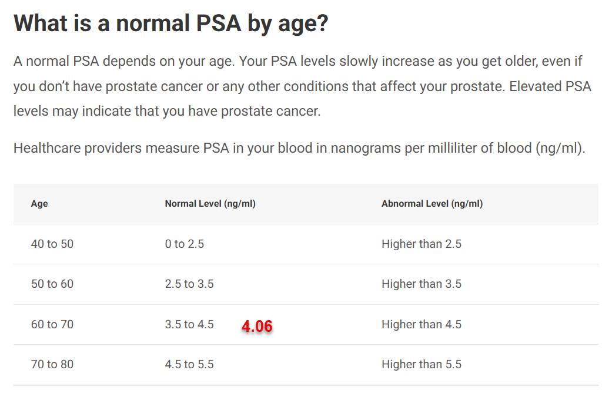

# 📌 **Summary of Key Prostate/PSA Points + Trusted References**

---

## 🩺 **What PSA Is and Why It Matters**

* PSA (prostate-specific antigen) is a **protein measured in the blood** — not a cancer diagnosis in itself. Its level goes up with age and a variety of conditions.
* PSA can be elevated in **benign prostatic hyperplasia (BPH)**, inflammation (prostatitis), infection, or cancer. ([Cleveland Clinic][1])

---
What is a normal PSA by age?
A normal PSA depends on your age. Your PSA levels slowly increase as you get older, even if you don’t have prostate cancer or any other conditions that affect your prostate. Elevated PSA levels may indicate that you have prostate cancer.

---

* For men in their **70s**, a value like ~4 ng/mL (e.g., 4.06) can be within common age-related ranges. ([Cleveland Clinic][1])

**Learn more:** *Cleveland Clinic PSA overview*
👉 [https://my.clevelandclinic.org/health/diagnostics/24615-psa-test](https://my.clevelandclinic.org/health/diagnostics/24615-psa-test) ([Cleveland Clinic][1])

---

## 📊 **Interpreting PSA Beyond a Single Number**

### 1. **PSA Trend (Velocity)**explrer

* How fast PSA changes year-to-year matters more than any single value. A slow rise may be benign. Rapid changes can signal need for further evaluation. ([eMedicine][2])

### 2. **Free PSA % (Ratio)**

* Measures proportion of PSA that is unbound.
* **Higher free PSA %** is more suggestive of benign causes like BPH; **lower %** may imply greater cancer risk. ([PCFA Survivorship Kit][3])

**Learn more:** *Free PSA explanation*
👉 [https://www.prostate.org.au/testing-and-diagnosis/psa-testing/free-to-total-psa-testing/](https://www.prostate.org.au/testing-and-diagnosis/psa-testing/free-to-total-psa-testing/) ([PCFA Survivorship Kit][3])

### 3. **PSA Density**

* PSA adjusted for prostate volume (measured by imaging). Higher density suggests greater concern relative to gland size. ([American Cancer Society][4])

---

## 🔎 **Imaging & Next Steps**

* **Enema is *not* recommended before a PSA test** — it doesn’t improve PSA accuracy and may irritate tissue.
* Doctors may use **MRI** after evaluating PSA trends and additional tests, especially if free PSA % is low or PSA keeps rising. ([AUA][5])

---

## 🥦 **Diet & Lifestyle — What We Know**

Holistic approaches aim at reducing **inflammation and metabolic stress**. However:

### **Evidence in research**

* Dietary patterns and supplements *do not consistently show strong effects on PSA levels* in controlled studies. ([PMC][6])
* Some antioxidants like lycopene (from tomatoes) show mixed data, but evidence isn’t definitive. ([Cancer.gov][7])
* Body composition, hydration, and overall cardiovascular/metabolic health correlate with prostate health. ([Frontiers][8])

### **What *may* support prostate health**

* **Anti-inflammatory foods**: cooked tomatoes, cruciferous vegetables, green tea (catechins)
* **Healthy fats**: fish oils (omega-3s)
* **Regular exercise and weight management**
* Limit high-fat and processed foods

👉 Note: supplements like saw palmetto and lycopene are *marketed* for prostate support, but high-quality evidence for lowering PSA is limited. ([Cancer.gov][9])

**Caution:** Some supplements (especially combinations or high doses) do not reliably lower PSA and may affect test interpretation. ([Ezra][10])

---

## 🧪 **Before PSA Testing — How to Avoid False Signals**

To reduce temporary PSA elevations:

* Avoid **ejaculation** for ~48 hours before testing. ([Cleveland Clinic][1])
* Avoid **bicycle riding or vigorous exercise** 48 hours pre-test. ([Cleveland Clinic][1])
* Test when free of **urinary infections/prostatitis**. ([Cleveland Clinic][11])

---

## 📊 **When to Seek Further Evaluation**

Consider further evaluation (MRI, biopsy) if:

* PSA continues rising rapidly over time
* Free PSA % is low
* Significant symptoms develop
* Family history increases risk

Current guidelines suggest routine PSA screening *may not be recommended* past about age 70–75 in asymptomatic men without risk factors. ([NCBI][12])

---

# 📌 **Helpful Links to Bookmark**

### PSA Testing & Interpretation

* **PSA test basics (Cleveland Clinic):** [https://my.clevelandclinic.org/health/diagnostics/24615-psa-test](https://my.clevelandclinic.org/health/diagnostics/24615-psa-test) ([Cleveland Clinic][1])
* **Free PSA explanation:** [https://www.prostate.org.au/testing-and-diagnosis/psa-testing/free-to-total-psa-testing/](https://www.prostate.org.au/testing-and-diagnosis/psa-testing/free-to-total-psa-testing/) ([PCFA Survivorship Kit][3])
* **Cancer Society PSA & test options:** [https://www.cancer.org/cancer/types/prostate-cancer/detection-diagnosis-staging/tests.html](https://www.cancer.org/cancer/types/prostate-cancer/detection-diagnosis-staging/tests.html) ([American Cancer Society][4])
* **Age-specific PSA ranges:** [https://www.hopkinsmedicine.org/health/conditions-and-diseases/prostate-cancer/prostate-cancer-age-specific-screening-guidelines](https://www.hopkinsmedicine.org/health/conditions-and-diseases/prostate-cancer/prostate-cancer-age-specific-screening-guidelines) ([Hopkins Medicine][13])

### Nutrition & Lifestyle Considerations

* **Cancer.gov prostate supplements overview:** [https://www.cancer.gov/about-cancer/treatment/cam/patient/prostate-supplements-pdq](https://www.cancer.gov/about-cancer/treatment/cam/patient/prostate-supplements-pdq) ([Cancer.gov][9])
* **Diet and PSA research review:** [https://pmc.ncbi.nlm.nih.gov/articles/PMC7600271/](https://pmc.ncbi.nlm.nih.gov/articles/PMC7600271/) ([PMC][6])

---

If you’d like, I can tailor a **simple follow-up plan** (diet, exercise, testing schedule) based on your prior PSA trend and health profile. Just let me know!

[1]: https://my.clevelandclinic.org/health/diagnostics/24615-psa-test?utm_source=chatgpt.com "Prostate-Specific Antigen (PSA) Test: Purpose & Results"
[2]: https://emedicine.medscape.com/article/457394-overview?utm_source=chatgpt.com "Prostate-Specific Antigen Testing: Overview, Physiological ..."
[3]: https://www.prostate.org.au/testing-and-diagnosis/psa-testing/free-to-total-psa-testing/?utm_source=chatgpt.com "Free to Total PSA Testing"
[4]: https://www.cancer.org/cancer/types/prostate-cancer/detection-diagnosis-staging/tests.html?utm_source=chatgpt.com "Prostate Cancer Screening Tests"
[5]: https://www.auanet.org/guidelines-and-quality/guidelines/early-detection-of-prostate-cancer-guidelines?utm_source=chatgpt.com "Early Detection of Prostate Cancer: AUA/SUO Guideline ..."
[6]: https://pmc.ncbi.nlm.nih.gov/articles/PMC7600271/?utm_source=chatgpt.com "Dietary Factors and Supplements Influencing Prostate ..."
[7]: https://www.cancer.gov/about-cancer/treatment/cam/patient/prostate-supplements-pdq?utm_source=chatgpt.com "Prostate Cancer, Nutrition, and Dietary Supplements - NCI"
[8]: https://www.frontiersin.org/journals/oncology/articles/10.3389/fonc.2024.1451941/full?utm_source=chatgpt.com "Lifestyle and risk factors associated with elevated prostate ..."
[9]: https://www.cancer.gov/about-cancer/treatment/cam/hp/prostate-supplements-pdq?utm_source=chatgpt.com "Prostate Cancer, Nutrition, and Dietary Supplements (PDQ®)"
[10]: https://ezra.com/blog/what-can-skew-a-psa-test?utm_source=chatgpt.com "What Can Skew a PSA Test? 6 Factors To Consider"
[11]: https://my.clevelandclinic.org/health/symptoms/15282-elevated-psa-prostate-specific-antigen-level?utm_source=chatgpt.com "Elevated PSA (Prostate-Specific Antigen) Level"
[12]: https://www.ncbi.nlm.nih.gov/books/NBK557495/?utm_source=chatgpt.com "Prostate-Specific Antigen - StatPearls - NCBI Bookshelf - NIH"
[13]: https://www.hopkinsmedicine.org/health/conditions-and-diseases/prostate-cancer/prostate-cancer-age-specific-screening-guidelines?utm_source=chatgpt.com "Prostate Cancer: Age-Specific Screening Guidelines"
