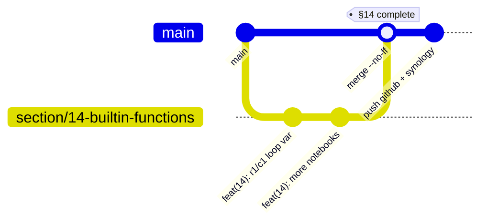
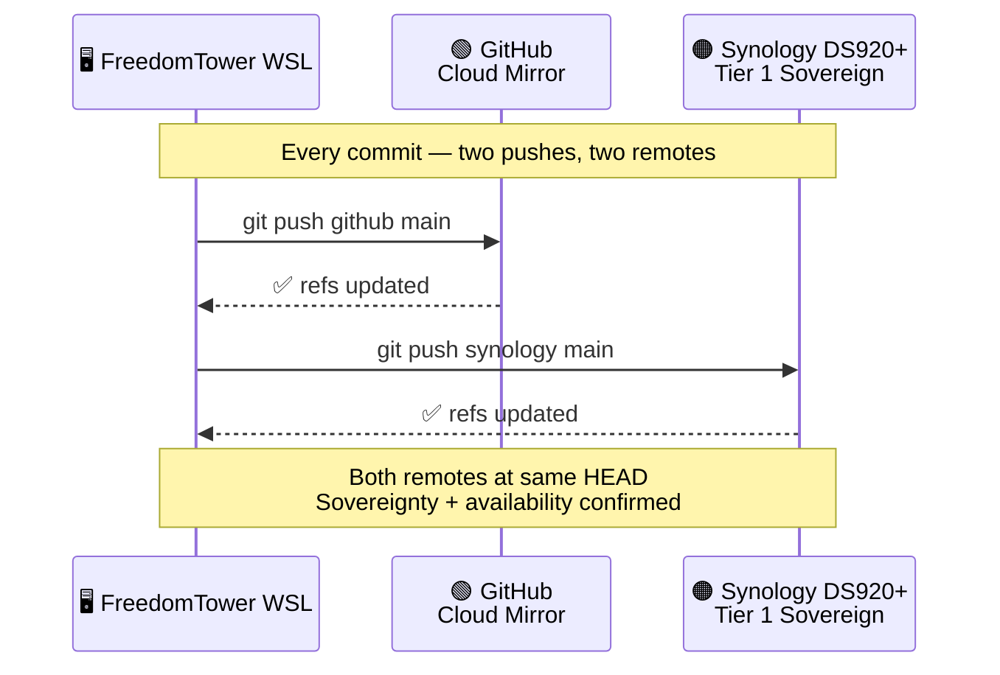
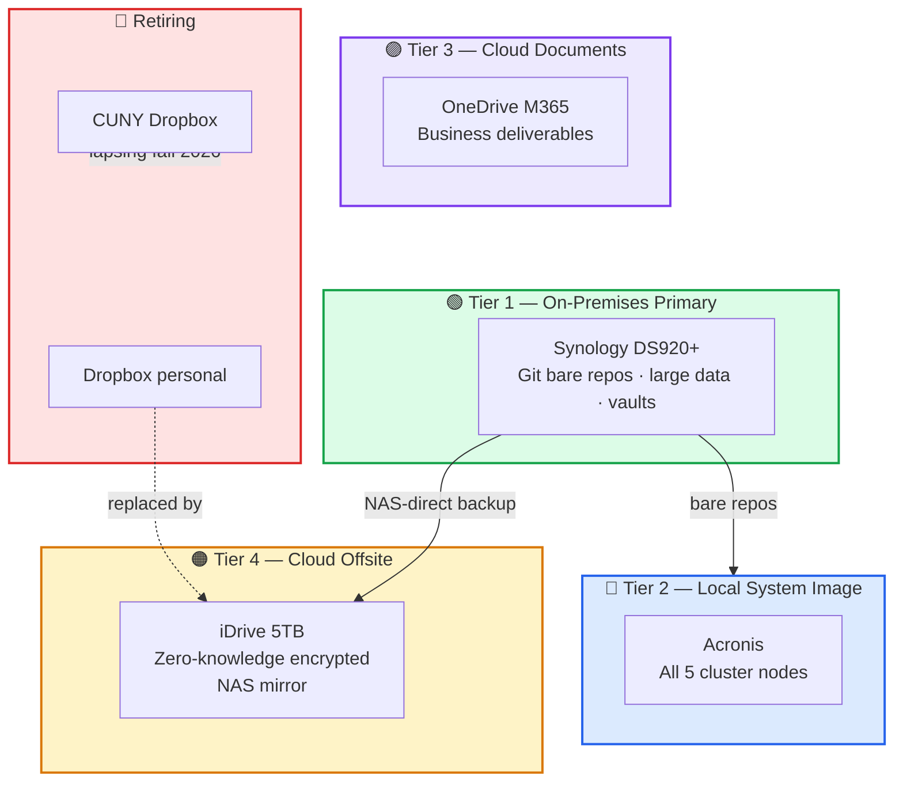
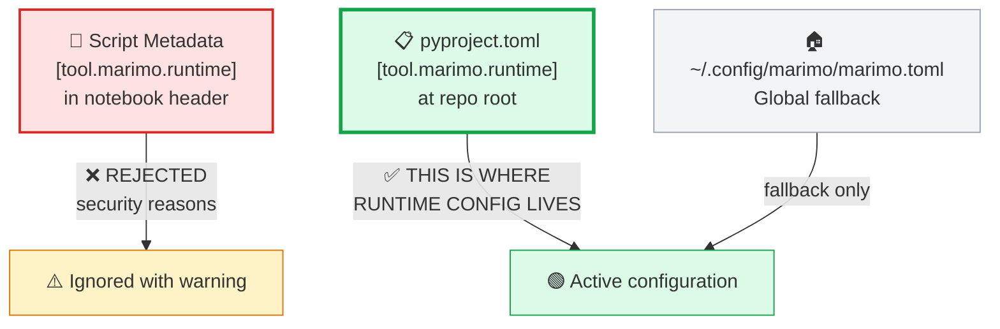
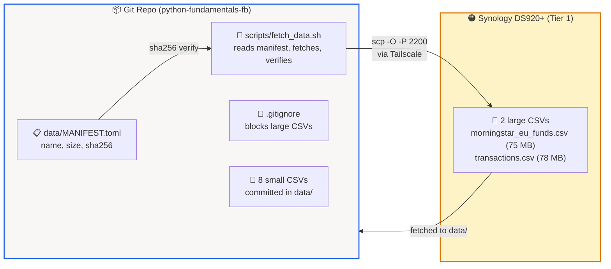

<a id="jupyter-marimo-migration-spec-python-fundamentals-fb"></a>
# 🏗️ Jupyter → Marimo Migration Spec — `python-fundamentals-fb`

> **Mind Over Metadata LLC © 2026**
> Navigator: Peter Heller | Driver: Claude Opus 4.6
> Repository: `QCadjunct/python-fundamentals-fb`
> WSL: `/mnt/e/WSLData/Projects/python-fundamentals-fb`

---

<a id="table-of-contents"></a>
## 📋 Table of Contents

- [Section 0 — What's New in v4](#section-0-whats-new-in-v4)
- [Section 1 — Overview](#section-1-overview)
  - [1.1 What This Repo Is](#11-what-this-repo-is)
  - [1.2 Repo Quick-Reference](#12-repo-quick-reference)
- [Section 2 — Toolchain](#section-2-toolchain)
  - [2.1 The uv-Only Rule](#21-the-uv-only-rule)
  - [2.2 pyproject.toml — Four Required Blocks](#22-pyprojecttoml-four-required-blocks)
  - [2.3 UV_LINK_MODE](#23-uvlinkmode)
- [Section 3 — VS Code Workspace](#section-3-vs-code-workspace)
  - [3.1 Workspace File Template](#31-workspace-file-template)
  - [3.2 Multi-Root Meta Workspace (Option B)](#32-multi-root-meta-workspace-option-b)
  - [3.3 Cross-Vault Workflow](#33-cross-vault-workflow)
  - [3.4 Opening the Workspace](#34-opening-the-workspace)
  - [3.5 Shell Aliases](#35-shell-aliases)
- [Section 4 — Git Branch-Per-Section Strategy](#section-4-git-branch-per-section-strategy)
  - [4.1 The Workflow](#41-the-workflow)
  - [4.2 Locked Git Decisions](#42-locked-git-decisions)
- [Section 5 — Dual Remote Pattern](#section-5-dual-remote-pattern-github-synology)
  - [5.1 Remote Configuration](#51-remote-configuration)
  - [5.2 GitHub Remote](#52-github-remote)
  - [5.3 Synology Remote](#53-synology-remote)
  - [5.4 Canonical Push Sequence](#54-canonical-push-sequence)
  - [5.5 SSH Troubleshooting](#55-ssh-troubleshooting)
  - [5.6 Backup Tier Context (ADR-060)](#56-backup-tier-context-adr-060)
  - [5.7 Network Topology](#57-network-topology-synology-and-freedomtower-ssh)
- [Section 6 — Marimo Runtime Configuration](#section-6-marimo-runtime-configuration)
  - [6.1 Configuration Precedence](#61-configuration-precedence)
  - [6.2 The Learning-Mode Setting](#62-the-learning-mode-setting)
  - [6.3 Anti-Patterns](#63-anti-patterns)
  - [6.4 Schema Discovery](#64-schema-discovery)
- [Section 7 — DAG Conflict Resolution](#section-7-dag-conflict-resolution)
  - [7.1 Notebook Count](#71-notebook-count)
  - [7.2 Pattern A — Numeric Suffix](#72-pattern-a-numeric-suffix)
  - [7.3 Pattern B — Loop Variable Uniqueness](#73-pattern-b-loop-variable-uniqueness)
  - [7.4 Pattern C — Semantic Suffixes](#74-pattern-c-semantic-suffixes)
  - [7.5 Pattern D — Class Version Suffixes](#75-pattern-d-class-version-suffixes)
  - [7.6 Pattern E — Python Writer Deployment](#76-pattern-e-python-writer-deployment)
- [Section 8 — Smoke Testing](#section-8-smoke-testing)
- [Section 9 — Key Lessons Learned](#section-9-key-lessons-learned)
- [Section 10 — MOM Scripts Registry](#section-10-mom-scripts-registry)
- [Section 11 — ADR Pending](#section-11-adr-pending)
- [Section 12 — Data Files](#section-12-data-files)
- [Section 13 — Operational Runbook](#section-13-operational-runbook)
  - [13.1 Cells Already Executed on Open](#131-cells-already-executed-on-open)
  - [13.2 "Address Already in Use"](#132-address-already-in-use)
  - [13.3 Stale Browser Tab](#133-stale-browser-tab)
  - [13.4 PATH Shadowing](#134-path-shadowing)
  - [13.5 Sandbox Prompt Conflict](#135-sandbox-prompt-conflict)
  - [13.6 Dual-Remote Drift](#136-dual-remote-drift)
  - [13.7 Missing .code-workspace File](#137-missing-code-workspace-file)
  - [13.8 Markdown Autolink Corruption](#138-markdown-autolink-corruption)
  - [13.9 Synology scp/rsync Permission Denied](#139-synology-scprsync-permission-denied)
- [Section 14 — Locked Decisions](#section-14-locked-decisions)
- [Section 15 — Alias Library](#section-15-alias-library)
- [Section 16 — Output Trifecta](#section-16-output-trifecta)
- [Section 17 — Data Manifest Pattern](#section-17-data-manifest-pattern-lfs-alternative)
  - [17.1 The Pattern in One Sentence](#171-the-pattern-in-one-sentence)
  - [17.2 LFS vs External Store](#172-lfs-vs-external-store)
  - [17.3 Why External Store Wins for This Repo](#173-why-external-store-wins-for-this-repo)
  - [17.4 Data Manifest — MANIFEST.toml](#174-data-manifest-datamanifesttoml)
  - [17.5 Fetch Script — fetch_data.sh](#175-fetch-script-scriptsfetchdatash)
  - [17.6 Updated .gitignore](#176-updated-gitignore)
  - [17.7 README Data Section](#177-readme-data-section)
  - [17.8 Generalizing — Beyond This Project](#178-generalizing-beyond-this-project)
- [Appendix A — ADR-060 (Backup Strategy Migration)](#appendix-a-adr-060-backup-strategy-migration)
- [Appendix B — ADR-036 (Rclone Universal Storage Layer)](#appendix-b-adr-036-rclone-universal-storage-layer)
- [Appendix C — ADR-038 (RustFS Local S3 Hub)](#appendix-c-adr-038-rustfs-local-s3-hub)
- [Appendix D — ADR-046 (FreedomTower Disk Topology)](#appendix-d-adr-046-freedomtower-disk-topology)
  - [ADR-046 Amendment 1 — E: Drive Root Restructure](#adr-046-amendment-1-e-drive-root-restructure)
- [Appendix E — ADR-047 (Backup Governance)](#appendix-e-adr-047-backup-governance)

---

<a id="section-0-whats-new-in-v4"></a>
# 🔷 Section 0 — What's New in v4

v4 is a **platinum rewrite** — same verified content as v6, rewritten to the documentation standard established in `Section_1_overview_architecture.md` (ACES D⁴ Database Design). Interim spec versions v4 and v5 were never accepted as complete. v6 had the correct content but the wrong style. This is the first version that meets both content and quality standards.

**What it is:**

- A complete, styled rewrite of all 17 sections plus Appendix A
- Output trifecta: markdown (authoritative) + docx + html
- Platinum-standard formatting: emoji headers, anchor TOC, governing principles, ASCII diagrams, structured comparison tables

**What it is not:**

- It is not a content revision — all facts verified against repo state 2026-05-04
- It is not a new specification — the locked decisions table (§14) is unchanged
- It is not a style-only reskin — critical corrections from 2026-05-03/04 are embedded in every relevant section

| Change | Section |
|--------|---------|
| Platinum documentation standard applied to all 17 sections | All |
| Network topology table — eliminates SSH port trial-and-error | §5.7 |
| Synology DSM 7.2.2 OpenSSH 8.2 quirks — `scp -O` requirement | §13.9 |
| Data manifest pattern — LFS-vs-external explanation | §17 |
| `data/MANIFEST.toml` — two large CSVs cataloged with SHA-256 | §17.4 |
| `scripts/fetch_data.sh` — repeatable data acquisition with verification | §17.5 |
| ADR-060 included verbatim — backup tier rationale | Appendix A |
| Updated `.gitignore` — specific large files only, small CSVs committable | §17.6 |
| README data documentation — students aren't stranded | §17.7 |

---

<a id="section-1-overview"></a>
# 🔷 Section 1 — Overview

<a id="11-what-this-repo-is"></a>
## 🎯 1.1 What This Repo Is

`python-fundamentals-fb` is a Jupyter → Marimo migration of Fred Baptiste's Python Fundamentals Udemy course. Every original `.ipynb` notebook has been converted to a Marimo `.py` notebook, governed by `uv` as the exclusive toolchain, and deployed under a dual-remote git pattern (GitHub + Synology).

**In one sentence:** 118 Marimo notebooks running in learning mode (`auto_instantiate = false`), managed by `uv`, pushed to two remotes every commit, with large data files on a sovereign NAS and a manifest in the repo.

**What it is not:**

- It is not a fork of Baptiste's repo — it is a migration to a different runtime
- It is not a pip-managed project — `uv` is the only permitted package manager
- It is not a monorepo — each course gets its own repo (`python-deepdive-fb`, `pydantic-v2-essentials`)

---

<a id="12-repo-quick-reference"></a>
## 🏛️ 1.2 Repo Quick-Reference

| Field | Value |
|-------|-------|
| **Target runtime** | Marimo ≥ 0.23.4 |
| **Toolchain** | `uv` · `uvx` · `Ruff` exclusively. `pip` and `pipx` prohibited. |
| **Project root (WSL)** | `/mnt/e/WSLData/Projects/python-fundamentals-fb` |
| **Project root (Windows)** | `E:\WSLData\Projects\python-fundamentals-fb` |
| **GitHub** | `QCadjunct/python-fundamentals-fb` |
| **Synology git** | `ssh://synology:/volume1/git/python-fundamentals-fb.git` |
| **Synology data** | `/volume1/workspace/python-fundamentals-fb/` (large CSVs) |
| **Obsidian vault** | `E:\Obsidian\udemy-fred-baptiste` |
| **Notebooks** | 118 `.py` files under `notebooks/` |
| **Last commit** | `f532b80` (Ignore egg-info build output) |
| **Python** | 3.12 |
| **Shell alias** | `fb-fund` |

> **Governing principle:** KISS — Keep It Simple and Standard. Every tooling choice defaults to the simplest option that satisfies the requirement. No tool earns its place without a concrete problem it solves.

---

<a id="section-2-toolchain"></a>
# 🔷 Section 2 — Toolchain

<a id="21-the-uv-only-rule"></a>
## 🎯 2.1 The uv-Only Rule

This project uses `uv` as the **exclusive** Python toolchain. `pip`, `pipx`, and `conda` are prohibited. There is no exception mechanism.

```bash
uv venv --python 3.12
uv pip install -e .
.venv/bin/marimo edit --no-sandbox notebooks/03-python-basics/basic_data_types.py
uvx ruff check notebooks/
```

> **Governing principle:** One toolchain, no alternatives. `uv` handles virtual environment creation, dependency installation, tool execution (`uvx`), and linting delegation to `ruff`. If `uv` cannot do it, the project does not need it.

---

<a id="22-pyprojecttoml-four-required-blocks"></a>
## 🔩 2.2 pyproject.toml — Four Required Blocks

Every block below must be present. Missing any one causes subtle failures that waste session time.

```toml
[tool.uv]
package = false

[tool.setuptools]
packages = []

[tool.ruff.lint]
line-length = 88
target-version = "py312"
select = ["E", "F", "I"]

[tool.marimo.runtime]
auto_instantiate = false      # cells unrun on open (learning mode)
```

| Block | Why It Exists |
|-------|---------------|
| `[tool.uv]` | Tells `uv` this is a non-package project — no build step |
| `[tool.setuptools]` | Prevents `setuptools` from scanning for packages on editable install |
| `[tool.ruff.lint]` | Governs lint rules. `select = ["E", "F", "I"]` = pyflakes + pycodestyle + isort |
| `[tool.marimo.runtime]` | Learning mode — cells don't auto-execute on open (see §6) |

---

<a id="23-uvlinkmode"></a>
## 🔐 2.3 UV_LINK_MODE

```bash
<a id="bashrc"></a>
# ~/.bashrc
export UV_LINK_MODE=copy
```

**Why:** On WSL2 with NTFS-mounted drives, `uv` defaults to hardlinks. Cross-filesystem hardlinks fail silently. `UV_LINK_MODE=copy` forces file copies — slower, but reliable.

---

<a id="section-3-vs-code-workspace"></a>
# 🔷 Section 3 — VS Code Workspace

> **⚠️ Always open by workspace file — never by folder.**
> **⚠️ The `.code-workspace` file MUST be committed at repo root.**

Opening by folder bypasses interpreter and Marimo path settings. The workspace file is the authoritative entry point.

---

<a id="31-workspace-file-template"></a>
## 🎯 3.1 Workspace File Template

```json
// python-fundamentals-fb.code-workspace
{
  "folders": [{ "path": "." }],
  "settings": {
    "python.defaultInterpreterPath": "${workspaceFolder}/.venv/bin/python",
    "python.terminal.activateEnvironment": true,
    "[python]": {
      "editor.defaultFormatter": "charliermarsh.ruff"
    },
    "marimo.marimoPath": "${workspaceFolder}/.venv/bin/marimo"
  }
}
```

| Setting | Purpose |
|---------|---------|
| `python.defaultInterpreterPath` | Points VS Code at the project venv, not system Python |
| `python.terminal.activateEnvironment` | Auto-activates venv in integrated terminal |
| `editor.defaultFormatter` | Ruff handles all Python formatting |
| `marimo.marimoPath` | Prevents PATH shadowing (see §13.4) |

---

<a id="32-multi-root-meta-workspace-option-b"></a>
## 🏛️ 3.2 Multi-Root Meta Workspace (Option B)

For sessions that span multiple Baptiste courses and the Obsidian vault, a multi-root workspace lives under the fundamentals repo:

```json
// python-fundamentals-fb/workspaces/fred-baptiste-courses.code-workspace
{
  "folders": [
    { "name": "Python Fundamentals", "path": ".." },
    { "name": "Python Deep Dive",    "path": "../../python-deepdive-fb" },
    { "name": "Pydantic v2",         "path": "../../pydantic-v2-essentials" },
    { "name": "Vault Notes",         "path": "../../../Obsidian/udemy-fred-baptiste" }
  ],
  "settings": {
    "python.terminal.activateEnvironment": true,
    "[python]": { "editor.defaultFormatter": "charliermarsh.ruff" }
  }
}
```

> **Governing principle:** The multi-root workspace is a convenience, not a coupling. Each repo retains its own `.code-workspace` at root. The meta workspace adds a cross-project view — it does not replace per-project workspace files.

---

<a id="33-cross-vault-workflow"></a>
## 🔩 3.3 Cross-Vault Workflow

This is a discipline pattern, not a code integration. The workflow alternates between the code repo and the Obsidian vault:

```
fb-fund                          # cd to code repo
.venv/bin/marimo edit ...        # teach the lesson
fb-notes                         # cd to vault
<a id="write-reflection-note"></a>
# write reflection note
git add ... && git commit ...
git push synology main && git push github main
```

**What it is:** A post-session discipline — finish the lesson, write a reflection, push both repos.

**What it is not:** An automated sync. There is no code that ties the vault to the code repo.

---

<a id="34-opening-the-workspace"></a>
## 🖥️ 3.4 Opening the Workspace

```bash
fb-fund
code python-fundamentals-fb.code-workspace
.venv/bin/marimo edit --no-sandbox notebooks/03-python-basics/basic_data_types.py
```

---

<a id="35-shell-aliases"></a>
## 🔑 3.5 Shell Aliases

```bash
alias fb-fund='cd /mnt/e/WSLData/Projects/python-fundamentals-fb'
alias fb-deepdive='cd /mnt/e/WSLData/Projects/python-deepdive-fb'
alias fb-pydantic='cd /mnt/e/WSLData/Projects/pydantic-v2-essentials'
alias fb-notes='cd /mnt/e/Obsidian/udemy-fred-baptiste'
```

See §15 for the extended alias library.

---

<a id="section-4-git-branch-per-section-strategy"></a>
# 🔷 Section 4 — Git Branch-Per-Section Strategy

> **⚠️ WSL2 is the authoritative git interface. Never PowerShell.**

---

<a id="41-the-workflow"></a>
## 🎯 4.1 The Workflow



```bash
git checkout -b section/14-builtin-functions
git add notebooks/14-builtin-functions/
git commit -m "feat(14): builtin_functions — r1/c1 loop var scoping"

git checkout main
git merge --no-ff section/14-builtin-functions
git commit -m "feat(14): complete Built-In Functions — N notebooks"

git push github main
git push synology main
```

```
main ──────●─────────●── merge ──● push both
            \       /
             section/14 ── commits ──
```

> **Governing principle:** `--no-ff` always. Fast-forward merges lose the branch boundary in `git log`. Non-fast-forward preserves the section as a discrete unit of work, visible in the graph.

---

<a id="42-locked-git-decisions"></a>
## 🏛️ 4.2 Locked Git Decisions

| Decision | Rule |
|----------|------|
| Repo name | `python-fundamentals-fb` |
| Merge style | `--no-ff` always |
| Git interface | WSL2 terminal only |
| Remote push | Both remotes every commit |

---

<a id="section-5-dual-remote-pattern-github-synology"></a>
# 🔷 Section 5 — Dual Remote Pattern — GitHub + Synology

<a id="51-remote-configuration"></a>
## 🎯 5.1 Remote Configuration

```bash
git remote -v
<a id="github-gitgithubcomqcadjunctpython-fundamentals-fbgit-fetchpush"></a>
# github    git@github.com:QCadjunct/python-fundamentals-fb.git (fetch/push)
<a id="synology-sshsynologyvolume1gitpython-fundamentals-fbgit-fetchpush"></a>
# synology  ssh://synology:/volume1/git/python-fundamentals-fb.git (fetch/push)
```

Two named remotes. Two explicit pushes. No unified origin.

---

<a id="52-github-remote"></a>
## 🔩 5.2 GitHub Remote

| Field | Value |
|-------|-------|
| Name | `github` |
| URL | `git@github.com:QCadjunct/python-fundamentals-fb.git` |
| Auth | SSH key (not HTTPS) |
| Role | Public/cloud mirror |

---

<a id="53-synology-remote"></a>
## 🔩 5.3 Synology Remote

| Field | Value |
|-------|-------|
| Name | `synology` |
| URL | `ssh://synology:/volume1/git/python-fundamentals-fb.git` |
| Auth | SSH publickey via Tailscale mesh |
| Role | Tier 1 sovereign primary (ADR-060) |

---

<a id="54-canonical-push-sequence"></a>
## 🔑 5.4 Canonical Push Sequence

```bash
git push github main      # cloud mirror first
git push synology main    # NAS sovereign primary second
```



**Why two remotes — sovereignty vs redundancy:**

- **GitHub** — public-facing mirror. Students clone from it. If GitHub vanishes, your IP is intact on Synology.
- **Synology** — sovereign primary on your NAS, your network, your keys. Tier 1 recovery per ADR-060.

**Why GitHub first:**

GitHub is the more likely failure point (auth, rate limits, TOS). Pushing first surfaces problems before Synology is touched. If GitHub fails, retry it; both remotes still match the prior HEAD.

**Why two-explicit-pushes beats unified-origin (see §13.6):**

Unified origin couples failure — if either fails, the whole push fails. Two-explicit-pushes keeps remotes independent. If GitHub is down and Synology is up, your sovereign primary still gets the commit. Independence beats ergonomic tidiness when one remote is your IP guardian.

> **Governing principle:** Every commit exists on two remotes before the session ends. Sovereignty and redundancy are separate concerns — the Synology remote guarantees sovereignty; the GitHub remote guarantees availability. Neither is optional.

---

<a id="55-ssh-troubleshooting"></a>
## 🔐 5.5 SSH Troubleshooting

| Symptom | Fix |
|---------|-----|
| GitHub: Permission denied | `eval $(ssh-agent) && ssh-add ~/.ssh/id_ed25519` |
| Verify GitHub SSH | `ssh -T git@github.com` |
| Synology: connection refused | `tailscale status` |
| Verify Synology SSH | `ssh synology echo ok` |

---

<a id="56-backup-tier-context-adr-060"></a>
## 🏛️ 5.6 Backup Tier Context (ADR-060)

See Appendix A for the full ADR text. Summary:



| Tier | System | Coverage |
|------|--------|----------|
| 1 (primary) | Synology DS920+ | Git bare repos · large data files · vaults |
| 2 | Acronis | Five-node system images |
| 3 | OneDrive | M365 documents |
| 4 (cloud) | iDrive 5TB | NAS mirror · zero-knowledge encrypted |

---

<a id="57-network-topology-synology-and-freedomtower-ssh"></a>
## 🖥️ 5.7 Network Topology — Synology and FreedomTower SSH

> **Purpose:** Eliminates SSH port trial-and-error. Paste this table to establish topology context in future sessions.

| Host alias | IP | Port | User | Auth | Purpose |
|------------|-----|------|------|------|---------|
| `synology` | 192.168.1.242 | 2200 | pheller | publickey | Shell access · git push (default) |
| `synology2` | 192.168.1.167 | 2201 | pheller | publickey | Secondary access |
| `synology-admin` | 192.168.1.242 | 2200 | QCadjunct | publickey | DSM admin operations |
| `synology-git` | 192.168.1.242 | 2201 | pheller | publickey | Bare repo SSH (alternate) |
| `localhost` (FreedomTower) | n/a | 2220 | pheller | publickey | Local sshd |

**Synology details:**

- DSM version: 7.2.2 build 72806 (current as of 2026-05-04)
- OpenSSH version: 8.2 (older — drives the `scp -O` requirement, see §13.9)
- Shared folders relevant to this repo:
  - `/volume1/git/python-fundamentals-fb.git` — bare repo
  - `/volume1/workspace/python-fundamentals-fb/` — large CSV staging

**Configuration source:** `~/.ssh/config` on FreedomTower defines all aliases. Verify with:

```bash
cat ~/.ssh/config | grep -A5 -i synology
```

---

[🔝 Back to TOC](#table-of-contents)

---

<a id="section-6-marimo-runtime-configuration"></a>
# 🔷 Section 6 — Marimo Runtime Configuration

> **CRITICAL:** Marimo accepts `**kwargs` to `marimo.App(...)` and **silently ignores** keys it doesn't recognize. Runtime behavior must be configured at the project level via `pyproject.toml`.

**What this means:** If you write `marimo.App(auto_instantiate=False)`, Marimo will parse the file, see the kwarg, and do nothing with it. Your notebook will auto-execute. There is no error, no warning, no indication that the setting was ignored.

---

<a id="61-configuration-precedence"></a>
## 🔩 6.1 Configuration Precedence



```
Script metadata (rejected for runtime keys — security)
        ↓
pyproject.toml  ← THIS IS WHERE RUNTIME CONFIG LIVES
        ↓
~/.config/marimo/marimo.toml  (global fallback)
```

Per-notebook script-metadata `[tool.marimo.runtime]` blocks are **rejected** with:

```
[W reader:45] tool.marimo.runtime.auto_instantiate in script metadata
              is ignored for security reasons
```

---

<a id="62-the-learning-mode-setting"></a>
## 🎯 6.2 The Learning-Mode Setting

```toml
<a id="pyprojecttoml-at-repo-root"></a>
# pyproject.toml — at repo root
[tool.marimo.runtime]
auto_instantiate = false
```

Verify:

```bash
.venv/bin/marimo config show | head -10
<a id="should-show"></a>
# Should show:
<a id="project-overrides-from-mntewsldataprojectspython-fundamentals-fbpyprojecttoml"></a>
# 📁 Project overrides from /mnt/e/WSLData/Projects/python-fundamentals-fb/pyproject.toml
<a id="runtime"></a>
# [runtime]
<a id="autoinstantiate-false"></a>
# auto_instantiate = false
```

**What "learning mode" means:** Cells are unrun when you open a notebook. You must explicitly run each cell. This forces engagement with the material — you read the code, predict the output, then verify.

---

<a id="63-anti-patterns"></a>
## 🔐 6.3 Anti-Patterns

```python
<a id="kwarg-in-app-silently-ignored"></a>
# ❌ kwarg in App() — silently ignored
app = marimo.App(auto_instantiate=False)

<a id="script-metadata-rejected-for-security"></a>
# ❌ script metadata — rejected for security
<a id="script"></a>
# /// script
<a id="toolmarimoruntime"></a>
# [tool.marimo.runtime]
<a id="autoinstantiate-false-1"></a>
# auto_instantiate = false
<a id=""></a>
# ///
```

**Both fail silently or with a warning.** Neither configures the runtime. Only `pyproject.toml` works.

---

<a id="64-schema-discovery"></a>
## 🔬 6.4 Schema Discovery

```bash
.venv/bin/python -c "
from marimo._config.config import RuntimeConfig
import dataclasses
for f in dataclasses.fields(RuntimeConfig):
    print(f.name, '=', f.default)
"
```

> **Forward reference (Pydantic v2):** Same pattern works on Pydantic models via `MyModel.model_fields`. Schema introspection beats schema guessing in either world.

---

[🔝 Back to TOC](#table-of-contents)

---

<a id="section-7-dag-conflict-resolution"></a>
# 🔷 Section 7 — DAG Conflict Resolution

<a id="71-notebook-count"></a>
## 🎯 7.1 Notebook Count

118 `.py` files under `notebooks/`. All contain `marimo.App(`. Verified 2026-05-03.

Marimo's reactive runtime builds a DAG (Directed Acyclic Graph) from cell-level variable definitions. Every variable name must be unique across the entire notebook. Conflicts that Jupyter silently tolerates — reusing `x` in two cells — become hard errors in Marimo.

> **Governing principle:** The DAG is a feature, not a bug. It forces clean variable hygiene. The resolution patterns below are the vocabulary for working with it.

---

<a id="72-pattern-a-numeric-suffix"></a>
## 🔩 7.2 Pattern A — Numeric Suffix

When the same conceptual variable appears in multiple cells for demonstration purposes:

```python
x_1 = 10        # cell 3
x_2 = 'hello'   # cell 7
```

---

<a id="73-pattern-b-loop-variable-uniqueness"></a>
## ⚠️ 7.3 Pattern B — Loop Variable Uniqueness

> **For loop variables leak out of `for` loops into Marimo's DAG cell scope. The static scanner does NOT catch this.**

This is the most dangerous pattern because it produces no warning. Two cells with `for r in range(...)` silently conflict.

```python
<a id="wrong-both-cells-export-r"></a>
# ❌ WRONG — both cells export 'r'
for r in range(len(m1)): ...    # cell A
for r in range(len(m2)): ...    # cell B — CONFLICT

<a id="correct-unique-loop-vars-per-cell"></a>
# ✅ CORRECT — unique loop vars per cell
for r1 in range(len(m1)): ...
for r2 in range(len(m2)): ...
```

**Standard naming convention:** `r1/c1` · `r2/c2` · `r3/c3` · `e1/e2/e3` · `v1/v2/v3/v4`

---

<a id="74-pattern-c-semantic-suffixes"></a>
## 🔩 7.4 Pattern C — Semantic Suffixes

When multiple cells demonstrate the same concept across types:

```python
a_int   = 10
a_float = 10.5
a_str   = 'hello'
```

---

<a id="75-pattern-d-class-version-suffixes"></a>
## 🔩 7.5 Pattern D — Class Version Suffixes

When a class evolves across cells:

```python
class VectorV1: ...
class VectorV2: ...   # adds __repr__
class VectorV3: ...   # adds __add__
```

---

<a id="76-pattern-e-python-writer-deployment"></a>
## 🔐 7.6 Pattern E — Python Writer Deployment

> **Never use raw bash heredoc for files containing `marimo.App`, `mo.md`, or `app.run`.** Chat clients autolink dotted names — `marimo.App` becomes `[marimo.App](http://marimo.App)` — and corrupt the heredoc.

```bash
python3 << 'PYEOF'
import pathlib
pathlib.Path("notebooks/section/file.py").write_text('''
import marimo
app = marimo.App()
...
''')
PYEOF
```

**Why this works:** The Python heredoc processes the file content as a Python string literal. Python does not autolink. The file is written exactly as specified.

---

[🔝 Back to TOC](#table-of-contents)

---

<a id="section-8-smoke-testing"></a>
# 🔷 Section 8 — Smoke Testing

| Script | Wave | Coverage |
|--------|------|----------|
| `scripts/smoke_test_wave1.sh` | 1 (original) | Sections 22–32 |
| `scripts/smoke_test_wave1_improved.sh` | 1 (refined) | Sections 20–32 |
| `scripts/smoke_test_wave2.sh` | 2 | TBD |
| `scripts/smoke_test_wave3.sh` | 3 | TBD |

Future orchestrator: `scripts/smoke_test_all.sh` runs all waves.

**Naming rules:**

- `wave{N}` prefix — sortable, greppable
- `_improved` suffix optional, for substantive iterations
- No silent renames — preserve bisect history

---

<a id="section-9-key-lessons-learned"></a>
# 🔷 Section 9 — Key Lessons Learned

Twelve hard-won lessons from the migration. Each one cost at least one debugging session.

| # | Lesson | Reference |
|---|--------|-----------|
| 1 | Loop var leak — use unique names per cell | §7.3 |
| 2 | Python writer — `python3 << 'PYEOF'`, never raw bash heredoc | §7.6 |
| 3 | Generator exhaustion — separate vars (`squares_1`–`squares_4`) | — |
| 4 | `pyproject.toml` needs all four blocks: `[tool.uv]`, `[tool.setuptools]`, `[tool.ruff.lint]`, `[tool.marimo.runtime]` | §2.2 |
| 5 | `datetime.utcnow()` — Python 3.12 DeprecationWarning expected, non-fatal | — |
| 6 | Marimo runtime config lives in `pyproject.toml`, not `App()` kwargs | §6 |
| 7 | `.code-workspace` is a tracked artifact | §3 |
| 8 | Dual-remote drift — plain `git push` writes only to upstream | §13.6 |
| 9 | PATH shadowing — `~/.local/bin/marimo` shadows `.venv/bin/marimo` | §13.4 |
| 10 | Schema introspection beats schema guessing | §6.4 |
| 11 | Synology DSM 7.2.2 OpenSSH 8.2 requires `scp -O` for transfers | §13.9 |
| 12 | Large data files belong in external store with manifest, not LFS | §17 |

---

<a id="section-10-mom-scripts-registry"></a>
# 🔷 Section 10 — MOM Scripts Registry

| MMS ID | Name | Purpose |
|--------|------|---------|
| MMS-023 | `convert/nb_convert.py` | Bulk `.ipynb` → Marimo `.py` converter |
| MMS-024 | `convert/scan_conflicts.py` | Variable redefinition scanner |
| MMS-025 | `scripts/fetch_data.sh` | Data manifest acquisition (new in v4) |

---

<a id="section-11-adr-pending"></a>
# 🔷 Section 11 — ADR Pending

- **ADR-061** — Jupyter → Marimo Migration — Fred Baptiste Python Fundamentals
  - Status: Proposed
  - Decision: Migrate notebooks to Marimo ≥ 0.23.4 using uv/uvx/Ruff exclusively
  - Scope: data manifest pattern, `/volume1/workspace/` data path, ADR-060 backup tier integration

---

<a id="section-12-data-files"></a>
# 🔷 Section 12 — Data Files

| Original | Used In | Canonical Path | Tier |
|----------|---------|----------------|------|
| populations.csv | §30, §31 | `data/populations.csv` | small (committed) |
| world_bank_countries.csv | §30 | `data/world_bank_countries.csv` | small (committed) |
| daily_quotes.csv | §30, §31 | `data/daily_quotes.csv` | small (committed) |
| AAPL.csv | §31 | `data/AAPL.csv` | small (committed) |
| AAPL_data.csv | §31 | `data/AAPL_data.csv` | small (committed) |
| DEXUSEU.csv | §31 | `data/DEXUSEU.csv` | small (committed) |
| nasdaq.csv | §22 | `data/nasdaq.csv` | small (committed) |
| widget_sales.csv | §32 | `data/widget_sales.csv` | small (committed) |
| Morningstar EU Funds.csv | §30 | `data/morningstar_eu_funds.csv` | **large (external — see §17)** |
| transactions.csv | §32 | `data/transactions.csv` | **large (external — see §17)** |

> **Governing principle:** Small files commit. Large files manifest. The threshold is practical, not numerical — if `git clone` becomes painful for a student, the file belongs on the NAS.

---

<a id="section-13-operational-runbook"></a>
# 🔷 Section 13 — Operational Runbook

Nine failure modes, each with symptom, root cause, and fix. These are not hypothetical — every entry was triggered during development.

---

<a id="131-cells-already-executed-on-open"></a>
## 🔩 13.1 Cells Already Executed on Open

**Symptom:** Open notebook, every cell shows computed output.

**Cause:** `auto_instantiate = false` not set at project level in `pyproject.toml`.

**Fix:**

```toml
[tool.marimo.runtime]
auto_instantiate = false
```

**Verify:** `.venv/bin/marimo config show | head -10`

---

<a id="132-address-already-in-use"></a>
## 🔩 13.2 "Address Already in Use"

**Symptom (any port):**

```
ERROR: [Errno 98] error while attempting to bind on address
       ('127.0.0.1', <PORT>): address already in use
```

**Cause:** Zombie Marimo process. `pkill -f marimo` may not catch it.

**Fix:**

```bash
ss -ltnp | grep 2718         # find PID
fuser -k 2718/tcp            # kill by port — the reliable kill
ss -ltnp | grep 2718         # verify gone
```

For non-default ports, substitute the port number.

---

<a id="133-stale-browser-tab"></a>
## 🔩 13.3 Stale Browser Tab

**Cause:** Browser tab from previous Marimo session pointing at old (possibly dead) server.

**Fix:** Close all tabs, restart Marimo, open new URL (with new `access_token`) in **fresh incognito window**. This is the definitive test — if Marimo works in incognito with a new token, the issue was browser cache.

---

<a id="134-path-shadowing"></a>
## 🔩 13.4 PATH Shadowing

**Symptom:** `which marimo` returns `~/.local/bin/marimo` instead of `.venv/bin/marimo`.

**Cause:** A prior `uv tool install marimo` placed a global binary in `~/.local/bin/`, which shadows the project venv.

**Fix (immediate):**

```bash
.venv/bin/marimo edit --no-sandbox notebooks/03-python-basics/basic_data_types.py
```

**Fix (permanent):**

```bash
uv tool uninstall marimo
```

> Note: `pipx` is not in this toolchain. If you see `pipx` in a suggestion, ignore it.

---

<a id="135-sandbox-prompt-conflict"></a>
## 🔩 13.5 Sandbox Prompt Conflict

**Symptom:** `uvx marimo edit --sandbox` fails with jedi version conflict.

**Cause:** Notebook inline deps pin `jedi==0.20.0` but `python-lsp-server` requires `jedi<0.20.0`.

**Fix:** Don't use `--sandbox`:

```bash
.venv/bin/marimo edit --no-sandbox notebooks/03-python-basics/basic_data_types.py
```

If prompted `Run in a sandboxed venv? [Y/n]:`, answer `n`.

---

<a id="136-dual-remote-drift"></a>
## 🔩 13.6 Dual-Remote Drift

**Symptom:** One remote is ahead of the other after `git push`.

**Cause:** Plain `git push` only writes to the upstream-tracking remote (usually `github`).

**Fix:**

```bash
git push github main
git push synology main
```

Or use the `git pushall` alias from §15.

---

<a id="137-missing-code-workspace-file"></a>
## 🔩 13.7 Missing .code-workspace File

**Cause:** Never committed, or moved during filesystem migration.

**Fix:** Create per §3.1, commit, push both remotes. The `.code-workspace` file is a tracked artifact — its absence is a bug, not a configuration choice.

---

<a id="138-markdown-autolink-corruption"></a>
## 🔩 13.8 Markdown Autolink Corruption

**Cause:** Chat clients autolink dotted names — `marimo.App` becomes `[marimo.App](http://marimo.App)`.

**Fix:** Type commands fresh from terminal history. Don't copy-paste from chat for dotted-name commands.

---

<a id="139-synology-scprsync-permission-denied"></a>
## ⚠️ 13.9 Synology scp/rsync Permission Denied

**Symptom:**

```
scp: remote mkdir "...": No such file or directory
<a id="or"></a>
# or
Permission denied, please try again.
rsync: connection unexpectedly closed
```

…even though `ssh synology echo ok` works fine.

**Cause:** Synology DSM 7.2.2 ships OpenSSH 8.2. Modern OpenSSH 9.x clients (default on Ubuntu 24.04 WSL) negotiate SFTP for scp transfers, which Synology's older sftp-server may chroot or reject. Rsync falls back to password auth despite SSH key auth succeeding.

**Fix — scp:** Force legacy SCP protocol with `-O` flag:

```bash
scp -O -P 2200 \
  data/morningstar_eu_funds.csv \
  data/transactions.csv \
  synology:/volume1/workspace/python-fundamentals-fb/
```

**Fix — rsync:** Specify rsync path explicitly:

```bash
rsync -avh --progress \
  --rsync-path=/bin/rsync \
  -e "ssh -p 2200" \
  data/big_file.csv \
  synology:/volume1/workspace/python-fundamentals-fb/
```

**Long-term fix:** Wait for Synology to ship a DSM update with OpenSSH 9.x. Not under your control.

---

[🔝 Back to TOC](#table-of-contents)

---

<a id="section-14-locked-decisions"></a>
# 🔷 Section 14 — Locked Decisions

These decisions are non-relitigable. They were made deliberately, tested in practice, and are not open for renegotiation.

| Decision | Value |
|----------|-------|
| Repo name | `python-fundamentals-fb` |
| Marimo version | `≥ 0.23.4` |
| Marimo runtime config | `pyproject.toml` `[tool.marimo.runtime]` |
| Loop var pattern | Unique per cell: `r1/c1`, `r2/c2`, `e1/e2/e3` |
| Python writer | `python3 << 'PYEOF'` always |
| Dual remote push | `git push github main && git push synology main` |
| Toolchain | `uv` exclusively — pip and pipx prohibited |
| `pyproject.toml` | All four blocks required |
| UV_LINK_MODE | `copy` in `~/.bashrc` |
| `.code-workspace` | Tracked artifact at repo root |
| Marimo invocation | `.venv/bin/marimo` until global uninstalled |
| Multi-root workspace | Option B — under `python-fundamentals-fb/workspaces/` |
| Smoke test naming | `smoke_test_wave{N}[_improved].sh` |
| Cross-vault workflow | Discipline (post-session reflection), not code integration |
| Large data files | External store on Synology + manifest in repo (§17), NOT git LFS |
| Synology data path | `/volume1/workspace/python-fundamentals-fb/` |
| Synology scp transfer | `scp -O` required (DSM 7.2.2 OpenSSH 8.2) |
| KISS | Keep It Simple and Standard |

---

<a id="section-15-alias-library"></a>
# 🔷 Section 15 — Alias Library

<a id="151-shell-aliases-bashrc"></a>
## 🔩 15.1 Shell Aliases (~/.bashrc)

```bash
<a id="repo-navigation"></a>
# Repo navigation
alias fb-fund='cd /mnt/e/WSLData/Projects/python-fundamentals-fb'
alias fb-deepdive='cd /mnt/e/WSLData/Projects/python-deepdive-fb'
alias fb-pydantic='cd /mnt/e/WSLData/Projects/pydantic-v2-essentials'
alias fb-notes='cd /mnt/e/Obsidian/udemy-fred-baptiste'
alias adr='cd /mnt/e/Obsidian/Architectural-Decision-Records'

<a id="marimo-workflow"></a>
# Marimo workflow
fb-marimo() {
    .venv/bin/marimo edit --no-sandbox "$@"
}
alias fb-killport='fuser -k 2718/tcp 2>/dev/null && echo "Port 2718 cleared"'
alias fb-marimo-config='.venv/bin/marimo config show | head -20'

<a id="data-manifest"></a>
# Data manifest
alias fb-fetch-data='./scripts/fetch_data.sh'
alias fb-verify-data='./scripts/fetch_data.sh --verify'
```

---

<a id="152-git-aliases-gitconfig-under-alias"></a>
## 🔩 15.2 Git Aliases (~/.gitconfig under [alias])

```ini
[alias]
    pushall   = !git push github main && git push synology main
    fetchall  = !git fetch github && git fetch synology
    section   = "!f() { git checkout -b section/$1; }; f"
    merge-section = "!f() { git checkout main && git merge --no-ff section/$1 && git branch -d section/$1; }; f"
    br        = branch -vv
    lg        = log --oneline --graph --decorate -20
    st        = status -uno
    pending   = !git log --oneline @{u}..HEAD 2>/dev/null || echo "No upstream set"
```

---

<a id="153-why-these-aliases"></a>
## 🔐 15.3 Why These Aliases

| Alias | Compresses | Avoids |
|-------|-----------|--------|
| `fb-*` cd | 70-char absolute paths | Path typos |
| `fb-marimo` | full venv invocation | PATH shadowing (§13.4) |
| `git pushall` | two-line dual-remote push | §13.6 drift |
| `git section <N>` | branch creation | Inconsistent naming |
| `git pending` | upstream-vs-HEAD diff | Forgetting unpushed work |
| `fb-fetch-data` | manifest-driven download | Manual scp/rsync trial |

---

<a id="section-16-output-trifecta"></a>
# 🔷 Section 16 — Output Trifecta

| Format | File | Purpose |
|--------|------|---------|
| Markdown | `jupyter-marimo-migration-spec-v4.md` | Source of truth |
| DOCX | `jupyter-marimo-migration-spec-v4.docx` | Shareable for committee/ADR |
| HTML | `jupyter-marimo-migration-spec-v4.html` | Browsable reference |

Markdown is authoritative. DOCX and HTML are derived artifacts.

---

[🔝 Back to TOC](#table-of-contents)

---

<a id="section-17-data-manifest-pattern-lfs-alternative"></a>
# 🔷 Section 17 — Data Manifest Pattern — LFS Alternative

<a id="171-the-pattern-in-one-sentence"></a>
## 🎯 17.1 The Pattern in One Sentence

For large data files in a git repo, **the right answer is not LFS — it's an external store with a manifest in the repo describing where to fetch each file and how to verify it**.



---

<a id="172-lfs-vs-external-store"></a>
## 🏛️ 17.2 LFS vs External Store

| | Git LFS | External Store (Manifest) |
|-|---------|---------------------------|
| **How it works** | Replaces large files with text pointers in git. Actual blobs live on an LFS server. | Large files never enter git. Repo contains a manifest (TOML) listing files, sizes, hashes, source paths. |
| **Server requirement** | LFS server support required (GitHub has it, Synology does not) | No server requirement — files live on any host you control |
| **Clone speed** | `git clone` fetches LFS blobs automatically | `git clone` is fast; explicit fetch step required |
| **Bandwidth** | Subject to hosting quotas (GitHub LFS has bandwidth caps) | Controlled by your own host — no quota |
| **Versioning** | Versioned with the repo — every commit can pin a different blob | Not versioned in git — the manifest pins a hash |
| **Integrity** | Git's content-addressing | SHA-256 verification in fetch script |

---

<a id="173-why-external-store-wins-for-this-repo"></a>
## 🔬 17.3 Why External Store Wins for This Repo

Three concrete reasons:

1. **Synology lacks LFS server support.** The warning `Remote "synology" does not support the Git LFS locking API` confirms it. Using LFS would mean GitHub-only blob hosting — undermining your dual-remote sovereignty (ADR-060). External store on Synology preserves Tier 1 sovereignty.

2. **The data is static teaching material.** It doesn't change. Versioning data with the repo (LFS's strength) buys nothing here.

3. **No quota concerns on your NAS.** GitHub LFS has bandwidth caps that would matter at student-clone scale. Synology over Tailscale has no quota.

---

<a id="174-data-manifest-datamanifesttoml"></a>
## 🔩 17.4 Data Manifest — `data/MANIFEST.toml`

```toml
<a id="data-manifest-python-fundamentals-fb"></a>
# Data Manifest — python-fundamentals-fb
<a id="large-csv-files-not-committed-to-git-fetch-via-scriptsfetchdatash"></a>
# Large CSV files not committed to git. Fetch via scripts/fetch_data.sh.
<a id="source-synology-nas-over-tailscale-tier-1-adr-060"></a>
# Source: Synology NAS over Tailscale (Tier 1, ADR-060).

[source]
host = "synology"                                    # Tailscale alias, port 2200
base_path = "/volume1/workspace/python-fundamentals-fb"

[[files]]
name = "morningstar_eu_funds.csv"
size_bytes = 75583183
sha256 = "70a2121a6dd52b54df1c3a090c6343bf77d62c1179c95d60615d39f8427c7c35"
used_in = ["§30 Pandas"]

[[files]]
name = "transactions.csv"
size_bytes = 78616734
sha256 = "e7ac8ab5d745fa37306c2a1cfc9f51cbc00118d5fb3a51b288442d6fa4cb523d"
used_in = ["§32 Practice Test 3"]
```

---

<a id="175-fetch-script-scriptsfetchdatash"></a>
## 🔩 17.5 Fetch Script — `scripts/fetch_data.sh`

```bash
#!/usr/bin/env bash
<a id="fetchdatash-populate-data-from-synology-per-datamanifesttoml"></a>
# fetch_data.sh — populate data/ from Synology per data/MANIFEST.toml
<a id="usage"></a>
# Usage:
<a id="scriptsfetchdatash-fetch-missingchanged"></a>
#   ./scripts/fetch_data.sh            # fetch missing/changed
<a id="scriptsfetchdatash-force-re-fetch-all"></a>
#   ./scripts/fetch_data.sh --force    # re-fetch all
<a id="scriptsfetchdatash-verify-verify-checksums-only"></a>
#   ./scripts/fetch_data.sh --verify   # verify checksums only

set -euo pipefail

REPO_ROOT="$(cd "$(dirname "$0")/.." && pwd)"
MANIFEST="$REPO_ROOT/data/MANIFEST.toml"
DATA_DIR="$REPO_ROOT/data"

SRC_HOST=$(grep '^host'      "$MANIFEST" | cut -d'"' -f2)
SRC_BASE=$(grep '^base_path' "$MANIFEST" | cut -d'"' -f2)
FILES=$(grep -A2 '^\[\[files\]\]' "$MANIFEST" | grep '^name' | cut -d'"' -f2)

mode="${1:-fetch}"

for filename in $FILES; do
    local_file="$DATA_DIR/$filename"
    remote_path="${SRC_BASE}/${filename}"
    expected_sha=$(grep -B1 -A2 "name = \"$filename\"" "$MANIFEST" \
                   | grep '^sha256' | cut -d'"' -f2)

    case "$mode" in
        --verify)
            if [[ -f "$local_file" ]]; then
                actual=$(sha256sum "$local_file" | cut -d' ' -f1)
                [[ "$actual" == "$expected_sha" ]] \
                  && echo "OK    $filename (sha256 verified)" \
                  || echo "FAIL  $filename (sha256 MISMATCH)"
            else
                echo "MISS  $filename (not present)"
            fi ;;
        --force)
            echo "FETCH $filename (forced)..."
            scp -O -P 2200 "${SRC_HOST}:${remote_path}" "$local_file" ;;
        fetch|*)
            if [[ -f "$local_file" && -n "$expected_sha" ]]; then
                actual=$(sha256sum "$local_file" | cut -d' ' -f1)
                if [[ "$actual" == "$expected_sha" ]]; then
                    echo "OK    $filename (already present, sha256 verified)"
                    continue
                fi
            fi
            echo "FETCH $filename..."
            scp -O -P 2200 "${SRC_HOST}:${remote_path}" "$local_file" ;;
    esac
done

echo "Done."
```

> **Note:** Uses `scp -O` per §13.9 — required for Synology DSM 7.2.2 OpenSSH 8.2.

---

<a id="176-updated-gitignore"></a>
## 🔩 17.6 Updated .gitignore

Replace the broad `data/*.csv` catch-all with specific large-file blocks:

```gitignore
<a id="large-data-files-fetch-via-scriptsfetchdatash-see-17"></a>
# Large data files — fetch via scripts/fetch_data.sh (see §17)
data/morningstar_eu_funds.csv
data/transactions.csv
data/MANIFEST.toml.local       # optional per-user override
```

This allows the small/medium CSVs (~857 KB total) to be committed.

---

<a id="177-readme-data-section"></a>
## 🖥️ 17.7 README Data Section

Add to `README.md`:

```markdown
<a id="data-files"></a>
## Data Files

Most CSV files needed for sections 19, 22, 29, 30, 31 are committed in `data/`.

Two large files are **not** in the repo and must be fetched separately:

| File | Size | Used in |
|------|------|---------|
| `data/morningstar_eu_funds.csv` | 75 MB | §30 Pandas |
| `data/transactions.csv`         | 78 MB | §32 Practice Test 3 |

To fetch (requires Tailscale connection to Synology):

    ./scripts/fetch_data.sh

To verify integrity after fetch:

    ./scripts/fetch_data.sh --verify

Source-of-truth: Synology NAS Tier 1 store at
/volume1/workspace/python-fundamentals-fb/. See ADR-060 for backup tier rationale.
```

---

<a id="178-generalizing-beyond-this-project"></a>
## 🏛️ 17.8 Generalizing — Beyond This Project

The same pattern works for any large-binary scenario: Parquet files for data engineering courses, model weights for ML projects (PyTorch `.pt`, ONNX), video assets for multimedia content, scientific datasets (HDF5, NetCDF).

The pattern is always:

```
1. Files live on a sovereign store you control (NAS, S3 bucket, internal HTTP)
2. Repo contains a manifest with name, size, hash, source path
3. Fetch script reads manifest, downloads, verifies
4. Repo's .gitignore blocks the actual files
5. Documentation tells users how to run the fetch
```

> **Governing principle:** This is D⁴ "hub-and-spoke" applied to binary assets. The NAS is the hub, repos are spokes that reference but don't duplicate the hub's content.

---

[🔝 Back to TOC](#table-of-contents)

---

<a id="appendix-a-adr-060-backup-strategy-migration"></a>
# 📎 Appendix A — ADR-060 (Backup Strategy Migration)

The full text of ADR-060 follows. This ADR is the authoritative source for the four-tier backup architecture referenced throughout this spec.

---

<a id="adr-060-backup-strategy-migration-idrive-integration-dropbox-retirement"></a>
## ADR-060 — Backup Strategy Migration: iDrive Integration + Dropbox Retirement

| Field | Value |
|-------|-------|
| **ADR Number** | ADR-060 |
| **Title** | Backup Strategy Migration: iDrive Integration + Dropbox Retirement |
| **Status** | ACCEPTED |
| **Date** | 2026-04-29 |
| **Session** | 2026-04-29 |
| **Author** | Peter Heller / Mind Over Metadata LLC |
| **Node** | Cluster-wide policy |
| **Vault** | Architectural-Decision-Records (ADR) |
| **Supersedes** | ADR-047 (Backup Governance — superseded in part) |
| **Related** | ADR-036 (rclone Universal Storage), ADR-038 (RustFS Local S3), ADR-046 (FreedomTower Disk Topology), ADR-047 (Backup Governance) |
| **Governance type** | Retrofit — implementation preceded documentation |

<a id="context"></a>
### Context

As of 2026-04-29 the cluster backup posture has changed on three fronts:

1. **iDrive 5TB personal** purchased — requires integration into the backup architecture
2. **Dropbox personal** — retiring; iDrive replaces it as the offsite cloud backup tier
3. **CUNY Dropbox** — retiring; trigger is not teaching fall 2026, institutional access will lapse

Prior backup architecture (per ADR-047) covered Acronis across five nodes and OneDrive for M365 documents. Dropbox was the incumbent cloud sync layer but was never formally governed as a backup tier. This ADR formalizes the retirement of both Dropbox instances, the integration of iDrive, and the target four-tier architecture.

<a id="decision"></a>
### Decision

Adopt a four-tier backup architecture:

```
Tier 1 — On-premises primary     Synology DS920+
Tier 2 — Local system image      Acronis (all 5 nodes)
Tier 3 — Cloud documents         OneDrive (M365 — Me@MindOverMetadata.com)
Tier 4 — Cloud offsite backup    iDrive 5TB personal

Retiring                         Dropbox personal
Retiring                         CUNY Dropbox
```

> **Governing principle:** Every critical asset must exist in at least two tiers simultaneously. No single cloud provider holds sole custody of any IP-sensitive content.

<a id="why-dropbox-is-being-retired"></a>
### Why Dropbox Is Being Retired

| Issue | Detail |
|-------|--------|
| **No zero-knowledge encryption** | Dropbox personal tier does not offer client-side encryption. Unacceptable for IP-sensitive content (D⁴, ACES, HAIP, Navigator/Driver). |
| **Backup semantics absent** | Dropbox is sync, not backup. Accidental deletion on one device propagates everywhere. No snapshot isolation. |
| **CUNY Dropbox lapsing** | Not teaching fall 2026. Institutional access will not be renewed. Content stored only there is at risk of loss. |
| **Redundant with iDrive** | iDrive covers the same offsite tier with better semantics, better capacity, and zero-knowledge encryption. No justification for both. |

<a id="why-idrive"></a>
### Why iDrive

- **Zero-knowledge encryption** — client-side; iDrive holds no plaintext. IP-sensitive content is safe.
- **NAS-direct backup** — Synology DS920+ backs up directly to iDrive without a PC intermediary. Tier 1 → Tier 4 path is direct via Synology Package Center iDrive app.
- **Snapshot isolation** — deleted files retained per retention policy. Accidental deletion does not cascade.
- **5TB capacity** — sufficient for full NAS mirror plus growth for 2–3 years.
- **Versioning** — point-in-time restore for individual files.

<a id="tier-definitions"></a>
### Tier Definitions

**Tier 1 — Synology DS920+ (On-Premises Primary)**

Authoritative on-premises data store. All five Obsidian vaults push to bare repos here via SSH. All project repos push here as second remote alongside GitHub. Recovery source for all vault content.

**What lives here:** Obsidian vault bare repos, project bare repos, Docker volume backups, home cluster config.

**Tier 2 — Acronis (Local System Image)**

Full system image across all five cluster nodes: FreedomTower (RTX 5080), TheBeast (dual RTX 5090), MiniBeast (dual RTX 4090), Teacher (GTX 1060), Photography (5th node). Bare-metal recovery layer. Not a file backup tool.

**Tier 3 — OneDrive (Cloud Documents)**

Microsoft 365 tenancy `Me@MindOverMetadata.com`. Currently protecting M365 documents and business deliverables.

**Open item:** Obsidian vault sync to OneDrive not yet configured. Microsoft ticket open. Until resolved, vault cloud redundancy is GitHub + iDrive (via NAS mirror) only.

**Tier 4 — iDrive 5TB (Cloud Offsite Backup)**

Replaces Dropbox as the offsite cloud backup tier.

**Intended coverage:**
- Mirror of Synology NAS (primary use — via NAS-direct backup)
- Obsidian vault content (second cloud tier alongside GitHub)
- Critical project files not already in GitHub

<a id="platform-role-matrix"></a>
### Platform Role Matrix

| Platform | Tier | Type | Scope | Status |
|----------|------|------|-------|--------|
| Synology DS920+ | 1 | On-premises NAS | Obsidian vaults · repos · config | ✅ Active |
| Acronis | 2 | System image | All 5 cluster nodes | ✅ Active |
| OneDrive (M365) | 3 | Cloud documents | M365 docs · business deliverables | ✅ Active (partial — OneDrive ticket open) |
| iDrive 5TB | 4 | Cloud offsite backup | NAS mirror · vaults · critical files | 🔄 Integration in progress |
| Dropbox personal | — | Cloud sync | General files | 🔴 Retiring |
| CUNY Dropbox | — | Institutional sync | CUNY-related files | 🔴 Retiring (fall 2026 trigger) |

<a id="migration-actions"></a>
### Migration Actions

**Phase 1 — iDrive Setup (Immediate)**

- [ ] Install iDrive via Synology Package Center — NAS-direct backup agent
- [ ] Enable private (zero-knowledge) encryption **before** first backup job runs — key loss is unrecoverable
- [ ] Store encryption key in: (1) password manager, (2) printed copy in secure location, (3) encrypted copy on Synology outside the iDrive backup scope — do not create a circular dependency
- [ ] Configure daily incremental backup job at 03:00 — after Replica 2 quiet checkpoint window (02:00 per ADR-DB topology)
- [ ] Set retention policy: minimum 30-day file versioning
- [ ] Verify first backup completes; spot-check restorability

**Phase 2 — Dropbox Personal Retirement**

- [ ] Audit Dropbox personal: identify any content not already in Synology, GitHub, or OneDrive
- [ ] Migrate orphaned content before decommission
- [ ] Uninstall Dropbox client from all nodes
- [ ] Cancel subscription if on paid tier

**Phase 3 — CUNY Dropbox Retirement**

- [ ] Before fall 2026: audit CUNY Dropbox for any CSCI 331 / CSCI 381 course materials worth preserving
- [ ] Copy keepers to OneDrive (M365) or Synology
- [ ] No account action required — institutional lapse handles closure

**Phase 4 — OneDrive Obsidian Coverage (Pending Microsoft Ticket)**

- [ ] Resolve Microsoft ticket for Obsidian vault sync to OneDrive
- [ ] Validate git operations (WSL authoritative) not disrupted by OneDrive sync
- [ ] Update this ADR to reflect Tier 3 scope expansion when complete

<a id="consequences"></a>
### Consequences

**Positive:**

- IP-sensitive content protected by zero-knowledge encryption at cloud offsite tier — Dropbox provided no such protection
- Backup semantics replace sync semantics at Tier 4 — accidental deletion is no longer a cascade risk
- CUNY Dropbox retirement is a clean exit with no stranded content risk if migration completes before fall 2026
- 5TB capacity headroom sufficient for 2–3 years growth

**Constraints:**

- iDrive private key must be stored in at least two independent locations — key loss is unrecoverable
- OneDrive Obsidian sync remains open — vault cloud coverage is two-tier (GitHub + iDrive) until resolved
- CUNY Dropbox audit must complete before fall 2026 access lapses — hard deadline

**Unchanged:**

- Synology DS920+ remains Tier 1 — no change to NAS architecture
- Acronis node imaging — no change to scope or schedule
- Git remains the authoritative interface for all Obsidian vault operations — WSL only, no exceptions
- Dual-remote push discipline (GitHub + Synology) — unchanged

<a id="related-adrs"></a>
### Related ADRs

- ADR-036 — rclone Universal Storage Layer (see Appendix B)
- ADR-038 — RustFS Local S3 Hub (see Appendix C)
- ADR-046 — FreedomTower Disk Topology + Phased Cluster Migration (see Appendix D)
- ADR-047 — Backup Governance (see Appendix E)

---

[🔝 Back to TOC](#table-of-contents)

---

<a id="appendix-b-adr-036-rclone-universal-storage-layer"></a>
# 📎 Appendix B — ADR-036 (Rclone Universal Storage Layer)

The full text of ADR-036 follows verbatim. This ADR establishes rclone as the universal storage layer referenced in ADR-060's tiered backup architecture.

---

<a id="adr-036-rclone-universal-storage-layer"></a>
# ADR-036 — Rclone Universal Storage Layer

**Status:** ADOPTED  
**Date:** 2026-04-11  
**Author:** Peter Heller | Mind Over Metadata LLC  
**Node:** FREEDOMTOWER  
**ADR Registry Entry:** ADR-036

---

<a id="context"></a>
## Context

The MOM cluster backup stack has three cloud layers (Dropbox 3TB, SharePoint 1TB, Acronis cloud 2TB). Rclone is the designated tool for managing Layers 3a (Dropbox) and 3b (SharePoint). A single canonical `rclone.conf` governs all remotes across all nodes, stored at:

```
X:\Admin\rclone\rclone.conf
```

This ADR establishes: which data rclone owns, the remote naming convention, sync rules, exclusion patterns, and the relationship between rclone and the nightly job (ADR-035).

---

<a id="backup-stack-reference"></a>
## Backup Stack Reference

| Layer | Technology | Managed By | Scope |
|-------|-----------|-----------|-------|
| Layer 1 | E: + X: local RAID 1 | OS/hardware | All content on E: and X: |
| Layer 2 | Synology NAS on-premises | Git + Acronis | Vault bare repos + node images |
| Layer 3a | Dropbox 3TB | **Rclone** | Obsidian vaults (E:\Obsidian\) |
| Layer 3b | SharePoint 1TB | **Rclone** | MindOverMetadata-Docs (X:\MindOverMetadata-Docs\) |
| Layer 3c | Acronis cloud 2TB | Acronis agent | Full disk images (C:, D:, Disk 4) |

---

<a id="rclone-scope"></a>
## Rclone Scope

<a id="rclone-owns-sync-targets"></a>
### Rclone OWNS (sync targets)

| Source | Remote Target | Notes |
|--------|-------------|-------|
| `/mnt/e/Obsidian/` | `dropbox-mom:Obsidian-Backup/` | All five vaults |
| `X:\MindOverMetadata-Docs\` | `sharepoint-mom:MindOverMetadata-Docs/` | Docs hub |
| `X:\Admin\mom-scripts\` | `dropbox-mom:mom-scripts-Backup/` | Script repo mirror |

<a id="rclone-does-not-own"></a>
### Rclone does NOT own

| Item | Reason |
|------|--------|
| VHDX container files (W:\VHDXContainers\) | Binary — Acronis handles |
| Docker volumes (D:\) | Managed by Docker Desktop |
| OS files (C:\) | Acronis full image |
| Synology bare repos | Git push is the sync mechanism |
| Acronis backup archives | Self-managed by Acronis agent |

---

<a id="remote-naming-convention"></a>
## Remote Naming Convention

All rclone remotes follow the pattern: `{provider}-{scope}`

| Remote Name | Provider | Authentication |
|-------------|---------|---------------|
| `dropbox-mom` | Dropbox | OAuth2 token (pheller@...) |
| `sharepoint-mom` | Microsoft SharePoint | OAuth2 token (CUNY or personal) |

No other remotes are defined without a corresponding ADR or explicit note in this file.

---

<a id="config-file-location"></a>
## Config File Location

```
Windows: X:\Admin\rclone\rclone.conf
WSL:     /mnt/x/Admin/rclone/rclone.conf
```

**Single config file governs all nodes.** Spoke nodes access via Tailscale UNC (`\\FREEDOMTOWER\X$\Admin\rclone\rclone.conf`) or local copy pulled from hub.

All rclone invocations MUST specify `--config` explicitly:

```bash
rclone sync <src> <dst> --config /mnt/x/Admin/rclone/rclone.conf
```

No rclone command may rely on the default config location (`~/.config/rclone/rclone.conf`) — that location is not managed.

---

<a id="sync-rules"></a>
## Sync Rules

<a id="direction"></a>
### Direction

`rclone sync` (not `copy`, not `bisync`) is the standard operation:
- Source is always local
- Cloud is always destination
- Cloud is treated as a mirror — deletions propagate

**Rationale:** Obsidian vaults are the source of truth (git-managed). Cloud is backup, not collaboration. Bidirectional sync introduces conflict risk.

<a id="bandwidth-limits"></a>
### Bandwidth Limits

To avoid saturating the home uplink during nightly runs:

```bash
rclone sync <src> <dst> --config ... --bwlimit "02:00,512k 08:00,off"
```

Limit to 512 KB/s between 2 AM and 8 AM; no limit outside that window. The nightly job runs at 3 AM, so this applies.

<a id="checksum-vs-modtime"></a>
### Checksum vs ModTime

Default: `--checksum` is **not** used (too slow for large vault operations). ModTime + size comparison is sufficient for vault files. Exception: `MindOverMetadata-Docs` uses `--checksum` because it contains binary DOCX/PPTX files where ModTime may be unreliable.

```bash
<a id="vaults-modtime-only-default"></a>
# Vaults — ModTime only (default)
rclone sync /mnt/e/Obsidian dropbox-mom:Obsidian-Backup --config ...

<a id="docs-checksum-for-binary-files"></a>
# Docs — checksum for binary files
rclone sync /mnt/x/MindOverMetadata-Docs sharepoint-mom:MindOverMetadata-Docs \
    --checksum --config ...
```

---

<a id="exclusion-patterns"></a>
## Exclusion Patterns

Applied globally to all rclone operations via `--exclude` flags (or `--filter-from` file at `X:\Admin\rclone\rclone-filters.txt`):

```
<a id="rclone-filterstxt"></a>
# rclone-filters.txt
- .git/**
- .obsidian/workspace.json
- .obsidian/cache
- **/.DS_Store
- **/Thumbs.db
- **/*.tmp
- **/*.temp
- **/~$*
- node_modules/**
- __pycache__/**
- *.pyc
```

`.git/` directories are excluded — git content is backed up via Synology bare repos, not rclone.

---

<a id="rclone-binary-location"></a>
## Rclone Binary Location

```
Windows: X:\Admin\rclone\rclone.exe
WSL:     /usr/local/bin/rclone  (system install)
```

The WSL system install (`sudo apt install rclone` or download from rclone.org) is authoritative for nightly job execution. The Windows binary at `X:\Admin\rclone\rclone.exe` is available for manual PowerShell invocation.

---

<a id="filter-file-usage"></a>
## Filter File Usage

```bash
rclone sync /mnt/e/Obsidian dropbox-mom:Obsidian-Backup \
    --config /mnt/x/Admin/rclone/rclone.conf \
    --filter-from /mnt/x/Admin/rclone/rclone-filters.txt \
    --log-file /mnt/x/Admin/mom-scripts/logs/rclone-$(date +%Y%m%d).log \
    --log-level INFO
```

---

<a id="initial-setup-checklist"></a>
## Initial Setup Checklist

Before first nightly run:

1. `rclone config` — add `dropbox-mom` remote (OAuth2 flow, browser required)
2. `rclone config` — add `sharepoint-mom` remote (OAuth2 flow, browser required)
3. Verify: `rclone lsd dropbox-mom: --config /mnt/x/Admin/rclone/rclone.conf`
4. Verify: `rclone lsd sharepoint-mom: --config /mnt/x/Admin/rclone/rclone.conf`
5. Copy `rclone.conf` to `X:\Admin\rclone\` (it will be at `~/.config/rclone/rclone.conf` after setup)
6. Delete `~/.config/rclone/rclone.conf` — all invocations use `--config` explicitly

---

<a id="token-refresh"></a>
## Token Refresh

OAuth2 tokens expire. Rclone auto-refreshes tokens if the config contains a valid refresh token. If a token expires (e.g., after Dropbox revokes access), the nightly job will fail at the rclone step. Resolution:

```bash
rclone config reconnect dropbox-mom: --config /mnt/x/Admin/rclone/rclone.conf
```

---

<a id="decision"></a>
## Decision

**Adopted.** Effective immediately:

1. Rclone is the exclusive tool for Layer 3a (Dropbox) and 3b (SharePoint) cloud backup.
2. Single `rclone.conf` at `X:\Admin\rclone\rclone.conf` governs all remotes.
3. Remote naming: `{provider}-{scope}` (e.g., `dropbox-mom`, `sharepoint-mom`).
4. All rclone invocations specify `--config` explicitly — default config location is unused.
5. VHDX containers and OS files are excluded from rclone scope (Acronis handles these).
6. `rclone-filters.txt` excludes `.git/`, temp files, and OS artifacts.

---

<a id="consequences"></a>
## Consequences

- OAuth2 tokens must be initialized interactively before the nightly job runs for the first time.
- Config file at `X:\Admin\rclone\` must be kept in sync if tokens are refreshed.
- Spoke nodes that run rclone must access the config via UNC or local copy — never their own `~/.config/rclone/`.

---

<a id="related-adrs"></a>
## Related ADRs

- ADR-032: Shell Environment Governance (env vars, drive map)
- ADR-035: Nightly 3AM Cron Job (rclone invocation in pipeline)
- ADR-037: Symlink Strategy

---

*Mind Over Metadata LLC | DOS ID 4839036 | © 2026 Peter Heller*

---

[🔝 Back to TOC](#table-of-contents)

---

<a id="appendix-c-adr-038-rustfs-local-s3-hub"></a>
# 📎 Appendix C — ADR-038 (RustFS Local S3 Hub)

The full text of ADR-038 follows verbatim. This ADR establishes RustFS as the S3-compatible local storage peer within the rclone Universal Storage Layer.

---

<a id="adr-038-rustfs-local-s3-hub-universal-storage-peer-via-rclone"></a>
# ADR-038: RustFS Local S3 Hub — Universal Storage Peer via rclone

<a id="context-1"></a>
## Context

FreedomTower requires an S3-compatible local object store to serve:

- ACES agentic coding and testing
- MaaS (Model-as-a-Service) tier — Fabric as the pattern execution engine,
  Python/LangChain/LangGraph/LangSmith/Tavily for ACES distributed architecture
- Teaching workflows (CSCI 331, CSCI 381)
- Personal use across all Peter Heller workstreams — period

ADR-036 established rclone as the Universal Storage Layer with a backend-agnostic
remote model. All storage backends — local, NAS, cloud — are peers under that layer.
RustFS is the S3-compatible local peer, implemented as a Docker service on FreedomTower
with a governed local directory as its backing store.

No VHDX is required. No new drive is required. No file migrations are required.
The rclone abstraction layer insulates all consumers from backing store location entirely.

The Dropbox files already resident in the cloud are a direct example of this principle:
rclone has a native Dropbox remote type. Dropbox files become accessible to ACES agents
and Fabric patterns through the same rclone abstraction — no migration, no file moves,
no disruption. Dropbox is simply a named remote peer alongside rustfs, synology, and
any future cloud backend.

<a id="decision-1"></a>
## Decision

RustFS runs as a Docker service on FreedomTower, backed by a governed local directory
on an existing FreedomTower drive. It is registered as a named remote in rclone.conf
and is a peer backend within the ADR-036 Universal Storage Layer.

All five cluster nodes access RustFS via rclone over Tailscale on-demand. No persistent
RustFS client process runs on TheBeast, MiniBeast, Teacher, or Node-5.

**Phase 1 (current):** Local backing store on FreedomTower — governed directory,
existing drive, no new hardware.

**Phase 2 (future):** Distributed containerized RustFS across cluster MaaS nodes,
or cloud-resident backing store. Transition requires only a new rclone remote entry.
Zero changes to ACES agents, Fabric patterns, LangGraph/LangChain/Tavily integration
code, or teaching workflows.

<a id="universal-storage-layer-peer-backend-registry"></a>
## Universal Storage Layer — Peer Backend Registry

```
rclone Universal Storage Layer (ADR-036)
├── [rustfs]        ← RustFS local, FreedomTower — ACES/MaaS/testing/teaching
├── [rustfs-cloud]  ← future distributed/cloud RustFS (new entry, zero app change)
├── [dropbox]       ← Dropbox cloud files, accessible in place, zero migration
├── [synology]      ← Synology NAS backend
└── [s3-cloud]      ← AWS S3 / Cloudflare R2 / Backblaze B2 when needed
```

All remotes are peers. Consumers call `remote:bucket/key`. The backing store
location is transparent to every consumer — ACES agents, Fabric patterns,
LangGraph chains, Tavily search pipelines, teaching scripts, personal workflows.

<a id="bucket-topology"></a>
## Bucket Topology

```
RustFS on FreedomTower (local backing store)
├── aces-outputs        ← ACES pipeline phase results, JSONL ledger artifacts
├── aces-testing        ← agentic coding sandbox, MaaS test artifacts
├── maas-models         ← MaaS tier model artifacts, Fabric pattern outputs
├── obsidian-assets     ← vault attachments (all five vaults)
├── lecture-files       ← CSCI 331 / CSCI 381 teaching materials
├── wsl-backups         ← WSL2 distro exports
└── archives            ← historical artifacts, OldDataFiles overflow
```

<a id="rclone-remote-configuration"></a>
## rclone Remote Configuration

**FreedomTower** (`~/.config/rclone/rclone.conf`):

```ini
[rustfs]
type = s3
provider = Minio
env_auth = false
access_key_id = ${RUSTFS_ROOT_USER}
secret_access_key = ${RUSTFS_ROOT_PASSWORD}
endpoint = http://localhost:9000
path_style = true

[dropbox]
type = dropbox
; OAuth token configured via: rclone config
; Files remain in Dropbox cloud — zero migration

[synology]
type = s3
provider = Other
endpoint = http://${SYNOLOGY_IP}:9000
access_key_id = ${SYNOLOGY_S3_KEY}
secret_access_key = ${SYNOLOGY_S3_SECRET}
path_style = true
```

**Remote nodes** (TheBeast, MiniBeast, Teacher, Node-5):

```ini
[rustfs]
type = s3
provider = Minio
env_auth = false
access_key_id = ${RUSTFS_ROOT_USER}
secret_access_key = ${RUSTFS_ROOT_PASSWORD}
endpoint = http://${FREEDOMTOWER_TAILSCALE_IP}:9000
path_style = true
```

`FREEDOMTOWER_TAILSCALE_IP` populated at deploy time from Tailscale admin console.
All credentials sourced from node `.env` files — never hardcoded. ADR-032 governs.

<a id="docker-compose-freedomtower"></a>
## Docker Compose (FreedomTower)

```yaml
services:
  rustfs:
    image: rustfs/rustfs:latest
    container_name: rustfs
    ports:
      - "9000:9000"    # S3 API — all cluster nodes via Tailscale
      - "9001:9001"    # Console UI — FreedomTower local only
    volumes:
      - ${RUSTFS_DATA_DIR}:/data
    environment:
      RUSTFS_ROOT_USER:     ${RUSTFS_ROOT_USER}
      RUSTFS_ROOT_PASSWORD: ${RUSTFS_ROOT_PASSWORD}
      RUSTFS_VOLUMES:       /data
    restart: unless-stopped
```

`RUSTFS_DATA_DIR` is a governed local directory on FreedomTower — defined in `.env`,
governed by ADR-032. Drive assignment determined by Navigator at deploy time based on
available capacity. No VHDX. No new drive required.

<a id="phase-transition-zero-application-impact"></a>
## Phase Transition — Zero Application Impact

Moving from Phase 1 (local) to Phase 2 (cloud or distributed) requires exactly one
operational action: add a new rclone remote entry.

```ini
; Phase 2 addition — no existing entries modified
[rustfs-cloud]
type = s3
provider = AWS          ; or Cloudflare R2, Backblaze B2, distributed RustFS
endpoint = https://...
access_key_id = ${RUSTFS_CLOUD_KEY}
secret_access_key = ${RUSTFS_CLOUD_SECRET}
```

ACES agents, Fabric patterns, LangGraph chains, and teaching scripts that call
`rustfs:bucket/key` continue unchanged. Migration of individual buckets to
`rustfs-cloud:bucket/key` is a routing decision made at the rclone layer — not
in application code.

<a id="rationale"></a>
## Rationale

**rclone abstraction is the governing principle.** Backing store location is an
operational detail, not an architectural constraint. The Universal Storage Layer
(ADR-036) was designed precisely to make this true.

**Dropbox displacement without disruption.** Dropbox files in the cloud are already
accessible via rclone's native Dropbox remote. No migration is needed or desired.
Dropbox continues to serve its existing use cases. ACES and Fabric gain access to
those files through the same rclone abstraction. C: drive Dropbox daemon scope
reduces naturally over time as new artifacts land in rustfs instead.

**KISS.** One Docker service on one node. Local directory backing store. No quorum,
no replication, no distributed complexity in Phase 1. Complexity added only when
the MaaS distributed architecture requires it — and only through a new rclone entry.

**Teaching and personal use are first-class.** RustFS is not exclusively an ACES
infrastructure component. It serves all Peter Heller workstreams on FreedomTower —
teaching materials, personal archives, testing — under the same governed access model.

**Resource discipline.** Four nodes carry zero RustFS overhead at idle. One Docker
container on FreedomTower. Tailscale handles mesh routing. On-demand access only.

<a id="consequences-1"></a>
## Consequences

- `RUSTFS_DATA_DIR`, `RUSTFS_ROOT_USER`, `RUSTFS_ROOT_PASSWORD` added to
  FreedomTower `.env` and `$PROFILE` sentinel block (ADR-032).
- `FREEDOMTOWER_TAILSCALE_IP` added to remote node `.env` files.
- All five nodes receive `[rustfs]` remote entry in `rclone.conf` as part of
  node-provisioning runbook.
- Node-5 RustFS remote configuration deferred until sysprep SID fix and
  Tailscale join are complete (open action).
- Dropbox rclone remote (`[dropbox]`) configured on FreedomTower via
  `rclone config` OAuth flow — files remain in Dropbox cloud untouched.
- Phase 2 distributed RustFS architecture is a future ADR — not in scope here.
- Synology ↔ RustFS replication strategy is a future ADR — not in scope here.

<a id="cross-references"></a>
## Cross-References

- Implements: ADR-036 (rclone Universal Storage Layer) — new peer backend
- Governed by: ADR-032 (env var policy — no hardcoded credentials)
- Deferred dependency: Node-5 sysprep SID fix (open action)
- Future: Phase 2 distributed RustFS ADR (number TBD)
- Future: Synology ↔ RustFS replication ADR (number TBD)

---

[🔝 Back to TOC](#table-of-contents)

---

<a id="appendix-d-adr-046-freedomtower-disk-topology"></a>
# 📎 Appendix D — ADR-046 (FreedomTower Disk Topology)

The full text of ADR-046 and its Amendment 1 follow verbatim. This ADR governs the physical disk topology, drive letter assignments, user profile relocation, and phased cluster migration plan.

---

<a id="adr-046-freedomtower-disk-topology-and-phased-cluster-migration-governance"></a>
# ADR-046 — FreedomTower Disk Topology and Phased Cluster Migration Governance

| Field | Value |
|---|---|
| **ADR Number** | ADR-046 |
| **Title** | FreedomTower Disk Topology and Phased Cluster Migration Governance |
| **Status** | ACCEPTED |
| **Date** | 2026-04-13 |
| **Author** | Peter Heller / Mind Over Metadata LLC |
| **Node** | FREEDOMTOWER |
| **Vault** | Architectural-Decision-Records (ADR) |
| **Supersedes** | None |
| **Related** | ADR-033 (Disk4 DBVolMounts), ADR-034 (Windows User Profile Relocation), ADR-035 (Nightly Cron), ADR-036 (Rclone Universal Storage), ADR-037 (Symlink Strategy), ADR-038 (RustFS Local S3 Hub), ADR-039 (DuckLake/DuckDB/MotherDuck), ADR-042 (WSL↔WIN11 Interoperability), ADR-044 (DuckDB/Iceberg/RustFS Stack) |

---

<a id="context-2"></a>
## Context

FreedomTower's physical disk topology did not match the drive map
documented in the Session ignition keys. The actual Disk Management
view revealed eleven disks, dynamic mirrors, VHDX volumes, and legacy
drive letters that had accumulated over time without formal governance.

W: (TeachMaterials) was a mixed-use production drive containing not
only teaching materials but also legacy databases, Azure VM disks,
personal VHDXs, Windows Server 2012 VMs, and a stale Obsidian vault
copy. X: (ArchiveRaid1) was underutilized relative to its 14.5TB
capacity. Disk 4 had 5.7TB of unallocated space plus a 3TB Dropbox
volume that was consuming C: drive performance via the native sync
client.

No ADR existed governing the full disk topology, drive letter
assignments, user profile relocation, rclone remote configuration,
or the phased migration plan for the cluster nodes. This ADR locks
all of those decisions.

---

<a id="decision-2"></a>
## Decision

<a id="part-1-freedomtower-physical-disk-topology-target-state"></a>
### Part 1 — FreedomTower Physical Disk Topology (Target State)

<a id="c-os-only-37tb-ssd-disk-5"></a>
#### C: — OS Only — 3.7TB SSD (Disk 5)

- Windows system files only
- AppData for all user profiles — NEVER moved — Microsoft requirement
- Page file, crash dump
- Dropbox sync client: UNINSTALLED
- OneDrive: relocated to X: via OneDrive Settings (not Location tab)
- No user data, no project data, no Docker volumes

<a id="d-docker-wsl2-37tb-ssd-disk-6"></a>
#### D: — Docker + WSL2 — 3.7TB SSD (Disk 6)

- Docker Desktop VHDX
- WSL2 ext4.vhdx
- No user data
- COMPLETE — no open items

<a id="e-dataraid1-727tb-mirror-disks-03"></a>
#### E: — DataRaid1 — 7.27TB Mirror (Disks 0+3)

- All 8 Obsidian vaults (obsidian-mom, obsidian-adr, obsidian-docs,
  obsidian-userguide, obsidian-nav, obsidian-aces-poc, obsidian-haip,
  obsidian-cs-trends)
- aces-skills repo, aces-repo
- E:\Projects\ — all active development

<a id="x-archiveraid1-145tb-mirror-disks-12"></a>
#### X: — ArchiveRaid1 — 14.5TB Mirror (Disks 1+2)

RAID 1 protected. Primary hub for all user data, teaching content,
governance scripts, and archive material.

```
X:\Users\{username}\          All Windows shell folders — ALL profiles
  Desktop\
  Documents\
  Downloads\
  Pictures\
  Music\
  Videos\
  OneDrive\                   Relocated via OneDrive Settings

X:\MindOverMetadata-Docs\     Authoritative MOM documentation
X:\MindOverMetadata-Scripts\  mom-scripts hub (canonical)
X:\TeachMaterials\            All teaching content from old W:
  CSCI-Projects\              331\ + 381\ student project archives
  QueensCollegeLectures\
  TSQLFundamentals2012\
  TabularEditor\
  csci331-backup\
  CSCI331-backup.zip
X:\OCCAMServer\               OCCAM VHDXs — RAID 1 protected
  G-CSCI331.vhdx              on demand
  Q-CSCI381.vhdx              on demand
X:\GitRepos\                  Z: content migrated here — Z: retired
X:\Archives\
  OldDataFiles-20260408\      K: content — read only
```

<a id="w-disk-4-vhdx-farm-87tb-single-disk-backup-required"></a>
#### W: — Disk 4 VHDX Farm — ~8.7TB (Single Disk — Backup Required)

Disk 4 is a Basic disk — no RAID, no redundancy. All VHDXs here
require the backup strategy defined in Part 3. Active Docker workloads
are TEMPORARY on FreedomTower pending cluster node commissioning.

```
W:\DBarchives\
  EC3Database.vhdx            600GB max, dynamically expanding
                              SQL Server on demand
                              EC3 origin MDF + future D4 merges
  H-Databases.vhdx            on demand
  K-OldDataFiles.vhdx         on demand
  CSCI331-backup.vhdx         on demand
  HomeDatabase.vhdx           on demand
  winSrvr2012\                legacy VHDXs — on demand

W:\RustFS\
  rustfs-data.vhdx            TEMPORARY — migrates to S3Bucket
                              Docker -v backing store
                              S3 buckets: aces-iceberg, aces-outputs,
                              wsl-backups, obsidian-assets

W:\PostgreSQL\
  postgres-data.vhdx          TEMPORARY — migrates to TheBeast
                              Docker -v backing store
                              PostgreSQL 18 + pgduckdb + pgvector

W:\Nessie\
  nessie-data.vhdx            TEMPORARY — migrates to Teacher
                              Docker -v backing store
                              Iceberg catalog server
```

<a id="y-freed-drive-letter-was-dropbox-3tb"></a>
#### Y: — Freed Drive Letter (was Dropbox 3TB)

- Dropbox sync client uninstalled from Windows
- Y: volume removed — 3TB joins Disk 4 unallocated pool
- Dropbox cloud access: rclone [dropbox] remote only
- No physical drive letter assigned

<a id="z-retired"></a>
#### Z: — Retired

- Z: content migrated to X:\GitRepos\ (RAID 1 protected)
- Z: was Synology git server redundancy backup — function preserved
- Z: drive letter retired

---

<a id="part-2-user-profile-relocation-governance"></a>
### Part 2 — User Profile Relocation Governance

<a id="rule-all-shell-folders-for-all-user-profiles-on-all-cluster-nodes"></a>
#### Rule: All shell folders for ALL user profiles on ALL cluster nodes
are relocated from C:\Users\{username}\ to X:\Users\{username}\

```
C:\Users\{username}\Desktop    → X:\Users\{username}\Desktop
C:\Users\{username}\Documents  → X:\Users\{username}\Documents
C:\Users\{username}\Downloads  → X:\Users\{username}\Downloads
C:\Users\{username}\Pictures   → X:\Users\{username}\Pictures
C:\Users\{username}\Music      → X:\Users\{username}\Music
C:\Users\{username}\Videos     → X:\Users\{username}\Videos
C:\Users\{username}\OneDrive   → X:\Users\{username}\OneDrive
```

<a id="migration-method-by-folder-type"></a>
#### Migration method by folder type

- Shell folders (Desktop, Documents, Pictures, Music, Videos):
  Properties → Location tab → move to X:\Users\{username}\{folder}
- Downloads: mklink /J junction if Location tab is unavailable
- OneDrive: OneDrive Settings → Change folder location → X:\Users\{username}\OneDrive
- AppData: NEVER moved — stays on C: — no exceptions

<a id="profiles-in-scope"></a>
#### Profiles in scope

All user profiles present on C:\Users\ — not just pheller.
On FreedomTower this includes pheller and peterheller.
On each new node, all profiles present at commissioning time.

<a id="node-lifecycle-rule"></a>
#### Node lifecycle rule

- Commission: relocate all C:\Users\{username}\ → X:\Users\{username}\
  BEFORE the node joins the Tailscale mesh
- Decommission: X:\Users\{username}\ backed up to Synology
  BEFORE the node leaves the mesh
  Profile data is never lost on node retirement

---

<a id="part-3-rclone-universal-storage-layer-adr-036-extension"></a>
### Part 3 — rclone Universal Storage Layer (ADR-036 Extension)

Four remotes govern all cloud and cluster storage. No native sync
clients are permitted on any node after FreedomTower restructure.

```
[dropbox]    Dropbox cloud API
             Replaces Y: physical drive + C: sync client entirely
             Active

[synology]   Synology SSH — ssh://synology:/volume1/
             Layer 2 backup target for all Disk 4 VHDXs
             Active

[rustfs]     RustFS S3 endpoint via Tailscale
             Short term: http://freedomtower.tail<hash>.ts.net:9000
             Mid term:   http://s3bucket.tail<hash>.ts.net:9000
             Active — endpoint updated when S3Bucket commissioned

[sharepoint] SharePoint — RESERVED
             Config entry exists as commented placeholder
             Not active — future option, no timeline committed
```

<a id="single-rcloneconf-hub-and-spoke"></a>
#### Single rclone.conf — hub and spoke

- One rclone.conf lives on X:\MindOverMetadata-Scripts\rclone\
- Deployed to every node via mom-scripts (install-node.sh)
- No node runs a native Dropbox, OneDrive (beyond shell integration),
  or SharePoint sync client

---

<a id="part-4-disk-4-backup-strategy"></a>
### Part 4 — Disk 4 Backup Strategy

Disk 4 is a single Basic disk. Everything on W: is at risk without
the following backup discipline:

<a id="tier-1-rustfs-most-volatile-active-pipeline-writes"></a>
#### Tier 1 — RustFS (most volatile — active pipeline writes)

```bash
rclone sync W:\RustFS\data synology:/volume1/rustfs-backup/
```

Trigger: on-demand + after every ACES pipeline run
Future: nightly 3AM cron per ADR-035 pattern

<a id="tier-2-dbarchives-vhdxs-read-mostly"></a>
#### Tier 2 — DBarchives VHDXs (read-mostly)

```bash
rclone copy W:\DBarchives\ synology:/volume1/dbarchives-backup/
```

Trigger: on-demand before any mount/write operation

<a id="tier-3-postgresql-nessie-temporary-until-migrated"></a>
#### Tier 3 — PostgreSQL + Nessie (temporary — until migrated)

```bash
rclone sync W:\PostgreSQL\ synology:/volume1/postgres-backup/
rclone sync W:\Nessie\ synology:/volume1/nessie-backup/
```

Trigger: on-demand — these migrate off FreedomTower in mid term

---

<a id="part-5-phased-cluster-migration-plan"></a>
### Part 5 — Phased Cluster Migration Plan

<a id="short-term-freedomtower-complete-poc-live"></a>
#### Short Term — FreedomTower Complete + POC Live

Target: this week (Bloomberg demo + immediate follow-on)

```
C: restructure:
  Dropbox sync client uninstalled
  OneDrive relocated to X: via OneDrive Settings
  All user profiles shell folders → X:\Users\{username}\

X: restructure:
  mkdir -p X:\Users\pheller X:\Users\peterheller
  mkdir -p X:\TeachMaterials X:\GitRepos X:\OCCAMServer
  mkdir -p X:\Archives\OldDataFiles-20260408
  W: TeachMaterials content → X:\TeachMaterials\
  Z: content → X:\GitRepos\ → Z: retired
  K: content → X:\Archives\OldDataFiles-20260408\ (read-only)
  G: VHDX → X:\OCCAMServer\G-CSCI331.vhdx
  Q: VHDX → X:\OCCAMServer\Q-CSCI381.vhdx

W: Disk 4 VHDX farm provisioned:
  W:\DBarchives\EC3Database.vhdx     600GB max
  W:\DBarchives\H-Databases.vhdx
  W:\DBarchives\K-OldDataFiles.vhdx
  W:\DBarchives\CSCI331-backup.vhdx
  W:\DBarchives\HomeDatabase.vhdx
  W:\DBarchives\winSrvr2012\
  W:\RustFS\rustfs-data.vhdx         TEMPORARY
  W:\PostgreSQL\postgres-data.vhdx   TEMPORARY
  W:\Nessie\nessie-data.vhdx         TEMPORARY

Y: decommissioned — letter freed

POC live on FreedomTower:
  RustFS Docker container → -v W:\RustFS\data:/data
  PostgreSQL 18 Docker container → -v W:\PostgreSQL\data:/var/lib/postgresql/data
  Nessie Docker container → -v W:\Nessie\data:/nessie-data
  aces-iceberg bucket created in RustFS
  DuckDB iceberg_scan() verified
  rclone [dropbox] [synology] [rustfs] confirmed operational
```

<a id="mid-term-s3bucket-thebeast-teacher-commissioned"></a>
#### Mid Term — S3Bucket + TheBeast + Teacher Commissioned

Target: opportunistic — as nodes receive their fixes, no hard date

```
S3Bucket node:
  Prerequisite: sysprep SID fix → unique SID
  Actions:
    Set hostname to S3Bucket
    Join Tailscale mesh
    mom-scripts deployed via X: hub
    User profile relocation → X:\Users\{username}\
    RustFS PRIMARY deployed — dedicated node, no GPU competition
    Golden template imported from FreedomTower E:\FreedomTower\WSL\Templates\
    FreedomTower RustFS data migrated to S3Bucket via rclone
    FreedomTower W:\RustFS\rustfs-data.vhdx decommissioned
    rclone [rustfs] endpoint updated to S3Bucket Tailscale IP
    Disk 4 I/O pressure on FreedomTower relieved

TheBeast node:
  Prerequisite: git clone mom-scripts (in Session E hardware lane)
  Actions:
    User profile relocation → X:\Users\{username}\
    PostgreSQL 18 migrated from FreedomTower → TheBeast local disk
    pgduckdb + pgvector + pgwal stack live on TheBeast
    FreedomTower W:\PostgreSQL\postgres-data.vhdx decommissioned

Teacher node:
  Prerequisite: git clone mom-scripts (in Session E hardware lane)
  Actions:
    Nessie catalog migrated from FreedomTower → Teacher
    Always-on alongside existing Ollama cloud gateway
    FreedomTower W:\Nessie\nessie-data.vhdx decommissioned

FreedomTower Disk 4 post-migration:
  W:\DBarchives\ only — archive VHDXs on demand
  No constant write pressure
  Backup obligation reduced to on-demand archive operations
```

<a id="long-term-full-distributed-cluster"></a>
#### Long Term — Full Distributed Cluster

Target: as MiniBeast BIOS fix is resolved and cluster evolves

```
Cluster role assignments (locked):
  FreedomTower   ACES orchestrator · DuckDB analytics · archive hub
  TheBeast       PostgreSQL 18 primary · heavy GPU compute
  Teacher        Nessie · Ollama cloud gateway · always-on services
  S3Bucket       RustFS primary · dedicated S3 object store
  MiniBeast      Secondary pipeline · inference
  DS920+         Synology backup target · git bare repos

RustFS distributed cluster (future ADR):
  S3Bucket = primary writer — dedicated node
  FreedomTower + TheBeast = peer nodes
  DS920+ = replication target
  MotherDuck = cloud federation hub (per ADR-039)

Production database HA (future ADR):
  PostgreSQL primary → TheBeast
  PostgreSQL replica → FreedomTower or MiniBeast
  DuckLake spokes → per D4 domain
  MotherDuck hub → cloud federation
```

---

<a id="part-6-node-commissioning-checklist-standard"></a>
### Part 6 — Node Commissioning Checklist (Standard)

Every node — new or restored — follows this sequence before
being declared production-ready and joining the Tailscale mesh:

```
[ ] sysprep SID fix (if cloned node)
[ ] Hostname set to canonical cluster name
[ ] mkdir -p X:\Users\{username}\ for all profiles
[ ] All shell folders relocated C: → X: (Properties Location tab)
[ ] OneDrive relocated via OneDrive Settings (not Location tab)
[ ] AppData confirmed on C: — never touched
[ ] mom-scripts deployed from X: hub
[ ] rclone.conf deployed — all four remotes verified
[ ] rclone [dropbox] lsd — confirmed
[ ] rclone [synology] lsd — confirmed
[ ] rclone [rustfs] lsd — confirmed
[ ] WSL golden template imported from E:\FreedomTower\WSL\Templates\
[ ] Tailscale join
[ ] Node declared production-ready
```

<a id="part-7-node-decommissioning-checklist-standard"></a>
### Part 7 — Node Decommissioning Checklist (Standard)

```
[ ] X:\Users\{username}\ backed up to synology:/volume1/node-archive/{hostname}/
[ ] All active Docker volumes backed up to Synology
[ ] Node removed from Tailscale mesh
[ ] mom-scripts node entry removed
[ ] rclone [rustfs] peer list updated
[ ] Node declared decommissioned
```

---

<a id="consequences-2"></a>
## Consequences

<a id="positive"></a>
### Positive

- C: is truly OS-only — page file, AppData, Windows system only
- All user data is RAID 1 protected on X: — no single point of failure
- Disk 4 is a governed VHDX farm — same ADR-033 pattern, consistent
- Dropbox eliminated as a native sync client — rclone replaces it
- Node commissioning and decommissioning are deterministic checklists
- Phased migration respects POC timeline — nothing blocked
- S3Bucket as dedicated RustFS node eliminates I/O contention
- TheBeast as PostgreSQL host gives dedicated I/O headroom
- Teacher as Nessie host is always-on at minimal resource cost

<a id="negative"></a>
### Negative

- FreedomTower Disk 4 carries temporary active workloads until mid term
- Disk 4 backup discipline must be maintained manually until ADR-035
  nightly cron is extended to cover W: volumes
- S3Bucket, TheBeast, and Teacher commissioning are opportunistic —
  no hard timeline means FreedomTower POC state persists indefinitely
  if nodes are not prioritized

<a id="neutral"></a>
### Neutral

- WinSrvr2012 VHDXs relocated to W:\DBarchives\ — legacy, on demand
- EC3Database.mdf wrapped in 600GB VHDX — museum-grade IP, preserved
- SharePoint rclone remote reserved but inactive — zero cost placeholder
- Z: retired as a drive letter — function preserved under X:\GitRepos\
- Y: freed as a drive letter — available for future assignment if needed

---

<a id="related-adrs-1"></a>
## Related ADRs

- ADR-033 — Disk4 DBVolMounts VHDX Architecture (VHDX governance pattern)
- ADR-034 — Windows User Profile Relocation X Drive (profile relocation method)
- ADR-035 — Nightly 3AM Cron Job (future backup automation)
- ADR-036 — Rclone Universal Storage Layer (remote definitions)
- ADR-037 — Symlink Strategy (WSL symlink governance)
- ADR-038 — RustFS Local S3 Hub (RustFS architecture)
- ADR-039 — DuckLake/DuckDB/MotherDuck POC (MotherDuck federation)
- ADR-042 — WSL↔WIN11 Interoperability Contract (mkdir -p rule)
- ADR-044 — DuckDB/Iceberg/RustFS Stack (POC 2 stack)

---

*© 2026 Peter Heller / Mind Over Metadata LLC*
*ADR-046 — FreedomTower Disk Topology and Phased Cluster Migration Governance*
*FreedomTower — Session E — 2026-04-13*

---

<a id="adr-046-amendment-1-e-drive-root-restructure"></a>
# ADR-046 Amendment 1 — E: Drive Root Restructure

| Field | Value |
|---|---|
| **Amendment** | ADR-046 Amendment 1 |
| **Title** | E: Drive Root Restructure — Three-Root Topology + WSL/E: Split Rule |
| **Status** | ACCEPTED |
| **Date** | 2026-04-16 |
| **Session** | Session A — 2026-04-16 |
| **Author** | Peter Heller / Mind Over Metadata LLC |
| **Node** | FREEDOMTOWER |
| **Amends** | ADR-046 § Part 1 — E: DataRaid1 topology |
| **Related** | ADR-037 (Symlink Strategy), ADR-042 (WSL↔WIN11 Interoperability) |

---

<a id="context-3"></a>
## Context

ADR-046 original defined E: (DataRaid1) as containing Obsidian vaults
and Projects. As the cluster evolved, additional WSL runtime data
accumulated at the E: root without governance:

- `E:\Go\` — Go module cache (WSL runtime data)
- `E:\Fabric\` — Fabric patterns and patterns_custom (WSL text data)
- `E:\LLMs\` — Ollama model weights and manifests (WSL AI data)
- `E:\nvm\` — empty stub (orphaned)
- `E:\actions-runner\` — GitHub Actions Linux runner data
- `E:\FreedomTower\` — node-specific infrastructure data
- `E:\WSL\` — WSL VHDX backups
- `E:\VHDX\` — Docker VHDXs

The E: root had nine ungoverned folders with no topic organization.
This amendment establishes a three-root topology and a formal
WSL/E: split rule governing what lives where.

---

<a id="decision-3"></a>
## Decision

<a id="part-1-e-three-root-topology"></a>
### Part 1 — E: Three-Root Topology

E: root SHALL contain exactly three topic roots:

```
E:\
├── Obsidian\          ← Knowledge management — 8 vaults (unchanged)
├── FreedomTower\      ← Windows infrastructure root
└── WSLData\           ← WSL runtime data root
```

No other folders at E: root. Any new folder added to E: root
requires an ADR-046 amendment to classify it into one of these
three roots or justify a fourth.

---

<a id="part-2-freedomtower-contents"></a>
### Part 2 — FreedomTower\ Contents

`E:\FreedomTower\` owns Windows infrastructure data for the
FreedomTower node. Contents:

```
E:\FreedomTower\
├── FreedomTower\      ← node-specific data (from E:\FreedomTower\)
├── WSL\               ← WSL VHDX backups (from E:\WSL\)
└── VHDX\              ← Docker VHDXs (from E:\VHDX\)
```

**VHDX inventory at time of amendment:**

```
E:\FreedomTower\VHDX\Docker\
  container-volumes.vhdx    205GB
  docker-data.vhdx          205GB
  portainer-data.vhdx       205GB
  mount-docker-vhdx.ps1

E:\FreedomTower\WSL\Backups\
  docker_data-pre-compact-20260407.vhdx    281GB
  Ubuntu22.04-clean-20260408-1712.vhdx      36GB
  Ubuntu22.04-pre-clean-20260407-0617.vhdx 216GB
  Ubuntu22.04-pre-migration-20260406-1442.vhdx 216GB
```

---

<a id="part-3-wsldata-contents"></a>
### Part 3 — WSLData\ Contents

`E:\WSLData\` owns data and content artifacts for WSL runtimes.
Executables, binaries, and runtime configs stay inside WSL ext4.
E: is the persistence and backup layer — not the runtime layer.

```
E:\WSLData\
├── Projects\          ← ClaudeCode, Gemini (git repos + project data)
├── Go\                ← Go module cache/data (from E:\Go\)
├── Fabric\            ← patterns\, patterns_custom\ (from E:\Fabric\)
├── LLMs\              ← Ollama model weights + manifests (from E:\LLMs\)
└── actions-runner\    ← GitHub Actions Linux runner data (from E:\actions-runner\)
```

---

<a id="part-4-wsle-split-rule"></a>
### Part 4 — WSL/E: Split Rule

> **Executables stay in WSL ext4. Data and text live on E:.**

| Layer | Lives in | Rationale |
|---|---|---|
| Binaries, runtimes, configs | WSL ext4 (`~/`, `~/.config/`) | Fast path — no NTFS overhead |
| Module caches, model weights | `E:\WSLData\` | Persistent, Acronis-backed, survives WSL rebuild |
| Pattern files, project text | `E:\WSLData\` | Human-readable, git-trackable, portable |
| WSL VHDX backups | `E:\FreedomTower\WSL\` | Infrastructure — node-scoped |
| Docker VHDXs | `E:\FreedomTower\VHDX\` | Infrastructure — node-scoped |

**Applied per tool:**

| Tool | WSL (executable) | E:\WSLData\ (data) |
|---|---|---|
| Go | `~/go/bin`, `/usr/local/go/` | `Go\` — module cache, pkg |
| Fabric | `~/.config/fabric`, binary in PATH | `Fabric\patterns\`, `Fabric\patterns_custom\` |
| Ollama | `/usr/bin/ollama`, `~/.ollama/` | `LLMs\ollama\models\` |
| Claude Code | `~/.claude`, binary in PATH | `Projects\ClaudeCode\` |
| Gemini | `~/.gemini`, binary in PATH | `Projects\Gemini\` |
| nvm | `~/.nvm` (fully WSL-native) | none — E:\nvm\ stub deleted |
| actions-runner | service binary in WSL | `actions-runner\` — _work\, credentials |

---

<a id="part-5-symlink-registry-amendment-to-adr-037"></a>
### Part 5 — Symlink Registry (Amendment to ADR-037)

All active WSL symlinks from `~` to E: after restructure:

| Symlink | Target (post-restructure) | Purpose |
|---|---|---|
| `~/mom-scripts` | `/mnt/x/MindOverMetadata-Scripts/mom-scripts/` | MOM scripts hub |
| `~/vaults` | `/mnt/e/Obsidian/` | All 8 vaults shorthand |
| `~/mom-vault` | `/mnt/e/Obsidian/Mind-Over-Metadata/` | Primary vault shorthand |
| `~/docs` | `/mnt/x/MindOverMetadata-Docs/` | MOM docs hub |
| `~/w` | `/mnt/w/` | DBVolMounts drive |
| `~/q` | `/mnt/q/` | Teaching drive |
| `~/go` | `/mnt/e/WSLData/Go/go` | Go data (updated path) |
| `~/ClaudeCode` | `/mnt/e/WSLData/Projects/ClaudeCode` | Claude Code project (updated path) |
| `~/Gemini` | `/mnt/e/WSLData/Projects/Gemini` | Gemini project (updated path) |
| `~/actions-runner` | `/mnt/e/WSLData/actions-runner` | Actions runner (updated path) |

**Removed symlinks:**
- `~/Codex` — removed (project retired)

**Missing symlinks to create post-restructure:**
- `~/mom-scripts`, `~/vaults`, `~/mom-vault`, `~/docs`, `~/w`, `~/q`
  were in the bootstrap spec but not present in live inventory —
  must be created as part of restructure execution.

---

<a id="part-6-nvm-disposition"></a>
### Part 6 — nvm Disposition

`E:\nvm\` is an empty stub. `~/.nvm` is fully WSL-native (inside
ext4). No E: data exists for nvm. `E:\nvm\` SHALL be deleted as
part of restructure execution.

---

<a id="execution-sequence"></a>
## Execution Sequence

Run in WSL as a single sequence. **Prerequisite: E: Acronis backup
job must be configured (Sprint 4) before executing moves.**

```bash
<a id="step-1-create-three-root-structure"></a>
# Step 1 — Create three-root structure
mkdir -p "/mnt/e/FreedomTower/FreedomTower"
mkdir -p "/mnt/e/FreedomTower/WSL"
mkdir -p "/mnt/e/FreedomTower/VHDX"
mkdir -p "/mnt/e/WSLData/Projects"
mkdir -p "/mnt/e/WSLData/Go"
mkdir -p "/mnt/e/WSLData/Fabric"
mkdir -p "/mnt/e/WSLData/LLMs"
mkdir -p "/mnt/e/WSLData/actions-runner"

<a id="step-2-move-infrastructure-into-freedomtower"></a>
# Step 2 — Move infrastructure into FreedomTower\
mv "/mnt/e/WSL/"*    "/mnt/e/FreedomTower/WSL/"
mv "/mnt/e/VHDX/"*   "/mnt/e/FreedomTower/VHDX/"
<a id="freedomtower-node-data-confirm-contents-before-moving"></a>
# FreedomTower\ node data — confirm contents before moving
<a id="mv-mntefreedomtower-node-data-mntefreedomtowerfreedomtower"></a>
# mv "/mnt/e/FreedomTower-node-data/"* "/mnt/e/FreedomTower/FreedomTower/"

<a id="step-3-move-wsl-runtime-data-into-wsldata"></a>
# Step 3 — Move WSL runtime data into WSLData\
mv "/mnt/e/Go/"*             "/mnt/e/WSLData/Go/"
mv "/mnt/e/Fabric/"*         "/mnt/e/WSLData/Fabric/"
mv "/mnt/e/LLMs/"*           "/mnt/e/WSLData/LLMs/"
mv "/mnt/e/actions-runner/"* "/mnt/e/WSLData/actions-runner/"
mv "/mnt/e/Projects/"*       "/mnt/e/WSLData/Projects/"

<a id="step-4-delete-empty-stubs"></a>
# Step 4 — Delete empty stubs
rmdir "/mnt/e/nvm"
rmdir "/mnt/e/Go"
rmdir "/mnt/e/Fabric"
rmdir "/mnt/e/LLMs"
rmdir "/mnt/e/actions-runner"
rmdir "/mnt/e/Projects"
rmdir "/mnt/e/WSL"
rmdir "/mnt/e/VHDX"

<a id="step-5-remove-retired-codex-symlink"></a>
# Step 5 — Remove retired Codex symlink
rm ~/Codex

<a id="step-6-update-symlinks-to-new-paths"></a>
# Step 6 — Update symlinks to new paths
ln -sfn "/mnt/e/WSLData/Go/go"                    ~/go
ln -sfn "/mnt/e/WSLData/Projects/ClaudeCode"       ~/ClaudeCode
ln -sfn "/mnt/e/WSLData/Projects/Gemini"           ~/Gemini
ln -sfn "/mnt/e/WSLData/actions-runner"            ~/actions-runner

<a id="step-7-create-missing-canonical-symlinks"></a>
# Step 7 — Create missing canonical symlinks
ln -sfn "/mnt/x/MindOverMetadata-Scripts/mom-scripts/" ~/mom-scripts
ln -sfn "/mnt/e/Obsidian/"                             ~/vaults
ln -sfn "/mnt/e/Obsidian/Mind-Over-Metadata/"          ~/mom-vault
ln -sfn "/mnt/x/MindOverMetadata-Docs/"                ~/docs
ln -sfn "/mnt/w/"                                      ~/w
ln -sfn "/mnt/q/"                                      ~/q

<a id="step-8-verify"></a>
# Step 8 — Verify
ls -la ~/ | grep "^l"
ls /mnt/e/
```

---

<a id="consequences-3"></a>
## Consequences

- E: root is clean — three topic roots, no ungoverned folders
- WSL runtime data survives WSL rebuilds (on E:, Acronis-backed)
- Executables stay on the fast path inside WSL ext4
- All symlinks are current, documented, and registry-locked
- `nvm` stub eliminated
- `Codex` symlink retired
- Bootstrap script (`install-mom-scripts.sh`) must be updated to
  reflect new symlink targets (WSLData paths)

---

<a id="prerequisite-gate"></a>
## Prerequisite Gate

> **Do not execute the move sequence until E: Acronis backup job
> is active and has completed at least one successful run (Sprint 4
> first priority).**

---

<a id="related-adrs-2"></a>
## Related ADRs

- ADR-046 original — FreedomTower Disk Topology
- ADR-037 — Symlink Strategy (symlink registry superseded by Part 5)
- ADR-042 — WSL↔WIN11 Interoperability Contract
- ADR-047 — Backup Governance
- ADR-048 — MOM Scripts Taxonomy

---

*© 2026 Peter Heller / Mind Over Metadata LLC*
*ADR-046 Amendment 1 — E: Drive Root Restructure*
*FreedomTower — Session A — 2026-04-16*

---

[🔝 Back to TOC](#table-of-contents)

---

<a id="appendix-e-adr-047-backup-governance"></a>
# 📎 Appendix E — ADR-047 (Backup Governance)

The full text of ADR-047 follows verbatim. This ADR establishes backup governance across FreedomTower and the cluster, superseded in part by ADR-060.

---

<a id="adr-047-backup-governance-freedomtower-cluster-wide-policy"></a>
# ADR-047 — Backup Governance — FreedomTower + Cluster-Wide Policy

| Field | Value |
|---|---|
| **ADR Number** | ADR-047 |
| **Title** | Backup Governance — FreedomTower + Cluster-Wide Policy |
| **Status** | ACCEPTED |
| **Date** | 2026-04-13 |
| **Session** | Session-F-20260413 |
| **Author** | Peter Heller / Mind Over Metadata LLC |
| **Node** | FREEDOMTOWER (primary); cluster-wide policy |
| **Vault** | Architectural-Decision-Records |
| **Supersedes** | None |
| **Related** | ADR-033, ADR-036, ADR-038, ADR-042, ADR-046, ADR-048 |

---

<a id="context-4"></a>
## Context

FreedomTower Acronis backup configuration accumulated without formal
governance: C: used incremental/custom mode rather than Full, backup
artifacts landed at the Synology root without node-scoped structure,
and no cluster-wide commissioning pattern existed for backup.

ADR-046 locked FreedomTower disk topology and phased cluster migration.
Backup governance is the missing complement — how disks are protected,
where artifacts live, and the repeatable commissioning pattern for each
new node joining the cluster.

The Synology DS920+ (192.168.1.242, port 2200) is the designated backup
target for all cluster nodes. No off-site cold tier exists yet — deferred
to a future ADR pending RustFS operational status.

---

<a id="decision-4"></a>
## Decision

<a id="1-acronis-backup-method-c-drive"></a>
### 1. Acronis Backup Method — C: Drive

Acronis backup method for C: is changed from incremental/custom to
Full weekly. C: is OS only (ADR-046) — small, stable, rarely written.
Incremental chains on an OS-only drive add restore complexity with
negligible space savings. Full weekly produces a single self-contained
recovery artifact per cycle.

On-demand bootable backups are created before any major system change:
driver updates, Windows feature updates, profile migrations.

<a id="2-synology-backup-folder-structure"></a>
### 2. Synology Backup Folder Structure

All backup artifacts on the Synology NAS are organized under a
node-scoped folder hierarchy:

    /volume1/acronis-backups/
      FreedomTower/
        C-Drive/       <- Acronis Full weekly — OS volume
        D-Drive/       <- Docker WSL2/VHDX — on demand
        W-Drive/       <- VHDX farm — on demand
        Private/       <- sensitive artifacts — on demand
      TheBeast/
        C-Drive/
      MiniBeast/
        C-Drive/
      Teacher/
        C-Drive/
      S3Bucket/
        C-Drive/

Each node folder is created at commissioning time. No cross-node
artifacts share a folder. The flat root layout that preceded this
ADR is retired.

<a id="3-acronis-destination-update"></a>
### 3. Acronis Destination Update

Acronis destination for FreedomTower C: is updated to point to
FreedomTower\C-Drive\ within the restructured hierarchy. Existing
.tibx files at the old root location are moved into the new
node-scoped folder before the next scheduled backup runs.

<a id="4-cluster-commissioning-pattern-backup"></a>
### 4. Cluster Commissioning Pattern — Backup

When a new node joins the cluster:

1. Create /volume1/acronis-backups/<NodeName>/C-Drive/ on Synology
2. Install Acronis on the node
3. Configure destination -> Synology <NodeName>\C-Drive\
4. Set backup method -> Full weekly
5. Run first Full backup manually — verify restore point appears
6. Document node backup status in ADR-046 cluster state table

<a id="5-rclone-as-supplemental-backup-transport"></a>
### 5. rclone as Supplemental Backup Transport

rclone (ADR-036) supplements Acronis for file-level backup of
non-system artifacts: Obsidian vault snapshots, ACES pipeline
outputs, VHDX farm contents. rclone is not a replacement for
Acronis bootable backups.

rclone jobs run from WSL using canonical conf at
~/.config/rclone/rclone.conf -> symlink to
X:\MindOverMetadata-Scripts\wsl\rclone\rclone.conf (ADR-048).

<a id="6-off-site-tier-deferred"></a>
### 6. Off-Site Tier — Deferred

Off-site cold backup (Backblaze B2, Wasabi, or equivalent) is
deferred to a future ADR once RustFS (ADR-038) is operational
as the egress point for off-site replication.

---

<a id="consequences-4"></a>
## Consequences

Positive:
- Full weekly C: backup is a single self-contained recovery artifact
- Node-scoped hierarchy scales to all 5 cluster nodes cleanly
- Commissioning checklist is repeatable and auditable
- rclone and Acronis have clearly separated responsibilities

Negative / Trade-offs:
- Full weekly consumes more Synology space than incremental —
  acceptable given DS920+ capacity and C: OS-only scope
- Off-site gap remains open until RustFS deployed

Pending actions (Session F):
- [ ] Restructure /volume1/acronis-backups/ -> FreedomTower\C-Drive\
- [ ] Move existing tibx files into new node-scoped folder
- [ ] Update Acronis destination -> FreedomTower\C-Drive\
- [ ] Change Acronis method -> Full weekly
- [ ] Verify next backup writes to new destination

---

<a id="revision-history"></a>
## Revision History

| Version | Date | Author | Notes |
|---------|------|--------|-------|
| 1.0 | 2026-04-13 | Peter Heller | Initial — Session F |

---

[🔝 Back to TOC](#table-of-contents)

---

*Mind Over Metadata LLC © 2026 · v4 — updated 2026-05-04*
